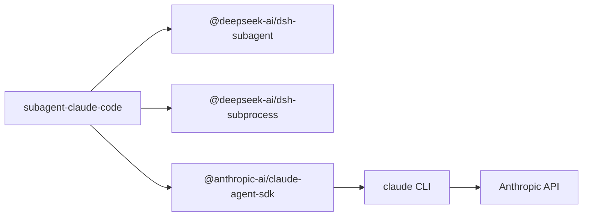

# Claude Code �代�

<cite>
**本文引用的文件**
- [packages/subagent/subagent-claude-code/src/index.ts](file://packages/subagent/subagent-claude-code/src/index.ts)
- [packages/subagent/subagent-claude-code/src/run.ts](file://packages/subagent/subagent-claude-code/src/run.ts)
- [packages/subagent/subagent-claude-code/src/process.ts](file://packages/subagent/subagent-claude-code/src/process.ts)
- [packages/subagent/subagent-claude-code/README.md](file://packages/subagent/subagent-claude-code/README.md)
- [packages/subagent/subagent-claude-code/tests/subagent-claude-code.spec.ts](file://packages/subagent/subagent-claude-code/tests/subagent-claude-code.spec.ts)
- [docs/subsystems/subagent.md](file://docs/subsystems/subagent.md)
</cite>

## 目录
1. [简介](#简介)
2. [项目结�](#项目结�)
3. [核心组件](#核心组件)
4. [��总览](#��总览)
5. [详细组件分�](#详细组件分�)
6. [�赖关系分�](#�赖关系分�)
7. [性能�调优](#性能�调优)
8. [故障�查指�](#故障�查指�)
9. [结论](#结论)
10. [附录：�置�集�示例](#附录�置�集�示例)

## 简介
本文件��在 DeepSeek Harness 中集�并�行 Claude Code �代�的开�者，系统说�其集�方���置项�执行�境�API 密钥设置�模��数传递�会�管��工具调用机制�错误处��性能调优建议，以�� Anthropic API 集�的注�事项和安全最佳�践。Claude Code �代�通过官方 Claude Agent SDK �动本地 CLI 进程，将父会�工作目录作为�代�工作空间，并以“一次性任务�的方��交纯文本指令，最终仅返�严格校验�的最终答案。

## 项目结�
Claude Code �代��� packages/subagent/subagent-claude-code 包内，核心由三个模�组�：
- index.ts：注册�代��供者，声�能力�注入�务�解��执行文件并�建�行规格。
- run.ts：��一次性�行的生命周期，包括�示�校验�SDK 查询选项�造�结�收敛�清���消。
- process.ts：将共享�进程�柄投影为 SDK 所需的进程��，并负责 Windows 批处�包装��境覆盖。

```mermaid
graph TB
A["应用/工具层"] --> B["�代��行时<br/>ctx.subagents.start('claude-code')"]
B --> C["Claude Code �供者<br/>index.ts"]
C --> D["�行编�<br/>run.ts"]
D --> E["SDK 选项�查询<br/>officialQuery(...)"]
E --> F["进程适�层<br/>process.ts"]
F --> G["共享�进程�务<br/>spawn/terminate/waitForExit"]
G --> H["本地 claude CLI 进程"]
H --> I["Anthropic API通过 CLI"]
```

图表��
- [packages/subagent/subagent-claude-code/src/index.ts:52-91](file://packages/subagent/subagent-claude-code/src/index.ts#L52-L91)
- [packages/subagent/subagent-claude-code/src/run.ts:177-291](file://packages/subagent/subagent-claude-code/src/run.ts#L177-L291)
- [packages/subagent/subagent-claude-code/src/process.ts:51-74](file://packages/subagent/subagent-claude-code/src/process.ts#L51-L74)

章节��
- [packages/subagent/subagent-claude-code/src/index.ts:1-114](file://packages/subagent/subagent-claude-code/src/index.ts#L1-L114)
- [packages/subagent/subagent-claude-code/src/run.ts:1-291](file://packages/subagent/subagent-claude-code/src/run.ts#L1-L291)
- [packages/subagent/subagent-claude-code/src/process.ts:1-171](file://packages/subagent/subagent-claude-code/src/process.ts#L1-L171)

## 核心组件
- �供者注册�能力声�
  - �称：claude-code
  - 能力：无�选�动期能力（输出模��深度�制�工具过滤�人格��支�）
  - 继承父上下文：�
  - 注入�务：subagents�subprocess
- �行编�
  - �示�校验：仅���空文本��列，拼�为�一字符串
  - SDK 查询选项：�用�久化会���止 AskUserQuestion��并安全清洗�的父�境��并�加部署级 env
  - 结�收敛：仅�� subtype=success�is_error=false�result �空的最终消�；�则映射为 error
  - �消�清�：本地�消优先，关闭 SDK Query，终止进程树并等待退出
- 进程适�
  - 将共享�进程�柄投影为 SDK 的 SpawnedProcess ��
  - Windows 下对 .cmd/.bat 使用 cmd.exe 包装并通过�境��传入�始命令
  - �境覆盖：对已清洗的�境键进行显� tombstone 覆盖，��泄露

章节��
- [packages/subagent/subagent-claude-code/src/index.ts:52-91](file://packages/subagent/subagent-claude-code/src/index.ts#L52-L91)
- [packages/subagent/subagent-claude-code/src/run.ts:70-127](file://packages/subagent/subagent-claude-code/src/run.ts#L70-L127)
- [packages/subagent/subagent-claude-code/src/process.ts:32-74](file://packages/subagent/subagent-claude-code/src/process.ts#L32-L74)

## ��总览
下图展示�父会�到 Claude Code CLI �到 Anthropic API 的完整调用链，以��消�错误�资�清�路径。

```mermaid
sequenceDiagram
participant Caller as "调用方"
participant SubAgent as "�代��行时"
participant Provider as "Claude Code �供者"
participant Runner as "�行编�(run.ts)"
participant SDK as "Claude Agent SDK"
participant Proc as "进程适�(process.ts)"
participant Child as "claude CLI 进程"
participant API as "Anthropic API"
Caller->>SubAgent : start("claude-code", {prompt, signal})
SubAgent->>Provider : start(ResolvedRequest)
Provider->>Runner : startClaudeCodeRun(request, spec)
Runner->>Runner : textTask(prompt)
Runner->>SDK : officialQuery({prompt, options})
SDK->>Proc : spawnClaudeCodeProcess(options)
Proc->>Child : �动本地 claude CLI
Child-->>SDK : ��消�(result/错误等)
SDK-->>Runner : 迭代消�
Runner->>Runner : consumeClaudeQuery()
alt �功且唯一strict success
Runner-->>SubAgent : result={output : [text], stopReason : "completed"}
else 错误或无结�
Runner-->>SubAgent : result={output : [], stopReason : "error"}
end
Note over Runner,Child : dispose时关闭Query并终止进程树
```

图表��
- [packages/subagent/subagent-claude-code/src/run.ts:203-291](file://packages/subagent/subagent-claude-code/src/run.ts#L203-L291)
- [packages/subagent/subagent-claude-code/src/process.ts:80-171](file://packages/subagent/subagent-claude-code/src/process.ts#L80-L171)
- [packages/subagent/subagent-claude-code/src/index.ts:62-91](file://packages/subagent/subagent-claude-code/src/index.ts#L62-L91)

## 详细组件分�

### �供者��置（index.ts）
- �责
  - 校验 disposeGraceMs 为正有�数且�大�最大定时器延迟
  - 解�父会� cwd，若缺失则拒�
  - 通过 subprocess.resolveExecutable 解� 'claude' �执行文件
  - 组装�行规格（cwd�executable�env�disposeGraceMs�spawn�onError）
  - 调用 startClaudeCodeRun �布�行
- �置项
  - env：显��境��，�加在共享清洗�的父�境之上
  - disposeGraceMs：进程树终止宽�时间（毫秒）

```mermaid
flowchart TD
Start(["start()"]) --> CheckCwd{"父会�有cwd�?"}
CheckCwd --> |�| ErrCwd["抛出错误：缺少工作目录"]
CheckCwd --> |是| Resolve["解�claude�执行文件"]
Resolve --> BuildSpec["�建�行规格(spec)"]
BuildSpec --> Run["startClaudeCodeRun(request, spec)"]
Run --> End(["返�SubagentRun"])
```

图表��
- [packages/subagent/subagent-claude-code/src/index.ts:62-91](file://packages/subagent/subagent-claude-code/src/index.ts#L62-L91)

章节��
- [packages/subagent/subagent-claude-code/src/index.ts:26-114](file://packages/subagent/subagent-claude-code/src/index.ts#L26-L114)

### �行编�（run.ts）
- �示�校验
  - 仅�许文本�，空或空白将被拒�
- SDK 查询选项
  - �并安全清洗�的父�境�部署级 env
  - �用 persistSession，�止 AskUserQuestion
  - 自定义 spawnClaudeCodeProcess 将 SDK 请求转为共享�进程规范
- 结�收敛
  - ��完整消��，仅�留最�一个 strict success 结�
  - 若无结�或失败，统一映射为 error
- �消�清�
  - 监� request.signal，建立本地 AbortController
  - 异常路径确�关闭 Query�终止进程树�等待退出，必�时��错误

```mermaid
flowchart TD
S(["开始"]) --> V["校验�示�(textTask)"]
V --> Q["�起SDK查询(officialQuery)"]
Q --> Stream["消费消��(consumeClaudeQuery)"]
Stream --> R{"收到strict success?"}
R --> |是| Ok["返�{output:text, stopReason:'completed'}"]
R --> |�| Err["返�{output:[], stopReason:'error'}"]
S -.-> C["监�request.signal并本地�消"]
C --> T["关闭Query并终止进程树"]
```

图表��
- [packages/subagent/subagent-claude-code/src/run.ts:70-127](file://packages/subagent/subagent-claude-code/src/run.ts#L70-L127)
- [packages/subagent/subagent-claude-code/src/run.ts:177-291](file://packages/subagent/subagent-claude-code/src/run.ts#L177-L291)

章节��
- [packages/subagent/subagent-claude-code/src/run.ts:1-291](file://packages/subagent/subagent-claude-code/src/run.ts#L1-L291)

### 进程适�（process.ts）
- �境覆盖
  - 对已清洗的�境键进行显� tombstone 覆盖，防止泄露
- �动规范
  - 校验 cwd 存在且�空
  - Windows 下对 .cmd/.bat 使用 cmd.exe 包装，并将�始命令放入�境��
  - stdio 固定为 stdin/stdout pipe，stderr inherit
- 进程对象
  - ManagedClaudeCodeProcess 将共享�进程�柄投影为 SDK 的 SpawnedProcess
  - 转� exit/error 事件，暴露 exitCode/signalCode/killed
  - kill() ��并委托给共享�进程 terminate

```mermaid
classDiagram
class ManagedClaudeCodeProcess {
+stdin
+stdout
+killed bool
+exitCode number|null
+signalCode Signals|null
+kill(signal) bool
+on(event, listener) void
+once(event, listener) void
+off(event, listener) void
}
class SubprocessHandle {
+pid number
+stdin stream
+stdout stream
+done Promise
+terminate() void
+waitForExit(signal?) Promise~bool~
}
ManagedClaudeCodeProcess --> SubprocessHandle : "�装/委托"
```

图表��
- [packages/subagent/subagent-claude-code/src/process.ts:80-171](file://packages/subagent/subagent-claude-code/src/process.ts#L80-L171)

章节��
- [packages/subagent/subagent-claude-code/src/process.ts:1-171](file://packages/subagent/subagent-claude-code/src/process.ts#L1-L171)

### �代�通用语义（� subagent �系统对�）
- 一次性�行�结�契约
  - 结�包� output�structured（本�供者�使用）�stopReason
  - stopReason 支� completed�aborted�error�max-tokens�refusal（本�供者仅产生 completed 或 error）
- 能力�上下文
  - 本�供者�继承父上下文，��供输出模��深度�制�工具过滤�人格等能力
  - �代�独立�父会�的工具���，仅继承工作目录�宿主�生设置

章节��
- [docs/subsystems/subagent.md:308-463](file://docs/subsystems/subagent.md#L308-L463)

## �赖关系分�
- 内部�赖
  - @deepseek-ai/dsh-subagent：�供�代��行时�结�收敛��进程�柄等
  - @deepseek-ai/dsh-subprocess：�供进程创建��境清洗�终止策略
  - @anthropic-ai/claude-agent-sdk：官方 SDK，用��起查询�进程定制
- 外部�赖
  - 本地安装的 claude CLI：通过 PATH 解�，Windows 批处�包装
  - Anthropic API：由 CLI 负责鉴��调用，�件�直��有密钥

图表��
- [packages/subagent/subagent-claude-code/src/run.ts:9-36](file://packages/subagent/subagent-claude-code/src/run.ts#L9-L36)
- [packages/subagent/subagent-claude-code/src/process.ts:8-18](file://packages/subagent/subagent-claude-code/src/process.ts#L8-L18)

章节��
- [packages/subagent/subagent-claude-code/src/run.ts:1-36](file://packages/subagent/subagent-claude-code/src/run.ts#L1-L36)
- [packages/subagent/subagent-claude-code/src/process.ts:1-18](file://packages/subagent/subagent-claude-code/src/process.ts#L1-L18)

## 性能�调优
- 进程�超时
  - ��设置 disposeGraceMs，使进程树优雅退出，��僵尸进程
  - 长任务应�赖调用方信��消，而�内置时钟超时
- 输入�缓存
  - �代��次新建独立 CLI 进程� SDK 查询，��父会� KV 缓存影�
  - 尽�精简�示�，�少�必�的上下文���信�
- 并��资�
  - �个�代��行独�一个 CLI 进程，注�并�度�系统资��用
  - ��在�一工作目录下频�并行大�写�作导致��争
- 日志�诊断
  - onError �调会记录�进程错误，便�定�问题
  - 关注 stderr 继承输出，结�系统日志�查�境问题

[本节为通用指导，无需特定文件引用]

## 故障�查指�
- 常è§�错误ä¸�å�Ÿå›
  - 缺少工作目录：父会�未�供 cwd，需在具备工作目录的会�中委派
  - �执行文件缺失：PATH 中找�到 claude，需安装或调整 PATH
  - 无结�或错误：SDK 返�� success�is_error=true�result 为空或迭代异常
  - �动��消：request.signal 在 SDK �动�触�，将直�拒�
- 调试步骤
  - 检查 resolveExecutable 是��功解�到 claude
  - 确认 env 中是�包�必�的认���（如 ANTHROPIC_API_KEY）
  - 观察�进程退出��信�，定�崩溃或超时
  - 在测试中�通过 mock SDK query ��进程�柄��边界情况

章节��
- [packages/subagent/subagent-claude-code/tests/subagent-claude-code.spec.ts:328-389](file://packages/subagent/subagent-claude-code/tests/subagent-claude-code.spec.ts#L328-L389)
- [packages/subagent/subagent-claude-code/tests/subagent-claude-code.spec.ts:532-618](file://packages/subagent/subagent-claude-code/tests/subagent-claude-code.spec.ts#L532-L618)
- [packages/subagent/subagent-claude-code/tests/subagent-claude-code.spec.ts:620-800](file://packages/subagent/subagent-claude-code/tests/subagent-claude-code.spec.ts#L620-L800)

## 结论
Claude Code �代�以“一次性任务�的方�将父会�的工作目录�宿主�生设置传递给本地 claude CLI，并通过官方 SDK 完�查询�结�收敛。它强调安全的�境隔离�严格的错误映射���的资�清�。对�需�独立 CLI 行为�产�默认�置�账户状�的场景，该�代��供了稳定而��的执行通�。生产�境中应�点关注�执行文件�用性��境��安全��消�超时策略，以�并�下的资�管�。

[本节为总结性内容，无需特定文件引用]

## 附录：�置�集�示例

### 如何�用��置
- 在宿主组�中加载�供者，并传入必�的�境��（例如 ANTHROPIC_API_KEY）
- �选地�置 disposeGraceMs �制进程树终止宽�
- 通过工具层（dsh-tool-subagent）暴露 subagent_claude_code 工具，指定 provider 为 claude-code

�考�置片段�置
- [packages/subagent/subagent-claude-code/README.md:25-51](file://packages/subagent/subagent-claude-code/README.md#L25-L51)

### �动�程�上下文传递
- 父会�需�供 cwd，�则拒�
- �示�必须为�空文本��列，会被拼�为�一字符串传给 SDK
- �代��继承父会�的工具�人格���，仅继承工作目录�宿主�生设置

章节��
- [packages/subagent/subagent-claude-code/src/index.ts:62-91](file://packages/subagent/subagent-claude-code/src/index.ts#L62-L91)
- [packages/subagent/subagent-claude-code/src/run.ts:70-85](file://packages/subagent/subagent-claude-code/src/run.ts#L70-L85)
- [packages/subagent/subagent-claude-code/README.md:15-23](file://packages/subagent/subagent-claude-code/README.md#L15-L23)

### 执行结��错误处�
- �功：唯一 strict success 的 result 文本作为最终输出，stopReason=completed
- 失败：任何 SDK 错误�is_error=true�无结�或迭代异常，统一映射为 stopReason=error
- �消：本地�消优先，stopReason=aborted

章节��
- [packages/subagent/subagent-claude-code/src/run.ts:112-127](file://packages/subagent/subagent-claude-code/src/run.ts#L112-L127)
- [packages/subagent/subagent-claude-code/src/run.ts:203-291](file://packages/subagent/subagent-claude-code/src/run.ts#L203-L291)

### � Anthropic API 的集��安全�践
- 认��端点
  - �件�直�调用 Anthropic API，而是通过本地 claude CLI；认��端点由 CLI �宿主�生设置决定
  - 如需自定义端点或代�，�在 env 中设置相关��（例如 ANTHROPIC_BASE_URL），但�感值必须显�传入 env
- �境��安全
  - �动�会对父�境进行安全清洗，��加部署级 env；��泄露�感��
  - Windows 批处�包装会将�始命令放入�境��，��元字符被误解�
- 会��缓存
  - �代��次新建独立 CLI 进程� SDK 查询，��久化会�，也��用父会� KV 缓存
- 交互�工具
  - �用 AskUserQuestion，其他交互�调未�供；需�人工审批的任务将失败
  - �继承父会�的工具���，�代�拥有独立的工具���范围

章节��
- [packages/subagent/subagent-claude-code/src/process.ts:32-74](file://packages/subagent/subagent-claude-code/src/process.ts#L32-L74)
- [packages/subagent/subagent-claude-code/README.md:25-33](file://packages/subagent/subagent-claude-code/README.md#L25-L33)
- [packages/subagent/subagent-claude-code/README.md:59-99](file://packages/subagent/subagent-claude-code/README.md#L59-L99)