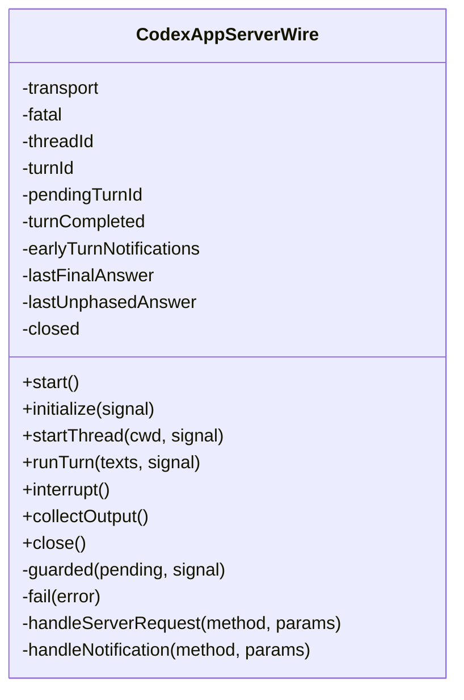
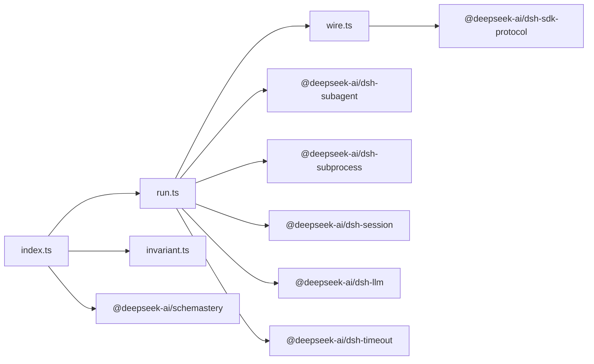

# Codex �代�

<cite>
**本文引用的文件**
- [index.ts](file://packages/subagent/subagent-codex/src/index.ts)
- [run.ts](file://packages/subagent/subagent-codex/src/run.ts)
- [wire.ts](file://packages/subagent/subagent-codex/src/wire.ts)
- [invariant.ts](file://packages/subagent/subagent-codex/src/invariant.ts)
- [package.json](file://packages/subagent/subagent-codex/package.json)
- [product-subagent-codex.cordis.yml](file://examples/acp-agent/product-subagent-codex.cordis.yml)
- [subagent-codex.spec.ts](file://packages/subagent/subagent-codex/tests/subagent-codex.spec.ts)
</cite>

## 目录
1. [简介](#简介)
2. [项目结�](#项目结�)
3. [核心组件](#核心组件)
4. [��总览](#��总览)
5. [详细组件分�](#详细组件分�)
6. [�赖关系分�](#�赖关系分�)
7. [性能�资�管�](#性能�资�管�)
8. [故障�除指�](#故障�除指�)
9. [结论](#结论)
10. [附录：�置�使用示例](#附录：�置�使用示例)

## 简介
本文件��“Codex �代��的��设计�����，�焦以下目标：
- 解释如何通过�代�机制�动并管�外部 Codex app-server 进程，完�一次性任务执行。
- 说����数�认���境注入方�（通过�境���父会�工作目录）。
- �述执行策略：生命周期�中断�终止�错误收敛�输出选择。
- 给出在 Cordis 装�中�用 Codex �代�的�置示例�调用�程。
- 解释代��解能力�文件�作机制�智能�示功能的边界（由外部 Codex �供，本��仅��议适��安全约�）。
- �供性能监��资�管�的�践建议，以�� OpenAI Codex API（app-server �议）集�的注�事项和�错方法。

## 项目结�
Codex �代��� packages/subagent/subagent-codex，采用“�供者 + �行器 + �议适�器 + ���注册�的分层组织：
- index.ts：�件入�，注册�为 codex 的�代��供者，负责�置校验�请求转�。
- run.ts：一次�行的生命周期编�，包括进程�动��始化�线程创建�任务�交�结�收集�清�。
- wire.ts：� Codex app-server 的 JSON-RPC �议适�，处��手�线程/���通知�审批请求�最终答案选择。
- invariant.ts：包级���注册��，声�该包对宿主����务的存在性�求。
- package.json：暴露导出�声� peerDependencies � devDependencies（� @openai/codex 版本信�用�文档�考）。
- examples/acp-agent/product-subagent-codex.cordis.yml：展示如何在 ACP 组�中�入 Codex �代��其工具包装。

```mermaid
graph TB
subgraph "Cordis 上下文"
Ctx["Context"]
Subagents["Subagent �务"]
Subprocess["Subprocess �务"]
end
subgraph "Codex �代�"
Provider["CodexProvider<br/>注册�供者 'codex'"]
Runner["startCodexRun<br/>生命周期编�"]
Wire["CodexAppServerWire<br/>JSON-RPC �议适�"]
end
subgraph "外部进程"
AppServer["codex app-server --stdio"]
end
Ctx --> Subagents
Ctx --> Subprocess
Provider --> Subagents
Provider --> Runner
Runner --> Subprocess
Runner --> Wire
Wire < --> AppServer
```

图表��
- [index.ts:47-101](file://packages/subagent/subagent-codex/src/index.ts#L47-L101)
- [run.ts:116-200](file://packages/subagent/subagent-codex/src/run.ts#L116-L200)
- [wire.ts:83-235](file://packages/subagent/subagent-codex/src/wire.ts#L83-L235)

章节��
- [index.ts:1-102](file://packages/subagent/subagent-codex/src/index.ts#L1-L102)
- [run.ts:1-201](file://packages/subagent/subagent-codex/src/run.ts#L1-L201)
- [wire.ts:1-375](file://packages/subagent/subagent-codex/src/wire.ts#L1-L375)
- [invariant.ts:1-31](file://packages/subagent/subagent-codex/src/invariant.ts#L1-L31)
- [package.json:1-63](file://packages/subagent/subagent-codex/package.json#L1-L63)
- [product-subagent-codex.cordis.yml:1-19](file://examples/acp-agent/product-subagent-codex.cordis.yml#L1-L19)

## 核心组件
- �供者（CodexProvider）
  - �称：codex
  - 能力：无�动能力（NO_START_CAPABILITIES），�继承父上下文
  - �责：校验父会�工作目录，组装�行规格（cwd�env�disposeGraceMs�spawn�onError），委托给 startCodexRun
- �行器（startCodexRun）
  - 任务校验：仅���空文本��列
  - 进程�动：跨平� argv 解�（Windows 走 cmd.exe 边界）
  - �始化：initialize/initialized �手；创建临时线程 thread/start
  - 执行：turn/start �交文本任务，等待 turn/completed
  - 清�：关闭�议�终止进程树�等待退出
- �议适�（CodexAppServerWire）
  - 固定最��议集：initialize�thread/start�turn/start�turn/started�item/completed�turn/completed�turn/interrupt
  - 审批请求自动应答：命令执行�文件�更����用户输入�MCP 询问等
  - 输出选择：优先 final_answer，�则�退到 nullable-phase 的最�一�
  - 错误映射：contextWindowExceeded 映射为 max-tokens
- ���（invariant）
  - 声�包��注入项，当�为空安装器，交由宿主�务管�生命周期�进程树所有�

章节��
- [index.ts:26-101](file://packages/subagent/subagent-codex/src/index.ts#L26-L101)
- [run.ts:24-83,116-200:24-83](file://packages/subagent/subagent-codex/src/run.ts#L24-L83)
- [wire.ts:83-235,294-373:83-235](file://packages/subagent/subagent-codex/src/wire.ts#L83-L235)
- [invariant.ts:10-29](file://packages/subagent/subagent-codex/src/invariant.ts#L10-L29)

## ��总览
下图展示了�父会��起一次 Codex �代�调用的端到端时�：

```mermaid
sequenceDiagram
participant Parent as "父会�"
participant Provider as "CodexProvider"
participant Runner as "startCodexRun"
participant Proc as "Subprocess �务"
participant Wire as "CodexAppServerWire"
participant Server as "codex app-server"
Parent->>Provider : �动�代�(�示�, 信�)
Provider->>Runner : 组装�行规格并调用
Runner->>Proc : spawn(argv, cwd, env, stdio)
Proc-->>Runner : 返��进程�柄
Runner->>Wire : �造并�动传输
Runner->>Wire : initialize(客户端信�)
Wire->>Server : JSON-RPC initialize
Server-->>Wire : �应
Wire-->>Runner : initialized 通知
Runner->>Wire : startThread(cwd, ephemeral=true)
Wire->>Server : thread/start
Server-->>Wire : {thread.id}
Runner->>Wire : runTurn(文本列表)
Wire->>Server : turn/start
Server-->>Wire : {turn.id}
Note over Wire,Server : item/completed ��消�
Server-->>Wire : turn/completed
Wire-->>Runner : 结�{output, stopReason}
Runner-->>Parent : 返� SubagentRun
```



图表��
- [run.ts:116-200](file://packages/subagent/subagent-codex/src/run.ts#L116-L200)
- [wire.ts:132-204](file://packages/subagent/subagent-codex/src/wire.ts#L132-L204)

## 详细组件分�

### �供者��置（CodexProvider）
- �置项
  - env：覆盖�进程�境（在共享凭�清洗�的父�境之上�加）
  - disposeGraceMs：进程树优雅终止宽�（毫秒），需为正有�数且�超过最大定时器延迟
- 关键行为
  - 强制�求父会��带工作目录（cwd），�则拒��动
  - 将 spawn 委托给宿主的 subprocess �务，��统一的生命周期管�
  - onError �调用�记录��行失败诊断信�

```mermaid
flowchart TD
Start(["开始"]) --> CheckCwd{"父会�有 cwd ?"}
CheckCwd --> |�| ErrCwd["抛出错误：缺少工作目录"]
CheckCwd --> |是| BuildSpec["�建�行规格<br/>cwd/env/disposeGraceMs/spawn/onError"]
BuildSpec --> CallRun["调用 startCodexRun"]
CallRun --> End(["返� SubagentRun"])
```



图表��
- [index.ts:57-80](file://packages/subagent/subagent-codex/src/index.ts#L57-L80)

章节��
- [index.ts:29-101](file://packages/subagent/subagent-codex/src/index.ts#L29-L101)

### �行生命周期（startCodexRun）
- 任务校验：仅�许�空文本�，空或包��文本类�会直�拒�
- 进程�动：根�平�生�固定 argv，��将任务文本带入 shell 边界
- �始化阶段：先 initialize，�创建 ephemeral 线程，确��续消��关�
- 执行阶段：�交 turn/start，监� item/completed � turn/completed
- 清�阶段：关闭�议�结� stdin�终止进程树�等待退出
- �消�中断：支�本地�消�远端中断（turn/interrupt），并妥善处���

```mermaid
flowchart TD
S(["进入 startCodexRun"]) --> V["校验任务文本"]
V --> Spawn["spawn �进程"]
Spawn --> Init["initialize + startThread"]
Init --> Run["runTurn �交任务"]
Run --> Wait{"收到 turn/completed ?"}
Wait --> |是| Collect["collectOutput 选择最终答案"]
Collect --> Done(["返�结�"])
Wait --> |�| Fail["进程��退出或错误"]
Fail --> Cleanup["close/terminate/waitForExit"]
Cleanup --> Done
```



图表��
- [run.ts:63-83,116-200:63-83](file://packages/subagent/subagent-codex/src/run.ts#L63-L83)
- [run.ts:116-200](file://packages/subagent/subagent-codex/src/run.ts#L116-L200)

章节��
- [run.ts:24-200](file://packages/subagent/subagent-codex/src/run.ts#L24-L200)

### �议适�（CodexAppServerWire）
- �手�线程
  - initialize：上报客户端信��能力
  - thread/start：创建临时线程，�存 threadId
- ��执行
  - turn/start：�交文本输入，�存 turnId
  - 处� item/completed：过滤 commentary，�留 final_answer 或最�一� nullable-phase
  - 处� turn/completed：状�校验，异常映射（contextWindowExceeded -> max-tokens）
- 审批请求自动应答
  - 命令执行�文件�更����用户输入�MCP 询问等，默认拒�或�消
- 中断�关闭
  - interrupt：�活跃���� turn/interrupt
  - close：断开传输，释放事件监�



图表��
- [wire.ts:83-235](file://packages/subagent/subagent-codex/src/wire.ts#L83-L235)
- [wire.ts:294-373](file://packages/subagent/subagent-codex/src/wire.ts#L294-L373)

章节��
- [wire.ts:1-375](file://packages/subagent/subagent-codex/src/wire.ts#L1-L375)

### �����件装�
- 包级���：声�包��注入项，当�为空安装器，表示该包自身�附加�行时���
- �件装�：通过 apply(ctx, config) 注册�供者；测试验�了 HMR �载时�供者会被移除

章节��
- [invariant.ts:10-29](file://packages/subagent/subagent-codex/src/invariant.ts#L10-L29)
- [subagent-codex.spec.ts:288-315](file://packages/subagent/subagent-codex/tests/subagent-codex.spec.ts#L288-L315)

## �赖关系分�
- 内部�赖
  - �代�框�：@deepseek-ai/dsh-subagent（�供者���结��装�生命周期）
  - �进程：@deepseek-ai/dsh-subprocess（spawn��柄�终止）
  - 会�：@deepseek-ai/dsh-session（会� ID）
  - LLM 内容：@deepseek-ai/dsh-llm（ContentBlock）
  - 超时：@deepseek-ai/dsh-timeout（最大定时器延迟常�）
  - �议：@deepseek-ai/dsh-sdk-protocol（JSON-RPC 行�传输）
  - �置校验：@deepseek-ai/schemastery（Zod �格 schema）
- 外部�赖
  - @openai/codex 0.147.0：作为开��赖，表��议基�该版本的 app-server



图表��
- [package.json:34-60](file://packages/subagent/subagent-codex/package.json#L34-L60)
- [index.ts:9-24](file://packages/subagent/subagent-codex/src/index.ts#L9-L24)
- [run.ts:10-22](file://packages/subagent/subagent-codex/src/run.ts#L10-L22)
- [wire.ts:10-13](file://packages/subagent/subagent-codex/src/wire.ts#L10-L13)

章节��
- [package.json:1-63](file://packages/subagent/subagent-codex/package.json#L1-L63)

## 性能�资�管�
- 进程生命周期
  - 一次性�行：�次�动新的 app-server 进程，隔离性强，适�短任务
  - 优雅终止：通过 disposeGraceMs �制进程树终止宽�，��孤儿进程
- 内存� I/O
  - �议��处�：�行 JSON-RPC，��大对象驻留
  - 输出选择：仅�留最终答案，�少中间�数�
- 并��中断
  - 支�本地�消�远端中断，防止长时间阻�
  - 严格线程/��关�，��跨��消�污染
- 监�建议
  - 利用 onError å›�调记录失败å�Ÿå› ä¸�å�œæ­¢å�Ÿå›
  - 结�宿主日志�指标系统，统计�动耗时��行时长�错误�
  - 关注 contextWindowExceeded 导致的 max-tokens 场景，必�时拆分任务

[本节为通用指导，无需特定文件引用]

## 故障�除指�
- 常�错误�定�
  - 缺少工作目录：父会�未�供 cwd，导致无法派生�进程
  - 任务�法：空任务或�文本�被拒�
  - �议错误：initialize/thread/start/turn/start �应形状�符
  - 终端状�异常：turn/completed 状�� completed/failed/interrupted
  - 无最终答案：completed 但未产出 final_answer 或��退答案
  - 上下文窗�超�：映射为 max-tokens，需缩�输入或分步执行
- 调试步骤
  - 检查父会�是�设置了工作目录
  - 确认�进程已�动并能�收 JSON-RPC 帧
  - 观察 item/completed � turn/completed 的顺��内容
  - 使用测试中的模拟�进程��议对端进行断点验�
- 相关测试用例�考
  - 命令行�数�平�差异
  - 任务校验�空值拒�
  - �手�线程���的�应校验
  - 审批请求自动应答�未知请求拒�
  - 中断�早期终止的��处�

章节��
- [subagent-codex.spec.ts:262-315](file://packages/subagent/subagent-codex/tests/subagent-codex.spec.ts#L262-L315)
- [subagent-codex.spec.ts:363-551](file://packages/subagent/subagent-codex/tests/subagent-codex.spec.ts#L363-L551)
- [subagent-codex.spec.ts:553-790](file://packages/subagent/subagent-codex/tests/subagent-codex.spec.ts#L553-L790)

## 结论
Codex �代�以“�供者 + �行器 + �议适��的清晰分层，安全地桥�外部 Codex app-server。其设计强调：
- 严格的输入��议校验，确��壮性��观测性
- �确的生命周期管��资��收，��泄�
- 稳定的输出选择�错误映射，便�上层消费
- 通过�境���父会�工作目录���置�上下文传递
对�需�代��解�文件�作�智能�示的场景，�际能力由外部 Codex �供；本��专注���集��治�。

[本节为总结性内容，无需特定文件引用]

## 附录：�置�使用示例
- 在 Cordis 中装� Codex �代�
  - 通过 include �件�入 provider � tool 包装，指定 provider 为 codex，工具�为 subagent_codex
  - �设置 enableRunInBackground � maxDepth 等策略开关
- �动�传递上下文
  - 父会�需�供工作目录（cwd），�进程将在该目录下执行
  - �通过 env 注入密钥��行时��（�共享凭�清洗��加）
- 执行�生命周期管�
  - 调用�代��触�一次性�行：�动进程��始化�创建线程��交任务�等待完�
  - 支��消�中断；完��自动清�进程树
- � OpenAI Codex API 的集�细节
  - �议基� app-server 的 JSON-RPC 行�传输，版本�考 @openai/codex 0.147.0
  - 注�上下文窗��制，�到 contextWindowExceeded 会映射为 max-tokens
- �用建议
  - ��拆分任务以��上下文溢出
  - 使用 onError 记录诊断信�，��宿主监�
  - 在 CI/CD 中通过本地�进程模拟进行契约测试

章节��
- [product-subagent-codex.cordis.yml:1-19](file://examples/acp-agent/product-subagent-codex.cordis.yml#L1-L19)
- [index.ts:29-101](file://packages/subagent/subagent-codex/src/index.ts#L29-L101)
- [run.ts:24-83,116-200:24-83](file://packages/subagent/subagent-codex/src/run.ts#L24-L83)
- [wire.ts:132-204](file://packages/subagent/subagent-codex/src/wire.ts#L132-L204)
- [package.json:59-60](file://packages/subagent/subagent-codex/package.json#L59-L60)