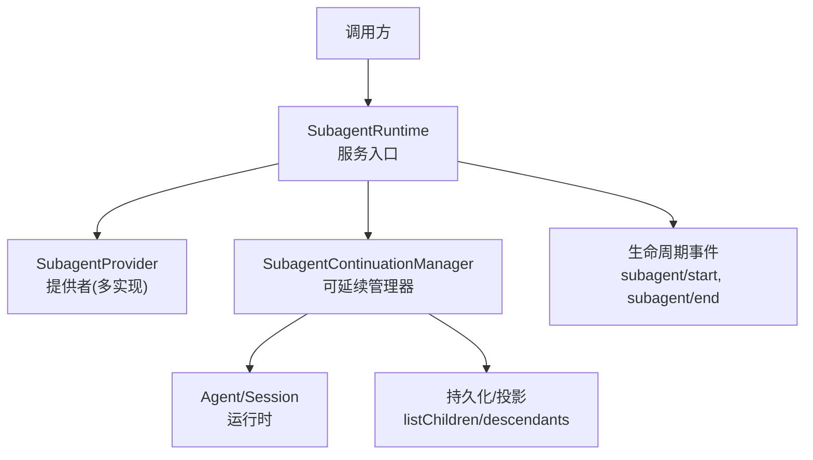
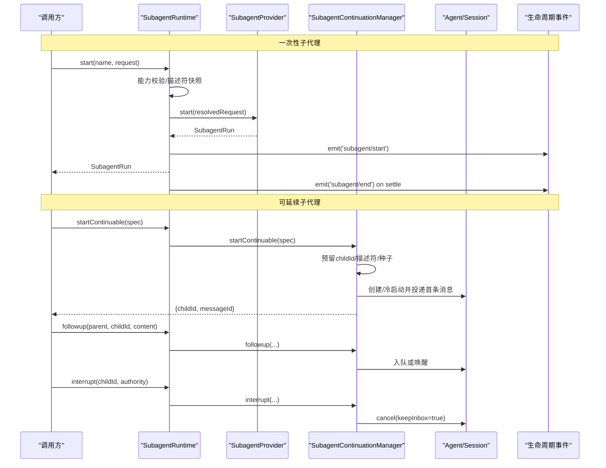
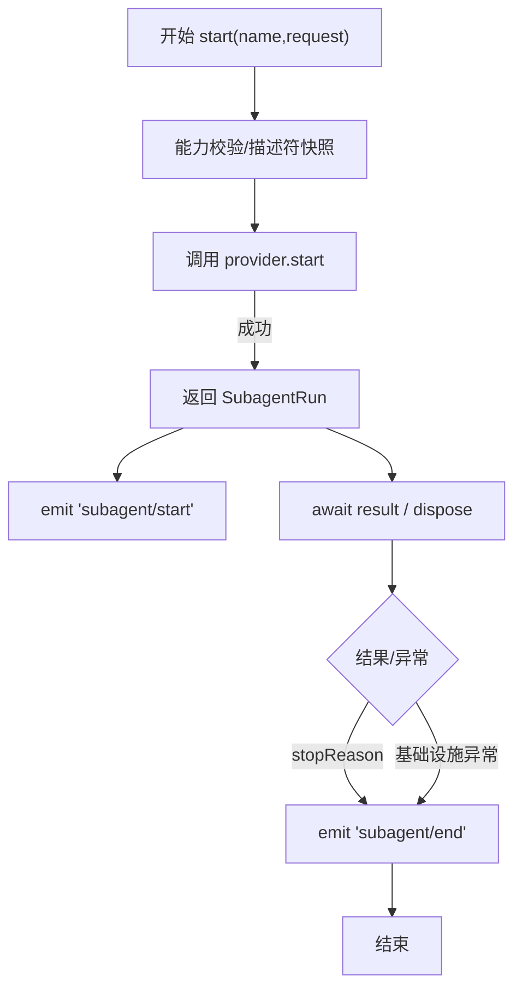
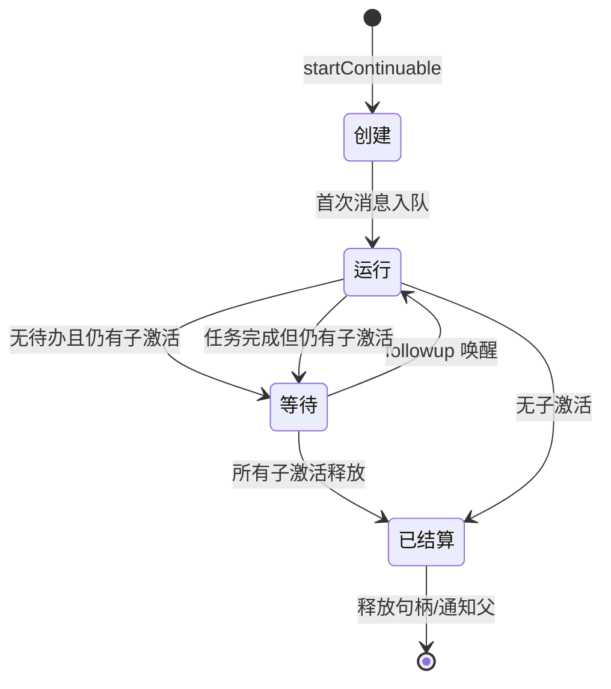
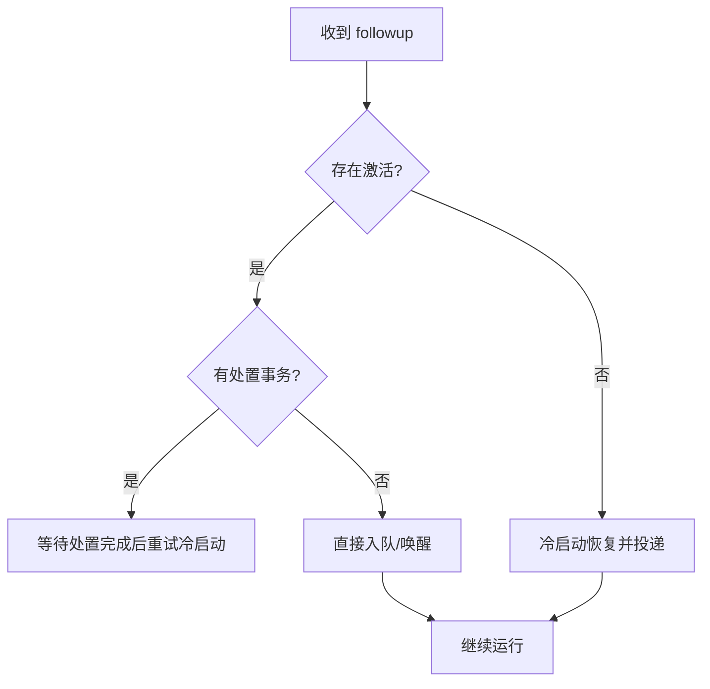
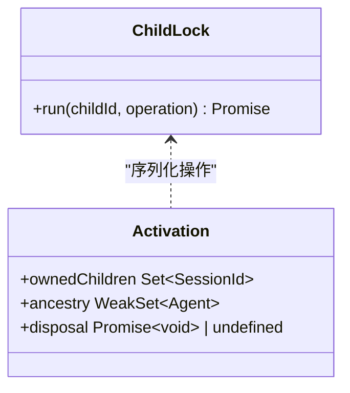
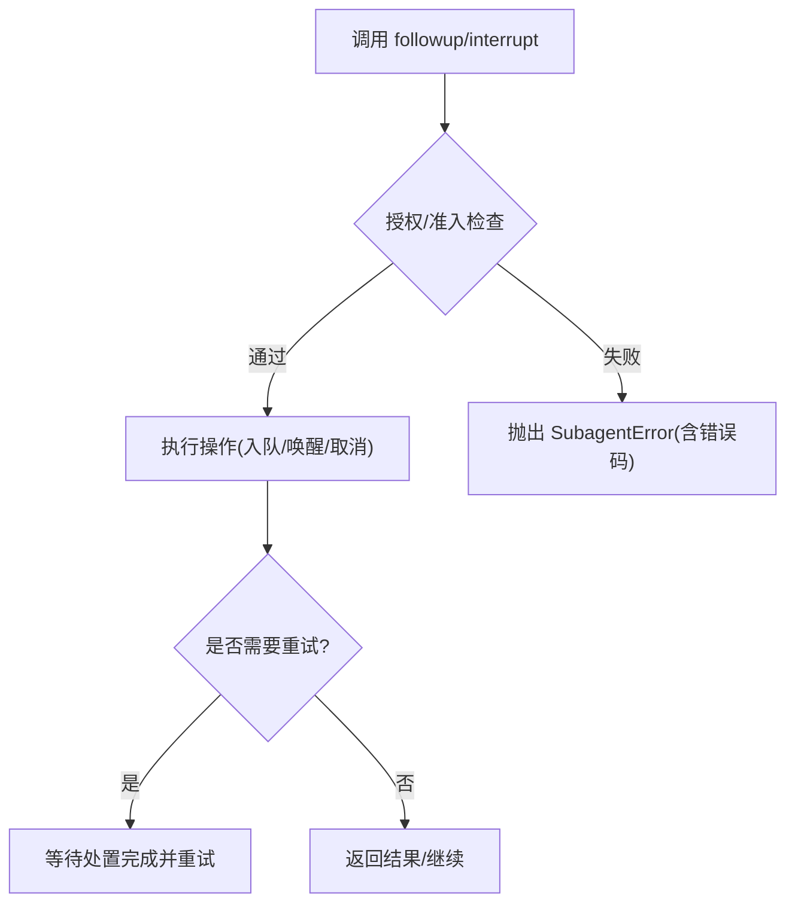
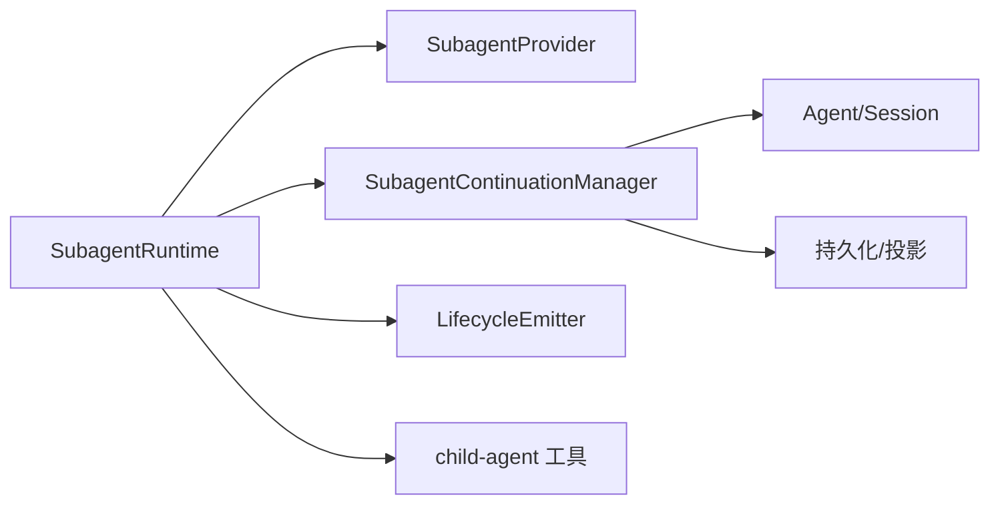

# 子代理生命周期管理

<cite>
**本文引用的文件**
- [packages/subagent/subagent/src/index.ts](file://packages/subagent/subagent/src/index.ts)
- [packages/subagent/subagent/src/continuation.ts](file://packages/subagent/subagent/src/continuation.ts)
- [packages/subagent/subagent/src/types.ts](file://packages/subagent/subagent/src/types.ts)
- [packages/subagent/subagent/src/lifecycle.ts](file://packages/subagent/subagent/src/lifecycle.ts)
- [packages/subagent/subagent/src/child-agent.ts](file://packages/subagent/subagent/src/child-agent.ts)
- [packages/subagent/subagent/src/error.ts](file://packages/subagent/subagent/src/error.ts)
- [docs/subsystems/subagent.md](file://docs/subsystems/subagent.md)
- [docs/agent-lifecycle.md](file://docs/agent-lifecycle.md)
</cite>

## 目录
1. [简介](#简介)
2. [项目结构](#项目结构)
3. [核心组件](#核心组件)
4. [架构总览](#架构总览)
5. [详细组件分析](#详细组件分析)
6. [依赖关系分析](#依赖关系分析)
7. [性能考量](#性能考量)
8. [故障排查指南](#故障排查指南)
9. [结论](#结论)
10. [附录](#附录)

## 简介
本文件系统性阐述“子代理”从创建到销毁的完整生命周期，覆盖一次性（one-shot）与可延续（continuable）两类子代理。重点说明：
- 状态管理机制：激活态、等待态、已结算态的推导与转换
- 资源分配与清理：AgentHandle、会话持久化、所有权图、冷启动恢复
- 启动顺序、依赖关系与并发控制：按子代理优先的释放顺序、锁与队列
- 错误恢复、异常处理与重试策略：停止原因映射、中断语义、不可恢复错误的上报
- 性能监控与调试：生命周期事件、投影、审计日志
- 最佳实践与常见问题：能力校验失败、权限不足、冷启动竞态等

## 项目结构
子代理能力由服务定义与多种提供者实现组成，核心位于 subagent 包：
- 服务入口与注册表：SubagentRuntime（命名提供者注册、start/startContinuable/followup/interrupt/reportFrom/listChildren/listDescendants）
- 可延续管理器：SubagentContinuationManager（稳定子ID、描述符持久化、激活期管理、冷启动、子优先释放）
- 类型契约：请求、结果、能力、运行句柄、事件载荷
- 生命周期事件：统一的 start/end 事件对，适配一次性与可延续两种形态
- 子代理组合与深度：继承父代理配置、委派深度预算、工具/角色限制
- 错误模型：统一 SubagentError 及错误码

图表来源
- [packages/subagent/subagent/src/index.ts:171-497](file://packages/subagent/subagent/src/index.ts#L171-L497)
- [packages/subagent/subagent/src/continuation.ts:349-800](file://packages/subagent/subagent/src/continuation.ts#L349-L800)
- [packages/subagent/subagent/src/lifecycle.ts:100-162](file://packages/subagent/subagent/src/lifecycle.ts#L100-L162)

章节来源
- [packages/subagent/subagent/src/index.ts:171-497](file://packages/subagent/subagent/src/index.ts#L171-L497)
- [docs/subsystems/subagent.md:1-735](file://docs/subsystems/subagent.md#L1-L735)

## 核心组件
- SubagentRuntime：对外暴露子代理能力，负责提供者注册、能力校验、一次性启动、可延续子代理编排、枚举与事件发布。
- SubagentContinuationManager：维护每个可延续子代理的稳定 SessionId、激活期（Activation）、冷启动恢复、父子所有权图、子优先释放、报告投递与终止。
- 生命周期观察者：为一次性与可延续子代理统一发布 start/end 事件，保证观测一致性。
- 子代理组合与深度：统一计算委派深度、注入系统提示、应用工具限制与角色覆盖。
- 错误模型：通过 SubagentError 携带明确错误码，便于上层区分并处理。

章节来源
- [packages/subagent/subagent/src/index.ts:171-497](file://packages/subagent/subagent/src/index.ts#L171-L497)
- [packages/subagent/subagent/src/continuation.ts:349-800](file://packages/subagent/subagent/src/continuation.ts#L349-L800)
- [packages/subagent/subagent/src/lifecycle.ts:100-162](file://packages/subagent/subagent/src/lifecycle.ts#L100-L162)
- [packages/subagent/subagent/src/child-agent.ts:48-175](file://packages/subagent/subagent/src/child-agent.ts#L48-L175)
- [packages/subagent/subagent/src/error.ts:1-16](file://packages/subagent/subagent/src/error.ts#L1-L16)

## 架构总览
子代理分为两类：
- 一次性子代理：通过 provider.start() 建立并发布，返回 SubagentRun，消费者 await result 并 dispose。
- 可延续子代理：通过 startContinuable 建立稳定 SessionId，后续通过 followup 投递消息；manager 持有 AgentHandle，按 FIFO 顺序执行轮次；支持冷启动恢复、报告投递、中断与子优先释放。

图表来源
- [packages/subagent/subagent/src/index.ts:414-426](file://packages/subagent/subagent/src/index.ts#L414-L426)
- [packages/subagent/subagent/src/continuation.ts:403-457](file://packages/subagent/subagent/src/continuation.ts#L403-L457)
- [packages/subagent/subagent/src/continuation.ts:476-505](file://packages/subagent/subagent/src/continuation.ts#L476-L505)
- [packages/subagent/subagent/src/continuation.ts:528-568](file://packages/subagent/subagent/src/continuation.ts#L528-L568)
- [packages/subagent/subagent/src/lifecycle.ts:133-162](file://packages/subagent/subagent/src/lifecycle.ts#L133-L162)

## 详细组件分析

### 一次性子代理生命周期
- 初始化：校验能力（outputSchema/depthLimit/toolFilter/persona），生成描述符，委托 provider.start。
- 启动：provider 完成资源准备并发布子代理；服务捕获本地/远程标识并包装为 SubagentRun。
- 运行：消费者 await run.result，内部将模型/传输错误映射为 stopReason，不抛错。
- 暂停/终止：调用 run.dispose 取消剩余工作并达到静默；事件 end 在结果落定时发出。
- 资源清理：provider 在 fulfillment 前拥有资源，fulfillment 后转移给运行期；失败时回滚未发布资源。

图表来源
- [packages/subagent/subagent/src/index.ts:414-426](file://packages/subagent/subagent/src/index.ts#L414-L426)
- [packages/subagent/subagent/src/lifecycle.ts:133-162](file://packages/subagent/subagent/src/lifecycle.ts#L133-L162)
- [packages/subagent/subagent/src/types.ts:249-275](file://packages/subagent/subagent/src/types.ts#L249-L275)

章节来源
- [packages/subagent/subagent/src/index.ts:414-426](file://packages/subagent/subagent/src/index.ts#L414-L426)
- [packages/subagent/subagent/src/types.ts:249-275](file://packages/subagent/subagent/src/types.ts#L249-L275)
- [packages/subagent/subagent/src/lifecycle.ts:133-162](file://packages/subagent/subagent/src/lifecycle.ts#L133-L162)

### 可延续子代理生命周期
- 创建：预留稳定 childId，快照描述符，获取提供者的 ContinuableCreateSpec（如是否注入父历史种子），通过激活所有者作用域创建 Agent，提交首条消息。
- 运行：Agent 收件箱是唯一队列；running/waiting/settled 状态由 Agent 静默性与 ownedChildren 集合推导。
- 续传：followup 根据是否存在激活决定直接入队/唤醒/冷启动恢复。
- 报告：reportFrom 允许子代理向直接父代理发送内容，支持 quiet/wakeup 两种投递策略。
- 中断：interrupt 基于用户父会话或精确祖先 Agent 授权，fire-and-return，保留未认领消息与已发布后代。
- 结算：子优先释放，先等待所有子激活完成，再释放父；最终向父投递结算通知。

图表来源
- [packages/subagent/subagent/src/continuation.ts:151-159](file://packages/subagent/subagent/src/continuation.ts#L151-L159)
- [packages/subagent/subagent/src/continuation.ts:403-457](file://packages/subagent/subagent/src/continuation.ts#L403-L457)
- [packages/subagent/subagent/src/continuation.ts:476-505](file://packages/subagent/subagent/src/continuation.ts#L476-L505)
- [packages/subagent/subagent/src/continuation.ts:528-568](file://packages/subagent/subagent/src/continuation.ts#L528-L568)
- [packages/subagent/subagent/src/continuation.ts:704-800](file://packages/subagent/subagent/src/continuation.ts#L704-L800)

章节来源
- [packages/subagent/subagent/src/continuation.ts:151-159](file://packages/subagent/subagent/src/continuation.ts#L151-L159)
- [packages/subagent/subagent/src/continuation.ts:403-457](file://packages/subagent/subagent/src/continuation.ts#L403-L457)
- [packages/subagent/subagent/src/continuation.ts:476-505](file://packages/subagent/subagent/src/continuation.ts#L476-L505)
- [packages/subagent/subagent/src/continuation.ts:528-568](file://packages/subagent/subagent/src/continuation.ts#L528-L568)
- [packages/subagent/subagent/src/continuation.ts:704-800](file://packages/subagent/subagent/src/continuation.ts#L704-L800)

### 状态管理与资源清理
- 状态推导：不维护独立状态机，依据 Agent 静默性与 ownedChildren 集合推导 running/waiting/settled。
- 所有权图：每个激活记录 ancestry 与 ownedChildren，确保子优先释放。
- 冷启动恢复：无激活时 followup 触发冷启动，读取持久化会话并重建 Agent。
- 清理流程：drain/drainDescendants 关闭准入、等待已接纳材料化、子优先释放、聚合失败。

图表来源
- [packages/subagent/subagent/src/continuation.ts:476-505](file://packages/subagent/subagent/src/continuation.ts#L476-L505)
- [packages/subagent/subagent/src/continuation.ts:704-800](file://packages/subagent/subagent/src/continuation.ts#L704-L800)

章节来源
- [packages/subagent/subagent/src/continuation.ts:476-505](file://packages/subagent/subagent/src/continuation.ts#L476-L505)
- [packages/subagent/subagent/src/continuation.ts:704-800](file://packages/subagent/subagent/src/continuation.ts#L704-L800)

### 启动顺序、依赖关系与并发控制
- 启动顺序：子优先释放，确保父在子完全结束后才结算。
- 依赖关系：激活持有 ownedChildren，阻止父过早结算。
- 并发控制：ChildLock 串行化同一 childId 的操作；followup 在临界区中判断处置事务并可能重试。

图表来源
- [packages/subagent/subagent/src/continuation.ts:319-341](file://packages/subagent/subagent/src/continuation.ts#L319-L341)
- [packages/subagent/subagent/src/continuation.ts:186-240](file://packages/subagent/subagent/src/continuation.ts#L186-L240)

章节来源
- [packages/subagent/subagent/src/continuation.ts:319-341](file://packages/subagent/subagent/src/continuation.ts#L319-L341)
- [packages/subagent/subagent/src/continuation.ts:186-240](file://packages/subagent/subagent/src/continuation.ts#L186-L240)

### 错误恢复、异常处理与重试策略
- 停止原因映射：completed/aborted/error/max-tokens/refusal，非 completed 表示输出可能不完整。
- 中断语义：fire-and-return，保留未认领消息与已发布后代；目标不存在视为无操作。
- 重试策略：followup 在处置竞态下自动重试冷启动；一次性 run 的错误通过 stopReason 表达，不抛基础设施异常。
- 能力校验失败：start 前检查 capabilities，缺失则拒绝并抛出明确错误码。

图表来源
- [packages/subagent/subagent/src/continuation.ts:476-505](file://packages/subagent/subagent/src/continuation.ts#L476-L505)
- [packages/subagent/subagent/src/continuation.ts:528-568](file://packages/subagent/subagent/src/continuation.ts#L528-L568)
- [packages/subagent/subagent/src/index.ts:480-496](file://packages/subagent/subagent/src/index.ts#L480-L496)
- [packages/subagent/subagent/src/error.ts:1-16](file://packages/subagent/subagent/src/error.ts#L1-L16)

章节来源
- [packages/subagent/subagent/src/continuation.ts:476-505](file://packages/subagent/subagent/src/continuation.ts#L476-L505)
- [packages/subagent/subagent/src/continuation.ts:528-568](file://packages/subagent/subagent/src/continuation.ts#L528-L568)
- [packages/subagent/subagent/src/index.ts:480-496](file://packages/subagent/subagent/src/index.ts#L480-L496)
- [packages/subagent/subagent/src/error.ts:1-16](file://packages/subagent/subagent/src/error.ts#L1-L16)

### 性能监控与调试
- 生命周期事件：subagent/start 与 subagent/end 成对出现，用于观测一次性与可延续子代理的起止与结果。
- 投影与枚举：listChildren/listDescendants 合并在线会话与可选持久化，使用投影缓存加速，支持诊断信息。
- 审计日志：子代理描述符追加至会话日志，支持压缩与回放；epoch 停止原因基于会话事件后缀计算。

章节来源
- [packages/subagent/subagent/src/lifecycle.ts:100-162](file://packages/subagent/subagent/src/lifecycle.ts#L100-L162)
- [packages/subagent/subagent/src/index.ts:311-360](file://packages/subagent/subagent/src/index.ts#L311-L360)
- [docs/subsystems/subagent.md:287-306](file://docs/subsystems/subagent.md#L287-L306)
- [docs/agent-lifecycle.md:1-83](file://docs/agent-lifecycle.md#L1-L83)

### 最佳实践与常见问题
- 正确管理启动顺序与依赖：
  - 一次性：始终 await result 并 dispose，避免资源泄漏。
  - 可延续：关注 followup 的幂等性；利用 reportFrom 进行结构化汇报；使用 interrupt 安全中止。
- 并发控制：
  - 遵循 ChildLock 的串行化语义；避免在同一 childId 上并发写入。
- 能力与权限：
  - 提前声明所需能力（toolFilter/persona/maxDepth/outputSchema），缺失会立即拒绝。
  - 中断需满足权威校验（user parent 或 exact ancestor）。
- 冷启动与持久化：
  - 无持久化时仅能枚举在线子代理；冷启动失败不影响健康子代理的列举。
- 常见错误：
  - UNSUPPORTED_CAPABILITY：能力不匹配。
  - UNAUTHORIZED：中断授权失败。
  - ACTIVATION_CLOSING/PARENT_UNAVAILABLE：报告投递时机或父不可用。
  - CONTINUATION_UNAVAILABLE：缺少 agents 服务导致可延续功能不可用。

章节来源
- [packages/subagent/subagent/src/index.ts:414-426](file://packages/subagent/subagent/src/index.ts#L414-L426)
- [packages/subagent/subagent/src/continuation.ts:528-568](file://packages/subagent/subagent/src/continuation.ts#L528-L568)
- [packages/subagent/subagent/src/continuation.ts:582-693](file://packages/subagent/subagent/src/continuation.ts#L582-L693)
- [packages/subagent/subagent/src/index.ts:457-466](file://packages/subagent/subagent/src/index.ts#L457-L466)

## 依赖关系分析
- SubagentRuntime 依赖：
  - SubagentProvider：具体实现（spawn/fork/acp 等）
  - SubagentContinuationManager：可延续子代理编排
  - LifecycleEmitter：统一事件发布
  - 子代理组合工具：child-agent.ts（深度、元数据、系统提示、工具限制）
- 外部依赖：
  - Agent/Session：运行时执行与会话持久化
  - 投影与持久化：listChildren/descendants 的数据源

图表来源
- [packages/subagent/subagent/src/index.ts:171-497](file://packages/subagent/subagent/src/index.ts#L171-L497)
- [packages/subagent/subagent/src/continuation.ts:349-800](file://packages/subagent/subagent/src/continuation.ts#L349-L800)
- [packages/subagent/subagent/src/child-agent.ts:48-175](file://packages/subagent/subagent/src/child-agent.ts#L48-L175)

章节来源
- [packages/subagent/subagent/src/index.ts:171-497](file://packages/subagent/subagent/src/index.ts#L171-L497)
- [packages/subagent/subagent/src/continuation.ts:349-800](file://packages/subagent/subagent/src/continuation.ts#L349-L800)
- [packages/subagent/subagent/src/child-agent.ts:48-175](file://packages/subagent/subagent/src/child-agent.ts#L48-L175)

## 性能考量
- 队列与状态：
  - Agent 收件箱是唯一队列，避免额外排队层；状态由 Agent 静默性与子集推导，降低状态机开销。
- 冷启动优化：
  - 使用投影缓存与 watermark 快照减少持久化读取；失败时静默降级到权威重折叠。
- 并发与锁：
  - ChildLock 串行化同一子代理的关键段，避免竞态；drain 子优先释放，减少死锁风险。
- 事件与审计：
  - 生命周期事件轻量且隔离监听器异常；epoch 停止原因基于会话事件后缀，避免重复计算。

[本节为通用指导，不直接分析具体文件]

## 故障排查指南
- 能力校验失败：
  - 现象：start 阶段抛出 UNSUPPORTED_CAPABILITY。
  - 排查：确认 provider.capabilities 与请求选项匹配（outputSchema/depthLimit/toolFilter/persona）。
- 中断授权失败：
  - 现象：interrupt 抛出 UNAUTHORIZED。
  - 排查：确认 authority 为 exact ancestor 或 user parent 地址与目标一致。
- 报告投递失败：
  - 现象：reportFrom 抛出 PARENT_UNAVAILABLE/ACTIVATION_CLOSING。
  - 排查：确认父代理存活且激活未处于处置阶段；选择合适 delivery 策略。
- 可延续不可用：
  - 现象：CONTINUATION_UNAVAILABLE。
  - 排查：确保 agents 服务可用；否则仅支持一次性子代理。
- 列举子代理异常：
  - 现象：SUBAGENT_CONTROL_PROJECTIONS_UNAVAILABLE/SUBAGENT_CONTROL_SESSION_STORE_UNAVAILABLE。
  - 排查：确保 sessionProjections 与 session store 已挂载。

章节来源
- [packages/subagent/subagent/src/index.ts:480-496](file://packages/subagent/subagent/src/index.ts#L480-L496)
- [packages/subagent/subagent/src/continuation.ts:528-568](file://packages/subagent/subagent/src/continuation.ts#L528-L568)
- [packages/subagent/subagent/src/continuation.ts:582-693](file://packages/subagent/subagent/src/continuation.ts#L582-L693)
- [packages/subagent/subagent/src/index.ts:457-466](file://packages/subagent/subagent/src/index.ts#L457-L466)
- [packages/subagent/subagent/src/index.ts:311-360](file://packages/subagent/subagent/src/index.ts#L311-L360)

## 结论
子代理生命周期以“能力前置校验、统一事件观测、唯一队列与状态推导、子优先释放”为核心原则，兼顾一次性与可延续两种模式。通过明确的错误码与中断语义，结合投影与持久化，实现了高可靠、可观测、可扩展的子代理管理能力。实践中应严格遵循能力声明、授权校验与资源释放约定，以获得稳定与高性能的运行效果。

[本节为总结，不直接分析具体文件]

## 附录
- 关键接口速览：
  - start(name, request)：一次性子代理
  - startContinuable(spec)：可延续子代理
  - followup(parent, childId, content, options)：续传消息
  - interrupt(targetSessionId, authority)：中断
  - reportFrom(child, content, options)：子代理报告
  - listChildren/listDescendants：枚举子代理
- 事件：
  - subagent/start、subagent/end：生命周期观测
  - subagent/provider-added、subagent/provider-removed：提供者注册变更

章节来源
- [packages/subagent/subagent/src/index.ts:203-360](file://packages/subagent/subagent/src/index.ts#L203-L360)
- [packages/subagent/subagent/src/lifecycle.ts:100-162](file://packages/subagent/subagent/src/lifecycle.ts#L100-L162)
- [docs/subsystems/subagent.md:474-649](file://docs/subsystems/subagent.md#L474-L649)