# �代�通信�议

<cite>
**本文引用的文件**
- [packages/subagent/subagent/src/types.ts](file://packages/subagent/subagent/src/types.ts)
- [packages/subagent/subagent/src/index.ts](file://packages/subagent/subagent/src/index.ts)
- [packages/subagent/subagent/src/continuation.ts](file://packages/subagent/subagent/src/continuation.ts)
- [packages/subagent/subagent/src/out-of-process.ts](file://packages/subagent/subagent/src/out-of-process.ts)
- [packages/subagent/subagent/src/error.ts](file://packages/subagent/subagent/src/error.ts)
- [packages/subagent/subagent/src/descriptor.ts](file://packages/subagent/subagent/src/descriptor.ts)
- [packages/subagent/subagent/src/list-children.ts](file://packages/subagent/subagent/src/list-children.ts)
- [packages/subagent/subagent/src/child-agent.ts](file://packages/subagent/subagent/src/child-agent.ts)
- [docs/subsystems/subagent.md](file://docs/subsystems/subagent.md)
</cite>

## 目录
1. [简介](#简介)
2. [项目结�](#项目结�)
3. [核心组件](#核心组件)
4. [��总览](#��总览)
5. [详细组件分�](#详细组件分�)
6. [�赖关系分�](#�赖关系分�)
7. [性能考虑](#性能考虑)
8. [故障�查指�](#故障�查指�)
9. [结论](#结论)
10. [附录](#附录)

## 简介
本文件系统化�述�代�（Subagent）�父代�之间的通信机制�数�交�格��消�类��事件系统，覆盖一次性任务��延续会�两�模�。文档还包���通信��时数�传输�状��步的完整示例路径说�；解释消��列化�版本兼容性�错误传播；并给出网络通信的安全考��加密传输�身份验�建议，以�性能优化�调试方法。

## 项目结�
�代�能力由“�务定义 + 多�供者���：
- �务定义��行时：`packages/subagent/subagent`
- 多��端��（进程内/进程外/产�集�等）：`subagent-spawn-in-process`�`subagent-fork-in-process`�`subagent-acp`�`subagent-codex`�`subagent-claude-code`�`subagent-dsh-sdk`
- 模�侧工具��制器：`tool-subagent`�`tool-subagent-control`�`tool-subagent-report`
- 文档�规范：`docs/subsystems/subagent.md`

```mermaid
graph TB
A["调用方/工具层"] --> B["SubagentRuntime<br/>�务入�"]
B --> C["SubagentContinuationManager<br/>�延续�代�编�"]
B --> D["Provider 注册表<br/>按�称选择"]
D --> E["进程内�端<br/>spawn/fork"]
D --> F["进程外�端<br/>acp/codex/claude-code/dsh-sdk"]
C --> G["Agent 生命周期/Session 日志"]
F --> H["进程间通信/网络传输"]
```

图表��
- [packages/subagent/subagent/src/index.ts:171-497](file://packages/subagent/subagent/src/index.ts#L171-L497)
- [packages/subagent/subagent/src/continuation.ts:349-505](file://packages/subagent/subagent/src/continuation.ts#L349-L505)
- [packages/subagent/subagent/src/out-of-process.ts:1-216](file://packages/subagent/subagent/src/out-of-process.ts#L1-L216)

章节��
- [docs/subsystems/subagent.md:1-10](file://docs/subsystems/subagent.md#L1-L10)
- [packages/subagent/subagent/src/index.ts:1-32](file://packages/subagent/subagent/src/index.ts#L1-L32)

## 核心组件
- SubagentRuntime：�务入�，负责�供者注册�能力校验�一次性�动��延续�代�管���举�事件�布。
- SubagentContinuationManager：�延续�代�的激活�冷�动�FIFO 入队�中断�报告�收尾通知。
- Provider 抽象：统一 start/prepareContinuable 契约，支�进程内/进程外��。
- �述符（Descriptor）：�久化�代�元信�，用�冷�动�列表投影。
- 错误体系：统一的 SubagentError 类���止�因 stopReason。

章节��
- [packages/subagent/subagent/src/types.ts:19-325](file://packages/subagent/subagent/src/types.ts#L19-L325)
- [packages/subagent/subagent/src/index.ts:171-497](file://packages/subagent/subagent/src/index.ts#L171-L497)
- [packages/subagent/subagent/src/continuation.ts:349-800](file://packages/subagent/subagent/src/continuation.ts#L349-L800)
- [packages/subagent/subagent/src/out-of-process.ts:1-216](file://packages/subagent/subagent/src/out-of-process.ts#L1-L216)

## ��总览
�代�通信分为两类：
- 一次性任务（One-shot）：通过 `start()` �动，返��行�柄，等待结��结�。
- �延续会�（Continuable）：通过 `startContinuable()` 创建�久会�，�续通过 `followup()` 投递消�，支�中断�报告。

```mermaid
sequenceDiagram
participant Caller as "调用方"
participant Runtime as "SubagentRuntime"
participant Manager as "ContinuationManager"
participant Provider as "Provider"
participant Agent as "Agent/Session"
Caller->>Runtime : start(name, request)
Runtime->>Runtime : 能力校验/深度�制/Schema校验
Runtime->>Provider : start(ResolvedRequest)
Provider-->>Runtime : SubagentRun(id, localAgent?)
Runtime-->>Caller : SubagentRun
Note over Runtime,Provider : 一次性任务结�� emit subagent/end
Caller->>Runtime : startContinuable(spec)
Runtime->>Manager : startContinuable(spec)
Manager->>Provider : prepareContinuable(request)
Provider-->>Manager : ContinuableCreateSpec
Manager->>Agent : 创建/冷�动并投递�始消�
Manager-->>Caller : {childId, messageId}
Caller->>Runtime : followup(parent, childId, content, options)
Runtime->>Manager : followup(...)
alt 已激活
Manager->>Agent : 入队下一� FIFO 消�
else 未激活
Manager->>Agent : 冷�动并投递
end
```

图表��
- [packages/subagent/subagent/src/index.ts:414-426](file://packages/subagent/subagent/src/index.ts#L414-L426)
- [packages/subagent/subagent/src/continuation.ts:403-457](file://packages/subagent/subagent/src/continuation.ts#L403-L457)
- [packages/subagent/subagent/src/continuation.ts:476-505](file://packages/subagent/subagent/src/continuation.ts#L476-L505)

## 详细组件分�

### 通信�议�消�类�
- 请求/�应边界
  - 一次性：`SubagentStartRequest` → `SubagentRun.result`（`SubagentResult`），�输出�结�化结�（�选）。
  - �延续：`ContinuableStartSpec` → `{childId, messageId}`；�续通过 `SubagentFollowupOptions` 投递消�。
- 消���归�
  - �调器跟进：`CoordinatorMessageSource`
  - �代�报告：`SubagentReportMessageSource`
  - �行时结算通知：`SubagentSettledMessageSource`
- å�œæ­¢å�Ÿå›
  - `SubagentStopReasonMap`：completed�aborted�error�max-tokens�refusal（�扩展）。

章节��
- [packages/subagent/subagent/src/types.ts:93-158](file://packages/subagent/subagent/src/types.ts#L93-L158)
- [packages/subagent/subagent/src/types.ts:194-238](file://packages/subagent/subagent/src/types.ts#L194-L238)
- [packages/subagent/subagent/src/continuation.ts:57-149](file://packages/subagent/subagent/src/continuation.ts#L57-L149)

### 事件系统�生命周期
- 事件
  - `subagent/start`：�代��布时触�，�带 runId�provider�id�local。
  - `subagent/end`：�代�结�时触�，�带最终输出摘�� stopReason。
  - `subagent/provider-added` / `subagent/provider-removed`：�供者注册/移除。
- 作用域
  - 事件按委托父作用域过滤，确�父�隔离观察。

章节��
- [packages/subagent/subagent/src/index.ts:129-167](file://packages/subagent/subagent/src/index.ts#L129-L167)
- [packages/subagent/subagent/src/index.ts:711-733](file://packages/subagent/subagent/src/index.ts#L711-L733)

### �延续�代�的状�机�调度
- 激活�
  - running：有活跃入场或轮次，或唤醒入队工作。
  - waiting：空闲但�有未释放的�激活。
  - settled：空闲且所有�已释放，管�器释放 AgentHandle。
- 路由策略
  - followup 根�激活�决定直�入队�唤醒或冷�动。
- 中断
  - interrupt(target, authority)：基�用户父会�或精确祖先 Agent ��，�消当�轮次并��队列。

章节��
- [packages/subagent/subagent/src/continuation.ts:151-159](file://packages/subagent/subagent/src/continuation.ts#L151-L159)
- [packages/subagent/subagent/src/continuation.ts:476-505](file://packages/subagent/subagent/src/continuation.ts#L476-L505)
- [packages/subagent/subagent/src/continuation.ts:528-568](file://packages/subagent/subagent/src/continuation.ts#L528-L568)

### �述符�版本兼容性
- �述符快照
  - 一次性：记录 provider�label。
  - �延续：记录 provider�label�agentProvider/model�persona/toolFilter（用�冷�动��）。
- 版本策略
  - �述符带版本字段，未知版本在折�时视为��分类，列表�务�级为诊断项。
  - 仅快照必�字段，��无关扩展破�延续性。

章节��
- [packages/subagent/subagent/src/descriptor.ts:1-200](file://packages/subagent/subagent/src/descriptor.ts#L1-L200)
- [docs/subsystems/subagent.md:283-286](file://docs/subsystems/subagent.md#L283-L286)

### 错误传播��壮性
- 统一错误类�：`SubagentError`，带 code 便�上层处�。
- �止�因映射：将� completed 的终止映射为工具层的 isError。
- 进程外结�收敛：`settleRunResult` �� result 永�拒�，将传输失败归并为 error。

章节��
- [packages/subagent/subagent/src/error.ts:1-16](file://packages/subagent/subagent/src/error.ts#L1-L16)
- [packages/subagent/subagent/src/types.ts:194-238](file://packages/subagent/subagent/src/types.ts#L194-L238)
- [packages/subagent/subagent/src/out-of-process.ts:131-175](file://packages/subagent/subagent/src/out-of-process.ts#L131-L175)

### ��通信��时数�传输�状��步示例
- ��通信
  - 父→�：`followup(parent, childId, content, options)` 投递用户角色内容作为下一轮 FIFO。
  - �→父：�代�通过 `reportFrom(child, content, options)` �直�父��报告，支� quiet/wakeup 两�交付策略。
- �时数�传输
  - 使用多次 followup ����内容；�代��在�轮中产出中间结�并通过 reportFrom �传。
- 状��步
  - 利用 `listChildren`/`listDescendants` ���代�存活�活动快照；结� `subagent/start`/`subagent/end` 事件感知生命周期。
  - �延续�代�的激活��化由管�器内部维护，外部通过事件�列表��观测。

章节��
- [packages/subagent/subagent/src/index.ts:212-276](file://packages/subagent/subagent/src/index.ts#L212-L276)
- [packages/subagent/subagent/src/continuation.ts:570-693](file://packages/subagent/subagent/src/continuation.ts#L570-L693)
- [packages/subagent/subagent/src/index.ts:339-360](file://packages/subagent/subagent/src/index.ts#L339-L360)

### 网络通信安全�加密�身份验�
- 进程外�端
  - 默认�声�任何开始能力（outputSchema/depthLimit/toolFilter/persona ��支�），由�务在 start �拒�需�这些能力的请求，��跨进程误用。
  - 工作目录解�严格校验，防止越�访问。
- 安全建议（部署层�）
  - 使用 TLS 加密通�（如 gRPC/HTTPS）�护进程间或远程通信。
  - 对远端�代�进行身份认�（如 mTLS�JWT），并在�务端�最���校验。
  - �制�代��访问资�（沙箱��读挂载�网络白��）。
  - 对输入进行严格校验�长度�制，防范注入�资�耗尽。
- 注�
  - 本仓库的进程内�供者是�信�进程�作者；跨进程/网络的�列化���输入校验应在真�进程�worker��久化�模�边界完�。

章节��
- [packages/subagent/subagent/src/out-of-process.ts:19-30](file://packages/subagent/subagent/src/out-of-process.ts#L19-L30)
- [packages/subagent/subagent/src/out-of-process.ts:63-120](file://packages/subagent/subagent/src/out-of-process.ts#L63-L120)
- [packages/subagent/subagent/src/index.ts:26-29](file://packages/subagent/subagent/src/index.ts#L26-L29)

### 性能优化技巧
- �用�延续会�：对长任务使用 `startContinuable` + `followup`，�少创建/销�开销。
- 批����：将多�消��并为一次 followup；�代�以��方��步产出结�并通过 reportFrom 上报。
- 列表缓存：`listChildren`/`listDescendants` 使用三层阶梯（活体水��投影缓存��久化检查）加速查询。
- �制并�：通过共享容��制器延迟�作，但�耦�清��结算。
- ���必�的能力：进程外�端�支��些能力，��拒���少无效往返。

章节��
- [packages/subagent/subagent/src/index.ts:311-360](file://packages/subagent/subagent/src/index.ts#L311-L360)
- [packages/subagent/subagent/src/types.ts:277-325](file://packages/subagent/subagent/src/types.ts#L277-L325)
- [docs/subsystems/subagent.md:287-290](file://docs/subsystems/subagent.md#L287-L290)

### 调试通信问题的方法
- 监�事件：订阅 `subagent/start`�`subagent/end`�`subagent/provider-added/removed`，定�生命周期断点。
- 检查能力：确认所选 provider 是�支�所需能力（outputSchema/depthLimit/toolFilter/persona）。
- 查看列表：使用 `listChildren`/`listDescendants` ���代�存活�活动情况。
- 中断���：对��的�代�调用 `interrupt`，��继续 followup ��队列。
- 进程外问题：检查工作目录��置超时�进程退出��日志；利用 `settleRunResult` 的错误归一化信�。

章节��
- [packages/subagent/subagent/src/index.ts:129-167](file://packages/subagent/subagent/src/index.ts#L129-L167)
- [packages/subagent/subagent/src/index.ts:480-496](file://packages/subagent/subagent/src/index.ts#L480-L496)
- [packages/subagent/subagent/src/continuation.ts:528-568](file://packages/subagent/subagent/src/continuation.ts#L528-L568)
- [packages/subagent/subagent/src/out-of-process.ts:131-175](file://packages/subagent/subagent/src/out-of-process.ts#L131-L175)

## �赖关系分�

```mermaid
classDiagram
class SubagentRuntime {
+registerProvider()
+start()
+startContinuable()
+followup()
+interrupt()
+reportFrom()
+listChildren()
+listDescendants()
}
class SubagentContinuationManager {
+startContinuable()
+followup()
+interrupt()
+reportFrom()
+drain()
+drainDescendants()
}
class SubagentProvider {
<<interface>>
+name
+capabilities
+inheritsParentContext
+start()
+prepareContinuable?()
}
class OutOfProcessHelpers {
+NO_START_CAPABILITIES
+assertPositiveFinite()
+validateConfiguredCwd()
+resolveChildCwd()
+settleRunResult()
+subprocessRunHandle()
}
SubagentRuntime --> SubagentContinuationManager : "组�"
SubagentRuntime --> SubagentProvider : "注册/分�"
SubagentContinuationManager --> SubagentProvider : "prepareContinuable"
SubagentRuntime --> OutOfProcessHelpers : "进程外结�收敛"
```

图表��
- [packages/subagent/subagent/src/index.ts:171-497](file://packages/subagent/subagent/src/index.ts#L171-L497)
- [packages/subagent/subagent/src/continuation.ts:349-800](file://packages/subagent/subagent/src/continuation.ts#L349-L800)
- [packages/subagent/subagent/src/out-of-process.ts:1-216](file://packages/subagent/subagent/src/out-of-process.ts#L1-L216)

章节��
- [packages/subagent/subagent/src/index.ts:171-497](file://packages/subagent/subagent/src/index.ts#L171-L497)
- [packages/subagent/subagent/src/continuation.ts:349-800](file://packages/subagent/subagent/src/continuation.ts#L349-L800)
- [packages/subagent/subagent/src/out-of-process.ts:1-216](file://packages/subagent/subagent/src/out-of-process.ts#L1-L216)

## 性能考虑
- 优先使用�延续会�以�少上下文�建�本。
- ��设置中断�报告策略，��频�唤醒父代�。
- 使用列表�务的缓存层级�� I/O �力。
- 进程外�端��使用其�支�的能力，�少无效�商��试。
- �制并�度，��过多�代��时抢�资�。

[本节�供通用指导，无需特定文件引用]

## 故障�查指�
- 无法�动�代�
  - 检查 provider 是�存在�能力是�满足。
  - 检查�述符快照是��功，版本是��支�。
- 消�未到达
  - 确认 followup 的父��正确；检查激活�是�为 running/waiting。
  - 若目标�存在，走冷�动�程；关注异常�信��消。
- �代���
  - 使用 interrupt 中断当�轮次；必�时 drain 指定祖先树下的�代。
- 进程外崩溃
  - 检查工作目录��置超时�进程退出�；利用 settleRunResult 的错误归一化信�定�。

章节��
- [packages/subagent/subagent/src/index.ts:480-496](file://packages/subagent/subagent/src/index.ts#L480-L496)
- [packages/subagent/subagent/src/continuation.ts:476-505](file://packages/subagent/subagent/src/continuation.ts#L476-L505)
- [packages/subagent/subagent/src/out-of-process.ts:131-175](file://packages/subagent/subagent/src/out-of-process.ts#L131-L175)

## 结论
�代�通信�议通过清晰的�务契约�能力校验��述符�久化��延续会�编�，��了稳定��的��通信�状��步。一次性任务��延续会�分别适用�短任务�长对�场景；事件系统�列表���供了强大的�观测性。进程外�端通过严格的�数校验�结�收敛�障�壮性。结�安全加固�性能优化，�在生产�境中高效�安全地�行��的多代��作。

## 附录

### 关键数�结�速查
- 请求/结�
  - `SubagentStartRequest`�`ResolvedSubagentStartRequest`�`SubagentResult`�`SubagentRun`
- �延续会�
  - `ContinuableStartSpec`�`ContinuableStart`�`SubagentFollowupOptions`�`SubagentInterruptAuthority`
- 消��
  - `CoordinatorMessageSource`�`SubagentReportMessageSource`�`SubagentSettledMessageSource`
- 能力ä¸�å�œæ­¢å�Ÿå›
  - `SubagentCapabilities`�`SubagentStopReasonMap`

章节��
- [packages/subagent/subagent/src/types.ts:93-325](file://packages/subagent/subagent/src/types.ts#L93-L325)
- [packages/subagent/subagent/src/continuation.ts:57-149](file://packages/subagent/subagent/src/continuation.ts#L57-L149)

### �程图：followup 路由决策

```mermaid
flowchart TD
Start(["进入 followup"]) --> CheckActivation{"是�存在激活?"}
CheckActivation --> |是| SubmitAdmitted["�交到 Agent 收件箱"]
CheckActivation --> |�| ColdResume["��久化 Session 冷�动"]
SubmitAdmitted --> ReturnMsgId["返���的 messageId"]
ColdResume --> SubmitAdmitted
ReturnMsgId --> End(["结�"])
```

图表��
- [packages/subagent/subagent/src/continuation.ts:476-505](file://packages/subagent/subagent/src/continuation.ts#L476-L505)