# �代�集�

<cite>
**本文引用的文件**
- [packages/subagent/subagent/src/types.ts](file://packages/subagent/subagent/src/types.ts)
- [packages/subagent/subagent/src/index.ts](file://packages/subagent/subagent/src/index.ts)
- [docs/subsystems/subagent.md](file://docs/subsystems/subagent.md)
- [packages/subagent/subagent-acp/src/index.ts](file://packages/subagent/subagent-acp/src/index.ts)
- [packages/subagent/subagent-claude-code/src/index.ts](file://packages/subagent/subagent-claude-code/src/index.ts)
- [packages/subagent/subagent-codex/src/index.ts](file://packages/subagent/subagent-codex/src/index.ts)
- [examples/acp-agent/cordis.yml](file://examples/acp-agent/cordis.yml)
- [examples/headless-agent/cordis.yml](file://examples/headless-agent/cordis.yml)
- [packages/subagent/subagent/src/error.ts](file://packages/subagent/subagent/src/error.ts)
</cite>

## 目录
1. [简介](#简介)
2. [项目结�](#项目结�)
3. [核心组件](#核心组件)
4. [��总览](#��总览)
5. [详细组件分�](#详细组件分�)
6. [�赖关系分�](#�赖关系分�)
7. [性能考�](#性能考�)
8. [故障�查指�](#故障�查指�)
9. [结论](#结论)
10. [附录](#附录)

## 简介
本文件��需�在 Harness 中集�并管�“�代��的开�者，覆盖 ACP�Claude Code�Codex 等��类�的�代�。内容涵盖：
- �代�能力��议：�动请求�结���继续（continuable）会��中断�报告
- �置�通信：进程内/进程外�供者�工作目录���策略��境��
- 数�交�格�：结�化输出 schema�工具�制�角色化�示�
- 生命周期管�：�动��行�中断�清��冷��
- 错误处��资�释放：失败语义��消信��优雅退出
- 性能监��调试：事件�投影�日志�快照
- 安全����制：沙箱�最�����境隔离

## 项目结�
�代�系统由“�务定义 + 多�供者 + 模�侧工具 + 示例�置���：
- �务定义��行时：`packages/subagent/subagent`
- �供者��：ACP（进程外）�Claude Code�Codex�进程内 spawn/fork 等
- 模�侧工具：`tool-subagent`�`tool-subagent-control`�`tool-subagent-report`
- 示例装�：`examples/acp-agent/cordis.yml`�`examples/headless-agent/cordis.yml`

```mermaid
graph TB
subgraph "�务��行时"
RT["SubagentRuntime<br/>注册/校验/分�"]
CT["ContinuationManager<br/>�继续会�管�"]
end
subgraph "�供者"
P_ACP["ACP Provider<br/>进程外"]
P_CLAUDE["Claude Code Provider<br/>进程外"]
P_CODEX["Codex Provider<br/>进程外"]
P_INPROC["In-process Providers<br/>spawn/fork"]
end
subgraph "工具层"
T_SUB["tool-subagent<br/>按 provider 委派"]
T_CTRL["tool-subagent-control<br/>send_message/list_agents"]
T_RPT["tool-subagent-report<br/>�代� report"]
end
subgraph "示例装�"
E_ACP["examples/acp-agent/cordis.yml"]
E_HEADLESS["examples/headless-agent/cordis.yml"]
end
RT --> P_ACP
RT --> P_CLAUDE
RT --> P_CODEX
RT --> P_INPROC
T_SUB --> RT
T_CTRL --> RT
T_RPT --> CT
E_ACP --> RT
E_HEADLESS --> RT
```

图表��
- [packages/subagent/subagent/src/index.ts:171-497](file://packages/subagent/subagent/src/index.ts#L171-L497)
- [packages/subagent/subagent-acp/src/index.ts:146-170](file://packages/subagent/subagent-acp/src/index.ts#L146-L170)
- [packages/subagent/subagent-claude-code/src/index.ts:52-91](file://packages/subagent/subagent-claude-code/src/index.ts#L52-L91)
- [packages/subagent/subagent-codex/src/index.ts:47-80](file://packages/subagent/subagent-codex/src/index.ts#L47-L80)
- [examples/acp-agent/cordis.yml:81-134](file://examples/acp-agent/cordis.yml#L81-L134)
- [examples/headless-agent/cordis.yml:84-131](file://examples/headless-agent/cordis.yml#L84-L131)

章节��
- [docs/subsystems/subagent.md:1-10](file://docs/subsystems/subagent.md#L1-L10)
- [packages/subagent/subagent/src/index.ts:1-32](file://packages/subagent/subagent/src/index.ts#L1-L32)

## 核心组件
- SubagentRuntime：命��供者注册�能力校验�一次性�动��继续会�编���举�生命周期事件
- SubagentProvider：具体�代��端契约（start��选 prepareContinuable�capabilities�inheritsParentContext）
- ContinuationManager：�继续�代�的激活�冷���父����报告投递�中断��收
- 工具层：按 provider 委派调用�全局�制（send_message�list_agents）��代�报告（report）

关键类���责（节选）
- SubagentStartRequest / ResolvedSubagentStartRequest：一次性�动请求（� prompt�parent�signal�schema�depth�toolFilter�persona）
- SubagentResult / SubagentStopReason：终止结æ�œä¸�结æ�Ÿå�Ÿå›
- SubagentCapabilities：输出 schema�深度�制�工具过滤�角色化�示�支�
- ContinuableCreateRequest / ContinuableCreateSpec：�继续�代�的首次创建输入（如父����）
- SubagentRun：一次性�行的�柄（id�localAgent�result�dispose）

章节��
- [packages/subagent/subagent/src/types.ts:93-158](file://packages/subagent/subagent/src/types.ts#L93-L158)
- [packages/subagent/subagent/src/types.ts:194-275](file://packages/subagent/subagent/src/types.ts#L194-L275)
- [packages/subagent/subagent/src/index.ts:171-497](file://packages/subagent/subagent/src/index.ts#L171-L497)
- [docs/subsystems/subagent.md:35-112](file://docs/subsystems/subagent.md#L35-L112)
- [docs/subsystems/subagent.md:114-244](file://docs/subsystems/subagent.md#L114-L244)

## ��总览
�代�通过“�务 + �供者�解耦：上层�关心�图（�动��续消��中断�报告），�供者负责具体执行（进程内/外���产�）。

```mermaid
sequenceDiagram
participant Caller as "调用方(工具/模�)"
participant Runtime as "SubagentRuntime"
participant Provider as "SubagentProvider"
participant Child as "�代�(进程内/外)"
participant Events as "生命周期事件"
Caller->>Runtime : start(name, request)
Runtime->>Runtime : 能力校验/�述符快照
Runtime->>Provider : start(resolved)
Provider-->>Runtime : SubagentRun(已�布)
Runtime-->>Caller : SubagentRun(id, localAgent?, result, dispose)
Runtime->>Events : emit("subagent/start")
Note over Child : �代�执行任务...
Child-->>Runtime : 完�/错误/�消
Runtime->>Events : emit("subagent/end")
```

图表��
- [packages/subagent/subagent/src/index.ts:414-426](file://packages/subagent/subagent/src/index.ts#L414-L426)
- [packages/subagent/subagent/src/types.ts:240-275](file://packages/subagent/subagent/src/types.ts#L240-L275)

章节��
- [docs/subsystems/subagent.md:1-10](file://docs/subsystems/subagent.md#L1-L10)
- [packages/subagent/subagent/src/index.ts:171-497](file://packages/subagent/subagent/src/index.ts#L171-L497)

## 详细组件分�

### 一次性�代�（One-shot）
- �动�程：�造请求 → 能力检查 → �久化�述符 → 调用�供者 start → 返��行�柄
- 结�语义：result 解�为 SubagentResult；stopReason 包� completed/aborted/error/max-tokens/refusal 等
- �消�清�：通过 AbortSignal 在�动�或�行中�消；dispose 确�资�释放

```mermaid
flowchart TD
Start(["开始"]) --> Validate["校验能力/最大深度/schema"]
Validate --> |通过| BuildDesc["�建�久化�述符"]
Validate --> |�通过| FailCap["抛出 UNSUPPORTED_CAPABILITY"]
BuildDesc --> CallProvider["调用 Provider.start()"]
CallProvider --> RunOK{"是��功�布?"}
RunOK --> |是| ReturnRun["返� SubagentRun"]
RunOK --> |�| Cleanup["清�未�布资�并拒�"]
ReturnRun --> AwaitResult["await result()"]
AwaitResult --> StopReason{"结��因"}
StopReason --> Completed["completed"]
StopReason --> Aborted["aborted"]
StopReason --> Error["error"]
StopReason --> MaxTokens["max-tokens"]
StopReason --> Refusal["refusal"]
```

图表��
- [packages/subagent/subagent/src/index.ts:414-426](file://packages/subagent/subagent/src/index.ts#L414-L426)
- [packages/subagent/subagent/src/types.ts:194-275](file://packages/subagent/subagent/src/types.ts#L194-L275)

章节��
- [docs/subsystems/subagent.md:35-112](file://docs/subsystems/subagent.md#L35-L112)
- [docs/subsystems/subagent.md:308-405](file://docs/subsystems/subagent.md#L308-L405)

### �继续�代�（Continuable）
- 首次创建：�留稳定 childId，快照�述符，调用 provider.prepareContinuable（如有）生���，建立父�归�，�交�始�示
- �续消�：followup 将消�入队到�代�收件箱；若无激活则冷��
- 中断：interrupt(targetSessionId, authority) 立�下��消，�等待空闲；目标�存在视为 no-op
- 报告：reportFrom(child, content, options) 将选定内容投递给直�父代�（quiet/wakeup 两�调度）
- �收：drainContinuableDescendants(parents) 按祖先范围关闭新�入并�收激活

```mermaid
sequenceDiagram
participant Parent as "父 Agent"
participant Runtime as "SubagentRuntime"
participant Manager as "ContinuationManager"
participant Provider as "Provider"
participant Child as "�代�会�"
Parent->>Runtime : startContinuable(spec)
Runtime->>Manager : 预留childId/快照�述符
Manager->>Provider : prepareContinuable(request)
Provider-->>Manager : ContinuableCreateSpec(seed?)
Manager->>Child : 注入�始�示(入收件箱)
Manager-->>Runtime : {childId, messageId}
Parent->>Runtime : followup(parent, childId, content, options)
alt �代�活跃
Runtime->>Child : 直�入队
else �代�未激活
Runtime->>Manager : 冷��并唤醒
end
Parent->>Runtime : interrupt(childId, authority)
Runtime->>Child : cancel(keepInbox=true)
```

图表��
- [packages/subagent/subagent/src/index.ts:212-309](file://packages/subagent/subagent/src/index.ts#L212-L309)
- [docs/subsystems/subagent.md:114-244](file://docs/subsystems/subagent.md#L114-L244)

章节��
- [docs/subsystems/subagent.md:114-244](file://docs/subsystems/subagent.md#L114-L244)
- [packages/subagent/subagent/src/index.ts:212-309](file://packages/subagent/subagent/src/index.ts#L212-L309)

### ACP �代��供者
- 进程外执行：�个�代�独立进程�会��模��工具，�共享 Cordis 上下文
- 能力声�：��供 outputSchema/depthLimit/toolFilter/persona（由�务在 start �拒�）
- 工作目录：优先使用�置的 cwd，�则继承父会� cwd（需存在且�进入）
- ��策略：自动�答 session/request_permission（allow/reject）
- �境��：仅�传显� env，父进程�感信�会被清洗

章节��
- [packages/subagent/subagent-acp/src/index.ts:1-190](file://packages/subagent/subagent-acp/src/index.ts#L1-L190)
- [docs/subsystems/subagent.md:406-462](file://docs/subsystems/subagent.md#L406-L462)

### Claude Code �代��供者
- 进程外执行：调用官方 CLI，置�共享�进程组下
- 能力声�：��供 start-time 能力
- 工作目录：必须�自父会� cwd（�则报错）
- �境��：�加部署级 env；�供优雅终止宽�期

章节��
- [packages/subagent/subagent-claude-code/src/index.ts:1-114](file://packages/subagent/subagent-claude-code/src/index.ts#L1-L114)
- [docs/subsystems/subagent.md:406-462](file://docs/subsystems/subagent.md#L406-L462)

### Codex �代��供者
- 进程外执行：�动 codex app-server --stdio，线程就绪��布
- 能力声�：��供 start-time 能力
- 工作目录：必须�自父会� cwd（�则报错）
- �境��：�加部署级 env；�供优雅终止宽�期

章节��
- [packages/subagent/subagent-codex/src/index.ts:1-102](file://packages/subagent/subagent-codex/src/index.ts#L1-L102)
- [docs/subsystems/subagent.md:406-462](file://docs/subsystems/subagent.md#L406-L462)

### 工具�装�（示例）
- tool-subagent：按 provider 委派，支� one-shot � continuable 模�
- tool-subagent-control：全局 send_message�list_agents（通过 sessionProjections）
- tool-subagent-report：仅在�继续�代�作用域安装 report
- 示例装�：
  - examples/acp-agent/cordis.yml：�用 ACP 演示��代�工具链�工作区沙箱�钩�等
  - examples/headless-agent/cordis.yml：无头模�下的�代�装�

章节��
- [examples/acp-agent/cordis.yml:81-134](file://examples/acp-agent/cordis.yml#L81-L134)
- [examples/headless-agent/cordis.yml:84-131](file://examples/headless-agent/cordis.yml#L84-L131)

## �赖关系分�
- �务��供者�耦�：通过�称注册�能力声�进行匹�；缺失能力时“失败�告警�
- �继续会��赖 agents �务；若无则相关 API 会�确报错
- 列举�代��赖 sessionProjections � session store；缺少任一将抛错
- 生命周期事件以父作用域为键，便�隔离观察

```mermaid
graph LR
RT["SubagentRuntime"] --> |注册/查找| Prov["SubagentProvider"]
RT --> |需�| Agents["agents �务"]
RT --> |列举| Projs["sessionProjections"]
RT --> |列举| Store["session store"]
RT --> |事件| Events["subagent/* 事件"]
```

图表��
- [packages/subagent/subagent/src/index.ts:171-497](file://packages/subagent/subagent/src/index.ts#L171-L497)

章节��
- [packages/subagent/subagent/src/index.ts:171-497](file://packages/subagent/subagent/src/index.ts#L171-L497)

## 性能考�
- 列举优化：对活性�代�使用水�快照；对冷�代�优先读�投影缓存，�则�退到�久化检查
- 队列模�：�继续�代�仅使用 Agent 收件箱作为唯一队列，��顺���观测性
- 资�隔离：进程外�供者天然隔离，��共享状�导致的�争
- �消�超时：统一通过 AbortSignal �优雅退出宽�期�制，�少资�泄�

[本节为通用指导，无需特定文件引用]

## 故障�查指�
- 常�错误�
  - UNSUPPORTED_CAPABILITY：请求的能力未被所选�供者支�（如 outputSchema�toolFilter�persona�depthLimit）
  - NO_PROVIDER：未注册指定�称的�供者
  - CONTINUATION_UNAVAILABLE：�继续功能�赖 agents �务但未挂载
  - CANCELLED：列举或读�被�消
- 诊断�点
  - 检查 providers 是�已注册（provider-added/provider-removed 事件）
  - 检查 sessionProjections � session store 是��用（列举失败时）
  - 检查父会� cwd 是�存在且�访问（ACP/Claude/Codex �求）
  - 关注�代��止�因（stopReason）定�模�/传输/��问题
- 资�清�
  - 始终调用 run.dispose() 确�一次性�行释放资�
  - 使用 drainContinuableDescendants 在祖先销�时�收�继续�代�

章节��
- [packages/subagent/subagent/src/index.ts:414-497](file://packages/subagent/subagent/src/index.ts#L414-L497)
- [packages/subagent/subagent/src/error.ts:1-16](file://packages/subagent/subagent/src/error.ts#L1-L16)
- [docs/subsystems/subagent.md:287-305](file://docs/subsystems/subagent.md#L287-L305)

## 结论
�代�体系通过“�务 + �供者�的清晰边界，��了多��端（ACP�Claude Code�Codex�进程内）的统一�入。一次性�行��继续会�分别满足短时任务�长对�场景；能力校验�中断�报告�列举�事件机制�供了完整的生命周期管���观测性。结�示例装�，�以快速�建�本地到产�级的�代�集�方案。

[本节为总结，无需特定文件引用]

## 附录

### �置清�（关键项）
- ACP �供者
  - providerName�command�args�cwd�permission�env�disposeEofGraceMs�disposeGraceMs
- Claude Code �供者
  - env�disposeGraceMs
- Codex �供者
  - env�disposeGraceMs
- 工具装�
  - tool-subagent：provider�toolName�backgroundMode�maxDepth
  - tool-subagent-control：全局 send_message�list_agents
  - tool-subagent-report：�代� report

章节��
- [packages/subagent/subagent-acp/src/index.ts:26-75](file://packages/subagent/subagent-acp/src/index.ts#L26-L75)
- [packages/subagent/subagent-claude-code/src/index.ts:31-45](file://packages/subagent/subagent-claude-code/src/index.ts#L31-L45)
- [packages/subagent/subagent-codex/src/index.ts:29-43](file://packages/subagent/subagent-codex/src/index.ts#L29-L43)
- [examples/acp-agent/cordis.yml:81-134](file://examples/acp-agent/cordis.yml#L81-L134)
- [examples/headless-agent/cordis.yml:84-131](file://examples/headless-agent/cordis.yml#L84-L131)

### 数�交���议�点
- 一次性�动请求：prompt�parent�signal�outputSchema�maxDepth�toolFilter�persona
- 结�：output（最��空助手消�）�structured（满足 schema 的结�化值）�stopReason
- �继续会�：首次创建 seed（父��片段）�followup（FIFO 入队）�interrupt（�消）�reportFrom（�父报告）
- 列举：listChildren/listDescendants，基äº� live-preferred å�ˆå¹¶ä¸�投影折å�

章节��
- [packages/subagent/subagent/src/types.ts:93-158](file://packages/subagent/subagent/src/types.ts#L93-L158)
- [packages/subagent/subagent/src/types.ts:194-275](file://packages/subagent/subagent/src/types.ts#L194-L275)
- [docs/subsystems/subagent.md:114-244](file://docs/subsystems/subagent.md#L114-L244)
- [docs/subsystems/subagent.md:287-305](file://docs/subsystems/subagent.md#L287-L305)

### 安全����制
- 工作目录隔离：ACP/Claude/Codex 强制使用�对且�访问的目录，��跨会�泄露
- �境��最�化：仅�传显� env，父进程�感信�被清洗
- ��策略：ACP 支� allow/reject 自动应答；文件系统� Bash �沙箱策略约�
- 作用域���：�继续�代�的 followup/interrupt/report �基�精确的父身份�存活祖先验�

章节��
- [packages/subagent/subagent-acp/src/index.ts:105-139](file://packages/subagent/subagent-acp/src/index.ts#L105-L139)
- [examples/acp-agent/cordis.yml:18-31](file://examples/acp-agent/cordis.yml#L18-L31)
- [docs/subsystems/subagent.md:140-159](file://docs/subsystems/subagent.md#L140-L159)