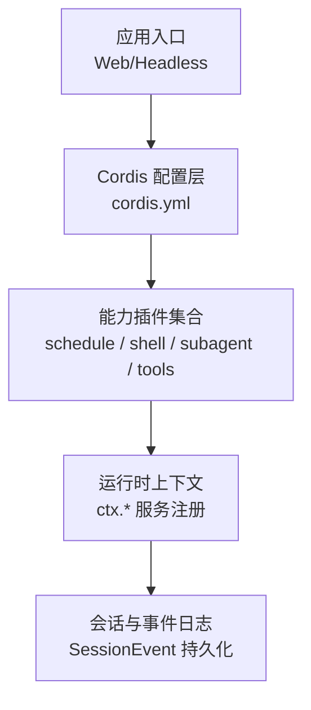
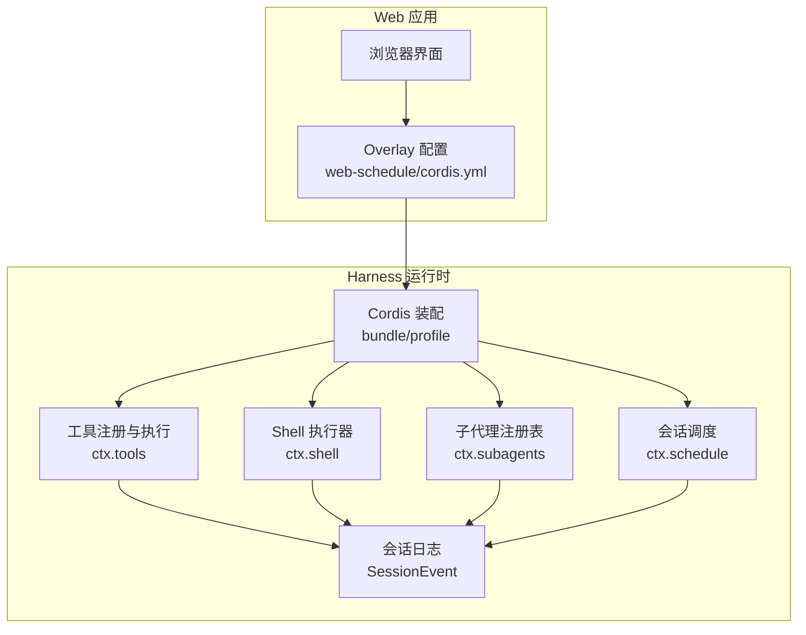
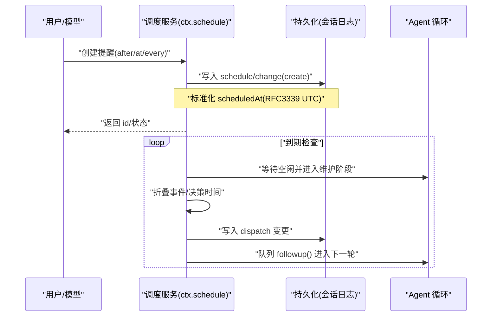
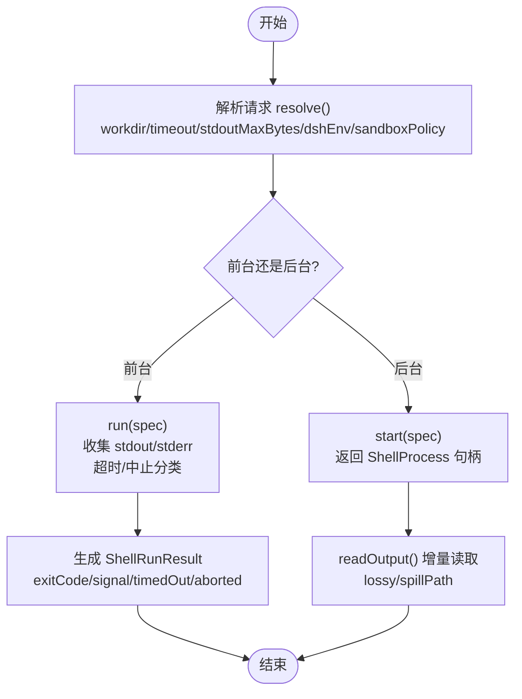
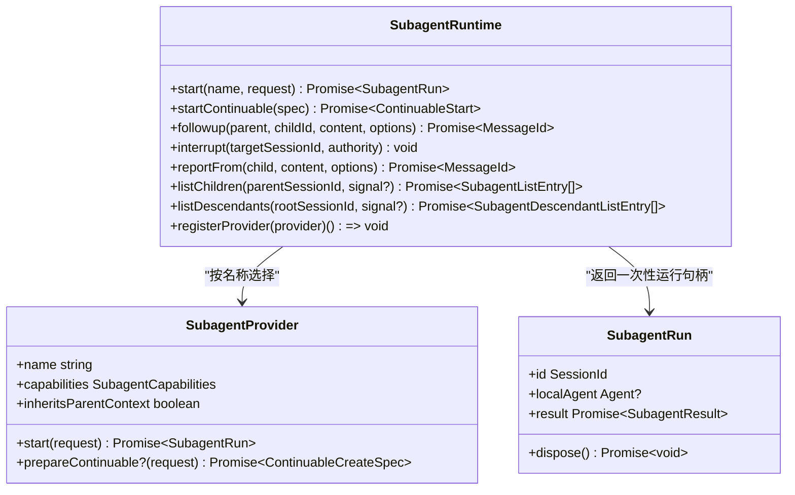
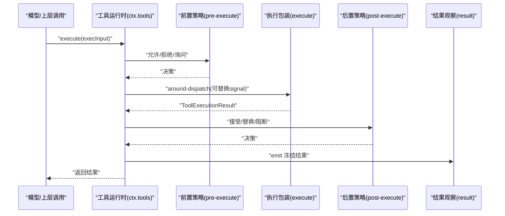
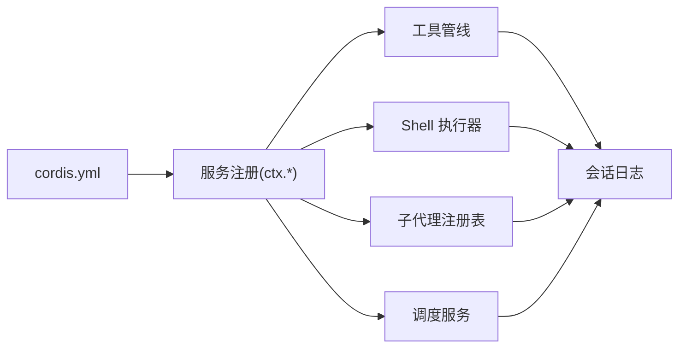

# 集成示例

<cite>
**本文引用的文件**
- [README.md](file://README.md)
- [架构文档](file://docs/architecture.md)
- [Web 调度配置](file://examples/web-schedule/cordis.yml)
- [ACP 代理配置](file://examples/acp-agent/cordis.yml)
- [会话级调度子系统文档](file://docs/subsystems/schedule.md)
- [Shell/执行器子系统文档](file://docs/subsystems/shell.md)
- [子代理子系统文档](file://docs/subsystems/subagent.md)
- [工具子系统文档](file://docs/subsystems/tools.md)
</cite>

## 目录
1. [简介](#简介)
2. [项目结构](#项目结构)
3. [核心组件](#核心组件)
4. [架构总览](#架构总览)
5. [详细组件分析](#详细组件分析)
6. [依赖关系分析](#依赖关系分析)
7. [性能考虑](#性能考虑)
8. [故障排查指南](#故障排查指南)
9. [结论](#结论)
10. [附录](#附录)

## 简介
本集成示例面向 DeepSeek Harness（dsh）与外部系统、工具的对接，覆盖三类典型场景：
- Web 调度器集成：在 Web 应用中启用会话级定时提醒与固定频率任务。
- Shell 工具集成：通过统一的 Shell 执行接口运行命令、管理进程、沙箱策略与环境变量。
- 子代理集成：将工作委派给子代理，支持一次性启动与可延续的后台对话。

文档从架构、通信协议、数据交换格式入手，给出完整的集成配置与调用流程说明，并解释异步操作、错误处理与状态同步的最佳实践，同时提供性能与安全建议。

## 项目结构
DeepSeek Harness 采用“一切皆插件”的 Cordis 架构，通过配置文件（cordis.yml）组合不同能力层。示例工程展示了如何叠加能力：
- Web 调度：通过 overlay 注入时间上下文与调度服务。
- ACP 代理：组合模型适配器、沙箱、审批、子代理、工作流等能力。
- 子系统文档：对调度、Shell、子代理、工具等能力进行类型化契约说明。

图表来源
- [架构文档:15-37](file://docs/architecture.md#L15-L37)
- [Web 调度配置:1-10](file://examples/web-schedule/cordis.yml#L1-L10)
- [ACP 代理配置:1-193](file://examples/acp-agent/cordis.yml#L1-L193)

章节来源
- [README.md:1-58](file://README.md#L1-L58)
- [架构文档:15-37](file://docs/architecture.md#L15-L37)

## 核心组件
- 工具管线（Tools）：统一注册、校验、执行、呈现与审计；支持并行/独占模式、超时、前置/后置拦截、结果规范化。
- Shell 执行器（Shell）：抽象执行接口，本地/沙箱实现，前台/后台进程管理，环境变量与沙箱策略。
- 子代理（Subagent）：命名提供者注册表，一次性与可延续两种模式，冷启动恢复、中断、报告通道、枚举与发现。
- 调度（Schedule）：会话内持久化提醒，绝对时间/延迟/固定间隔三种规则，批处理投递与回放一致性。

章节来源
- [工具子系统文档:9-93](file://docs/subsystems/tools.md#L9-L93)
- [Shell 子系统文档:9-103](file://docs/subsystems/shell.md#L9-L103)
- [子代理子系统文档:11-145](file://docs/subsystems/subagent.md#L11-L145)
- [调度子系统文档:7-103](file://docs/subsystems/schedule.md#L7-L103)

## 架构总览
下图展示 dsh 在 Web 场景中，通过 cordis.yml 叠加能力，并在运行时以 ctx.* 暴露服务，供工具、Shell、子代理与调度协同工作。

图表来源
- [Web 调度配置:1-10](file://examples/web-schedule/cordis.yml#L1-L10)
- [ACP 代理配置:1-193](file://examples/acp-agent/cordis.yml#L1-L193)
- [架构文档:15-37](file://docs/architecture.md#L15-L37)

## 详细组件分析

### Web 调度器集成
- 目标：在 Web 应用中启用会话级定时提醒，支持 after/at/every 三种规则，并以普通对话轮次形式投递到原会话。
- 配置要点：通过 overlay 插入时间上下文与调度服务。
- 数据模型：记录包含 id、kind、prompt、scheduledAt 等字段；变更通过 schedule/change 事件持久化。
- 投递语义：一次 one-shot 或一批 overdue every 进入后续轮次；冷重启后重建定时器；失败重试与幂等性由管理器保证。

图表来源
- [调度子系统文档:7-103](file://docs/subsystems/schedule.md#L7-L103)
- [调度子系统文档:154-187](file://docs/subsystems/schedule.md#L154-L187)

章节来源
- [Web 调度配置:1-10](file://examples/web-schedule/cordis.yml#L1-L10)
- [调度子系统文档:7-103](file://docs/subsystems/schedule.md#L7-L103)
- [调度子系统文档:154-187](file://docs/subsystems/schedule.md#L154-L187)

### Shell 工具集成
- 目标：统一执行命令、管理前台/后台进程、控制超时与信号、合并环境变量与沙箱策略。
- 关键接口：resolve/run/start、ShellRunResult、ShellProcess、ShellSandboxInfo。
- 环境变量：DSH_* 由 Harness 管理，每次执行前清理并合并当前快照。
- 沙箱：根据会话策略解析 sandboxPolicy，拒绝时返回事实，支持请求更宽权限并重试。

图表来源
- [Shell 子系统文档:13-103](file://docs/subsystems/shell.md#L13-L103)
- [Shell 子系统文档:105-217](file://docs/subsystems/shell.md#L105-L217)

章节来源
- [Shell 子系统文档:9-103](file://docs/subsystems/shell.md#L9-L103)
- [Shell 子系统文档:105-217](file://docs/subsystems/shell.md#L105-L217)

### 子代理集成
- 目标：将复杂任务委派给子代理，支持一次性（one-shot）与可延续（continuable）两种模式。
- 能力发现：提供者声明 start-time 能力；可延续能力通过可选方法存在即表示支持。
- 生命周期：一次性通过 run.result 获取最终输出；可延续通过 startContinuable/followup/interrupt/reportFrom 管理。
- 枚举与发现：listChildren/listDescendants 基于会话存储与可选持久化的合并视图，带投影缓存加速。

图表来源
- [子代理子系统文档:11-145](file://docs/subsystems/subagent.md#L11-L145)
- [子代理子系统文档:308-468](file://docs/subsystems/subagent.md#L308-L468)
- [子代理子系统文档:478-649](file://docs/subsystems/subagent.md#L478-L649)

章节来源
- [ACP 代理配置:87-134](file://examples/acp-agent/cordis.yml#L87-L134)
- [子代理子系统文档:11-145](file://docs/subsystems/subagent.md#L11-L145)
- [子代理子系统文档:308-468](file://docs/subsystems/subagent.md#L308-L468)
- [子代理子系统文档:478-649](file://docs/subsystems/subagent.md#L478-L649)

### 工具子系统（通用集成基座）
- 目标：为所有工具提供统一的注册、校验、执行、呈现与审计管道。
- 关键点：参数与输出使用 JSON Schema 子集；execute 必须遵循取消与收敛；支持 isConcurrencySafe 并行分组；presentCall/presentResult 定义 UI 呈现意图。
- 扩展点：tools/pre-execute、tools/execute、tools/post-execute、tools/result 水线与事件。

图表来源
- [工具子系统文档:170-404](file://docs/subsystems/tools.md#L170-L404)
- [工具子系统文档:478-721](file://docs/subsystems/tools.md#L478-L721)

章节来源
- [工具子系统文档:9-93](file://docs/subsystems/tools.md#L9-L93)
- [工具子系统文档:170-404](file://docs/subsystems/tools.md#L170-L404)
- [工具子系统文档:478-721](file://docs/subsystems/tools.md#L478-L721)

## 依赖关系分析
- 配置驱动：Web 调度与 ACP 代理通过 cordis.yml 叠加能力，决定运行时可用的 ctx.* 服务。
- 服务耦合：工具、Shell、子代理均依赖会话日志与事件总线；调度依赖 Agent 空闲期与持久化屏障。
- 外部集成点：Shell 通过 subprocess 与沙箱后端；子代理可通过 spawn/fork/acp 等提供者；工具可桥接 MCP/工作流等。

图表来源
- [Web 调度配置:1-10](file://examples/web-schedule/cordis.yml#L1-L10)
- [ACP 代理配置:1-193](file://examples/acp-agent/cordis.yml#L1-L193)
- [架构文档:15-37](file://docs/architecture.md#L15-L37)

章节来源
- [Web 调度配置:1-10](file://examples/web-schedule/cordis.yml#L1-L10)
- [ACP 代理配置:1-193](file://examples/acp-agent/cordis.yml#L1-L193)
- [架构文档:15-37](file://docs/architecture.md#L15-L37)

## 性能考虑
- 工具并行：利用 isConcurrencySafe 将无副作用的工具放入并行组，减少整体时延。
- 输出预算：Shell 的 stdoutMaxBytes 限制前台输出大小，避免大文本阻塞；溢出时 spill 文件用于恢复。
- 调度批处理：overdue every 记录在同一轮次中批量投递，降低模型轮次开销。
- 子代理深度与过滤：通过 maxDepth 与 toolFilter 限制子代理能力范围，减少不必要计算。
- 压缩与持久化：ACP 示例默认 zstd 压缩会话日志，降低 I/O 压力。

[本节为通用指导，不直接分析具体文件]

## 故障排查指南
- 调度失败：若 persistence barrier 失败，返回 persistence_uncertain；无效时间/时区/频率会返回对应错误码；冷重启后需重建定时器。
- Shell 失败：区分退出码、信号、超时与中止；沙箱不可用抛出 SANDBOX_UNAVAILABLE；stderr/stdout 截断时查看 spill 路径。
- 子代理失败：一次性 run.result 非 completed 视为部分输出；可延续 followup 可能因授权冲突被拒；中断仅发信号不等待完成。
- 工具失败：未知工具报 UNKNOWN_TOOL；参数/输出校验失败走工具错误路径；post-execute 可阻断并转为 isError。

章节来源
- [调度子系统文档:154-187](file://docs/subsystems/schedule.md#L154-L187)
- [Shell 子系统文档:105-217](file://docs/subsystems/shell.md#L105-L217)
- [子代理子系统文档:308-468](file://docs/subsystems/subagent.md#L308-L468)
- [工具子系统文档:170-404](file://docs/subsystems/tools.md#L170-L404)

## 结论
通过 Cordis 的配置化装配与能力 seam，DeepSeek Harness 能够以最小侵入方式集成 Web 调度、Shell 执行与子代理等外部系统。借助统一的工具管线与会话日志，系统在异步、错误与状态一致性方面提供了稳健保障。结合并行、预算与压缩等优化手段，可在保证安全的前提下提升吞吐与响应速度。

[本节为总结性内容，不直接分析具体文件]

## 附录
- 快速上手：参考根 README 中的运行方式与开发指引。
- 更多示例：查看 examples 下的 web-schedule 与 acp-agent 配置，理解能力叠加方式。
- 深入阅读：子系统文档提供类型化契约与 API 目录，便于二次开发与集成。

章节来源
- [README.md:13-35](file://README.md#L13-L35)
- [Web 调度配置:1-10](file://examples/web-schedule/cordis.yml#L1-L10)
- [ACP 代理配置:1-193](file://examples/acp-agent/cordis.yml#L1-L193)