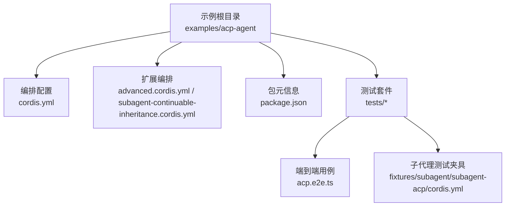
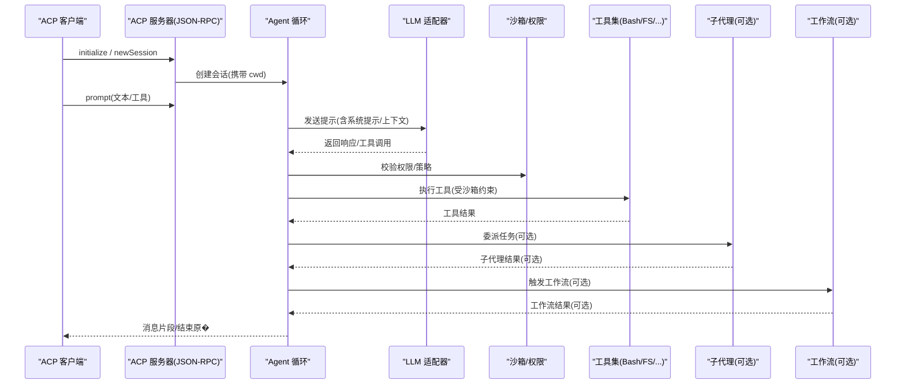
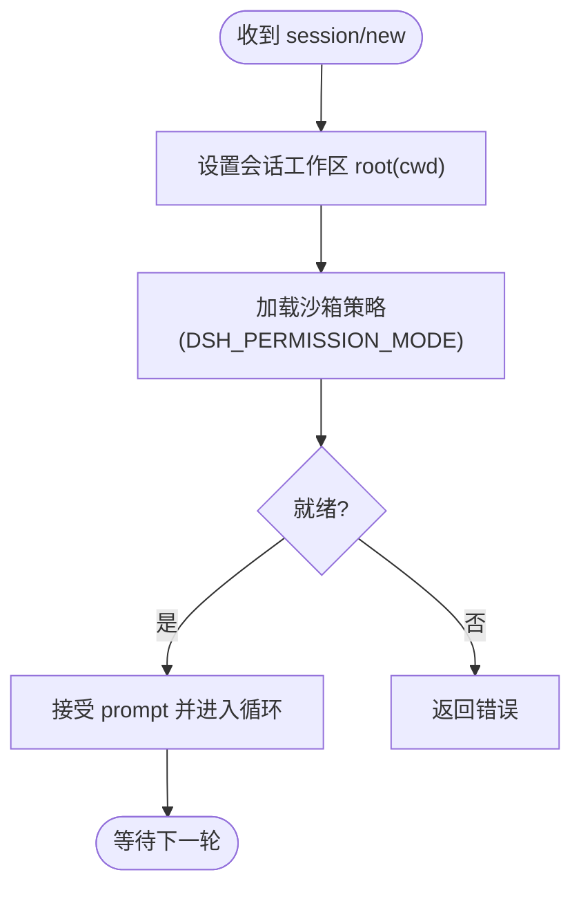
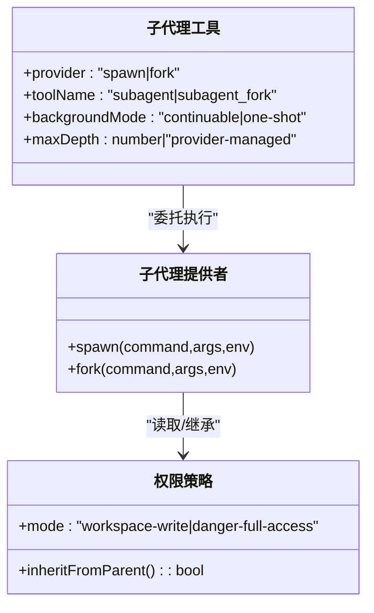
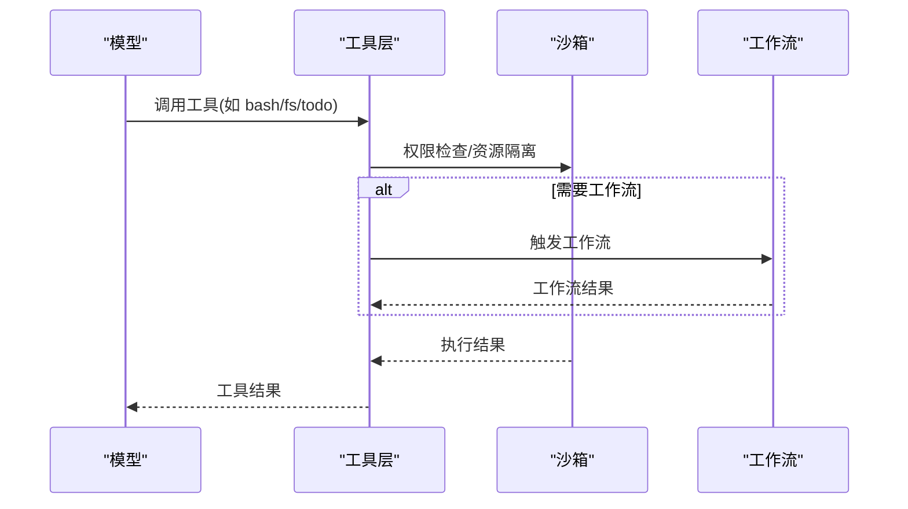
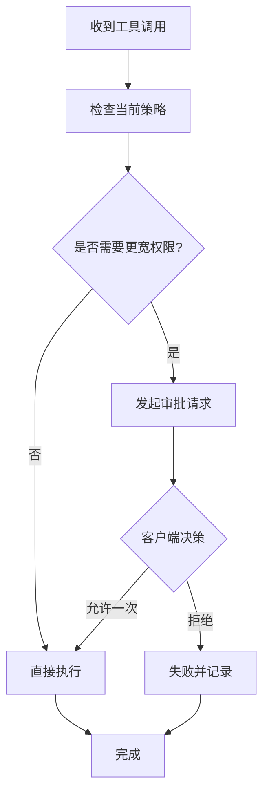
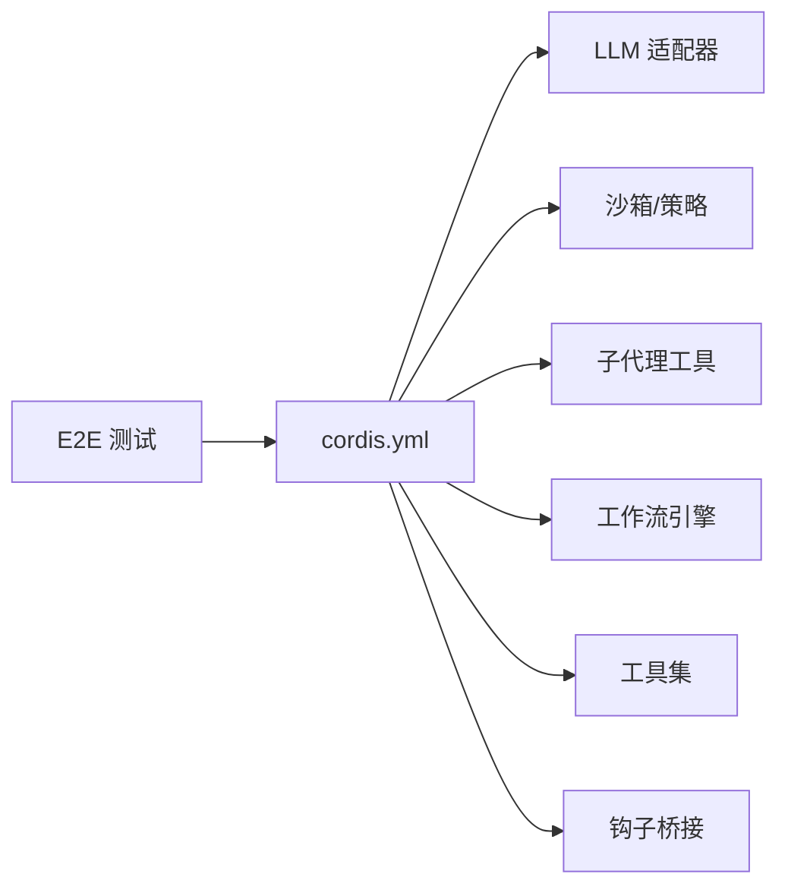

# ACP Agent 示例

<cite>
**本文引用的文件**
- [README.md](file://examples/acp-agent/README.md)
- [cordis.yml](file://examples/acp-agent/cordis.yml)
- [package.json](file://examples/acp-agent/package.json)
- [advanced.cordis.yml](file://examples/acp-agent/advanced.cordis.yml)
- [subagent-continuable-inheritance.cordis.yml](file://examples/acp-agent/subagent-continuable-inheritance.cordis.yml)
- [acp.e2e.ts](file://examples/acp-agent/tests/acp.e2e.ts)
- [README.md](file://packages/acp/README.md)
- [tests/fixtures/subagent/subagent-acp/cordis.yml](file://examples/acp-agent/tests/fixtures/subagent/subagent-acp/cordis.yml)
</cite>

## 目录
1. [简介](#简介)
2. [项目结构](#项目结构)
3. [核心组件](#核心组件)
4. [架构总览](#架构总览)
5. [详细组件分析](#详细组件分析)
6. [依赖关系分析](#依赖关系分析)
7. [性能与可扩展性](#性能与可扩展性)
8. [故障排查指南](#故障排查指南)
9. [结论](#结论)
10. [附录：配置与测试要点](#附录配置与测试要点)

## 简介
本示例展示基于 ACP（Agent Client Protocol）的自动化智能体通信模式。它通过 JSON-RPC over stdio 暴露 ACP 服务器，面向父代理、子代理提供者及其他程序化客户端，不承载 UI。每个 session/new 会创建独立工作区与沙箱策略，支持子代理、工作流、工具链、权限审批、压缩与持久化等能力，并通过端到端测试验证协议通道纯净性与实际文件系统效果。

**章节来源**
- [README.md:1-25](file://examples/acp-agent/README.md#L1-L25)
- [README.md:1-12](file://packages/acp/README.md#L1-L12)

## 项目结构
- 示例根目录 examples/acp-agent 提供可运行的 ACP 自动化服务器与多种场景覆盖的配置文件与测试。
- 核心编排由 cordis.yml 定义，组合 LLM、沙箱、子代理、工作流、工具、钩子等插件。
- tests 目录包含端到端用例与快照，覆盖协议通道纯净性、会话创建、真实提示执行、子代理继承、权限策略等。

**图表来源**
- [cordis.yml:1-193](file://examples/acp-agent/cordis.yml#L1-L193)
- [advanced.cordis.yml:1-30](file://examples/acp-agent/advanced.cordis.yml#L1-L30)
- [subagent-continuable-inheritance.cordis.yml:1-12](file://examples/acp-agent/subagent-continuable-inheritance.cordis.yml#L1-L12)
- [package.json:1-8](file://examples/acp-agent/package.json#L1-L8)
- [acp.e2e.ts:1-127](file://examples/acp-agent/tests/acp.e2e.ts#L1-L127)
- [tests/fixtures/subagent/subagent-acp/cordis.yml:1-56](file://examples/acp-agent/tests/fixtures/subagent/subagent-acp/cordis.yml#L1-L56)

**章节来源**
- [package.json:1-8](file://examples/acp-agent/package.json#L1-L8)

## 核心组件
- ACP 自动化服务器：以 JSON-RPC over stdio 暴露 ACP 接口，负责会话生命周期、提示路由、结果聚合与协议通道纯净性。
- LLM 适配层：默认使用 DeepSeek 适配器，支持思考模式与模型选择。
- 沙箱与权限：本地沙箱 + 策略，按部署模式控制 workspace-write 或危险全访问；重试时可通过审批流程请求更宽权限。
- 子代理管理：支持 spawn/fork 两种进程内/外方式，支持可继续后台子代理与一次性 fork，具备深度限制与列表能力。
- 工作流引擎：线程工作器驱动脚本中的 agent() 调用，配合工具暴露给模型。
- 工具栈：Bash、文件系统、Todo、Ralph、Cordis（可选）、重复提醒等。
- 钩子：兼容 Claude Code 与 Codex 两种钩子协议，用于预处理/后处理与上下文注入。
- 持久化与压缩：JSONL 会话日志，可按环境切换压缩策略。

**章节来源**
- [cordis.yml:7-193](file://examples/acp-agent/cordis.yml#L7-L193)
- [README.md:1-25](file://examples/acp-agent/README.md#L1-L25)

## 架构总览
下图展示了 ACP Agent 在运行时的主要交互：客户端通过 JSON-RPC 与 ACP 服务器通信，服务器协调 LLM、沙箱、子代理与工作流，并将结果回传。

**图表来源**
- [cordis.yml:7-193](file://examples/acp-agent/cordis.yml#L7-L193)
- [README.md:1-25](file://examples/acp-agent/README.md#L1-L25)

## 详细组件分析

### ACP 协议通道与会话管理
- 协议通道：stdout 仅承载换行分隔的 ACP JSON-RPC 帧，禁止任何非协议输出泄漏。
- 会话创建：session/new 接收绝对路径的 cwd，作为该会话的工作空间根；后续工具与沙箱均基于此解析。
- 权限策略：DSH_PERMISSION_MODE 决定默认策略；workspace-write 下，模型重试若需更广权限，将触发审批流程，由客户端决定是否允许一次。

**图表来源**
- [README.md:14-25](file://examples/acp-agent/README.md#L14-L25)
- [cordis.yml:18-32](file://examples/acp-agent/cordis.yml#L18-L32)

**章节来源**
- [README.md:14-25](file://examples/acp-agent/README.md#L14-L25)
- [acp.e2e.ts:42-97](file://examples/acp-agent/tests/acp.e2e.ts#L42-L97)

### 子代理管理与继承
- 子代理提供者：支持 spawn 与 fork 两种方式；spawn 适合长驻后台（可继续），fork 为一次性任务。
- 深度限制：可配置 maxDepth，避免无限递归；某些场景由提供者自行管理深度。
- 权限继承：父会话的策略可被子代理继承，例如只读父会话的子代理也保持只读。
- 列表能力：通过注册表暴露 list_agents，便于上层发现可用子代理。

**图表来源**
- [cordis.yml:87-135](file://examples/acp-agent/cordis.yml#L87-L135)
- [subagent-continuable-inheritance.cordis.yml:1-12](file://examples/acp-agent/subagent-continuable-inheritance.cordis.yml#L1-L12)
- [tests/fixtures/subagent/subagent-acp/cordis.yml:10-36](file://examples/acp-agent/tests/fixtures/subagent/subagent-acp/cordis.yml#L10-L36)

**章节来源**
- [cordis.yml:87-135](file://examples/acp-agent/cordis.yml#L87-L135)
- [subagent-continuable-inheritance.cordis.yml:1-12](file://examples/acp-agent/subagent-continuable-inheritance.cordis.yml#L1-L12)
- [tests/fixtures/subagent/subagent-acp/cordis.yml:1-56](file://examples/acp-agent/tests/fixtures/subagent/subagent-acp/cordis.yml#L1-L56)

### 工作流与工具链
- 工作流：线程工作器驱动脚本中的 agent() 调用，通过 spawn 后端与外部进程协作。
- 工具：Bash、文件系统、Todo、Ralph、Cordis（可选）等；文件系统操作受同一沙箱策略约束。
- 代码模式：advanced 配置启用 both 模式，同时暴露 CLI 与 Code Mode 工具通道。

**图表来源**
- [cordis.yml:137-175](file://examples/acp-agent/cordis.yml#L137-L175)
- [advanced.cordis.yml:1-30](file://examples/acp-agent/advanced.cordis.yml#L1-L30)

**章节来源**
- [cordis.yml:137-175](file://examples/acp-agent/cordis.yml#L137-L175)
- [advanced.cordis.yml:1-30](file://examples/acp-agent/advanced.cordis.yml#L1-L30)

### 权限控制与审批
- 部署模式：DSH_PERMISSION_MODE 控制默认策略；快照模式下默认危险全访问以保证场景稳定。
- 审批流程：workspace-write 下，若模型重试请求更宽权限，将触发 session/request_permission，客户端可选择 allow_once 或 reject_once。
- 审计记录：每次审批结果通过工具结果/审计路径记录，服务端不持久化客户端策略。

**图表来源**
- [README.md:20-25](file://examples/acp-agent/README.md#L20-L25)
- [cordis.yml:18-46](file://examples/acp-agent/cordis.yml#L18-L46)

**章节来源**
- [README.md:20-25](file://examples/acp-agent/README.md#L20-L25)
- [cordis.yml:18-46](file://examples/acp-agent/cordis.yml#L18-L46)

### 钩子与兼容性
- 钩子桥接：同时支持 Claude Code 与 Codex 两种钩子协议，分别读取各自配置文件。
- 行为契约：进程级加载、只读一次、缺失即无操作；警告走 logger，不污染 stdout。

**章节来源**
- [cordis.yml:176-193](file://examples/acp-agent/cordis.yml#L176-L193)

## 依赖关系分析
- 编排层：cordis.yml 集中声明所有插件 ID、名称与配置，形成可插拔的运行时图。
- 关键依赖：
  - LLM：deepseek-official 适配器，支持 thinking 与 reasoningEffort。
  - 沙箱：本地沙箱 + 策略，绑定 workspaceRoot 与 mode。
  - 子代理：spawn/fork 提供者与工具包装，支持列表与报告。
  - 工作流：线程工作器 + 工具桥接。
  - 工具：bash、fs、todo、ralph、repeat-tool-reminder 等。
  - 钩子：claude-code 与 codex 两套实现。
- 测试依赖：E2E 通过启动真实子进程，驱动 ACP 协议，断言 stdout 纯净与文件系统效果。

**图表来源**
- [cordis.yml:7-193](file://examples/acp-agent/cordis.yml#L7-L193)
- [acp.e2e.ts:1-127](file://examples/acp-agent/tests/acp.e2e.ts#L1-L127)

**章节来源**
- [cordis.yml:7-193](file://examples/acp-agent/cordis.yml#L7-L193)
- [acp.e2e.ts:1-127](file://examples/acp-agent/tests/acp.e2e.ts#L1-L127)

## 性能与可扩展性
- 压缩与持久化：JSONL 会话日志可按环境切换 zstd 压缩，平衡存储与回放效率。
- 上下文窗口：workspaceContext 限制最大字节数，避免过长上下文影响性能。
- 令牌计量与压缩：token-meter 与 compaction-basic 协同，防止溢出并自动摘要历史。
- 并行与批处理：工具如 todo_write 支持并行进行中任务，提升吞吐。
- 扩展点：通过 cordis 插件机制新增工具、提供者、钩子与策略，无需改动核心。

[本节为通用指导，不直接分析具体文件]

## 故障排查指南
- 协议通道污染：确保无任何 print/logger 写入 stdout；E2E 会断言每行均为合法 JSON-RPC 帧。
- 会话创建失败：检查 session/new 是否传入有效 cwd，以及注入路径是否正确；E2E 覆盖了无 key 下的初始化与新建会话路径。
- 权限被拒：确认 DSH_PERMISSION_MODE 与 workspaceRoot 设置；必要时通过审批流程申请一次更宽权限。
- 子代理继承异常：验证父会话策略是否被正确继承；测试夹具演示了只读父会话到子代理的继承。
- 钩子未生效：确认 hooks.json 或 codex-hooks.json 路径存在且格式正确；钩子仅记录警告，不影响主流程。

**章节来源**
- [acp.e2e.ts:42-97](file://examples/acp-agent/tests/acp.e2e.ts#L42-L97)
- [tests/fixtures/subagent/subagent-acp/cordis.yml:1-56](file://examples/acp-agent/tests/fixtures/subagent/subagent-acp/cordis.yml#L1-L56)
- [cordis.yml:176-193](file://examples/acp-agent/cordis.yml#L176-L193)

## 结论
本示例以 ACP 为核心，提供了完整的自动化智能体通信范式：标准化的 JSON-RPC 通道、严格的会话与权限模型、灵活的可插拔工具与子代理体系、以及完善的测试与快照机制。通过 cordis 编排，可在不同部署目标间快速切换策略与能力，满足企业级对安全、可观测与可扩展的需求。

[本节为总结性内容，不直接分析具体文件]

## 附录：配置与测试要点
- 环境变量
  - DEEPSEEK_API_KEY：启动 LLM 适配器所需（E2E 中可使用占位值进行引导）。
  - DSH_PERMISSION_MODE：workspace-write 或 danger-full-access，控制默认权限策略。
  - DSH_SNAPSHOT：切换快照模式与压缩策略。
  - DSH_SNAPSHOT_SESSIONS_ROOT：指定会话持久化根目录（快照采集用）。
- 关键配置项
  - acp-agent：provider、model、persistenceRoot、persistenceCompression、workspaceContext.maxBytes、persona。
  - sandbox-policy：mode、workspaceRoot。
  - approval：policy 根据部署模式动态选择 ask 或 never。
  - tool-subagent/tool-subagent-fork：provider、toolName、backgroundMode、enableRunInBackground、maxDepth。
  - workflow-worker-thread：provider。
  - fs-sandbox：cwd。
  - hooks-claude-code/hooks-codex：configPath。
- 测试要点
  - 协议纯净性：stdout 仅包含 JSON-RPC 帧。
  - 会话创建：无 key 也能成功 initialize 与 newSession。
  - 真实提示执行：通过 bash 工具写文件，断言文件系统效果。
  - 子代理继承：只读父会话的子代理保持只读。

**章节来源**
- [README.md:1-25](file://examples/acp-agent/README.md#L1-L25)
- [cordis.yml:7-193](file://examples/acp-agent/cordis.yml#L7-L193)
- [acp.e2e.ts:1-127](file://examples/acp-agent/tests/acp.e2e.ts#L1-L127)