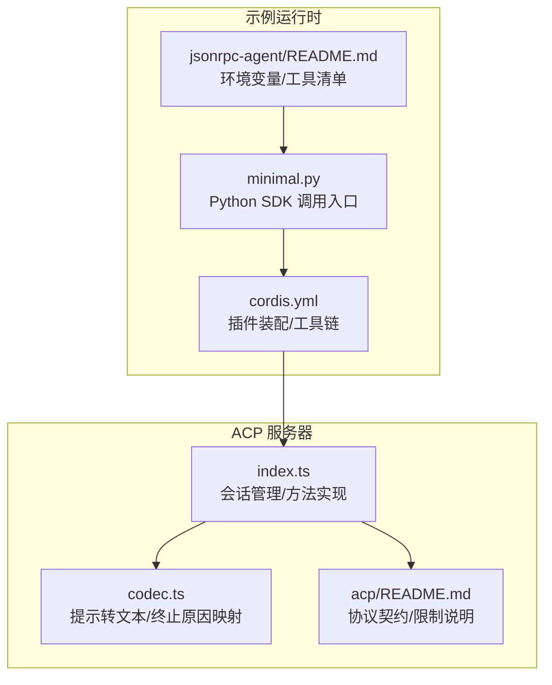
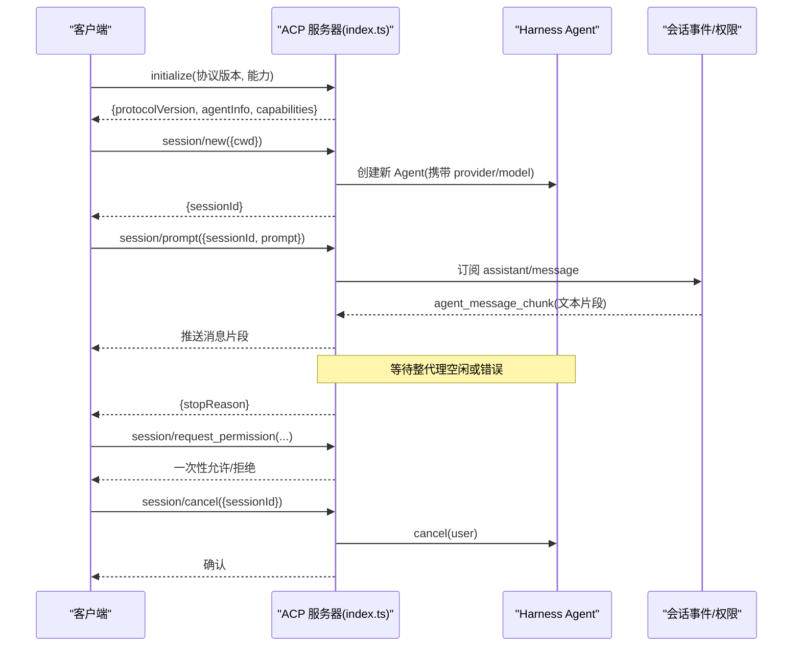
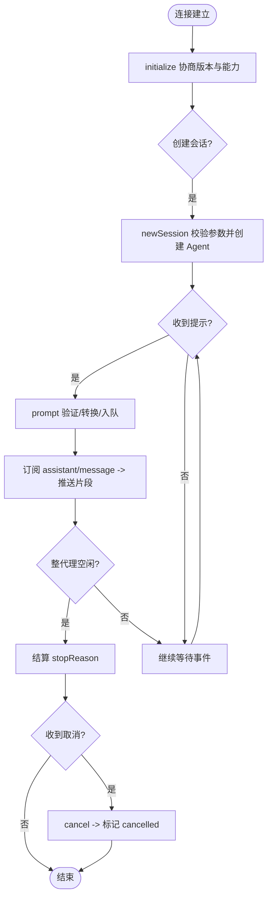
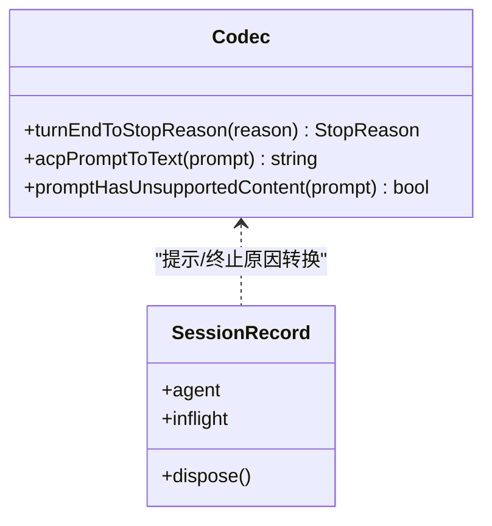
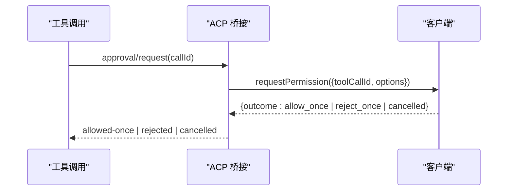
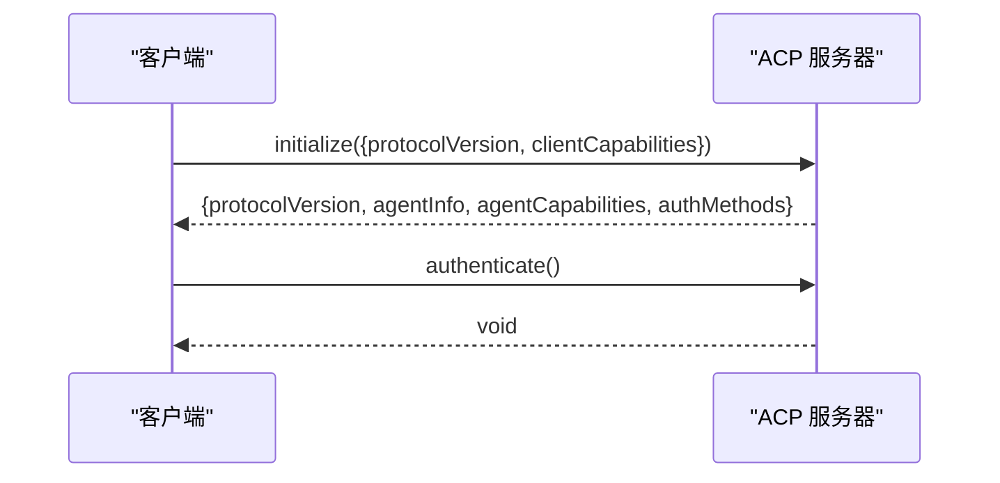
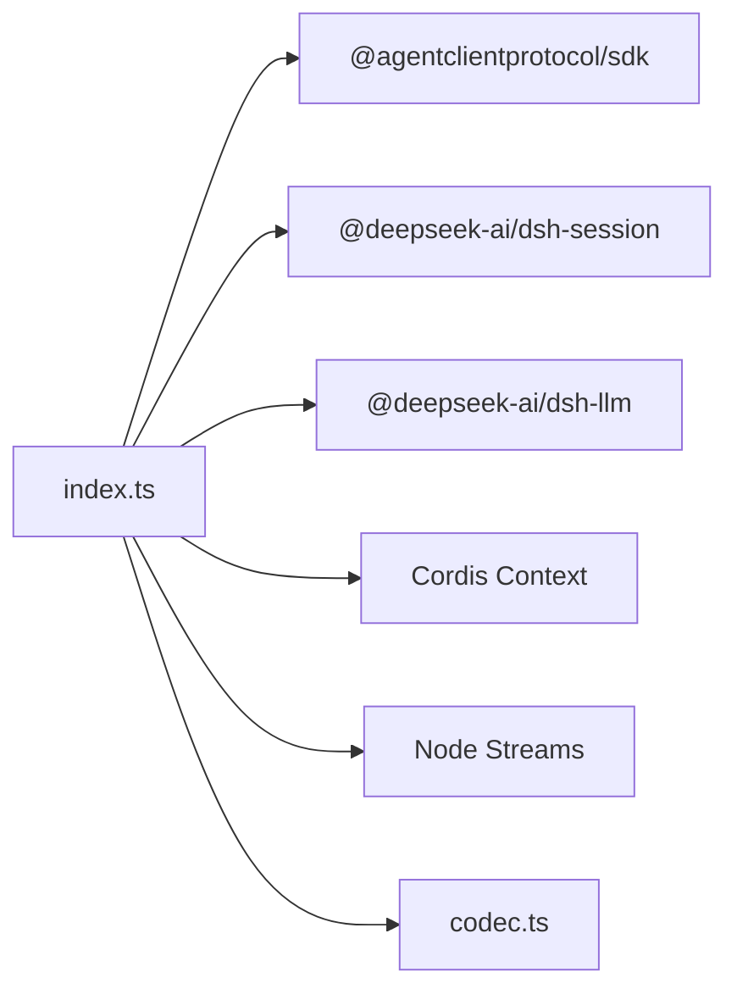

# ACP 协议概述

<cite>
**本文引用的文件**
- [packages/acp/README.md](file://packages/acp/README.md)
- [packages/acp/acp/README.md](file://packages/acp/acp/README.md)
- [packages/acp/acp/src/index.ts](file://packages/acp/acp/src/index.ts)
- [packages/acp/acp/src/codec.ts](file://packages/acp/acp/src/codec.ts)
- [examples/jsonrpc-agent/README.md](file://examples/jsonrpc-agent/README.md)
- [examples/jsonrpc-agent/cordis.yml](file://examples/jsonrpc-agent/cordis.yml)
- [examples/jsonrpc-agent/minimal.py](file://examples/jsonrpc-agent/minimal.py)
</cite>

## 目录
1. [简介](#简介)
2. [项目结构](#项目结构)
3. [核心组件](#核心组件)
4. [架构总览](#架构总览)
5. [详细组件分析](#详细组件分析)
6. [依赖关系分析](#依赖关系分析)
7. [性能考虑](#性能考虑)
8. [故障排查指南](#故障排查指南)
9. [结论](#结论)
10. [附录](#附录)

## 简介
ACP（Agent Communication Protocol，智能体通信协议）在本仓库中是一个面向自动化的、基于 JSON-RPC stdio 的传输层。它暴露受信任的程序化客户端创建新的 Harness 会话、发送文本提示、收集已提交的助手消息、以一次性策略决定权限请求，以及取消正在进行的任务。该协议专注于自动化场景，不包含编辑器导航、回放、命令、模式选择、人机交互或工具呈现等 UI 能力。

设计目标
- 提供稳定、可复现、易于测试的自动化接口：通过 JSON-RPC over stdio 实现进程间通信，便于脚本与 SDK 集成。
- 最小化协议面：仅承载提示、提交结果、取消和一次性权限决策，避免将 UI 语义泄漏到自动化通道。
- 明确会话与生命周期边界：每个连接拥有若干会话；连接关闭时统一清理所有会话及其子代理。
- 安全与可控：拒绝非基线能力（图像、音频、嵌入式上下文），限制工作区参数，显式支持一次性授权。
- 版本兼容：通过 initialize 协商协议版本并声明能力集，确保客户端与服务端对齐。

通信模式
- 单向流式输出：服务端在会话事件中将“已提交的助手消息”分块推送为 agent_message_chunk。
- 请求-响应：session/new、session/prompt、session/request_permission 等采用请求-响应模型。
- 通知：session/update 用于推送会话更新（如消息片段）。
- 取消：session/cancel 可中断指定会话中的活动。

## 项目结构
ACP 相关代码主要位于 packages/acp 下，包含自动化服务器实现与文档说明；示例工程 examples/jsonrpc-agent 展示了如何通过 Python SDK 驱动一个无头编码智能体，其运行环境与配置可作为 ACP 使用场景的参考。

图表来源
- [packages/acp/acp/src/index.ts:105-415](file://packages/acp/acp/src/index.ts#L105-L415)
- [packages/acp/acp/src/codec.ts:14-66](file://packages/acp/acp/src/codec.ts#L14-L66)
- [packages/acp/acp/README.md:20-44](file://packages/acp/acp/README.md#L20-L44)
- [examples/jsonrpc-agent/cordis.yml:1-90](file://examples/jsonrpc-agent/cordis.yml#L1-L90)
- [examples/jsonrpc-agent/minimal.py:16-39](file://examples/jsonrpc-agent/minimal.py#L16-L39)
- [examples/jsonrpc-agent/README.md:16-40](file://examples/jsonrpc-agent/README.md#L16-L40)

章节来源
- [packages/acp/README.md:1-12](file://packages/acp/README.md#L1-L12)
- [packages/acp/acp/README.md:1-44](file://packages/acp/acp/README.md#L1-L44)
- [examples/jsonrpc-agent/README.md:1-40](file://examples/jsonrpc-agent/README.md#L1-L40)

## 核心组件
- 自动化服务器（AgentSideConnection）：挂载于 Cordis 上下文中，监听会话事件、处理权限请求、维护会话状态机，并通过 ndJsonStream 在 stdin/stdout 上收发 JSON-RPC 帧。
- 编解码器（Codec）：将 ACP 提示转换为纯文本（含资源链接的文本化引用），并将内部 TurnEndReason 映射为 ACP 的 StopReason。
- 会话记录（SessionRecord）：保存 Agent 引用、dispose 句柄、当前进行中的 prompt 及结束原因，保证每会话独立的生命周期与并发控制。
- 配置项（AcpConfig）：可选 provider/model/stream，用于为新建 Agent 注入默认模型路由或测试用传输。

关键职责
- 初始化与能力声明：返回协议版本与能力集（仅文本与资源链接）。
- 会话创建：校验 cwd 必须为绝对路径，拒绝 additionalDirectories/mcpServers 非空值。
- 提示执行：合并文本块、渲染资源链接、拒绝空提示与非基线内容，等待整代理空闲后返回 stopReason。
- 取消与清理：取消指定会话并释放进行中提示；连接关闭时级联清理所有会话与可延续子代理。
- 权限决策：向客户端发起一次性 allow_once/reject_once 决策，不持久化授权。

章节来源
- [packages/acp/acp/src/index.ts:69-98](file://packages/acp/acp/src/index.ts#L69-L98)
- [packages/acp/acp/src/index.ts:231-345](file://packages/acp/acp/src/index.ts#L231-L345)
- [packages/acp/acp/src/index.ts:348-415](file://packages/acp/acp/src/index.ts#L348-L415)
- [packages/acp/acp/src/codec.ts:14-66](file://packages/acp/acp/src/codec.ts#L14-L66)
- [packages/acp/acp/README.md:20-44](file://packages/acp/acp/README.md#L20-L44)

## 架构总览
ACP 服务器作为传输适配器，桥接外部程序化客户端与内部 Harness Agent。客户端通过 JSON-RPC 建立连接，完成握手后创建会话、发送提示、接收消息片段、必要时参与一次性权限决策，并在需要时取消任务。

图表来源
- [packages/acp/acp/src/index.ts:231-345](file://packages/acp/acp/src/index.ts#L231-L345)
- [packages/acp/acp/src/index.ts:155-229](file://packages/acp/acp/src/index.ts#L155-L229)

## 详细组件分析

### 会话管理与生命周期
- 会话键：以 SessionId 索引，严格绑定到具体 Agent 实例，防止同 ID 冒充。
- 进行中提示：每个会话仅允许一个 in-flight 提示；重复提交会立即报错。
- 空闲结算：提示完成后等待整代理空闲，再根据 turn/end 或错误决定 stopReason。
- 连接关闭：标记 closed，拒绝新请求；取消所有会话；按子代理先序排空可延续后代；并行 dispose 并汇总失败。

图表来源
- [packages/acp/acp/src/index.ts:124-143](file://packages/acp/acp/src/index.ts#L124-L143)
- [packages/acp/acp/src/index.ts:277-335](file://packages/acp/acp/src/index.ts#L277-L335)
- [packages/acp/acp/src/index.ts:338-344](file://packages/acp/acp/src/index.ts#L338-L344)
- [packages/acp/acp/src/index.ts:355-401](file://packages/acp/acp/src/index.ts#L355-L401)

章节来源
- [packages/acp/acp/src/index.ts:114-128](file://packages/acp/acp/src/index.ts#L114-L128)
- [packages/acp/acp/src/index.ts:251-275](file://packages/acp/acp/src/index.ts#L251-L275)
- [packages/acp/acp/src/index.ts:277-335](file://packages/acp/acp/src/index.ts#L277-L335)
- [packages/acp/acp/src/index.ts:355-401](file://packages/acp/acp/src/index.ts#L355-L401)

### 提示与消息格式
- 输入：仅支持 text 与 resource_link；resource_link 会被转为文本形式的引用，以便基础客户端理解。
- 输出：仅推送已提交的 assistant/message 文本块；图片附件会以占位文本形式上报。
- 终止原因：completed 映射为 end_turn；max-tokens 映射为 max_tokens；aborted/interrupted/error/blocked 分别映射为 end_turn 或 cancelled。

图表来源
- [packages/acp/acp/src/codec.ts:14-66](file://packages/acp/acp/src/codec.ts#L14-L66)
- [packages/acp/acp/src/index.ts:84-98](file://packages/acp/acp/src/index.ts#L84-L98)

章节来源
- [packages/acp/acp/src/codec.ts:43-66](file://packages/acp/acp/src/codec.ts#L43-L66)
- [packages/acp/acp/src/index.ts:155-196](file://packages/acp/acp/src/index.ts#L155-L196)
- [packages/acp/acp/src/index.ts:283-287](file://packages/acp/acp/src/index.ts#L283-L287)

### 权限处理机制
- 触发点：当工具调用需要审批时，桥接层向客户端发起一次性决策请求。
- 选项：allow_once（允许一次）、reject_once（拒绝一次）。
- 行为：不持久化授权；若客户端取消则返回 cancelled；否则根据选项返回 allowed-once 或 rejected。

图表来源
- [packages/acp/acp/src/index.ts:215-229](file://packages/acp/acp/src/index.ts#L215-L229)

章节来源
- [packages/acp/acp/src/index.ts:212-229](file://packages/acp/acp/src/index.ts#L212-L229)

### 握手流程与版本兼容性
- initialize：返回协议版本、智能体信息与能力集（仅文本与资源链接）。
- authenticate：无认证方法，直接返回。
- 能力声明：明确不支持图像、音频、嵌入式上下文；不声明编辑器/终端/文件系统/MCP 能力。

图表来源
- [packages/acp/acp/src/index.ts:231-249](file://packages/acp/acp/src/index.ts#L231-L249)

章节来源
- [packages/acp/acp/src/index.ts:231-249](file://packages/acp/acp/src/index.ts#L231-L249)
- [packages/acp/acp/README.md:20-31](file://packages/acp/acp/README.md#L20-L31)

### 实际通信示例（概念性）
以下示例展示典型交互顺序，字段名与类型遵循 ACP 规范：
- 初始化：客户端发送 initialize，服务端返回协议版本与能力。
- 创建会话：客户端发送 session/new，附带绝对路径的 cwd。
- 发送提示：客户端发送 session/prompt，包含文本与可选资源链接。
- 接收消息：服务端多次推送 session/update（agent_message_chunk）。
- 结束：服务端返回 prompt 响应，包含 stopReason。
- 取消：客户端可在任意时刻发送 session/cancel。

注意：此处为概念序列，不粘贴具体报文内容。

章节来源
- [packages/acp/acp/src/index.ts:251-345](file://packages/acp/acp/src/index.ts#L251-L345)
- [packages/acp/acp/README.md:20-44](file://packages/acp/acp/README.md#L20-L44)

## 依赖关系分析
ACP 服务器依赖以下核心模块与外部服务：
- @agentclientprotocol/sdk：JSON-RPC 连接、协议版本、类型定义。
- @deepseek-ai/dsh-session：会话 ID、事件与终止原因。
- @deepseek-ai/dsh-llm：构造用户消息与错误链。
- Cordis 上下文：注入 agents、logger、事件总线。
- Node.js 流：stdin/stdout 作为传输通道。

图表来源
- [packages/acp/acp/src/index.ts:12-40](file://packages/acp/acp/src/index.ts#L12-L40)

章节来源
- [packages/acp/acp/src/index.ts:12-40](file://packages/acp/acp/src/index.ts#L12-L40)

## 性能考虑
- 流式输出：仅推送已提交的助手消息文本块，减少不必要的数据传输与解析开销。
- 批量写入：通过 ndJsonStream 将帧写入 stdout，降低 I/O 次数。
- 空闲结算：等待整代理空闲后再结算提示，避免中间态导致的重复或丢失。
- 资源限制：拒绝非基线能力（图像/音频/嵌入式上下文），降低模型侧处理成本。
- 并发控制：每会话单提示，避免竞争条件与资源争用。
- 清理优化：连接关闭时并行 dispose 会话，缩短整体回收时间。

[本节为通用指导，不直接分析具体文件]

## 故障排查指南
常见错误与定位要点
- 未知会话：newSession/prompt/cancel 传入的 sessionId 不存在时，返回 invalidParams。
- 提示为空或非基线内容：prompt 为空或包含不被支持的块类型时，返回 invalidParams。
- 会话已处置：bridge 已 disposed 或 Agent 被外部释放时，返回 internalError。
- 提示未排队：followup 同步抛出异常时，返回 internalError。
- 连接关闭：连接断开或 teardown 失败时，记录警告日志并尝试清理。

建议步骤
- 检查 initialize 返回的能力是否与客户端期望一致。
- 确认 newSession 的 cwd 为绝对路径，且未设置 additionalDirectories/mcpServers。
- 观察 session/update 是否持续推送消息片段；若无，检查 assistant/message 事件。
- 若 prompt 长时间未完成，检查整代理空闲回调与 turn/end 事件。
- 对权限请求，确保客户端及时响应 allow_once/reject_once/cancelled。

章节来源
- [packages/acp/acp/src/index.ts:120-128](file://packages/acp/acp/src/index.ts#L120-L128)
- [packages/acp/acp/src/index.ts:277-316](file://packages/acp/acp/src/index.ts#L277-L316)
- [packages/acp/acp/src/index.ts:348-415](file://packages/acp/acp/src/index.ts#L348-L415)

## 结论
ACP 在本仓库中是一个简洁、稳定的自动化协议层，聚焦于提示、消息、取消与一次性权限决策。通过 JSON-RPC stdio 与明确的会话生命周期，它为程序化客户端提供了可靠的智能体访问通道。结合示例工程，可以快速搭建无头编码智能体环境，并通过 Python SDK 驱动端到端任务。对于更复杂的 UI 或人类交互需求，应使用 Web 或其他宿主界面，而非 ACP 自动化通道。

[本节为总结性内容，不直接分析具体文件]

## 附录

### 环境变量与运行配置（示例）
- DEEPSEEK_API_KEY：OpenAI 兼容端点的凭据。
- DEEPSEEK_BASE_URL：OpenAI 兼容端点地址。
- DSH_CWD：bash 与文件系统工具的工作目录。
- DSH_CONTEXT_WINDOW：上下文容量（用于最小变体的模型条目）。
- DSH_MAX_TOKENS_AS_SUCCESS：是否将 token 限制视为成功结果。
- DSH_MODEL：默认模型（可由命令行覆盖）。
- DSH_SESSION_ROOT：JSONL 会话根目录。
- DSH_SYSTEM_PROMPT：系统提示（最小变体回退为工程师助手）。

章节来源
- [examples/jsonrpc-agent/README.md:16-28](file://examples/jsonrpc-agent/README.md#L16-L28)

### 示例工程装配（示例）
- 加载 DeepSeek 适配器、本地 bash、子代理、文件系统工具、令牌计量与压缩策略。
- 通过 cordis.yml 组合各插件，形成无头编码智能体。

章节来源
- [examples/jsonrpc-agent/cordis.yml:1-90](file://examples/jsonrpc-agent/cordis.yml#L1-L90)

### Python SDK 调用入口（示例）
- minimal.py 通过 DeepSeekHarness 启动最小化智能体，接受 prompt、workspace、session-root、provider、model、max-tokens 等参数，并打印最终响应。

章节来源
- [examples/jsonrpc-agent/minimal.py:16-39](file://examples/jsonrpc-agent/minimal.py#L16-L39)