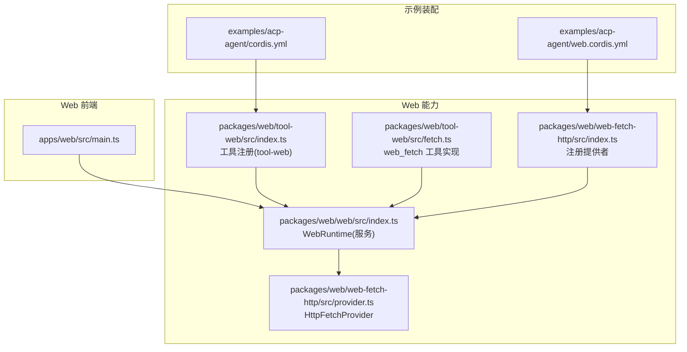
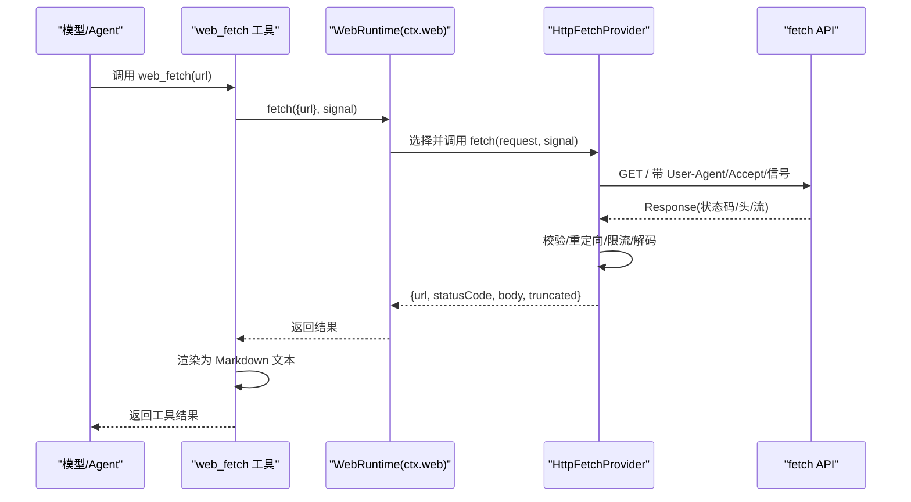
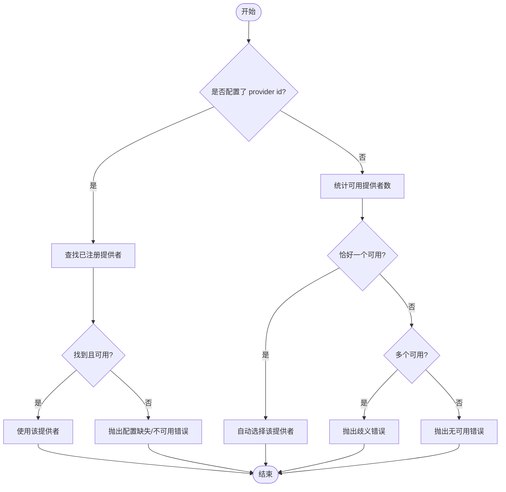
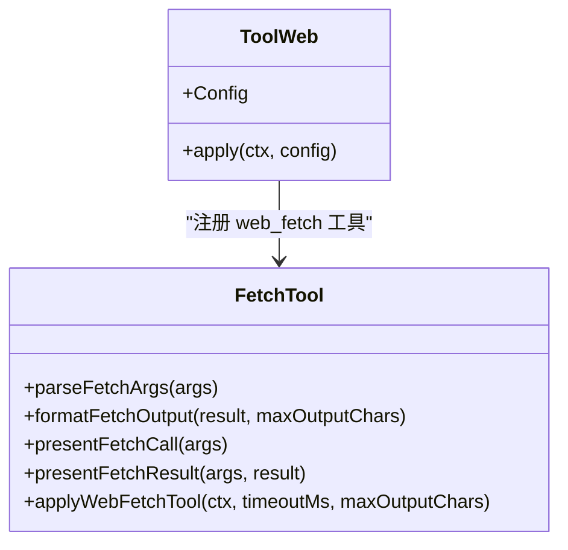
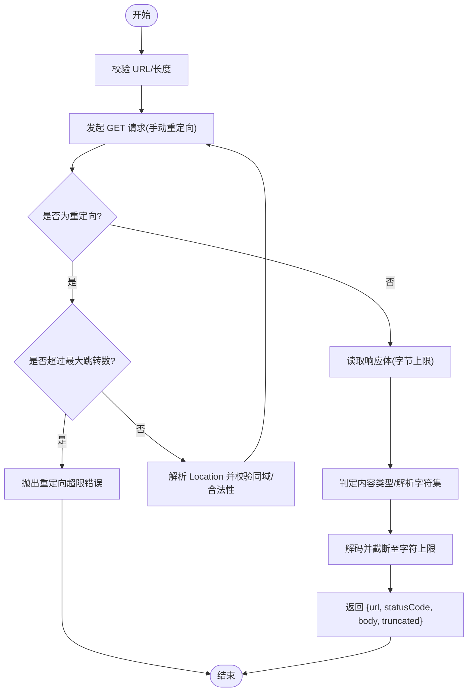

# Web 集成

<cite>
**本文引用的文件**
- [apps/web/src/main.ts](file://apps/web/src/main.ts)
- [packages/web/web/src/index.ts](file://packages/web/web/src/index.ts)
- [packages/web/tool-web/src/index.ts](file://packages/web/tool-web/src/index.ts)
- [packages/web/tool-web/src/fetch.ts](file://packages/web/tool-web/src/fetch.ts)
- [packages/web/web-fetch-http/src/index.ts](file://packages/web/web-fetch-http/src/index.ts)
- [packages/web/web-fetch-http/src/provider.ts](file://packages/web/web-fetch-http/src/provider.ts)
- [examples/acp-agent/cordis.yml](file://examples/acp-agent/cordis.yml)
- [examples/acp-agent/web.cordis.yml](file://examples/acp-agent/web.cordis.yml)
</cite>

## 目录
1. [简介](#简介)
2. [项目结构](#项目结构)
3. [核心组件](#核心组件)
4. [架构总览](#架构总览)
5. [详细组件分析](#详细组件分析)
6. [依赖关系分析](#依赖关系分析)
7. [性能与限制](#性能与限制)
8. [故障排查指南](#故障排查指南)
9. [结论](#结论)
10. [附录：配置与示例](#附录配置与示例)

## 简介
本文件面向 ACP Agent 的 Web 集成，聚焦于 Web 请求处理、HTTP 客户端与网络通信能力，覆盖网页抓取、API 调用与数据获取机制；说明代理/提供者配置、SSL 处理、错误分类与重试策略；提供 Web 集成示例、配置选项与调试方法；并讨论速率限制、缓存策略与安全考虑。

## 项目结构
- Web 前端入口位于 apps/web，负责启动应用壳层，实际逻辑由 dsh-client-web 承载。
- Web 能力以“服务 + 工具 + 提供者”分层组织：
  - 服务层（ctx.web）：注册搜索与抓取提供者，执行时按规则选择可用提供者。
  - 工具层（tool-web）：暴露 web_search 与 web_fetch 工具给模型使用，负责参数校验、输出渲染与提示词引导。
  - 提供者层（web-fetch-http）：实现 HTTP(S) 抓取，包含 URL 校验、重定向控制、大小/超时限制、内容类型判定与解码。
- 示例通过 cordis 组合将上述能力装配到 ACP Agent 中，并通过本地 fixture server 进行确定性测试。

**图表来源**
- [apps/web/src/main.ts:1-11](file://apps/web/src/main.ts#L1-L11)
- [packages/web/web/src/index.ts:74-163](file://packages/web/web/src/index.ts#L74-L163)
- [packages/web/tool-web/src/index.ts:80-91](file://packages/web/tool-web/src/index.ts#L80-L91)
- [packages/web/tool-web/src/fetch.ts:429-495](file://packages/web/tool-web/src/fetch.ts#L429-L495)
- [packages/web/web-fetch-http/src/index.ts:84-101](file://packages/web/web-fetch-http/src/index.ts#L84-L101)
- [packages/web/web-fetch-http/src/provider.ts:36-114](file://packages/web/web-fetch-http/src/provider.ts#L36-L114)
- [examples/acp-agent/cordis.yml:47-64](file://examples/acp-agent/cordis.yml#L47-L64)
- [examples/acp-agent/web.cordis.yml:1-22](file://examples/acp-agent/web.cordis.yml#L1-L22)

**章节来源**
- [apps/web/src/main.ts:1-11](file://apps/web/src/main.ts#L1-L11)
- [packages/web/web/src/index.ts:74-163](file://packages/web/web/src/index.ts#L74-L163)
- [packages/web/tool-web/src/index.ts:80-91](file://packages/web/tool-web/src/index.ts#L80-L91)
- [packages/web/web-fetch-http/src/index.ts:84-101](file://packages/web/web-fetch-http/src/index.ts#L84-L101)
- [examples/acp-agent/cordis.yml:47-64](file://examples/acp-agent/cordis.yml#L47-L64)
- [examples/acp-agent/web.cordis.yml:1-22](file://examples/acp-agent/web.cordis.yml#L1-L22)

## 核心组件
- WebRuntime（ctx.web）
  - 维护搜索与抓取的提供者注册表，并在执行时按“显式配置优先、唯一可用自动选择”的规则解析提供者。
  - 对外暴露 search() 与 fetch()，对搜索结果数量进行上限裁剪。
- tool-web
  - 注册 web_search 与 web_fetch 工具，定义参数 schema、系统提示、输出渲染与元数据。
  - 为每个工具设置协作式超时预算（timeoutMs），由外部超时策略强制。
- HttpFetchProvider
  - 实现安全、可控的 HTTP(S) 抓取：URL 校验、仅同域重定向、字节/字符/长度/超时限制、内容类型判定与解码。
  - 将网络/中止/超时等异常统一映射为结构化 WebError。

**章节来源**
- [packages/web/web/src/index.ts:74-163](file://packages/web/web/src/index.ts#L74-L163)
- [packages/web/tool-web/src/index.ts:23-91](file://packages/web/tool-web/src/index.ts#L23-L91)
- [packages/web/web-fetch-http/src/provider.ts:36-114](file://packages/web/web-fetch-http/src/provider.ts#L36-L114)

## 架构总览
下图展示一次 web_fetch 调用的端到端流程：从工具层到 WebRuntime 再到 HTTP 提供者，最后返回结果并由工具渲染。

**图表来源**
- [packages/web/tool-web/src/fetch.ts:429-495](file://packages/web/tool-web/src/fetch.ts#L429-L495)
- [packages/web/web/src/index.ts:140-163](file://packages/web/web/src/index.ts#L140-L163)
- [packages/web/web-fetch-http/src/provider.ts:46-114](file://packages/web/web-fetch-http/src/provider.ts#L46-L114)

## 详细组件分析

### WebRuntime（Web 能力服务）
- 职责
  - 注册搜索/抓取提供者，拒绝重复 id。
  - 执行时按以下规则选择提供者：
    - 已配置 id 且可用 → 使用该提供者
    - 已配置 id 未注册或不可用 → 抛出对应 WebError
    - 未配置 id 且恰好一个可用 → 自动选择
    - 未配置 id 且多个可用 → 报错要求显式配置
    - 未配置 id 且无可用 → 报错
  - 对搜索结果 sources 数量进行上限裁剪，并标记 truncated。
- 关键行为
  - 支持通过环境变量注入 provider 选择（等价于配置字段）。
  - 所有注册在 fiber 作用域内生效，dispose 时自动注销。

**图表来源**
- [packages/web/web/src/index.ts:171-194](file://packages/web/web/src/index.ts#L171-L194)

**章节来源**
- [packages/web/web/src/index.ts:74-163](file://packages/web/web/src/index.ts#L74-L163)
- [packages/web/web/src/index.ts:171-200](file://packages/web/web/src/index.ts#L171-L200)

### tool-web（web_search 与 web_fetch 工具）
- 职责
  - 注册 web_search 与 web_fetch 工具，定义参数 schema、系统提示、输出渲染与元数据。
  - 为每个工具设置协作式超时预算（timeoutMs），由外部超时策略强制执行。
  - 对 web_fetch 输出进行 HTML→Markdown 转换，限制同步转换深度与最终输出字符数，避免恶意页面导致事件循环阻塞。
- 关键行为
  - 默认启用 search 与 fetch，可通过配置关闭其一。
  - 支持自定义 searchMaxResults、searchTimeoutMs、fetchTimeoutMs、fetchMaxOutputChars。
  - 工具执行时将 AbortSignal 透传给 ctx.web.fetch，以便上层取消传播。

**图表来源**
- [packages/web/tool-web/src/index.ts:80-91](file://packages/web/tool-web/src/index.ts#L80-L91)
- [packages/web/tool-web/src/fetch.ts:429-495](file://packages/web/tool-web/src/fetch.ts#L429-L495)

**章节来源**
- [packages/web/tool-web/src/index.ts:23-91](file://packages/web/tool-web/src/index.ts#L23-L91)
- [packages/web/tool-web/src/fetch.ts:80-103](file://packages/web/tool-web/src/fetch.ts#L80-L103)
- [packages/web/tool-web/src/fetch.ts:214-330](file://packages/web/tool-web/src/fetch.ts#L214-L330)
- [packages/web/tool-web/src/fetch.ts:429-495](file://packages/web/tool-web/src/fetch.ts#L429-L495)

### HttpFetchProvider（HTTP(S) 抓取提供者）
- 职责
  - 安全抓取：URL 校验、仅跟随同域重定向、限制跳转次数。
  - 资源保护：限制 URL 长度、响应体字节数、解码后字符数、超时时间。
  - 内容处理：根据 Content-Type 判定 html/text，解析 charset 并解码。
  - 错误分类：将网络错误、中止、超时分别映射为结构化 WebError。
- 关键行为
  - 若 Content-Length 超过上限直接拒绝；否则流式读取并按上限截断。
  - 重定向必须满足同域且可解析，否则阻断并报错。
  - 通过 deadline/signal 将超时与中止传播到请求与流读取阶段。

**图表来源**
- [packages/web/web-fetch-http/src/provider.ts:46-114](file://packages/web/web-fetch-http/src/provider.ts#L46-L114)
- [packages/web/web-fetch-http/src/provider.ts:116-207](file://packages/web/web-fetch-http/src/provider.ts#L116-L207)
- [packages/web/web-fetch-http/src/provider.ts:210-241](file://packages/web/web-fetch-http/src/provider.ts#L210-L241)

**章节来源**
- [packages/web/web-fetch-http/src/provider.ts:36-114](file://packages/web/web-fetch-http/src/provider.ts#L36-L114)
- [packages/web/web-fetch-http/src/provider.ts:116-207](file://packages/web/web-fetch-http/src/provider.ts#L116-L207)
- [packages/web/web-fetch-http/src/provider.ts:210-241](file://packages/web/web-fetch-http/src/provider.ts#L210-L241)

### 示例装配（ACP Agent + Web）
- 基础 ACP 服务通过 cordis.yml 装配 LLM、沙箱、子代理、工作流、文件系统工具等。
- 通过 web.cordis.yml 叠加 web 能力：引入 web 服务、http 抓取提供者、web 工具，并禁用搜索（仅测试 fetch）。
- 同时挂载本地 fixture server，确保录制/回放场景无需真实网络即可稳定运行。

**章节来源**
- [examples/acp-agent/cordis.yml:47-64](file://examples/acp-agent/cordis.yml#L47-L64)
- [examples/acp-agent/web.cordis.yml:1-22](file://examples/acp-agent/web.cordis.yml#L1-L22)

## 依赖关系分析
- tool-web 依赖 WebRuntime（ctx.web）完成实际的搜索/抓取。
- web 服务依赖各提供者实现（如 http 抓取提供者）来执行具体网络操作。
- 示例通过 cordis 组合将工具与服务装配进 ACP Agent，使模型能够调用 web 工具。

**图表来源**
- [packages/web/tool-web/src/index.ts:80-91](file://packages/web/tool-web/src/index.ts#L80-L91)
- [packages/web/web/src/index.ts:74-163](file://packages/web/web/src/index.ts#L74-L163)
- [packages/web/web-fetch-http/src/index.ts:84-101](file://packages/web/web-fetch-http/src/index.ts#L84-L101)
- [examples/acp-agent/web.cordis.yml:1-22](file://examples/acp-agent/web.cordis.yml#L1-L22)

**章节来源**
- [packages/web/tool-web/src/index.ts:80-91](file://packages/web/tool-web/src/index.ts#L80-L91)
- [packages/web/web/src/index.ts:74-163](file://packages/web/web/src/index.ts#L74-L163)
- [packages/web/web-fetch-http/src/index.ts:84-101](file://packages/web/web-fetch-http/src/index.ts#L84-L101)
- [examples/acp-agent/web.cordis.yml:1-22](file://examples/acp-agent/web.cordis.yml#L1-L22)

## 性能与限制
- 超时与协作式取消
  - 工具级超时：web_fetch/web_search 的 timeoutMs 作为协作式预算，由外部超时策略强制。
  - 提供者级超时：HttpFetchProvider 内部基于 deadline/signal 保证请求与流读取阶段的超时。
- 大小限制
  - URL 长度、响应体字节数、解码后字符数均有限制，防止内存与 CPU 滥用。
  - HTML→Markdown 转换限制同步深度，避免 DOM 遍历导致的长时间阻塞。
- 重定向限制
  - 仅跟随同域重定向，且限制跳转次数，降低重定向攻击面。
- 速率限制
  - 当前实现未内置全局速率限制；可在上层通过调度器/令牌桶/并发度控制实现。
- 缓存策略
  - 当前实现未内置 HTTP 缓存；如需缓存，可在上层封装或使用反向代理缓存。
- SSL/TLS
  - 使用平台/运行时提供的 HTTPS 能力；证书验证遵循运行时默认策略。
  - 如需自定义 CA 或禁用验证，应在宿主环境或运行时层面配置，而非在此层绕过。

[本节为通用指导，不直接分析具体文件]

## 故障排查指南
- 常见问题与定位
  - 未注册可用提供者：检查是否加载 web 与 web-fetch-http 插件，或通过环境变量指定 provider。
  - 重定向被阻断：确认目标 URL 是否与当前 URL 同域，或减少跳转次数。
  - 响应过大：检查 maxResponseBytes/maxBodyChars 配置，必要时缩小抓取范围。
  - 超时：调整 fetchTimeoutMs/searchTimeoutMs，或优化上游响应。
  - 内容类型不支持：确认服务端返回的 Content-Type 可识别。
- 错误分类
  - 超时：WEB_FETCH_TIMEOUT
  - 中止：WEB_ABORTED
  - 重定向超限/跨域重定向：WEB_REDIRECT_BLOCKED
  - 响应过大：WEB_FETCH_TOO_LARGE
  - 内容类型不支持：WEB_UNSUPPORTED_CONTENT_TYPE
  - 其他网络错误：WEB_PROVIDER_ERROR
- 调试建议
  - 启用更详细的日志（在宿主/CLI 层），注意 stdout 保持协议纯净，诊断信息走 stderr。
  - 使用示例中的 fixture server 在无网环境下复现问题。
  - 逐步放宽限制以定位瓶颈（先增大超时/大小上限，再观察稳定性）。

**章节来源**
- [packages/web/web/src/index.ts:171-194](file://packages/web/web/src/index.ts#L171-L194)
- [packages/web/web-fetch-http/src/provider.ts:210-241](file://packages/web/web-fetch-http/src/provider.ts#L210-L241)
- [examples/acp-agent/web.cordis.yml:1-22](file://examples/acp-agent/web.cordis.yml#L1-L22)

## 结论
本集成通过“工具 + 服务 + 提供者”的分层设计，将 Web 抓取能力安全、可控地暴露给 ACP Agent。工具层负责交互与渲染，服务层负责提供者选择与约束，提供者层负责网络 I/O 与资源保护。通过明确的配置项与错误分类，便于在生产环境中进行速率限制、缓存与安全的扩展与治理。

[本节为总结性内容，不直接分析具体文件]

## 附录：配置与示例
- 工具配置（tool-web）
  - search: 是否注册 web_search（默认开启）
  - fetch: 是否注册 web_fetch（默认开启）
  - searchMaxResults: 单次搜索返回的最大结果数
  - fetchTimeoutMs/searchTimeoutMs: 工具协作式超时预算（毫秒）
  - fetchMaxOutputChars: 最终输出字符上限（含头部与尾部提示）
- 抓取提供者配置（web-fetch-http）
  - maxUrlLength: 请求 URL 最大长度
  - maxResponseBytes: 响应体最大字节数
  - maxBodyChars: 解码后最大字符数
  - timeoutMs: 抓取超时（毫秒）
  - maxRedirects: 最大重定向次数（仅同域）
  - userAgent: 请求头 User-Agent
- 示例装配
  - 在 cordis.yml 中加载 ACP 核心能力
  - 通过 web.cordis.yml 叠加 web 能力，并禁用搜索以聚焦 fetch 测试
  - 使用本地 fixture server 保证录制/回放的可重复性

**章节来源**
- [packages/web/tool-web/src/index.ts:36-91](file://packages/web/tool-web/src/index.ts#L36-L91)
- [packages/web/web-fetch-http/src/index.ts:33-101](file://packages/web/web-fetch-http/src/index.ts#L33-L101)
- [examples/acp-agent/cordis.yml:47-64](file://examples/acp-agent/cordis.yml#L47-L64)
- [examples/acp-agent/web.cordis.yml:1-22](file://examples/acp-agent/web.cordis.yml#L1-L22)