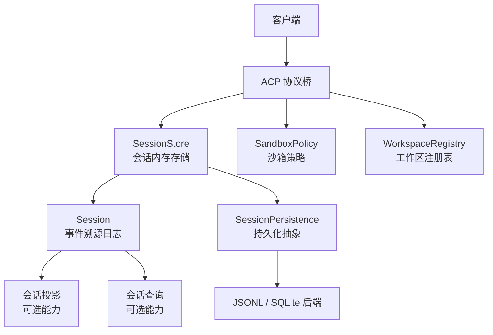
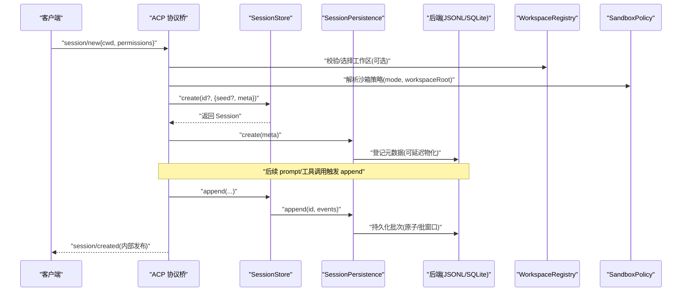
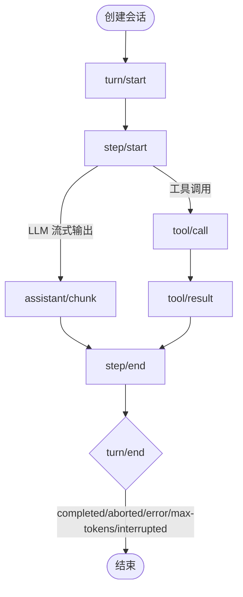
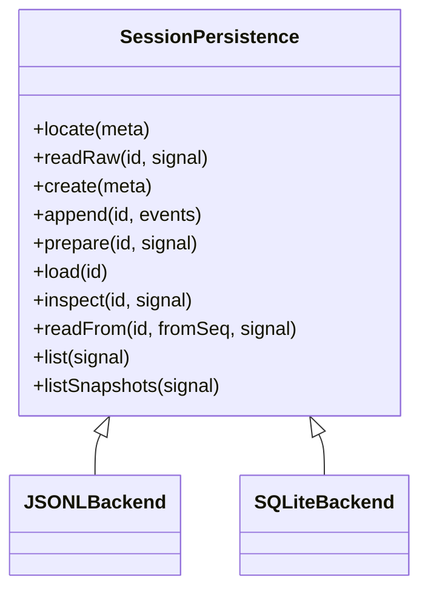
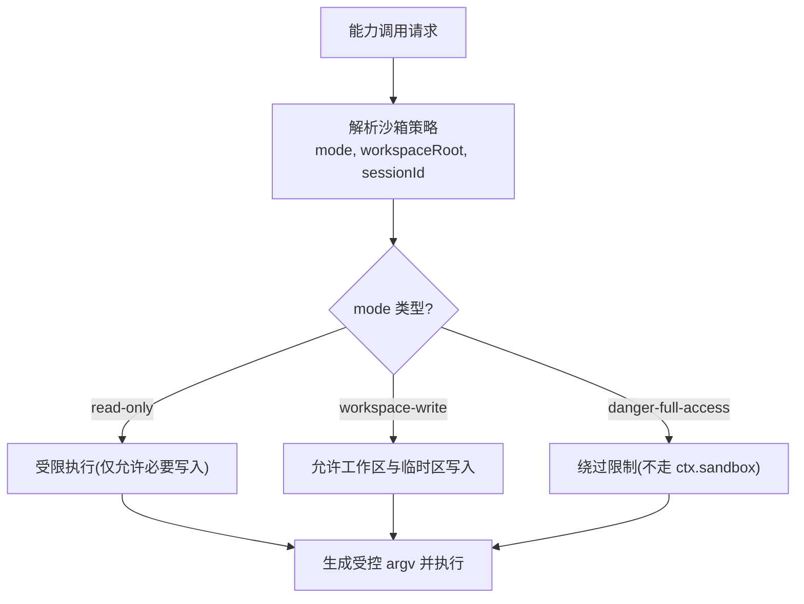
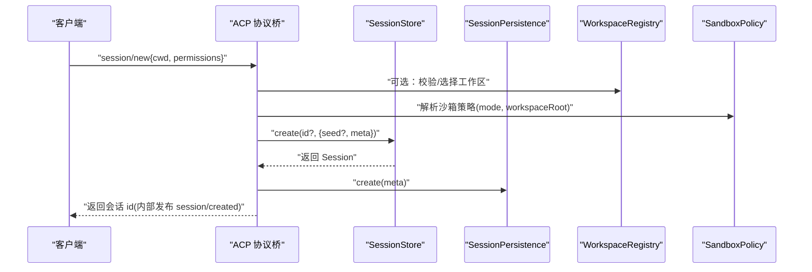
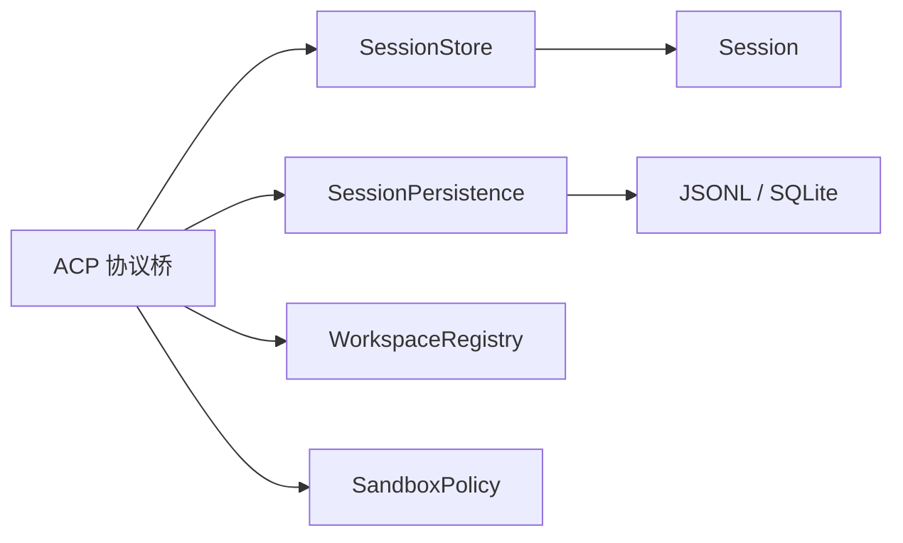

# 会话管理

<cite>
**本文引用的文件**
- [packages/core/session/src/types.ts](file://packages/core/session/src/types.ts)
- [packages/core/session/src/index.ts](file://packages/core/session/src/index.ts)
- [docs/subsystems/session.md](file://docs/subsystems/session.md)
- [docs/subsystems/persistence.md](file://docs/subsystems/persistence.md)
- [docs/subsystems/sandbox.md](file://docs/subsystems/sandbox.md)
- [docs/subsystems/workspace.md](file://docs/subsystems/workspace.md)
- [examples/acp-agent/README.md](file://examples/acp-agent/README.md)
- [packages/acp/acp/README.md](file://packages/acp/acp/README.md)
</cite>

## 目录
1. [简介](#简介)
2. [项目结构](#项目结构)
3. [核心组件](#核心组件)
4. [架构总览](#架构总览)
5. [详细组件分析](#详细组件分析)
6. [依赖关系分析](#依赖关系分析)
7. [性能考量](#性能考量)
8. [故障排除指南](#故障排除指南)
9. [结论](#结论)
10. [附录](#附录)

## 简介
本文件面向 ACP Agent 的会话管理，围绕会话生命周期、状态管理与持久化机制展开，重点说明 session/new 接口的使用方式（工作目录设置、权限配置、沙箱隔离等参数），并解释会话恢复、并发处理与资源清理策略。文档同时提供会话配置示例、最佳实践与故障排除建议，帮助读者在自动化场景下稳定地创建、运行与管理多个独立会话。

## 项目结构
ACP 会话管理由以下关键部分构成：
- 会话内核：事件溯源的 Session 与 SessionStore，负责追加式日志、派生历史、表面投影、fork/flush 等能力。
- 持久化层：抽象的 SessionPersistence 服务及 JSONL/SQLite 后端，负责落盘、崩溃恢复、冷读与热读。
- 工作区与会话归属：Workspace 记录目录级会话集合，校验会话 cwd 与工作区路径一致性。
- 沙箱与权限：进程沙箱模式与策略解析，决定文件系统访问边界；ACP 通过 workspace-write 或危险全开模式控制工具执行范围。
- ACP 协议桥：session/new、session/prompt、session/cancel、session/update、session/request_permission 等方法，驱动每个会话的独立生命周期。

图表来源
- [packages/core/session/src/index.ts:617-745](file://packages/core/session/src/index.ts#L617-L745)
- [docs/subsystems/persistence.md:246-380](file://docs/subsystems/persistence.md#L246-L380)
- [docs/subsystems/sandbox.md:166-213](file://docs/subsystems/sandbox.md#L166-L213)
- [docs/subsystems/workspace.md:152-223](file://docs/subsystems/workspace.md#L152-L223)
- [packages/acp/acp/README.md:20-40](file://packages/acp/acp/README.md#L20-L40)

章节来源
- [packages/core/session/src/index.ts:617-745](file://packages/core/session/src/index.ts#L617-L745)
- [docs/subsystems/session.md:1-127](file://docs/subsystems/session.md#L1-L127)
- [docs/subsystems/persistence.md:1-20](file://docs/subsystems/persistence.md#L1-L20)
- [docs/subsystems/sandbox.md:9-23](file://docs/subsystems/sandbox.md#L9-L23)
- [docs/subsystems/workspace.md:1-20](file://docs/subsystems/workspace.md#L1-L20)
- [packages/acp/acp/README.md:20-40](file://packages/acp/acp/README.md#L20-L40)

## 核心组件
- Session 与事件模型：以 append-only 的 SessionEvent 为唯一事实源，支持 turn/step 边界、消息派生、请求头快照、路由上下文等。
- SessionStore：提供 create/prepare/enter/announce/fork/flush/list/get 等能力，负责会话生命周期与发布。
- SessionPersistence：定义 locate/create/append/prepare/load/inspect/readFrom/list/listSnapshots 等接口，实现 JSONL 与 SQLite 两种后端。
- WorkspaceRegistry：维护目录级工作区与会话归属，确保会话 cwd 与工作区路径一致。
- SandboxPolicy：按调用解析沙箱模式与根目录，支持 read-only、workspace-write、danger-full-access。
- ACP 协议桥：对外暴露 session/new 等 RPC 方法，驱动会话创建、提示提交、取消、增量更新与一次性权限请求。

章节来源
- [docs/subsystems/session.md:194-519](file://docs/subsystems/session.md#L194-L519)
- [packages/core/session/src/index.ts:617-745](file://packages/core/session/src/index.ts#L617-L745)
- [docs/subsystems/persistence.md:246-380](file://docs/subsystems/persistence.md#L246-L380)
- [docs/subsystems/workspace.md:118-223](file://docs/subsystems/workspace.md#L118-L223)
- [docs/subsystems/sandbox.md:41-94](file://docs/subsystems/sandbox.md#L41-L94)
- [packages/acp/acp/README.md:20-40](file://packages/acp/acp/README.md#L20-L40)

## 架构总览
下图展示 ACP 会话从创建到运行的整体流程，包括工作目录、沙箱策略、持久化写入与崩溃恢复。

图表来源
- [packages/core/session/src/index.ts:617-745](file://packages/core/session/src/index.ts#L617-L745)
- [docs/subsystems/persistence.md:246-380](file://docs/subsystems/persistence.md#L246-L380)
- [docs/subsystems/workspace.md:152-223](file://docs/subsystems/workspace.md#L152-L223)
- [docs/subsystems/sandbox.md:166-213](file://docs/subsystems/sandbox.md#L166-L213)
- [packages/acp/acp/README.md:20-40](file://packages/acp/acp/README.md#L20-L40)

## 详细组件分析

### 会话生命周期与状态管理
- 生命周期阶段
  - 创建：通过 SessionStore.create/prepare + enter + announce 完成会话进入内存与发布。
  - 运行：turn/start → step/start → assistant/chunk → tool/call/result → step/end → turn/end。
  - 结束：completed、aborted、blocked、error、max-tokens、interrupted（崩溃恢复合成）。
- 状态与派生
  - 事件日志是追加不可变序列，消息历史通过 surfaceOp 派生。
  - request/header 与 request/context 作为请求头与路由上下文的快照，用于重建请求。
- 恢复与边界
  - 冷加载时若发现未闭合的 turn，会注入 interrupted 关闭，保持平衡。
  - firstLiveSeq 与 session/end-seed 标记种子与实时写入的分界。

图表来源
- [docs/subsystems/session.md:27-124](file://docs/subsystems/session.md#L27-L124)
- [docs/subsystems/session.md:540-576](file://docs/subsystems/session.md#L540-L576)
- [docs/subsystems/persistence.md:13-19](file://docs/subsystems/persistence.md#L13-L19)

章节来源
- [docs/subsystems/session.md:27-124](file://docs/subsystems/session.md#L27-L124)
- [docs/subsystems/session.md:540-576](file://docs/subsystems/session.md#L540-L576)
- [docs/subsystems/persistence.md:13-19](file://docs/subsystems/persistence.md#L13-L19)

### 持久化机制与崩溃恢复
- 持久化契约
  - 所有事件必须无损 JSON 序列化，seq 连续，包含 assistant/chunk。
  - append 成功后才视为持久化成功；失败保留事件并暂停自动重试。
- 后端
  - JSONL：每会话逻辑日志，压缩帧或原始行，原子写与中断恢复。
  - SQLite：单库多行，字段与事件一一对应。
- 崩溃恢复
  - 冷加载检测未闭合 turn，注入 interrupted 关闭，不截断已持久化事件。
  - prepare/load/inspect 提供准备、只读检查与恢复能力。

图表来源
- [docs/subsystems/persistence.md:246-380](file://docs/subsystems/persistence.md#L246-L380)

章节来源
- [docs/subsystems/persistence.md:9-20](file://docs/subsystems/persistence.md#L9-L20)
- [docs/subsystems/persistence.md:231-237](file://docs/subsystems/persistence.md#L231-L237)
- [docs/subsystems/persistence.md:246-380](file://docs/subsystems/persistence.md#L246-L380)

### 工作目录与会话归属
- 工作区概念
  - 工作区是对一个目录的稳定记录，包含显示标题与会话顺序。
  - 会话归属需满足：会话 id 在工作区账户中，且会话 header 的 canonical cwd 等于工作区路径。
- 创建与校验
  - 创建会话时确定绝对 cwd；随后 attachSession 再次校验 cwd 一致性。
  - 启动时可基于持久化 header 进行一次性历史引导，将有效 cwd 的会话归入对应工作区。

章节来源
- [docs/subsystems/workspace.md:1-20](file://docs/subsystems/workspace.md#L1-L20)
- [docs/subsystems/workspace.md:21-117](file://docs/subsystems/workspace.md#L21-L117)
- [docs/subsystems/workspace.md:118-127](file://docs/subsystems/workspace.md#L118-L127)
- [docs/subsystems/workspace.md:152-223](file://docs/subsystems/workspace.md#L152-L223)

### 沙箱隔离与权限配置
- 沙箱模式
  - read-only：仅允许必要写入（如 /dev/null）。
  - workspace-write：允许在工作区根与后端临时区域写入。
  - danger-full-access：绕过限制（不通过 ctx.sandbox）。
- 策略解析
  - 每次调用解析完整策略，包含 mode、workspaceRoot、sessionId。
  - 优先级：显式批准覆盖 > 会话事件中的最后模式 > 部署默认。
- ACP 集成
  - session/new 传入绝对 cwd；workspace-write 下工具变更按该 cwd 判定。
  - 模型重试申请更宽沙箱时，通过 session/request_permission 提供一次性 allow/reject。

图表来源
- [docs/subsystems/sandbox.md:9-23](file://docs/subsystems/sandbox.md#L9-L23)
- [docs/subsystems/sandbox.md:41-94](file://docs/subsystems/sandbox.md#L41-L94)
- [docs/subsystems/sandbox.md:166-213](file://docs/subsystems/sandbox.md#L166-L213)
- [examples/acp-agent/README.md:20-25](file://examples/acp-agent/README.md#L20-L25)

章节来源
- [docs/subsystems/sandbox.md:9-23](file://docs/subsystems/sandbox.md#L9-L23)
- [docs/subsystems/sandbox.md:41-94](file://docs/subsystems/sandbox.md#L41-L94)
- [docs/subsystems/sandbox.md:166-213](file://docs/subsystems/sandbox.md#L166-L213)
- [examples/acp-agent/README.md:20-25](file://examples/acp-agent/README.md#L20-L25)

### ACP session/new 接口详解
- 行为
  - 创建一个全新 agent，附带绝对 primary cwd；additionalDirectories 与 mcpServers 为空接受、非空拒绝。
  - 每个连接可拥有多个会话，按会话 id 路由事件与权限请求。
- 工作目录与权限
  - cwd 决定 workspace-write 的文件系统边界；平台临时根共享可写。
  - DSH_PERMISSION_MODE 可选择 workspace-write 或 danger-full-access。
- 生命周期
  - 连接断开或 Cordis 销毁时，统一回收：拒绝新会话/提示，结算进行中提示，并行释放子代理并等待结果。

图表来源
- [packages/acp/acp/README.md:20-40](file://packages/acp/acp/README.md#L20-L40)
- [examples/acp-agent/README.md:20-25](file://examples/acp-agent/README.md#L20-L25)
- [packages/core/session/src/index.ts:617-745](file://packages/core/session/src/index.ts#L617-L745)
- [docs/subsystems/sandbox.md:166-213](file://docs/subsystems/sandbox.md#L166-L213)
- [docs/subsystems/workspace.md:152-223](file://docs/subsystems/workspace.md#L152-L223)

章节来源
- [packages/acp/acp/README.md:20-40](file://packages/acp/acp/README.md#L20-L40)
- [examples/acp-agent/README.md:20-25](file://examples/acp-agent/README.md#L20-L25)
- [packages/core/session/src/index.ts:617-745](file://packages/core/session/src/index.ts#L617-L745)

### 会话恢复、并发与资源清理
- 恢复
  - 冷加载 load/inspect 保证逻辑会话平衡；必要时注入 interrupted 关闭未完成的 turn。
  - prepare 保留未发布的会话，供 resume 使用；load 复用同一恢复机制但不发布。
- 并发
  - 每个 ACP 会话有独立的提示槽、工作区、取消路径与处置器；并发互不影响。
  - 持久化采用批窗口与 flush 屏障，避免阻塞生产端。
- 清理
  - 连接断开时统一回收：拒绝新操作，结算进行中提示，并行释放子代理并等待结果。
  - 会话 dispose 后从 store 移除，停止事件通知。

章节来源
- [docs/subsystems/persistence.md:13-19](file://docs/subsystems/persistence.md#L13-L19)
- [docs/subsystems/persistence.md:143-207](file://docs/subsystems/persistence.md#L143-L207)
- [packages/acp/acp/README.md:36-40](file://packages/acp/acp/README.md#L36-L40)
- [packages/core/session/src/index.ts:751-800](file://packages/core/session/src/index.ts#L751-L800)

## 依赖关系分析
- 模块耦合
  - ACP 协议桥依赖 SessionStore 与 SessionPersistence，并通过 WorkspaceRegistry 与 SandboxPolicy 约束执行环境。
  - Session 依赖事件模型与派生规则；持久化后端实现统一的抽象接口。
- 外部依赖
  - JSONL/SQLite 后端提供物理存储；沙箱后端提供平台受限执行。
- 潜在循环
  - 各组件通过明确的服务边界解耦，未见直接循环依赖。

图表来源
- [packages/acp/acp/README.md:20-40](file://packages/acp/acp/README.md#L20-L40)
- [packages/core/session/src/index.ts:617-745](file://packages/core/session/src/index.ts#L617-L745)
- [docs/subsystems/persistence.md:246-380](file://docs/subsystems/persistence.md#L246-L380)
- [docs/subsystems/workspace.md:152-223](file://docs/subsystems/workspace.md#L152-L223)
- [docs/subsystems/sandbox.md:166-213](file://docs/subsystems/sandbox.md#L166-L213)

章节来源
- [packages/acp/acp/README.md:20-40](file://packages/acp/acp/README.md#L20-L40)
- [packages/core/session/src/index.ts:617-745](file://packages/core/session/src/index.ts#L617-L745)
- [docs/subsystems/persistence.md:246-380](file://docs/subsystems/persistence.md#L246-L380)
- [docs/subsystems/workspace.md:152-223](file://docs/subsystems/workspace.md#L152-L223)
- [docs/subsystems/sandbox.md:166-213](file://docs/subsystems/sandbox.md#L166-L213)

## 性能考量
- 事件追加与派生
  - append 同步通知观察者，持久化插件异步缓冲；派生历史缓存节点，重写时重建。
- 持久化批窗口
  - 固定批窗口与 flush 屏障减少 I/O 次数；失败不阻塞主循环，重试策略可控。
- 冷读优化
  - 投影缓存与 readFrom 后缀读取降低冷启动成本；SQLite 可按 seq 定位。
- 并发隔离
  - 每个会话独立上下文与取消路径，避免锁竞争；批写入与 flush 保障吞吐。

[本节为通用指导，无需特定文件引用]

## 故障排除指南
- 常见错误与定位
  - 格式不支持：后端拒绝无法解释的日志版本，提示升级方向而非损坏。
  - 事件非法：append 时非 JSON 可序列化数据会被拒绝，便于快速定位。
  - 沙箱受限：stderr 匹配后端提供的 denial signatures，区分“命令被阻止”和“运行器失败”。
  - 工作区不一致：attachSession 校验 cwd 与路径不一致会拒绝写入。
- 恢复与修复
  - 冷加载遇到未闭合 turn 会自动注入 interrupted；重复 inspect/prepare 可安全复用。
  - 投影缓存失效时会触发从 seq 0 重放，确保一致性。
- 调试建议
  - 使用 session/event 与 session/flush 观察持久化时机。
  - 通过 session/query 获取事件关系与全文检索，辅助定位问题。

章节来源
- [docs/subsystems/persistence.md:92-99](file://docs/subsystems/persistence.md#L92-L99)
- [docs/subsystems/persistence.md:13-19](file://docs/subsystems/persistence.md#L13-L19)
- [docs/subsystems/sandbox.md:96-157](file://docs/subsystems/sandbox.md#L96-L157)
- [docs/subsystems/workspace.md:118-127](file://docs/subsystems/workspace.md#L118-L127)

## 结论
ACP 会话管理以事件溯源为核心，结合持久化、工作区与沙箱策略，提供了高内聚、可扩展的会话生命周期管理能力。通过 session/new 等接口，可在自动化场景中安全地创建、运行与清理多个独立会话；借助崩溃恢复与批写入机制，系统在可靠性与性能之间取得良好平衡。遵循本文的最佳实践与故障排除建议，可有效提升稳定性与可维护性。

## 附录

### 会话配置示例（基于仓库约定）
- 基本会话
  - 工作目录：absolute cwd（例如项目根）。
  - 权限模式：DSH_PERMISSION_MODE=workspace-write（推荐）或 danger-full-access（谨慎）。
  - 额外目录与 MCP 服务器：为空（当前 ACP 仅接受空值）。
- 高级选项
  - 子代理继承：origin/delegationDepth 由上层决定，影响导航与预算。
  - 预置组合：agentPreset 指定会话的工具与提示组合。

章节来源
- [examples/acp-agent/README.md:20-25](file://examples/acp-agent/README.md#L20-L25)
- [docs/subsystems/persistence.md:96-125](file://docs/subsystems/persistence.md#L96-L125)

### 最佳实践
- 始终为 session/new 提供绝对 cwd，并确保其存在且为目录。
- 优先使用 workspace-write 模式，仅在必要时降级至 danger-full-access。
- 使用 flush 作为持久化屏障，确保关键步骤前落盘。
- 利用 fork 在稳定的 turn 边界创建子会话，避免在 open turn 中间分支。
- 监控 session/created 与 session/disposed，确保资源正确回收。

章节来源
- [packages/core/session/src/index.ts:617-745](file://packages/core/session/src/index.ts#L617-L745)
- [docs/subsystems/persistence.md:9-20](file://docs/subsystems/persistence.md#L9-L20)
- [docs/subsystems/sandbox.md:41-94](file://docs/subsystems/sandbox.md#L41-L94)
- [packages/acp/acp/README.md:36-40](file://packages/acp/acp/README.md#L36-L40)