# �代�系统

<cite>
**本文引用的文件**
- [packages/subagent/subagent/src/index.ts](file://packages/subagent/subagent/src/index.ts)
- [packages/subagent/subagent/src/types.ts](file://packages/subagent/subagent/src/types.ts)
- [packages/subagent/subagent/src/continuation.ts](file://packages/subagent/subagent/src/continuation.ts)
- [packages/subagent/subagent/src/descriptor.ts](file://packages/subagent/subagent/src/descriptor.ts)
- [packages/subagent/subagent/src/list-children.ts](file://packages/subagent/subagent/src/list-children.ts)
- [packages/subagent/subagent/src/child-agent.ts](file://packages/subagent/subagent/src/child-agent.ts)
- [packages/subagent/subagent/src/lifecycle.ts](file://packages/subagent/subagent/src/lifecycle.ts)
- [packages/subagent/subagent/src/error.ts](file://packages/subagent/subagent/src/error.ts)
- [packages/subagent/subagent-acp/src/index.ts](file://packages/subagent/subagent-acp/src/index.ts)
- [examples/acp-agent/cordis.yml](file://examples/acp-agent/cordis.yml)
- [docs/subsystems/subagent.md](file://docs/subsystems/subagent.md)
</cite>

## 目录
1. [简介](#简介)
2. [项目结�](#项目结�)
3. [核心组件](#核心组件)
4. [��总览](#��总览)
5. [详细组件分�](#详细组件分�)
6. [�赖关系分�](#�赖关系分�)
7. [性能�并�](#性能�并�)
8. [故障�查](#故障�查)
9. [结论](#结论)
10. [附录：�置�调用模�](#附录：�置�调用模�)

## 简介
本文件系统性说� ACP Agent 的�代�（Subagent）�系统，覆盖�代�的创建�管��通信机制，生命周期�继承�作用域隔离，�代�间的数�传递�错误传播�结���，以�嵌套�代��并行执行�超时处�等高级特性。文档�时�供���践的�置示例�调用模�，帮助读者在真�部署中正确组�和使用�代�能力。

## 项目结�
�代��系统由“�务定义 + 多��供者�� + 工具层�三部分��：
- �务定义：�� packages/subagent/subagent，�供 ctx.subagents �行时��，负责注册�供者�能力校验�一次性�动��延续�代�编���举�事件。
- �供者��：包括进程内 spawn/fork�ACP 外部进程�Codex�Claude Code�Dsh SDK 等，�自�� start/prepareContinuable 等契约。
- 工具层：tool-subagent/tool-subagent-control/tool-subagent-report 暴露模�侧工具（如 subagent/send_message/interrupt/list_agents/report）。

```mermaid
graph TB
subgraph "�务定义"
S["SubagentRuntime<br/>index.ts"]
T["类��契约<br/>types.ts"]
C["�延续管�器<br/>continuation.ts"]
D["�述符快照/折�<br/>descriptor.ts"]
L["�代�举<br/>list-children.ts"]
CA["�代��建/深度/策略<br/>child-agent.ts"]
LC["生命周期事件<br/>lifecycle.ts"]
E["错误类�<br/>error.ts"]
end
subgraph "�供者��"
P1["spawn-in-process"]
P2["fork-in-process"]
P3["subagent-acp<br/>index.ts"]
P4["codex / claude-code / dsh-sdk"]
end
subgraph "工具层"
U1["tool-subagent"]
U2["tool-subagent-control"]
U3["tool-subagent-report"]
end
S --> T
S --> C
S --> D
S --> L
S --> CA
S --> LC
S --> E
S --> P1
S --> P2
S --> P3
S --> P4
U1 --> S
U2 --> S
U3 --> S
```

图表��
- [packages/subagent/subagent/src/index.ts:171-500](file://packages/subagent/subagent/src/index.ts#L171-L500)
- [packages/subagent/subagent/src/types.ts:86-325](file://packages/subagent/subagent/src/types.ts#L86-L325)
- [packages/subagent/subagent/src/continuation.ts:349-800](file://packages/subagent/subagent/src/continuation.ts#L349-L800)
- [packages/subagent/subagent-acp/src/index.ts:146-190](file://packages/subagent/subagent-acp/src/index.ts#L146-L190)

章节��
- [docs/subsystems/subagent.md:1-10](file://docs/subsystems/subagent.md#L1-L10)
- [packages/subagent/subagent/src/index.ts:1-128](file://packages/subagent/subagent/src/index.ts#L1-L128)

## 核心组件
- SubagentRuntime（ctx.subagents）：命��供者注册表，能力校验，一次性�动 start，�延续�代� startContinuable/followup/interrupt/reportFrom，�举 listChildren/listDescendants，生命周期事件 emit。
- SubagentProvider：�供者契约，包� name�capabilities�inheritsParentContext�start��选 prepareContinuable。
- SubagentContinuationManager：�延续�代�的激活�管��冷�动���所有�图�消�路由�报告投递��水关闭。
- �述符（Descriptor）：�久化身份标识，区分 one-shot � continuable，�带 provider�label�agentOptions 快照等。
- �代��建（child-agent）：计算深度�应用工具过滤�注入 persona��并策略覆盖。
- 生命周期事件：subagent/start�subagent/end�provider-added/removed。

章节��
- [packages/subagent/subagent/src/index.ts:171-500](file://packages/subagent/subagent/src/index.ts#L171-L500)
- [packages/subagent/subagent/src/types.ts:86-325](file://packages/subagent/subagent/src/types.ts#L86-L325)
- [packages/subagent/subagent/src/continuation.ts:349-800](file://packages/subagent/subagent/src/continuation.ts#L349-L800)
- [packages/subagent/subagent/src/descriptor.ts](file://packages/subagent/subagent/src/descriptor.ts)
- [packages/subagent/subagent/src/child-agent.ts](file://packages/subagent/subagent/src/child-agent.ts)
- [packages/subagent/subagent/src/lifecycle.ts](file://packages/subagent/subagent/src/lifecycle.ts)

## ��总览
�代�系统采用“�务 + 多�供者 + 工具层�的分层��：
- 上层通过工具层�起�代�请求（一次性或�延续），�务进行能力校验��述符快照�委派给具体�供者。
- 一次性�代�返��行�柄 SubagentRun，消费者等待 result 并 dispose 释放资�。
- �延续�代�由 ContinuationManager 维护 Activation 驻留�，支� followup 投递�续消��interrupt 中断�reportFrom 上报父级。
- �举 API 直�读�会�存储��选�久化缓存，�加载 Agent，�供稳定视图。

```mermaid
sequenceDiagram
participant Caller as "调用方"
participant Runtime as "SubagentRuntime"
participant Provider as "SubagentProvider"
participant Cont as "ContinuationManager"
participant Child as "�代�Agent"
Caller->>Runtime : start(name, request)
Runtime->>Runtime : 能力校验/�述符快照
Runtime->>Provider : start(resolvedRequest)
Provider-->>Runtime : SubagentRun(已�布)
Runtime-->>Caller : SubagentRun(id, localAgent, result, dispose)
Note over Caller,Child : 一次性�代�：等待 result 并 dispose
Caller->>Runtime : startContinuable(spec)
Runtime->>Cont : startContinuable(spec)
Cont->>Provider : prepareContinuable(request)
Provider-->>Cont : ContinuableCreateSpec
Cont->>Child : 创建/冷��并�交�始消�
Cont-->>Caller : {childId, messageId}
Caller->>Runtime : followup(parent, childId, content, options)
Runtime->>Cont : followup(...)
Cont->>Child : 投递为下一轮FIFO消�
Cont-->>Caller : MessageId
```

图表��
- [packages/subagent/subagent/src/index.ts:414-426](file://packages/subagent/subagent/src/index.ts#L414-L426)
- [packages/subagent/subagent/src/continuation.ts:403-457](file://packages/subagent/subagent/src/continuation.ts#L403-L457)
- [packages/subagent/subagent/src/continuation.ts:476-505](file://packages/subagent/subagent/src/continuation.ts#L476-L505)

## 详细组件分�

### 一次性�代�（One-shot）
- 入�：SubagentRuntime.start(name, request)
- �程：解��供者 -> 能力校验（outputSchema/depthLimit/toolFilter/persona）-> 生��述符 -> 调用 provider.start -> 观察生命周期事件 -> 返� SubagentRun
- 结�：SubagentResult.output/structured/stopReason；� completed 表示输出�能�完整
- 资�：必须调用 dispose 以�消剩余工作并达到�默

```mermaid
flowchart TD
Start(["开始"]) --> Resolve["解��供者"]
Resolve --> CapCheck{"能力满足?"}
CapCheck -- � --> Err["抛出 UNSUPPORTED_CAPABILITY"]
CapCheck -- 是 --> Desc["生��述符"]
Desc --> CallStart["调用 provider.start"]
CallStart --> Run["返� SubagentRun"]
Run --> Wait["await result()"]
Wait --> Dispose["dispose() 释放资�"]
Dispose --> End(["结�"])
```

图表��
- [packages/subagent/subagent/src/index.ts:414-426](file://packages/subagent/subagent/src/index.ts#L414-L426)
- [packages/subagent/subagent/src/types.ts:219-275](file://packages/subagent/subagent/src/types.ts#L219-L275)

章节��
- [packages/subagent/subagent/src/index.ts:414-426](file://packages/subagent/subagent/src/index.ts#L414-L426)
- [packages/subagent/subagent/src/types.ts:219-275](file://packages/subagent/subagent/src/types.ts#L219-L275)

### �延续�代�（Continuable）
- 入�：startContinuable(spec) -> 预留 childId -> 快照�述符 -> 调用 provider.prepareContinuable -> �料化 Activation -> �交�始消� -> 返� {childId, messageId}
- �续消�：followup(parent, childId, content, options) 根� Activation 状�路由到入队/唤醒/冷��
- 中断：interrupt(targetSessionId, authority) ���立�下� cancel，�等待目标完�
- 报告：reportFrom(child, content, options) 将内容包装为用户消�投递到直父亲 Agent，支� quiet/wakeup 两�调度策略
- �水：drain()/drainDescendants(parents) 安全关闭并释放所有 Activation

```mermaid
sequenceDiagram
participant Parent as "父Agent"
participant Runtime as "SubagentRuntime"
participant Manager as "ContinuationManager"
participant Provider as "Provider"
participant Child as "å­�Agent"
Parent->>Runtime : startContinuable(spec)
Runtime->>Manager : startContinuable(spec)
Manager->>Provider : prepareContinuable(req)
Provider-->>Manager : CreateSpec(seed/meta)
Manager->>Child : 创建/冷��并�交�始消�
Manager-->>Runtime : {childId, messageId}
Parent->>Runtime : followup(parent, childId, content, opts)
Runtime->>Manager : followup(...)
alt 有Activation
Manager->>Child : 入队/唤醒
else æ— Activation
Manager->>Child : 冷��并�交
end
Manager-->>Runtime : MessageId
Parent->>Runtime : interrupt(childId, authority)
Runtime->>Manager : interrupt(...)
Manager->>Child : cancel(keepInbox=true)
```

图表��
- [packages/subagent/subagent/src/continuation.ts:403-457](file://packages/subagent/subagent/src/continuation.ts#L403-L457)
- [packages/subagent/subagent/src/continuation.ts:476-505](file://packages/subagent/subagent/src/continuation.ts#L476-L505)
- [packages/subagent/subagent/src/continuation.ts:528-568](file://packages/subagent/subagent/src/continuation.ts#L528-L568)

章节��
- [packages/subagent/subagent/src/continuation.ts:349-800](file://packages/subagent/subagent/src/continuation.ts#L349-L800)

### �举���：listChildren/listDescendants
- 直�读�会�存储��选�久化缓存，�加载/�� Agent
- 使用投影�元折��代�身份（mode/label），按 createdAt ��
- 对冷�动�代��供�级路径（缓存命中则最终，�则 inspect �算）
- 失败诊断：corrupt/unavailable 等，�影��康�代�的��性

章节��
- [packages/subagent/subagent/src/index.ts:339-360](file://packages/subagent/subagent/src/index.ts#L339-L360)
- [docs/subsystems/subagent.md:287-306](file://docs/subsystems/subagent.md#L287-L306)

### �供者：ACP 外部进程
- 特点：�个�代�独立进程�会��模��工具，�共享 Cordis 上下文
- 能力：�声�任何 start-time 能力（outputSchema/depthLimit/toolFilter/persona ��支�）
- 工作目录：优先使用�置的 cwd，�则�父会� header.cwd �导并校验
- ��策略：��置自动应答 session/request_permission �示
- 优雅退出：支� EOF 宽�期�终止�级宽�期

章节��
- [packages/subagent/subagent-acp/src/index.ts:146-190](file://packages/subagent/subagent-acp/src/index.ts#L146-L190)

## �赖关系分�
- SubagentRuntime �赖：
  - types.ts：对外契约（请求�结��能力�事件载�）
  - continuation.ts：�延续�代�编�
  - descriptor.ts：æ��述符快照/折å�
  - list-children.ts：�代��举
  - child-agent.ts：�代��建（深度�工具过滤�persona�策略覆盖）
  - lifecycle.ts：生命周期事件�射器�观察者
  - error.ts：统一错误类�
- �供者��：
  - subagent-acp：外部进程驱动，无能力声�，严格工作目录校验
  - 其他�供者（spawn/fork/codex/claude-code/dsh-sdk）�循相�契约

```mermaid
classDiagram
class SubagentRuntime {
+start(name, request)
+startContinuable(spec)
+followup(parent, childId, content, options)
+interrupt(targetSessionId, authority)
+reportFrom(child, content, options)
+registerProvider(provider)
+getProvider(name)
+list()
+listChildren(parentSessionId, signal)
+listDescendants(rootSessionId, signal)
}
class SubagentProvider {
<<interface>>
+name : string
+capabilities : SubagentCapabilities
+inheritsParentContext : boolean
+start(request) : Promise~SubagentRun~
+prepareContinuable?(request) : Promise~ContinuableCreateSpec~
}
class SubagentContinuationManager {
+startContinuable(spec)
+followup(parent, childId, content, options)
+interrupt(targetSessionId, authority)
+reportFrom(child, content, options)
+drain()
+drainDescendants(parents)
}
SubagentRuntime --> SubagentProvider : "注册/调用"
SubagentRuntime --> SubagentContinuationManager : "委托�延续逻辑"
```

图表��
- [packages/subagent/subagent/src/index.ts:171-500](file://packages/subagent/subagent/src/index.ts#L171-L500)
- [packages/subagent/subagent/src/continuation.ts:349-800](file://packages/subagent/subagent/src/continuation.ts#L349-L800)
- [packages/subagent/subagent/src/types.ts:285-325](file://packages/subagent/subagent/src/types.ts#L285-L325)

章节��
- [packages/subagent/subagent/src/index.ts:171-500](file://packages/subagent/subagent/src/index.ts#L171-L500)
- [packages/subagent/subagent/src/types.ts:285-325](file://packages/subagent/subagent/src/types.ts#L285-L325)

## 性能�并�
- �延续�代�的消�队列唯一性：Agent inbox 是唯一队列，��顺�性��观测性
- 列举优化：三层�退（活体水�缓存 -> �久化投影缓存 -> �久化 inspect），��加载 Agent
- 并��制：�供者�共享容��制器但�得耦�兄弟结算/清�；管�器内部使用 ChildLock 串行化�一 childId 的关键区
- 资�释放：drain/drainDescendants 自上而下传播�消�自下而上释放 handle，确�有��收
- 超时�中断：
  - 一次性�代�：通过 AbortSignal �制�动�/�的�消；result �会因�代�失败而 reject，而是 stopReason
  - �延续�代�：interrupt 立�下� cancel，�等待目标完�；followup/reportFrom 的 signal 仅�制准入阶段

章节��
- [packages/subagent/subagent/src/continuation.ts:319-341](file://packages/subagent/subagent/src/continuation.ts#L319-L341)
- [packages/subagent/subagent/src/continuation.ts:704-780](file://packages/subagent/subagent/src/continuation.ts#L704-L780)
- [packages/subagent/subagent/src/types.ts:219-275](file://packages/subagent/subagent/src/types.ts#L219-L275)

## 故障�查
- 常�错误��场景：
  - UNSUPPORTED_CAPABILITY：请求的能力（outputSchema/maxDepth/toolFilter/persona）�被�供者支�
  - NO_PROVIDER：未注册指定�称的�供者
  - CONTINUATION_UNAVAILABLE：缺少 agents �务导致�延续功能��用
  - UNAUTHORIZED：中断时父地��匹�或祖先�在当�活体血缘中
  - ACTIVATION_CLOSING：报告投递时 Activation 正在关闭
  - PARENT_UNAVAILABLE：报告的目标直父亲�在线
  - CANCELLED：列举过程中被�消
- 定�建议：
  - 检查�供者 capabilities �请求选项是�匹�
  - 确认 ctx.agents � sessionProjections 已挂载
  - 对� ACP �供者，检查工作目录是��对且�进入
  - 使用 listChildren/listDescendants ���代�状��诊断信�

章节��
- [packages/subagent/subagent/src/index.ts:448-496](file://packages/subagent/subagent/src/index.ts#L448-L496)
- [packages/subagent/subagent/src/continuation.ts:528-613](file://packages/subagent/subagent/src/continuation.ts#L528-L613)
- [packages/subagent/subagent-acp/src/index.ts:132-139](file://packages/subagent/subagent-acp/src/index.ts#L132-L139)

## 结论
�代�系统通过清晰的�务契约�多�供者��，��了�活的一次性��延续�代�编�。其设计强调：
- 能力�置校验�“失败�显���则
- 唯一消�队列�严格的父���
- 稳定的�久化身份�冷��能力
- 安全的�水�有�释放
- 高效的æ�šä¸¾ä¸�投影折å�
这些特性共�支撑了嵌套�代��并行执行�超时�中断等��场景的����。

## 附录：�置�调用模�

### �置示例（Cordis 装�）
- 基础�代�栈：注册 subagent �务�spawn/fork �供者�工具层 control/list-agents/report
- 一次性�代�工具：tool-subagent-fork，backgroundMode=one-shot，enableRunInBackground=false
- �延续�代�工具：tool-subagent，backgroundMode=continuable，maxDepth �制

�考路径
- [examples/acp-agent/cordis.yml:87-134](file://examples/acp-agent/cordis.yml#L87-L134)

### 调用模�
- 一次性�代�：调用 ctx.subagents.start(name, request)，等待 result，最� dispose
- �延续�代�：
  - �动：startContinuable(spec) 返� {childId, messageId}
  - �续消�：followup(parent, childId, content, options)
  - 中断：interrupt(targetSessionId, authority)
  - 报告：reportFrom(child, content, options)
- �举：listChildren(parentSessionId)�listDescendants(rootSessionId)

章节��
- [packages/subagent/subagent/src/index.ts:414-426](file://packages/subagent/subagent/src/index.ts#L414-L426)
- [packages/subagent/subagent/src/index.ts:212-276](file://packages/subagent/subagent/src/index.ts#L212-L276)
- [packages/subagent/subagent/src/index.ts:339-360](file://packages/subagent/subagent/src/index.ts#L339-L360)

### 高级特性
- 嵌套�代�：通过 depth � maxDepth �制层级；cold resume 信任�久化头部的 delegationDepth 作为�调下�
- 并行执行：多个 start �并�；�延续�代�的 followup �唯一 inbox ��顺�
- 超时处�：一次性�代�通过 AbortSignal �制；�延续�代�通过 interrupt 中断当� turn
- 作用域隔离：in-process �代��得新�平作用域，�继承父注册；ACP 外部进程完全隔离上下文

章节��
- [docs/subsystems/subagent.md:463-469](file://docs/subsystems/subagent.md#L463-L469)
- [packages/subagent/subagent/src/continuation.ts:403-457](file://packages/subagent/subagent/src/continuation.ts#L403-L457)