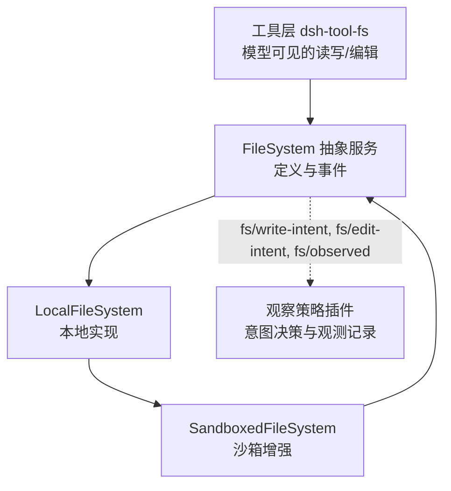
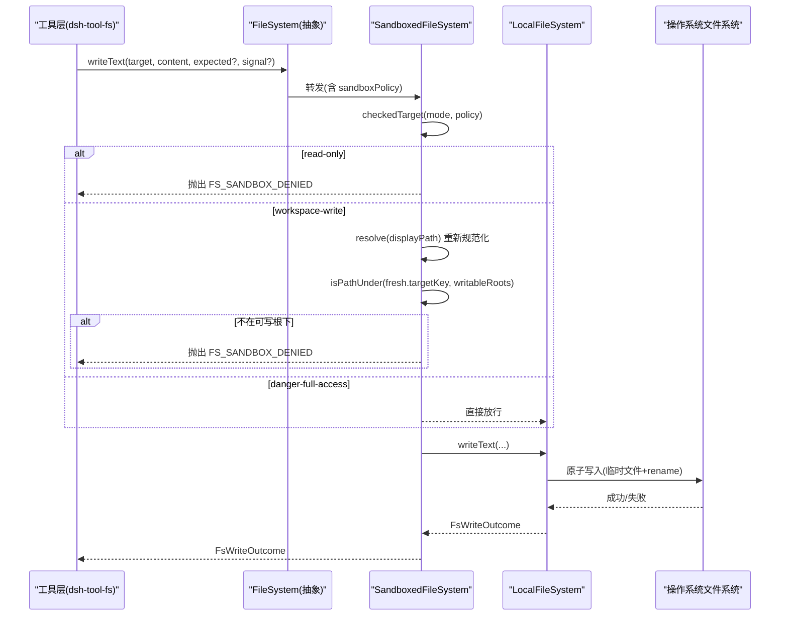
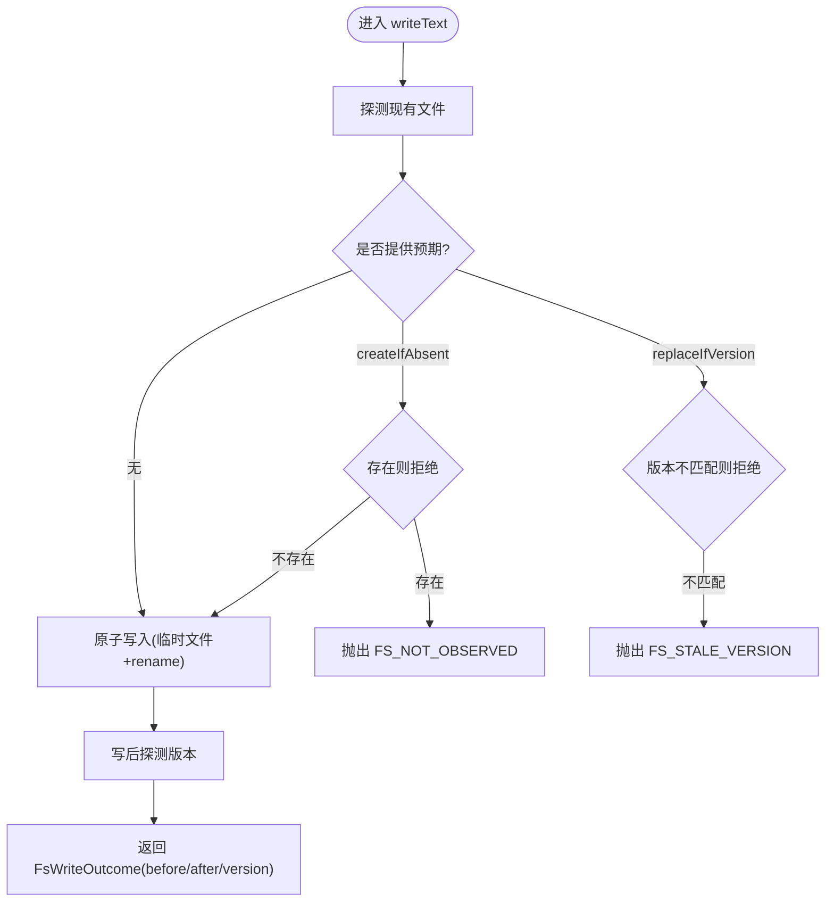
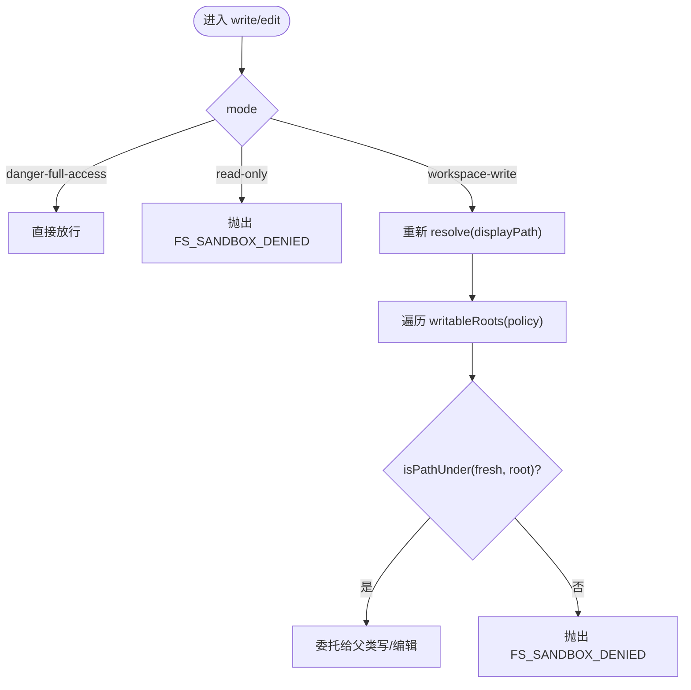
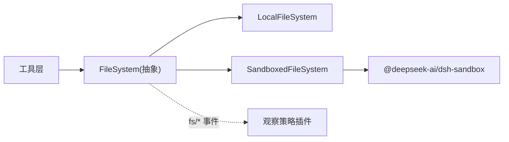

# 文件系统工具

<cite>
**本文引用的文件**
- [packages/fs/fs/src/index.ts](file://packages/fs/fs/src/index.ts)
- [packages/fs/fs/src/types.ts](file://packages/fs/fs/src/types.ts)
- [packages/fs/fs-local/src/index.ts](file://packages/fs/fs-local/src/index.ts)
- [packages/fs/fs-sandbox/src/index.ts](file://packages/fs/fs-sandbox/src/index.ts)
- [packages/fs/fs-sandbox/src/containment.ts](file://packages/fs/fs-sandbox/src/containment.ts)
- [docs/subsystems/filesystem.md](file://docs/subsystems/filesystem.md)
- [docs/subsystems/permission-presets.md](file://docs/subsystems/permission-presets.md)
- [apps/web/tests/shipped-composition.e2e.ts](file://apps/web/tests/shipped-composition.e2e.ts)
- [examples/acp-agent/tests/acp.e2e.ts](file://examples/acp-agent/tests/acp.e2e.ts)
</cite>

## 目录
1. [简介](#简介)
2. [项目结构](#项目结构)
3. [核心组件](#核心组件)
4. [架构总览](#架构总览)
5. [详细组件分析](#详细组件分析)
6. [依赖关系分析](#依赖关系分析)
7. [性能与并发](#性能与并发)
8. [故障排查指南](#故障排查指南)
9. [结论](#结论)
10. [附录：示例、权限配置与错误处理模式](#附录示例权限配置与错误处理模式)

## 简介
本文件面向 ACP Agent 的文件系统工具，系统性说明文件读写、目录操作、搜索与批量处理能力；详解权限控制机制（workspace-write 与 danger-full-access）的差异；解释沙箱隔离、路径解析与安全限制；并提供文件操作示例、权限配置与错误处理模式；最后给出大文件处理、并发访问与性能优化策略。

## 项目结构
文件系统能力由四个部分组成：抽象服务定义、本地实现、沙箱增强、以及观察策略与工具层（后者在文档中作为上下文引用）。其中：
- 抽象服务定义提供统一接口与事件契约（resolve/stat/read/write/edit/listDir 等），并暴露 fs/* 事件用于意图决策与观测记录。
- 本地实现基于宿主文件系统，提供原子写入、文本流式读取、目录枚举、版本守卫与并发序列化。
- 沙箱增强在写/编辑前按每调用策略进行路径包含性检查，拒绝越权写入。
- 观察策略通过事件决定 write/edit 的意图（createIfAbsent/replaceIfVersion），保证“先读后改”的安全默认行为。

图表来源
- [packages/fs/fs/src/index.ts:86-253](file://packages/fs/fs/src/index.ts#L86-L253)
- [packages/fs/fs-local/src/index.ts:64-266](file://packages/fs/fs-local/src/index.ts#L64-L266)
- [packages/fs/fs-sandbox/src/index.ts:59-152](file://packages/fs/fs-sandbox/src/index.ts#L59-L152)
- [docs/subsystems/filesystem.md:1-10](file://docs/subsystems/filesystem.md#L1-L10)

章节来源
- [docs/subsystems/filesystem.md:1-10](file://docs/subsystems/filesystem.md#L1-L10)

## 核心组件
- FileSystem 抽象服务：定义目标标识 FsTarget、元数据 FsInfo/FsPathInfo、读写接口、目录枚举、原子写/编辑、以及 fs/* 事件水闸与观测事件。
- LocalFileSystem：本地磁盘实现，支持相对路径解析、符号链接跟随后的稳定 targetKey、原子写入、行尾归一化、并发锁（按 targetKey 串行化写/编辑）、大小上限保护。
- SandboxedFileSystem：继承本地实现，仅在写/编辑时按 per-call 策略进行路径包含性检查；read-only 拒绝所有写；workspace-write 要求目标落在可写根下；danger-full-access 放行。
- 观察策略：通过 fs/write-intent 与 fs/edit-intent 水闸决定 createIfAbsent 或 replaceIfVersion；fs/observed 记录 present/absent 以驱动后续授权。

章节来源
- [packages/fs/fs/src/index.ts:86-253](file://packages/fs/fs/src/index.ts#L86-L253)
- [packages/fs/fs-local/src/index.ts:64-266](file://packages/fs/fs-local/src/index.ts#L64-L266)
- [packages/fs/fs-sandbox/src/index.ts:59-152](file://packages/fs/fs-sandbox/src/index.ts#L59-L152)
- [docs/subsystems/filesystem.md:114-179](file://docs/subsystems/filesystem.md#L114-L179)

## 架构总览
下图展示一次写操作的完整流程：工具层发起写请求，经抽象服务分发到后端；沙箱层按策略校验路径；本地实现执行原子写入并返回结果。

图表来源
- [packages/fs/fs-sandbox/src/index.ts:84-148](file://packages/fs/fs-sandbox/src/index.ts#L84-L148)
- [packages/fs/fs-local/src/index.ts:166-218](file://packages/fs/fs-local/src/index.ts#L166-L218)
- [packages/fs/fs-sandbox/src/containment.ts:58-77](file://packages/fs/fs-sandbox/src/containment.ts#L58-L77)

## 详细组件分析

### 抽象服务与类型契约
- 目标与元数据：FsTarget、FsInfo、FsPathInfo、FsDirEntry 提供稳定的目标标识与轻量元数据，避免消费者解析内部 key。
- 读写与编辑：readText/streamText/readBytes 提供文本与二进制读取；writeText/editText 提供原子更新与字面量替换；listDir 提供目录枚举。
- 事件契约：fs/write-intent 与 fs/edit-intent 为单槽位水闸，首个监听器决定意图；fs/observed 为同步记录事件，用于构建“已观测”状态。
- 错误体系：FsError 携带稳定代码（如 FS_SANDBOX_DENIED、FS_STALE_VERSION、FS_NOT_OBSERVED 等），便于上层分支重试或提示。

章节来源
- [packages/fs/fs/src/index.ts:86-253](file://packages/fs/fs/src/index.ts#L86-L253)
- [packages/fs/fs/src/types.ts:11-204](file://packages/fs/fs/src/types.ts#L11-L204)
- [docs/subsystems/filesystem.md:11-94](file://docs/subsystems/filesystem.md#L11-L94)
- [docs/subsystems/filesystem.md:244-270](file://docs/subsystems/filesystem.md#L244-L270)

### 本地实现（LocalFileSystem）
- 路径解析：resolve 将用户路径解析为稳定 targetKey；processPath/fileUrl/contains 提供跨能力坐标与包含性判断。
- 并发安全：按 targetKey 维护 FIFO 锁链，确保同一文件的读→守卫→写窗口串行化，避免竞态。
- 原子写入：使用临时文件 + rename 完成原子发布；diff 基线受 diffBasisMaxBytes 限制，避免无界分配。
- 文本与流：readText 与 streamText 语义一致，streamText 适合大文件；readBytes 带 maxBytes 上限，超限时返回 FS_TOO_LARGE。
- 编辑：editText 在关键区内完成版本检查、字面量匹配、行尾恢复与原子写入。

图表来源
- [packages/fs/fs-local/src/index.ts:166-218](file://packages/fs/fs-local/src/index.ts#L166-L218)
- [packages/fs/fs-local/src/index.ts:90-104](file://packages/fs/fs-local/src/index.ts#L90-L104)

章节来源
- [packages/fs/fs-local/src/index.ts:64-266](file://packages/fs/fs-local/src/index.ts#L64-L266)

### 沙箱增强（SandboxedFileSystem）
- 默认模式：sandboxMode 暴露部署默认模式，供工具层告知升级字段。
- 策略检查：checkedTarget 根据 mode 决定放行或拒绝；workspace-write 会重新 resolve 最新路径并验证是否在 writableRoots 之下。
- 拒绝语义：read-only 直接拒绝；workspace-write 越界拒绝；danger-full-access 完全放行。
- 包含性检测：isPathUnder 采用快速词法比较 + 保守回退（设备号+inode 等同身份），兼容大小写与别名。

图表来源
- [packages/fs/fs-sandbox/src/index.ts:84-148](file://packages/fs/fs-sandbox/src/index.ts#L84-L148)
- [packages/fs/fs-sandbox/src/containment.ts:58-77](file://packages/fs/fs-sandbox/src/containment.ts#L58-L77)

章节来源
- [packages/fs/fs-sandbox/src/index.ts:59-152](file://packages/fs/fs-sandbox/src/index.ts#L59-L152)
- [packages/fs/fs-sandbox/src/containment.ts:1-77](file://packages/fs/fs-sandbox/src/containment.ts#L1-L77)

### 权限预设与模式切换
- 预设表：将 sandbox/mode 与 approval/policy 打包为命名预设，默认包含 workspace-write 与 danger-full-access。
- 当前预设推导：从会话有效模式与审批策略折叠得出，优先保留用户选择，否则回退到声明顺序的第一个匹配项，否则为 custom。
- 切换行为：set 仅当有效值变化时才写入对应旋钮，并记录 permission/preset 日志事件。

章节来源
- [docs/subsystems/permission-presets.md:9-68](file://docs/subsystems/permission-presets.md#L9-L68)
- [docs/subsystems/permission-presets.md:78-132](file://docs/subsystems/permission-presets.md#L78-L132)
- [apps/web/tests/shipped-composition.e2e.ts:101-111](file://apps/web/tests/shipped-composition.e2e.ts#L101-L111)

## 依赖关系分析
- 抽象服务依赖 Cordis 上下文与事件机制；本地实现依赖 Node.js 文件系统 API；沙箱增强依赖 @deepseek-ai/dsh-sandbox 的可写根计算与策略解析。
- 工具层通过 ctx.fs 调用，不感知具体后端；策略插件通过 fs/* 事件参与决策，不侵入提供者实现。

图表来源
- [packages/fs/fs/src/index.ts:86-253](file://packages/fs/fs/src/index.ts#L86-L253)
- [packages/fs/fs-sandbox/src/index.ts:33-41](file://packages/fs/fs-sandbox/src/index.ts#L33-L41)

章节来源
- [packages/fs/fs/src/index.ts:86-253](file://packages/fs/fs/src/index.ts#L86-L253)
- [packages/fs/fs-sandbox/src/index.ts:33-41](file://packages/fs/fs-sandbox/src/index.ts#L33-L41)

## 性能与并发
- 大文件读取：优先使用 streamText 流式消费，避免一次性加载；readBytes 必须传入 maxBytes，防止无界缓冲。
- 原子写入：使用临时文件 + rename 保证原子性；diff 基线受 diffBasisMaxBytes 限制，超出时 before 为 null，由上层回退全量对比。
- 并发控制：按 targetKey 的 FIFO 锁链串行化写/编辑，避免竞态；读操作可并行。
- 包含性检查：isPathUnder 先做快速词法比较，再回退到 inode/dev 等同身份检查，减少系统调用。
- 取消与超时：文件系统操作无内置超时，但支持 AbortSignal 在系统调用边界尽力取消。

章节来源
- [packages/fs/fs-local/src/index.ts:40-57](file://packages/fs/fs-local/src/index.ts#L40-L57)
- [packages/fs/fs-local/src/index.ts:90-104](file://packages/fs/fs-local/src/index.ts#L90-L104)
- [packages/fs/fs-local/src/index.ts:143-153](file://packages/fs/fs-local/src/index.ts#L143-L153)
- [packages/fs/fs-local/src/index.ts:166-218](file://packages/fs/fs-local/src/index.ts#L166-L218)
- [packages/fs/fs-sandbox/src/containment.ts:58-77](file://packages/fs/fs-sandbox/src/containment.ts#L58-L77)
- [docs/subsystems/filesystem.md:272-275](file://docs/subsystems/filesystem.md#L272-L275)

## 故障排查指南
- 常见错误码
  - FS_SANDBOX_DENIED：沙箱策略拒绝写入（read-only 或 workspace-write 越界）。
  - FS_STALE_VERSION：版本守卫失败，文件已被修改或删除。
  - FS_NOT_OBSERVED：createIfAbsent 遇到已存在文件或未观测到缺失。
  - FS_NOT_REGULAR_FILE：目标不是普通文件。
  - FS_TOO_LARGE：读取超过 maxBytes。
  - FS_PERMISSION_DENIED / FS_IO_ERROR：底层权限或 I/O 错误。
- 定位步骤
  - 确认当前 sandbox/mode 与 effective writableRoots。
  - 检查 write/edit 是否携带正确的 expected 意图与版本。
  - 查看 fs/observed 是否记录了 present/absent 状态。
  - 对 workspace-write 场景，确认目标路径是否落在可写根下（考虑符号链接与大小写）。
- 复现建议
  - 使用 examples/acp-agent 的端到端测试，设置 DSH_PERMISSION_MODE 为不同模式，验证行为。

章节来源
- [packages/fs/fs/src/types.ts:170-204](file://packages/fs/fs/src/types.ts#L170-L204)
- [docs/subsystems/filesystem.md:244-270](file://docs/subsystems/filesystem.md#L244-L270)
- [examples/acp-agent/tests/acp.e2e.ts:24-30](file://examples/acp-agent/tests/acp.e2e.ts#L24-L30)
- [examples/acp-agent/tests/acp.e2e.ts:100-127](file://examples/acp-agent/tests/acp.e2e.ts#L100-L127)

## 结论
该文件系统工具通过清晰的抽象服务、稳健的本地实现与严格的沙箱增强，提供了安全的文件读写、目录操作与编辑能力。权限预设简化了策略配置，事件驱动的观察策略保证了“先读后改”的安全默认。配合流式读取、原子写入与并发锁，能够在高并发与大文件场景下保持性能与一致性。

## 附录：示例、权限配置与错误处理模式

### 文件操作示例（概念性）
- 读取文本：使用 readText 获取小文件全文；对大文件使用 streamText 分块消费。
- 写入文本：使用 writeText 并附带 expected 意图（createIfAbsent 或 replaceIfVersion）以避免覆盖未观测到的变更。
- 编辑文本：使用 editText 进行字面量替换，必要时携带版本守卫。
- 目录操作：使用 listDir 枚举子项；stat/lstat 获取元数据；contains 判断包含关系。

### 权限配置
- 预设：通过 permissionPresets 将 sandbox/mode 与 approval/policy 组合为命名预设（如 workspace-write、danger-full-access）。
- 模式：
  - read-only：禁止所有写/编辑。
  - workspace-write：允许在工作区与平台临时区域写入；需通过 writableRoots 判定。
  - danger-full-access：不限制写入。
- 环境变量：DSH_PERMISSION_MODE 可用于设置默认模式（见 e2e 测试）。

章节来源
- [docs/subsystems/permission-presets.md:9-68](file://docs/subsystems/permission-presets.md#L9-L68)
- [examples/acp-agent/tests/acp.e2e.ts:24-30](file://examples/acp-agent/tests/acp.e2e.ts#L24-L30)

### 错误处理模式
- 捕获 FsError 并依据 code 分支：FS_SANDBOX_DENIED 提示权限不足；FS_STALE_VERSION 提示内容已变更；FS_NOT_OBSERVED 提示需先读取或确认缺失；FS_TOO_LARGE 提示降低读取上限。
- 结合 fs/observed 状态：若 absent 则允许 createIfAbsent；若 present 则使用 replaceIfVersion 并携带版本。

章节来源
- [packages/fs/fs/src/types.ts:170-204](file://packages/fs/fs/src/types.ts#L170-L204)
- [docs/subsystems/filesystem.md:244-270](file://docs/subsystems/filesystem.md#L244-L270)