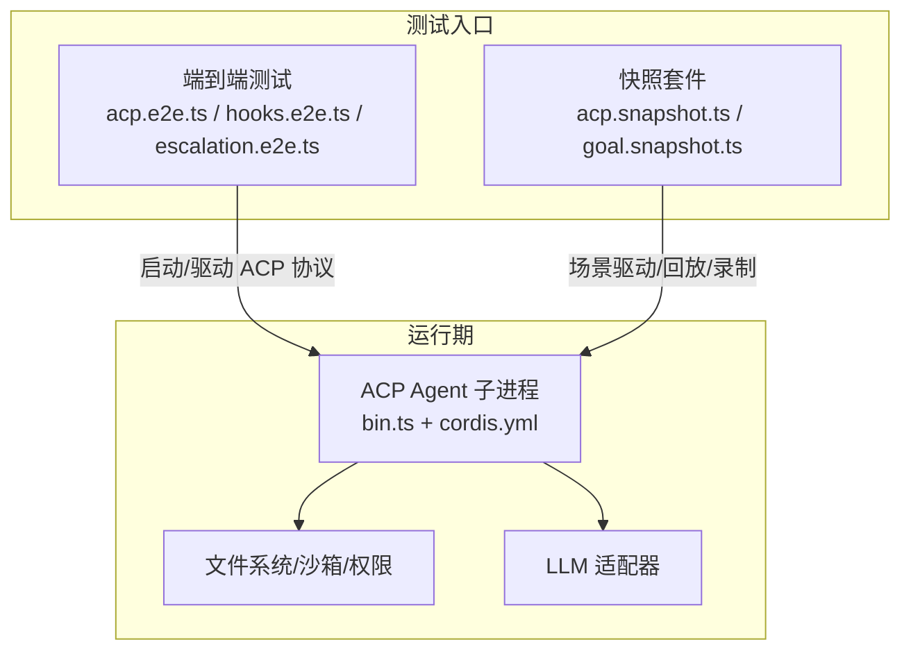
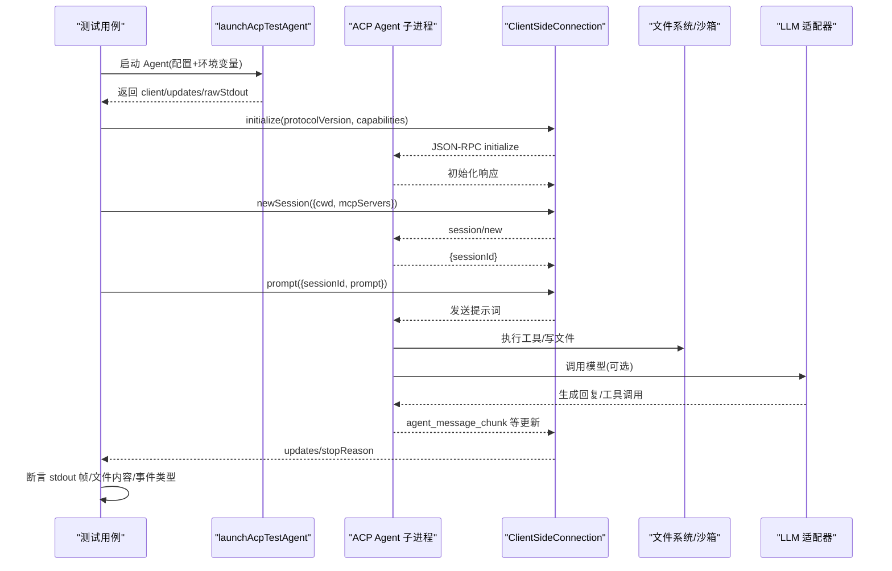
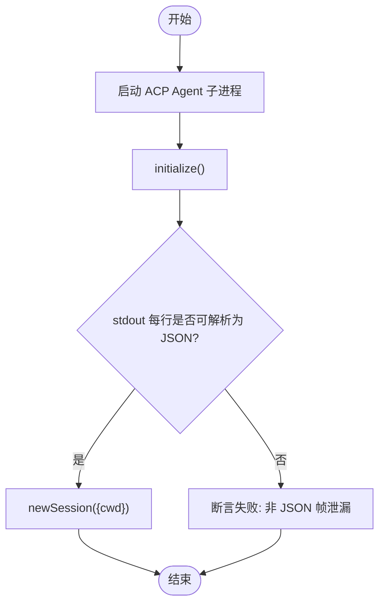
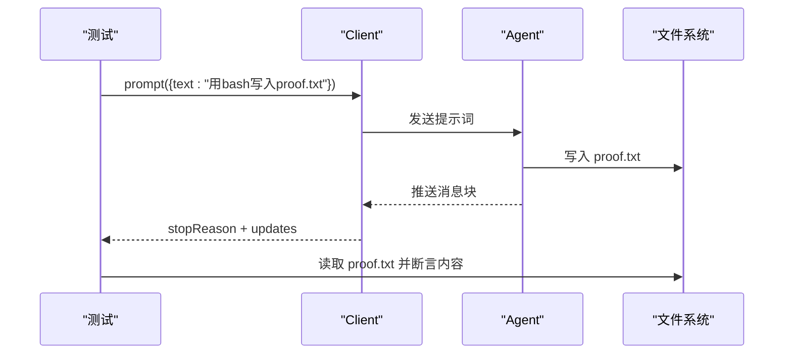
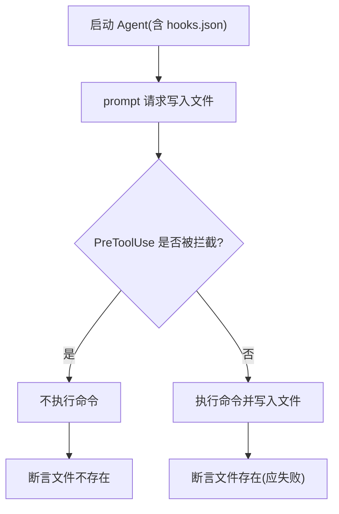
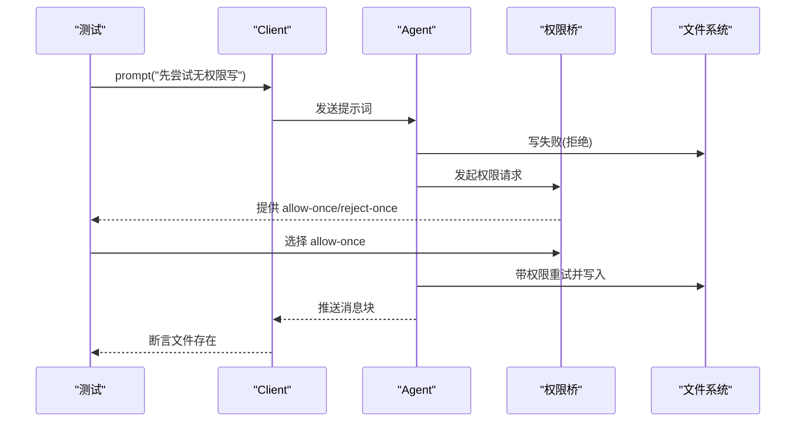
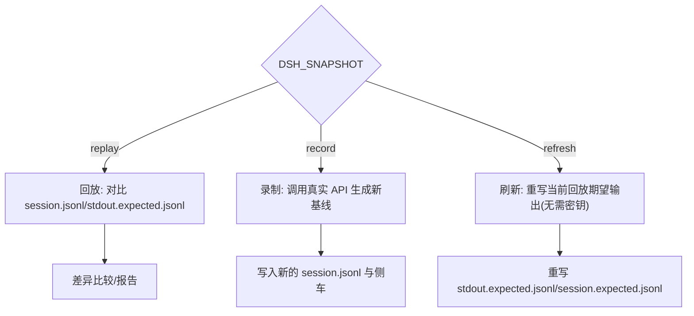
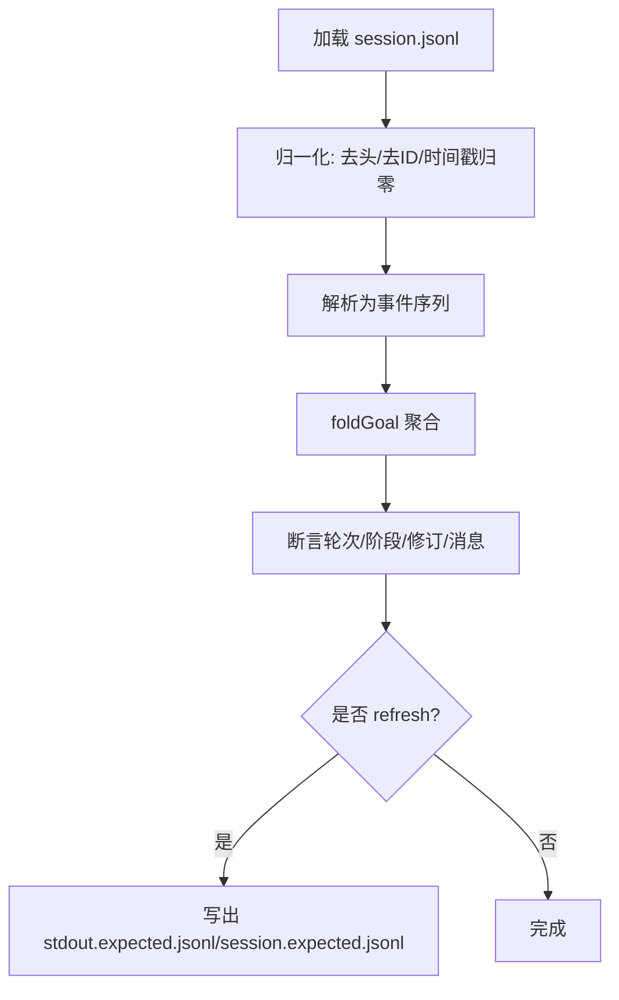
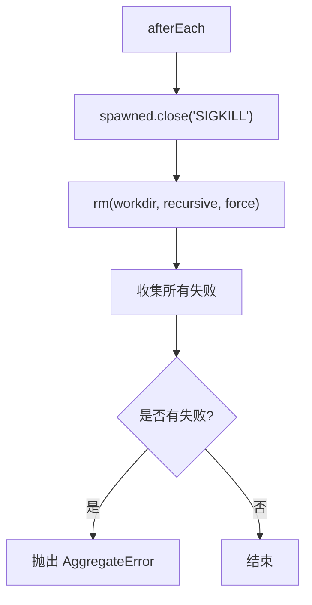
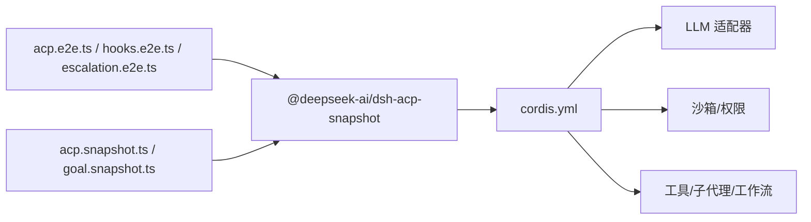

# 测试用例分析

<cite>
**本文引用的文件**
- [examples/acp-agent/tests/acp.e2e.ts](file://examples/acp-agent/tests/acp.e2e.ts)
- [examples/acp-agent/tests/acp.snapshot.ts](file://examples/acp-agent/tests/acp.snapshot.ts)
- [examples/acp-agent/tests/hooks.e2e.ts](file://examples/acp-agent/tests/hooks.e2e.ts)
- [examples/acp-agent/tests/escalation.e2e.ts](file://examples/acp-agent/tests/escalation.e2e.ts)
- [examples/acp-agent/tests/cleanup.ts](file://examples/acp-agent/tests/cleanup.ts)
- [examples/acp-agent/tests/goal.snapshot.ts](file://examples/acp-agent/tests/goal.snapshot.ts)
- [examples/acp-agent/cordis.yml](file://examples/acp-agent/cordis.yml)
- [packages/test-support/acp-snapshot/src/suite.ts](file://packages/test-support/acp-snapshot/src/suite.ts)
- [packages/test-support/acp-snapshot/src/launcher.ts](file://packages/test-support/acp-snapshot/src/launcher.ts)
- [packages/test-support/acp-snapshot/src/normalize.ts](file://packages/test-support/acp-snapshot/src/normalize.ts)
- [vitest.config.ts](file://vitest.config.ts)
- [vitest.e2e.config.ts](file://vitest.e2e.config.ts)
</cite>

## 目录
1. [简介](#简介)
2. [项目结构](#项目结构)
3. [核心组件](#核心组件)
4. [架构总览](#架构总览)
5. [详细组件分析](#详细组件分析)
6. [依赖关系分析](#依赖关系分析)
7. [性能考量](#性能考量)
8. [故障排查指南](#故障排查指南)
9. [结论](#结论)
10. [附录](#附录)

## 简介
本文件面向 ACP Agent 的测试体系，系统性说明测试框架结构、测试数据组织与断言机制，覆盖正常流程、错误处理与边界场景；详解快照测试的使用与维护策略；提供测试编写指南、调试技巧与性能测试方法；并总结端到端、单元测试与集成测试的最佳实践。内容基于仓库中 examples/acp-agent 下的测试实现与 test-support 提供的 ACP 快照套件。

## 项目结构
ACP Agent 测试位于 examples/acp-agent/tests，采用“端到端脚本 + 快照套件”的组合：
- 端到端测试（*.e2e.ts）：通过真实子进程启动 ACP Agent，使用 ACP 协议驱动会话，验证世界状态（如磁盘写入）、通道输出（stdout JSON-RPC 纯净性）以及权限升级流程等。
- 快照测试（*.snapshot.ts）：基于 @deepseek-ai/dsh-acp-snapshot 的 defineAcpSnapshotSuite，声明场景表（scenarios），以 session.jsonl 与 stdout.expected.jsonl 为期望基线，支持 record/replay/refresh 三种模式。
- 配置与装配：examples/acp-agent/cordis.yml 定义 LLM、沙箱、工具链、工作流、子代理、钩子等插件装配，供端到端与快照测试复用。
- 清理与保障：tests/cleanup.ts 提供统一的进程关闭与工作区清理，确保失败时也能回收资源。

图表来源
- [examples/acp-agent/tests/acp.e2e.ts:24-98](file://examples/acp-agent/tests/acp.e2e.ts#L24-L98)
- [examples/acp-agent/tests/acp.snapshot.ts:133-621](file://examples/acp-agent/tests/acp.snapshot.ts#L133-L621)
- [examples/acp-agent/cordis.yml:1-193](file://examples/acp-agent/cordis.yml#L1-L193)

章节来源
- [examples/acp-agent/tests/acp.e2e.ts:1-127](file://examples/acp-agent/tests/acp.e2e.ts#L1-L127)
- [examples/acp-agent/tests/acp.snapshot.ts:1-662](file://examples/acp-agent/tests/acp.snapshot.ts#L1-L662)
- [examples/acp-agent/cordis.yml:1-193](file://examples/acp-agent/cordis.yml#L1-L193)

## 核心组件
- 端到端驱动
  - 通过 launchAcpTestAgent 启动真实 ACP Agent 子进程，使用 ClientSideConnection 发送 initialize/newSession/prompt 等 RPC，断言 stopReason、stdout 帧、更新事件与磁盘结果。
  - 关键路径：无密钥的 stdout 纯净性校验、session/new 注入路径回归保护、真实提示词的世界级断言（文件写入）。
- 快照套件
  - 通过 defineAcpSnapshotSuite 声明 SCENARIOS，每个场景包含 name、hasModelTurn、recorded、pinsHeader、headerClass、configPath、prepareWorkspace、env、pwshOnly、posixOnly 等元信息，驱动录制/回放/刷新。
  - 支持多配置叠加（overlay），通过 headerClass/systemPromptSource/toolSchemasSource 复用或隔离头部与侧车。
- 目标（Goal）快照
  - 自定义 runScenario + normalizeStdout/normalizeSessionLog，对 session.jsonl 进行时间戳归一化与语义断言，验证自动轮次、取消与 wrap-up 指令注入。
- 清理器
  - cleanupAcpExampleTest 并发关闭进程与工作区，聚合所有失败并抛出 AggregateError，避免后续清理掩盖先前错误。

章节来源
- [examples/acp-agent/tests/acp.e2e.ts:24-127](file://examples/acp-agent/tests/acp.e2e.ts#L24-L127)
- [examples/acp-agent/tests/acp.snapshot.ts:133-621](file://examples/acp-agent/tests/acp.snapshot.ts#L133-L621)
- [examples/acp-agent/tests/goal.snapshot.ts:67-175](file://examples/acp-agent/tests/goal.snapshot.ts#L67-L175)
- [examples/acp-agent/tests/cleanup.ts:1-24](file://examples/acp-agent/tests/cleanup.ts#L1-L24)

## 架构总览
下图展示端到端测试与快照测试如何驱动 ACP Agent 子进程，并与文件系统、LLM 适配器交互。

图表来源
- [examples/acp-agent/tests/acp.e2e.ts:42-127](file://examples/acp-agent/tests/acp.e2e.ts#L42-L127)
- [examples/acp-agent/tests/acp.snapshot.ts:615-621](file://examples/acp-agent/tests/acp.snapshot.ts#L615-L621)
- [examples/acp-agent/cordis.yml:1-193](file://examples/acp-agent/cordis.yml#L1-L193)

## 详细组件分析

### 端到端测试：stdout 纯净性与 session/new 注入路径
- 目标
  - 验证 stdout 仅包含 JSON-RPC 帧，无日志泄漏。
  - 验证 session/new 能走通 Loader→AgentLoop→注册/持久化路径，避免注入缺失导致的内部错误。
- 关键点
  - 无需真实模型凭据即可运行（initialize-only 路径）。
  - 使用临时工作区作为 cwd，确保隔离。
  - 在 afterEach 中统一清理子进程与工作区。

图表来源
- [examples/acp-agent/tests/acp.e2e.ts:42-98](file://examples/acp-agent/tests/acp.e2e.ts#L42-L98)

章节来源
- [examples/acp-agent/tests/acp.e2e.ts:42-98](file://examples/acp-agent/tests/acp.e2e.ts#L42-L98)

### 端到端测试：真实提示词与文件系统断言
- 目标
  - 通过真实提示词驱动 Agent 使用 bash 工具在当前目录写入 proof.txt，并在磁盘上断言内容。
- 关键点
  - 断言 stopReason 为 end_turn 或 max_tokens。
  - 断言 updates 均为 agent_message_chunk。
  - 独立于模型响应的“世界断言”（文件存在且内容正确）。

图表来源
- [examples/acp-agent/tests/acp.e2e.ts:100-127](file://examples/acp-agent/tests/acp.e2e.ts#L100-L127)

章节来源
- [examples/acp-agent/tests/acp.e2e.ts:100-127](file://examples/acp-agent/tests/acp.e2e.ts#L100-L127)

### 钩子拦截：PreToolUse 阻止 bash
- 目标
  - 通过 process-level hooks.json 拦截 PreToolUse，阻止所有 bash 命令，从而不产生文件。
- 关键点
  - 断言 turn 正常结束（end_turn/max_tokens）。
  - 断言目标文件不存在。
  - 断言 updates 仅包含 agent_message_chunk。

图表来源
- [examples/acp-agent/tests/hooks.e2e.ts:38-72](file://examples/acp-agent/tests/hooks.e2e.ts#L38-L72)

章节来源
- [examples/acp-agent/tests/hooks.e2e.ts:38-72](file://examples/acp-agent/tests/hooks.e2e.ts#L38-L72)

### 权限升级：拒绝→重试→批准→落盘
- 目标
  - 默认读模式下首次写被拒，模型携带 sandbox_permissions 重试，客户端通过 requestPermission 选择 allow-once，最终文件落盘。
- 关键点
  - 探测可用沙箱执行器（bwrap/sandbox-exec），否则跳过。
  - 断言 stopReason、updates、permissionRequests 的结构与选项。
  - 世界断言：文件存在且内容正确。

图表来源
- [examples/acp-agent/tests/escalation.e2e.ts:122-177](file://examples/acp-agent/tests/escalation.e2e.ts#L122-L177)

章节来源
- [examples/acp-agent/tests/escalation.e2e.ts:103-177](file://examples/acp-agent/tests/escalation.e2e.ts#L103-L177)

### 快照套件：场景表与模式控制
- 目标
  - 通过 SCENARIOS 声明大量场景，覆盖文本/工具调用/PTY/PWSH/FS/LSP/Web/子代理/工作流/代码模式/权限等。
  - 支持 pinsHeader/headerClass/systemPromptSource/toolSchemasSource 复用或隔离头部与侧车。
  - 通过 DSH_SNAPSHOT 控制 record/replay/refresh 模式。
- 关键点
  - recorded=true 的场景会录制真实模型对话；recorded=false 的场景多为 keyless 回放或固定头部的断言。
  - prepareWorkspace 用于构造确定性工作区（如固定 mtime 的文件树）。
  - posixOnly/pwshOnly 控制平台相关场景的运行。

图表来源
- [examples/acp-agent/tests/acp.snapshot.ts:118-131](file://examples/acp-agent/tests/acp.snapshot.ts#L118-L131)
- [examples/acp-agent/tests/acp.snapshot.ts:133-621](file://examples/acp-agent/tests/acp.snapshot.ts#L133-L621)

章节来源
- [examples/acp-agent/tests/acp.snapshot.ts:118-621](file://examples/acp-agent/tests/acp.snapshot.ts#L118-L621)

### 目标（Goal）快照：时间戳归一化与语义断言
- 目标
  - 对 session.jsonl 中的 goal 相关记录进行时间戳归一化，断言轮次、阶段、修订号与 wrap-up 指令注入。
- 关键点
  - 使用 normalizeSessionLog/scrubRequestHeaders 去除不稳定字段。
  - 将 createdAt/updatedAt/clearedAt 等时间戳归一化为固定值，保证跨环境稳定。
  - 断言 foldGoal 的结果与预期一致。

图表来源
- [examples/acp-agent/tests/goal.snapshot.ts:43-65](file://examples/acp-agent/tests/goal.snapshot.ts#L43-L65)
- [examples/acp-agent/tests/goal.snapshot.ts:67-175](file://examples/acp-agent/tests/goal.snapshot.ts#L67-L175)

章节来源
- [examples/acp-agent/tests/goal.snapshot.ts:43-175](file://examples/acp-agent/tests/goal.snapshot.ts#L43-L175)

### 清理器：并发回收与错误聚合
- 目标
  - 在 afterEach 中关闭子进程并删除工作区，即使某一步失败也不掩盖另一步的错误。
- 关键点
  - 使用 Promise.allSettled 收集 close 与 rm 的结果。
  - 将所有拒绝原因收集为 AggregateError 抛出。

图表来源
- [examples/acp-agent/tests/cleanup.ts:11-23](file://examples/acp-agent/tests/cleanup.ts#L11-L23)

章节来源
- [examples/acp-agent/tests/cleanup.ts:1-24](file://examples/acp-agent/tests/cleanup.ts#L1-L24)

## 依赖关系分析
- 测试与运行时的耦合点
  - 端到端测试依赖 @deepseek-ai/dsh-acp-snapshot 的 launchAcpTestAgent 与 ClientSideConnection。
  - 快照套件依赖 defineAcpSnapshotSuite、runScenario、normalizeStdout/normalizeSessionLog。
  - 配置依赖 examples/acp-agent/cordis.yml 的插件装配（LLM、沙箱、工具、子代理、工作流、钩子）。
- 外部依赖与环境
  - 需要 DEEPSEEK_API_KEY 才能运行真实模型调用；无密钥时部分 e2e 自跳过。
  - POSIX 相关能力（bwrap/sandbox-exec/pwsh）影响场景运行条件。

图表来源
- [examples/acp-agent/tests/acp.e2e.ts:1-127](file://examples/acp-agent/tests/acp.e2e.ts#L1-L127)
- [examples/acp-agent/tests/acp.snapshot.ts:1-662](file://examples/acp-agent/tests/acp.snapshot.ts#L1-L662)
- [examples/acp-agent/cordis.yml:1-193](file://examples/acp-agent/cordis.yml#L1-L193)

章节来源
- [examples/acp-agent/tests/acp.e2e.ts:1-127](file://examples/acp-agent/tests/acp.e2e.ts#L1-L127)
- [examples/acp-agent/tests/acp.snapshot.ts:1-662](file://examples/acp-agent/tests/acp.snapshot.ts#L1-L662)
- [examples/acp-agent/cordis.yml:1-193](file://examples/acp-agent/cordis.yml#L1-L193)

## 性能考量
- 并行度与超时
  - vitest.e2e.config.ts 设置 testTimeout=120_000、hookTimeout=30_000、retry=2，并通过 DSH_E2E_MAX_WORKERS 控制文件级并行度，兼顾 CI 效率与配额限制。
  - vitest.config.ts 将进程绑定测试分离到 process-bound 项目，避免线程池竞争导致的不稳定。
- 录制与回放
  - 快照录制（record）会调用真实模型，耗时较长；回放（replay）与刷新（refresh）无需密钥，适合快速回归。
  - 通过 headerClass/systemPromptSource/toolSchemasSource 复用头部与侧车，减少不必要的录制范围。
- I/O 与稳定性
  - 使用临时目录与严格清理，避免残留进程/文件影响后续运行。
  - 对平台相关能力（pwsh/bwrap/sandbox-exec）进行运行时探测，避免在无能力环境下失败。

章节来源
- [vitest.e2e.config.ts:1-59](file://vitest.e2e.config.ts#L1-L59)
- [vitest.config.ts:117-159](file://vitest.config.ts#L117-L159)
- [examples/acp-agent/tests/acp.snapshot.ts:118-131](file://examples/acp-agent/tests/acp.snapshot.ts#L118-L131)

## 故障排查指南
- stdout 非 JSON 帧
  - 现象：stdout 中出现非 JSON 行。
  - 排查：检查日志输出是否误写到 stdout；确认 ACP 传输层未混入控制台输出。
  - 参考：[examples/acp-agent/tests/acp.e2e.ts:42-66](file://examples/acp-agent/tests/acp.e2e.ts#L42-L66)
- session/new 注入失败
  - 现象：newSession 报 Internal error。
  - 排查：确认 Loader→AgentLoop→注册/持久化路径的依赖注入完整；该路径在 JSON-RPC 读循环内执行，需避免懒加载缺失。
  - 参考：[examples/acp-agent/tests/acp.e2e.ts:68-97](file://examples/acp-agent/tests/acp.e2e.ts#L68-L97)
- 权限升级未生效
  - 现象：write 仍被拒绝或文件未落盘。
  - 排查：确认 requestPermission 回调已收到并选择 allow-once；检查沙箱执行器可用性；核对 DSH_PERMISSION_MODE。
  - 参考：[examples/acp-agent/tests/escalation.e2e.ts:122-177](file://examples/acp-agent/tests/escalation.e2e.ts#L122-L177)
- 钩子未拦截
  - 现象：bash 命令被执行。
  - 排查：确认 hooks.json 放置位置与 configPath 指向；验证 PreToolUse 钩子命令返回非零退出码。
  - 参考：[examples/acp-agent/tests/hooks.e2e.ts:38-72](file://examples/acp-agent/tests/hooks.e2e.ts#L38-L72)
- 清理失败
  - 现象：进程未关闭或工作区未删除。
  - 排查：查看 cleanup 抛出的 AggregateError 列表，定位具体失败项；必要时手动 SIGKILL。
  - 参考：[examples/acp-agent/tests/cleanup.ts:11-23](file://examples/acp-agent/tests/cleanup.ts#L11-L23)

章节来源
- [examples/acp-agent/tests/acp.e2e.ts:42-97](file://examples/acp-agent/tests/acp.e2e.ts#L42-L97)
- [examples/acp-agent/tests/escalation.e2e.ts:122-177](file://examples/acp-agent/tests/escalation.e2e.ts#L122-L177)
- [examples/acp-agent/tests/hooks.e2e.ts:38-72](file://examples/acp-agent/tests/hooks.e2e.ts#L38-L72)
- [examples/acp-agent/tests/cleanup.ts:11-23](file://examples/acp-agent/tests/cleanup.ts#L11-L23)

## 结论
ACP Agent 测试体系以端到端脚本与快照套件为核心，结合严格的清理与平台探测，覆盖了从协议契约、权限升级、工具执行到子代理与工作流的广泛场景。通过 record/replay/refresh 三模式与头部/侧车复用机制，既保证了稳定性又提升了维护效率。建议在新增场景时优先采用 keyless 回放与 pinned header，仅在必要情况下录制真实模型对话，并持续完善世界断言与异常路径覆盖。

## 附录

### 测试编写指南
- 端到端测试
  - 使用 launchAcpTestAgent 启动子进程，传入 agent.binScript/configPath/tsconfigPath 与工作区 cwd。
  - 在 afterEach 中调用 cleanupAcpExampleTest 确保进程与工作区回收。
  - 断言应包括：stopReason、updates 类型、stdout 帧、世界状态（文件/目录）。
  - 参考：[examples/acp-agent/tests/acp.e2e.ts:24-127](file://examples/acp-agent/tests/acp.e2e.ts#L24-L127)、[examples/acp-agent/tests/cleanup.ts:11-23](file://examples/acp-agent/tests/cleanup.ts#L11-L23)
- 快照测试
  - 在 SCENARIOS 中声明场景，合理设置 hasModelTurn/recorded/pinsHeader/headerClass/systemPromptSource/toolSchemasSource。
  - 使用 prepareWorkspace 构造确定性输入（如固定 mtime 的文件树）。
  - 通过 DSH_SNAPSHOT 切换 record/replay/refresh；刷新时只重写期望输出，无需密钥。
  - 参考：[examples/acp-agent/tests/acp.snapshot.ts:133-621](file://examples/acp-agent/tests/acp.snapshot.ts#L133-L621)
- 目标（Goal）快照
  - 使用 normalizeSessionLog/scrubRequestHeaders 去除不稳定字段，并对时间戳归一化。
  - 断言 foldGoal 的语义结果（轮次、阶段、修订号、消息）。
  - 参考：[examples/acp-agent/tests/goal.snapshot.ts:43-175](file://examples/acp-agent/tests/goal.snapshot.ts#L43-L175)

### 调试技巧
- 逐步缩小范围：先运行最小化的 e2e 用例（如 initialize-only），再逐步加入 prompt。
- 观察 stdout：若出现非 JSON 行，优先排查日志输出与传输层污染。
- 利用 replay：在 record 成功后，切换到 replay 快速回归；如需调整期望，使用 refresh。
- 平台能力探测：确认 pwsh/bwrap/sandbox-exec 可用性，避免无能力环境下的假失败。

### 性能测试方法
- 使用 vitest.e2e.config.ts 的 fileParallelism 与 maxWorkers 控制并发，结合 DSH_E2E_MAX_WORKERS 调节。
- 对长耗时场景启用 retry，降低瞬态失败影响。
- 通过快照录制与回放分离真实模型调用与回归验证，提升整体吞吐。

### 端到端、单元与集成测试最佳实践
- 端到端
  - 聚焦协议契约与世界状态，避免脆弱 UI 断言；使用临时工作区与严格清理。
  - 参考：[examples/acp-agent/tests/acp.e2e.ts:42-127](file://examples/acp-agent/tests/acp.e2e.ts#L42-L127)
- 单元
  - 针对纯函数与模块行为，保持快速与隔离；避免启动子进程。
  - 参考：[vitest.config.ts:117-159](file://vitest.config.ts#L117-L159)
- 集成
  - 组合多个子系统（如 LLM+沙箱+工具），通过快照套件与 fixture 固定输入输出。
  - 参考：[examples/acp-agent/tests/acp.snapshot.ts:133-621](file://examples/acp-agent/tests/acp.snapshot.ts#L133-L621)