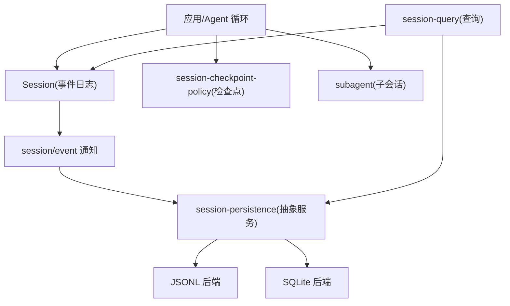
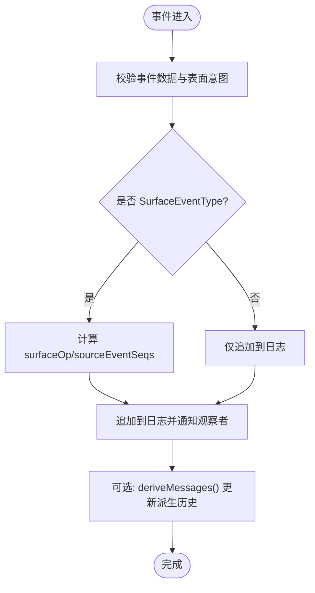
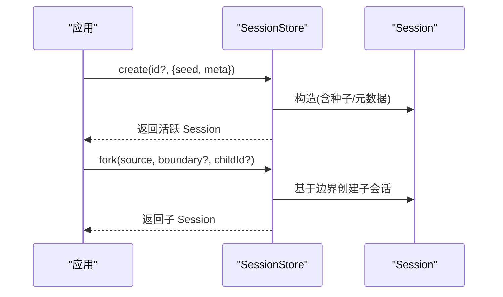
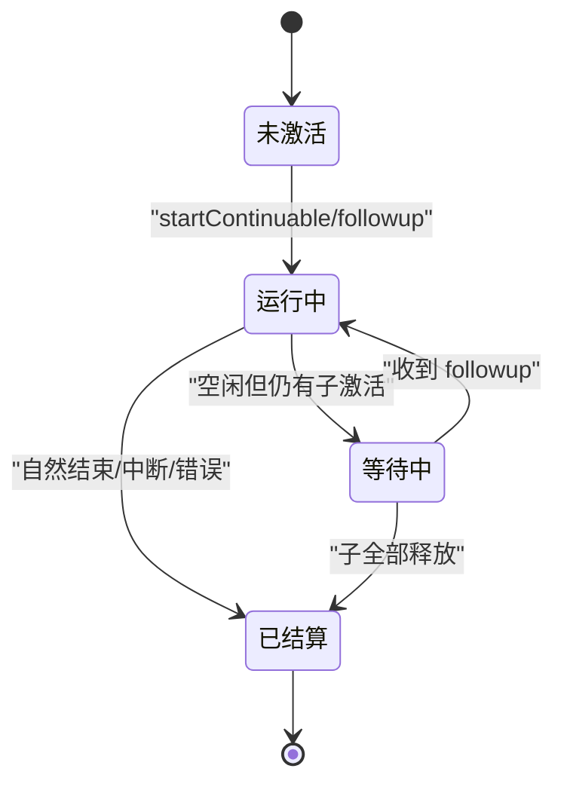
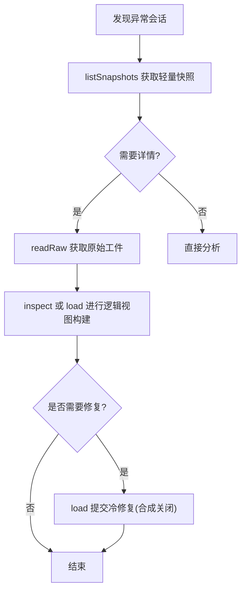
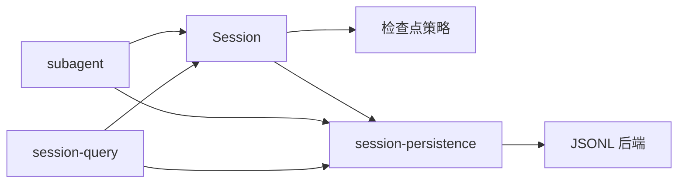

# 会话管理

<cite>
**本文引用的文件**
- [packages/core/session/src/types.ts](file://packages/core/session/src/types.ts)
- [packages/core/session/src/index.ts](file://packages/core/session/src/index.ts)
- [docs/subsystems/session.md](file://docs/subsystems/session.md)
- [docs/subsystems/persistence.md](file://docs/subsystems/persistence.md)
- [packages/session/session-checkpoint-policy/src/index.ts](file://packages/session/session-checkpoint-policy/src/index.ts)
- [packages/session/session-persistence/src/index.ts](file://packages/session/session-persistence/src/index.ts)
- [packages/session/session-persistence-jsonl/src/index.ts](file://packages/session/session-persistence-jsonl/src/index.ts)
- [docs/subsystems/subagent.md](file://docs/subsystems/subagent.md)
- [docs/subsystems/session-query.md](file://docs/subsystems/session-query.md)
</cite>

## 目录
1. [简介](#简介)
2. [项目结构](#项目结构)
3. [核心组件](#核心组件)
4. [架构总览](#架构总览)
5. [详细组件分析](#详细组件分析)
6. [依赖关系分析](#依赖关系分析)
7. [性能考量](#性能考量)
8. [故障排查指南](#故障排查指南)
9. [结论](#结论)
10. [附录](#附录)

## 简介
本文件面向“无头 Agent 会话管理”，围绕以下目标展开：会话的创建、持久化与恢复；JSONL 事件流与会话状态管理；检查点策略；子会话处理；生命周期管理；内存管理与资源清理；监控、调试与故障恢复；以及会话数据的导出、导入与迁移方案。文档以代码级事实为依据，结合系统文档中的契约与实现细节，提供从高层到落地的完整说明。

## 项目结构
- 会话模型与事件定义位于 core/session，提供追加式事件日志、表面投影、派生消息等能力。
- 持久化抽象在 session-persistence，提供后端无关的接口与协调器；JSONL 与 SQLite 为两种具体后端。
- 检查点策略通过 session-checkpoint-policy 插件挂载到 LLM 流、工具调用与步骤边界，确保语义级一致性。
- 子会话由 subagent 子系统管理，支持一次性与可延续（continuable）两种模式，具备冷启动恢复与生命周期治理。
- 查询与检索由 session-query 提供，统一活态与持久化数据源，支持过滤、全文检索、血缘追踪与事件窗口读取。



图表来源
- [packages/core/session/src/index.ts:617-749](file://packages/core/session/src/index.ts#L617-L749)
- [packages/session/session-persistence/src/index.ts:84-240](file://packages/session/session-persistence/src/index.ts#L84-L240)
- [packages/session/session-persistence-jsonl/src/index.ts:121-200](file://packages/session/session-persistence-jsonl/src/index.ts#L121-L200)
- [packages/session/session-checkpoint-policy/src/index.ts:63-83](file://packages/session/session-checkpoint-policy/src/index.ts#L63-L83)
- [docs/subsystems/subagent.md:114-159](file://docs/subsystems/subagent.md#L114-L159)
- [docs/subsystems/session-query.md:367-490](file://docs/subsystems/session-query.md#L367-L490)

章节来源
- [docs/subsystems/session.md:1-127](file://docs/subsystems/session.md#L1-L127)
- [docs/subsystems/persistence.md:1-20](file://docs/subsystems/persistence.md#L1-L20)

## 核心组件
- 会话事件与表面投影：追加式事件日志、SurfaceOp 替换、派生消息、首条活写边界。
- 会话存储与准备：创建、进入、公告、分叉、准备与恢复、检查点刷新。
- 持久化抽象与后端：locate/create/append/load/inspect/readFrom/list/listSnapshots；JSONL 与 SQLite 实现。
- 检查点策略：在 LLM 流、顶层工具调用、每步开始前进行 flush，保证语义一致。
- 子会话：一次性与可延续，激活、冷恢复、中断、报告、枚举与血缘。
- 查询：会话与事件过滤、全文检索、血缘追踪、事件窗口读取。

章节来源
- [packages/core/session/src/index.ts:617-749](file://packages/core/session/src/index.ts#L617-L749)
- [docs/subsystems/session.md:194-358](file://docs/subsystems/session.md#L194-L358)
- [docs/subsystems/persistence.md:231-380](file://docs/subsystems/persistence.md#L231-L380)
- [packages/session/session-checkpoint-policy/src/index.ts:63-83](file://packages/session/session-checkpoint-policy/src/index.ts#L63-L83)
- [docs/subsystems/subagent.md:114-159](file://docs/subsystems/subagent.md#L114-L159)
- [docs/subsystems/session-query.md:367-490](file://docs/subsystems/session-query.md#L367-L490)

## 架构总览
下图展示无头 Agent 会话从创建、写入、检查点到持久化的关键路径，以及与子会话和查询的关系。

```mermaid
sequenceDiagram
participant Loop as "Agent 循环"
participant Sess as "Session"
participant CP as "检查点策略"
participant SP as "session-persistence"
participant J as "JSONL 后端"
Loop->>Sess : append(事件)
Sess-->>CP : session/event(通知)
CP->>SP : flush(session)
SP->>J : append(id, events)
J-->>SP : 成功/失败
SP-->>CP : 完成
Note over Loop,Sess : 每步开始前也会触发 flush，确保请求前已持久化
```

图表来源
- [packages/core/session/src/index.ts:702-715](file://packages/core/session/src/index.ts#L702-L715)
- [packages/session/session-checkpoint-policy/src/index.ts:63-83](file://packages/session/session-checkpoint-policy/src/index.ts#L63-L83)
- [packages/session/session-persistence/src/index.ts:135-143](file://packages/session/session-persistence/src/index.ts#L135-L143)
- [packages/session/session-persistence-jsonl/src/index.ts:180-182](file://packages/session/session-persistence-jsonl/src/index.ts#L180-L182)

## 详细组件分析

### 会话事件与状态管理
- 事件类型：turn/start/end、step/start/end、user/message、assistant/chunk、assistant/message、tool/call、tool/result、request/header、request/context、session/end-seed 等。
- 表面投影：SurfaceOp 支持追加与范围替换；deriveMessages 基于有序表面生成模型可见历史。
- 首条活写边界：firstLiveSeq 与 session/end-seed 标记区分种子历史与本次进程产生的事件。
- 请求头与上下文：request/header 记录每次请求的配置与系统提示；request/context 记录路由容量等元信息。



图表来源
- [docs/subsystems/session.md:194-358](file://docs/subsystems/session.md#L194-L358)
- [docs/subsystems/session.md:359-519](file://docs/subsystems/session.md#L359-L519)

章节来源
- [docs/subsystems/session.md:1-127](file://docs/subsystems/session.md#L1-L127)
- [docs/subsystems/session.md:194-358](file://docs/subsystems/session.md#L194-L358)
- [docs/subsystems/session.md:359-519](file://docs/subsystems/session.md#L359-L519)

### 会话创建、恢复与分叉
- 创建：ctx.sessions.create(id?, options?) 支持 seed 与 meta，自动填充版本、id、创建时间。
- 准备与进入：prepare + enter + announce 组合用于复合 effect 的生命周期绑定，避免竞态。
- 恢复：Session.fromRestore 或 SessionStore.prepare({ seedSource: 'persistence' }) 将持久化值验证并冻结后恢复。
- 分叉：fork(source, boundary?, childSessionId?) 基于稳定边界创建子会话，要求边界不在开放 turn 内。



图表来源
- [packages/core/session/src/index.ts:617-749](file://packages/core/session/src/index.ts#L617-L749)
- [docs/subsystems/persistence.md:96-126](file://docs/subsystems/persistence.md#L96-L126)

章节来源
- [packages/core/session/src/index.ts:617-749](file://packages/core/session/src/index.ts#L617-L749)
- [docs/subsystems/persistence.md:96-126](file://docs/subsystems/persistence.md#L96-L126)

### 持久化与 JSONL 事件流
- 抽象服务：SessionPersistence 定义 locate/create/append/load/inspect/readFrom/list/listSnapshots。
- JSONL 后端：每会话一个追加式文件，支持 zstd 压缩与 packed chunk；原子写入、崩溃恢复、原始文本读取。
- 格式拒绝：未知版本或损坏的前缀会拒绝加载，错误信息包含方向性提示。
- 原始工件：readRaw 返回后端物理编码解码后的完整文本，保留键序与换行。

```mermaid
classDiagram
class SessionPersistence {
+locate(meta) SessionLocation?
+create(meta) Promise<void>
+append(id, events) Promise<void>
+load(id) Promise<SessionInspection>
+inspect(id, signal?) Promise<SessionInspection>
+readFrom(id, fromSeq, signal?) Promise<{meta, events}>
+list(signal?) Promise<SessionHeader[]>
+listSnapshots(signal?) Promise<SessionPersistenceSnapshot[]>
}
class JsonlSessionPersistence {
+supportsRawArtifacts = true
+readRaw(id, signal?) Promise<SessionRawArtifact?>
-appendLines(...)
-materialize(...)
-repair(offset)
}
SessionPersistence <|-- JsonlSessionPersistence
```

图表来源
- [packages/session/session-persistence/src/index.ts:84-240](file://packages/session/session-persistence/src/index.ts#L84-L240)
- [packages/session/session-persistence-jsonl/src/index.ts:121-200](file://packages/session/session-persistence-jsonl/src/index.ts#L121-L200)
- [packages/session/session-persistence-jsonl/src/index.ts:240-282](file://packages/session/session-persistence-jsonl/src/index.ts#L240-L282)
- [packages/session/session-persistence-jsonl/src/index.ts:421-444](file://packages/session/session-persistence-jsonl/src/index.ts#L421-L444)

章节来源
- [docs/subsystems/persistence.md:231-380](file://docs/subsystems/persistence.md#L231-L380)
- [packages/session/session-persistence-jsonl/src/index.ts:121-200](file://packages/session/session-persistence-jsonl/src/index.ts#L121-L200)
- [packages/session/session-persistence-jsonl/src/index.ts:240-282](file://packages/session/session-persistence-jsonl/src/index.ts#L240-L282)
- [packages/session/session-persistence-jsonl/src/index.ts:421-444](file://packages/session/session-persistence-jsonl/src/index.ts#L421-L444)

### 检查点策略与一致性
- 策略要点：在 LLM 流首次请求前、顶层工具执行前、每步开始前进行 flush，确保语义边界已持久化。
- 失败关闭：检查点失败阻止下游适配器或工具体执行，避免不一致副作用。
- 批量与延迟：协调器维护固定批窗口与跟随批次，显式 flush 立即重试并上报失败。

```mermaid
sequenceDiagram
participant Loop as "Agent 循环"
participant CP as "检查点策略"
participant Sess as "Session"
participant SP as "session-persistence"
Loop->>CP : llm/stream(options, next)
CP->>Sess : get(session)
CP->>SP : flush(session)
SP-->>CP : 完成
CP-->>Loop : 继续 next()
Loop->>CP : tools/execute(exec, next)
CP->>SP : flush(agent.session)
CP-->>Loop : 继续 next()
Loop->>CP : agent/pre-step
CP->>SP : flush(agent.session)
```

图表来源
- [packages/session/session-checkpoint-policy/src/index.ts:63-83](file://packages/session/session-checkpoint-policy/src/index.ts#L63-L83)

章节来源
- [packages/session/session-checkpoint-policy/src/index.ts:63-83](file://packages/session/session-checkpoint-policy/src/index.ts#L63-L83)

### 子会话处理与生命周期
- 一次性与可延续：一次性 run 有明确结果与处置；可延续子会话具有 Activation，支持冷恢复、followup、interrupt、report。
- 激活与归属：Activation 持有 AgentHandle 与 ownedChildren，按子优先顺序释放；manager 负责准入、授权与回收。
- 枚举与血缘：listChildren/listDescendants 合并活态与持久化，按描述符折叠身份；traceSession 提供祖先与后代树。



图表来源
- [docs/subsystems/subagent.md:114-159](file://docs/subsystems/subagent.md#L114-L159)
- [docs/subsystems/subagent.md:287-305](file://docs/subsystems/subagent.md#L287-L305)
- [docs/subsystems/session-query.md:220-257](file://docs/subsystems/session-query.md#L220-L257)

章节来源
- [docs/subsystems/subagent.md:114-159](file://docs/subsystems/subagent.md#L114-L159)
- [docs/subsystems/subagent.md:287-305](file://docs/subsystems/subagent.md#L287-L305)
- [docs/subsystems/session-query.md:220-257](file://docs/subsystems/session-query.md#L220-L257)

### 会话监控、调试与故障恢复
- 监控：通过 session/created、session/disposed、subagent/start、subagent/end 等事件观察生命周期。
- 调试：使用 readRaw 获取原始工件文本；使用 listSnapshots 快速比较变更；使用 traceEvent 定位替换链与引用关系。
- 恢复：load 对冷会话进行崩溃修复，合成关闭 open turn；JSONL 后端可截断破损尾部并恢复完整事件。



图表来源
- [packages/session/session-persistence-jsonl/src/index.ts:240-282](file://packages/session/session-persistence-jsonl/src/index.ts#L240-L282)
- [packages/session/session-persistence-jsonl/src/index.ts:421-444](file://packages/session/session-persistence-jsonl/src/index.ts#L421-L444)
- [docs/subsystems/persistence.md:13-19](file://docs/subsystems/persistence.md#L13-L19)
- [docs/subsystems/session-query.md:293-331](file://docs/subsystems/session-query.md#L293-L331)

章节来源
- [docs/subsystems/persistence.md:13-19](file://docs/subsystems/persistence.md#L13-L19)
- [packages/session/session-persistence-jsonl/src/index.ts:240-282](file://packages/session/session-persistence-jsonl/src/index.ts#L240-L282)
- [docs/subsystems/session-query.md:293-331](file://docs/subsystems/session-query.md#L293-L331)

### 内存管理与资源清理
- 会话对象：events 为不可变快照，surface 为只读投影；派生消息共享深冻结数据，避免二次拷贝。
- 子会话：Activation 拥有 AgentHandle 与子集合，按子优先顺序释放；drainContinuableDescendants 安全关闭并释放。
- 持久化：协调器维护 prepared session 缓存与写批窗口；dispose 执行最终排空。

章节来源
- [docs/subsystems/session.md:359-519](file://docs/subsystems/session.md#L359-L519)
- [docs/subsystems/subagent.md:114-159](file://docs/subsystems/subagent.md#L114-L159)
- [packages/session/session-persistence/src/index.ts:145-168](file://packages/session/session-persistence/src/index.ts#L145-L168)

### 会话数据导出、导入与迁移
- 导出：readRaw 返回后端物理编码解码后的完整文本，保留键序与换行；listSnapshots 提供轻量变更令牌。
- 导入：Session.fromRestore 或 prepare({ seedSource: 'persistence' }) 将新鲜 detached 事件与元数据验证并冻结后恢复。
- 迁移：后端拒绝未知版本；JSONL 后端在解析阶段即拒绝未来/旧格式，错误信息指明升级方向；SQLite 通过 SCHEMA_VERSION 保护。

章节来源
- [packages/session/session-persistence-jsonl/src/index.ts:240-282](file://packages/session/session-persistence-jsonl/src/index.ts#L240-L282)
- [docs/subsystems/persistence.md:92-95](file://docs/subsystems/persistence.md#L92-L95)
- [docs/subsystems/persistence.md:143-167](file://docs/subsystems/persistence.md#L143-L167)

## 依赖关系分析
- Session 依赖 persistence 进行持久化，并通过 checkpoint policy 在关键边界触发 flush。
- JSONL 后端依赖文件系统与压缩库，提供原子写入与崩溃恢复。
- subagent 依赖 session store 与 session persistence 进行枚举与冷恢复。
- session-query 依赖 live-preferred 逻辑语料，合并活态与持久化数据。



图表来源
- [packages/core/session/src/index.ts:617-749](file://packages/core/session/src/index.ts#L617-L749)
- [packages/session/session-persistence/src/index.ts:84-240](file://packages/session/session-persistence/src/index.ts#L84-L240)
- [packages/session/session-persistence-jsonl/src/index.ts:121-200](file://packages/session/session-persistence-jsonl/src/index.ts#L121-L200)
- [docs/subsystems/subagent.md:114-159](file://docs/subsystems/subagent.md#L114-L159)
- [docs/subsystems/session-query.md:367-490](file://docs/subsystems/session-query.md#L367-L490)

章节来源
- [packages/core/session/src/index.ts:617-749](file://packages/core/session/src/index.ts#L617-L749)
- [packages/session/session-persistence/src/index.ts:84-240](file://packages/session/session-persistence/src/index.ts#L84-L240)
- [packages/session/session-persistence-jsonl/src/index.ts:121-200](file://packages/session/session-persistence-jsonl/src/index.ts#L121-L200)
- [docs/subsystems/subagent.md:114-159](file://docs/subsystems/subagent.md#L114-L159)
- [docs/subsystems/session-query.md:367-490](file://docs/subsystems/session-query.md#L367-L490)

## 性能考量
- 事件批处理：协调器维护固定批窗口与跟随批次，减少 fsync 次数；显式 flush 立即重试并上报失败。
- JSONL 压缩：默认 zstd 压缩，packed chunk 显著减小日志体积；读取时按需解压并定期让出事件循环。
- 列表优化：list 仅读取头部行，避免全量解析；listSnapshots 提供轻量变更令牌。
- 派生历史缓存：deriveMessages 缓存每个表面节点投影，重写时重建，降低重复计算。

章节来源
- [packages/session/session-persistence-jsonl/src/index.ts:38-44](file://packages/session/session-persistence-jsonl/src/index.ts#L38-L44)
- [packages/session/session-persistence-jsonl/src/index.ts:446-470](file://packages/session/session-persistence-jsonl/src/index.ts#L446-L470)
- [docs/subsystems/session.md:521-531](file://docs/subsystems/session.md#L521-L531)

## 故障排查指南
- 常见错误：
  - 格式不支持：未知版本或结构不兼容，错误信息包含升级方向。
  - 损坏前缀：committed prefix 损坏导致拒绝加载；JSONL 可截断破损尾部并恢复。
  - 并发冲突：多进程同时 materialize 同一 id 会被拒绝。
- 诊断步骤：
  - 使用 listSnapshots 快速识别变更；readRaw 获取原始工件；traceEvent 定位替换链与引用。
  - 对冷会话执行 load 进行崩溃修复；对活会话避免重复修复。
- 恢复策略：
  - JSONL 后端截断破损尾部，恢复完整事件并追加合成关闭事件。
  - 子会话 manager 在卸载时安全关闭并释放所有激活。

章节来源
- [docs/subsystems/persistence.md:92-95](file://docs/subsystems/persistence.md#L92-L95)
- [packages/session/session-persistence-jsonl/src/index.ts:421-444](file://packages/session/session-persistence-jsonl/src/index.ts#L421-L444)
- [docs/subsystems/session-query.md:293-331](file://docs/subsystems/session-query.md#L293-L331)
- [docs/subsystems/subagent.md:114-159](file://docs/subsystems/subagent.md#L114-L159)

## 结论
本仓库提供了完整的无头 Agent 会话管理能力：以追加式事件日志为核心，配合检查点策略与多种持久化后端，确保强一致性与可恢复性；子会话机制支持一次性与可延续模式，具备冷恢复与生命周期治理；查询层提供跨语料的过滤、检索与血缘追踪。实践中建议结合 readRaw、listSnapshots 与 traceEvent 进行监控与排障，并在关键边界使用 flush 保证一致性。

## 附录
- 最佳实践：
  - 在 LLM 流、顶层工具与每步开始前使用 flush，确保语义边界持久化。
  - 使用 fork 的稳定边界创建子会话，避免在开放 turn 内分叉。
  - 使用 readRaw 与 listSnapshots 进行导出与变更检测；使用 load 进行冷恢复。
  - 对子会话使用 interrupt 与 drainContinuableDescendants 进行安全终止与资源释放。
- 参考路径：
  - 会话 API：[packages/core/session/src/index.ts:617-749](file://packages/core/session/src/index.ts#L617-L749)
  - 持久化抽象：[packages/session/session-persistence/src/index.ts:84-240](file://packages/session/session-persistence/src/index.ts#L84-L240)
  - JSONL 后端：[packages/session/session-persistence-jsonl/src/index.ts:121-200](file://packages/session/session-persistence-jsonl/src/index.ts#L121-L200)
  - 检查点策略：[packages/session/session-checkpoint-policy/src/index.ts:63-83](file://packages/session/session-checkpoint-policy/src/index.ts#L63-L83)
  - 子会话：[docs/subsystems/subagent.md:114-159](file://docs/subsystems/subagent.md#L114-L159)
  - 查询：[docs/subsystems/session-query.md:367-490](file://docs/subsystems/session-query.md#L367-L490)