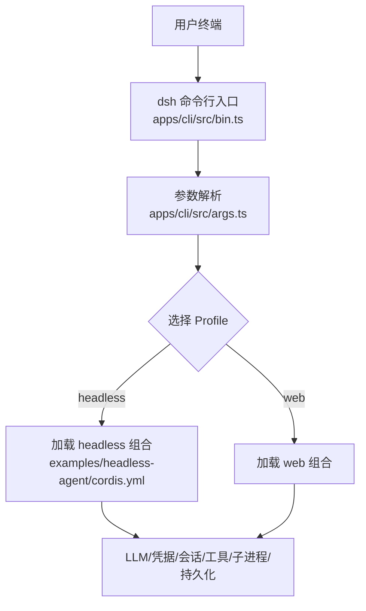
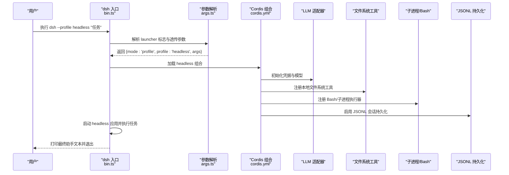
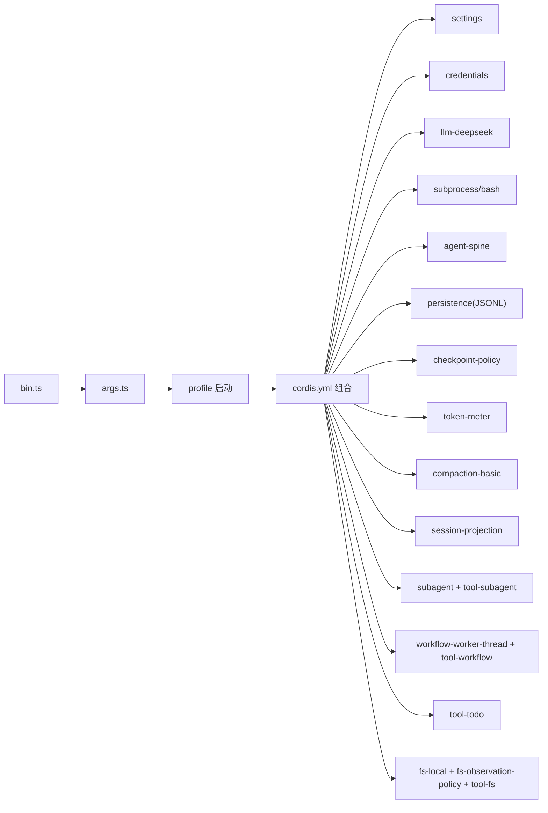

# 基础使用指南

<cite>
**本文引用的文件**
- [apps/cli/README.md](file://apps/cli/README.md)
- [apps/cli/src/bin.ts](file://apps/cli/src/bin.ts)
- [apps/cli/src/args.ts](file://apps/cli/src/args.ts)
- [examples/headless-agent/README.md](file://examples/headless-agent/README.md)
- [examples/headless-agent/cordis.yml](file://examples/headless-agent/cordis.yml)
- [examples/headless-agent/advanced.cordis.yml](file://examples/headless-agent/advanced.cordis.yml)
</cite>

## 目录
1. [简介](#简介)
2. [项目结构](#项目结构)
3. [核心组件](#核心组件)
4. [架构总览](#架构总览)
5. [详细组件分析](#详细组件分析)
6. [依赖关系分析](#依赖关系分析)
7. [性能注意事项](#性能注意事项)
8. [故障排除指南](#故障排除指南)
9. [结论](#结论)
10. [附录](#附录)

## 简介
本指南面向首次接触无头 Agent 的用户，聚焦“如何安装与配置无头模式、设置环境变量与 API Key、提交任务、处理输出结果”，并对比 Web 模式与 CLI 模式的差异与适用场景。文档基于仓库中的 CLI 入口与 headless 示例配置进行说明，确保每一步都有据可查。

## 项目结构
- dsh 命令行入口位于 apps/cli，负责解析参数、选择 profile（如 headless/web），并将剩余参数透传给被启动的应用。
- headless 示例位于 examples/headless-agent，提供一份可直接运行的 Cordis 组合配置，包含 LLM、文件系统、子进程、持久化、子代理、工作流等能力。
- advanced.cordis.yml 展示了如何在 headless 基础上叠加代码模式与更多工具。

图表来源
- [apps/cli/src/bin.ts:1-54](file://apps/cli/src/bin.ts#L1-L54)
- [apps/cli/src/args.ts:105-192](file://apps/cli/src/args.ts#L105-L192)
- [examples/headless-agent/cordis.yml:1-166](file://examples/headless-agent/cordis.yml#L1-L166)

章节来源
- [apps/cli/README.md:1-48](file://apps/cli/README.md#L1-L48)
- [apps/cli/src/bin.ts:1-54](file://apps/cli/src/bin.ts#L1-L54)
- [apps/cli/src/args.ts:1-192](file://apps/cli/src/args.ts#L1-L192)
- [examples/headless-agent/README.md:1-33](file://examples/headless-agent/README.md#L1-L33)

## 核心组件
- 命令行入口与参数解析：dsh 命令仅解析自身标志，将后续参数原样交给被启动的 profile 应用。
- Headless 组合：通过 Cordis 配置文件声明式装配 LLM、凭据、文件系统、子进程、持久化、子代理与工作流等模块。
- 运行方式：以 dsh --profile headless "任务" 的形式一次性创建会话、执行任务、输出最终答案并退出。

章节来源
- [apps/cli/README.md:7-43](file://apps/cli/README.md#L7-L43)
- [apps/cli/src/args.ts:18-103](file://apps/cli/src/args.ts#L18-L103)
- [examples/headless-agent/README.md:7-18](file://examples/headless-agent/README.md#L7-L18)

## 架构总览
下图展示从命令行到 headless 执行的端到端流程，包括环境加载、参数路由、Cordis 组合装配与关键服务。

图表来源
- [apps/cli/src/bin.ts:27-49](file://apps/cli/src/bin.ts#L27-L49)
- [apps/cli/src/args.ts:112-192](file://apps/cli/src/args.ts#L112-L192)
- [examples/headless-agent/cordis.yml:1-166](file://examples/headless-agent/cordis.yml#L1-L166)

## 详细组件分析

### 命令行与 Profile 启动
- dsh 支持三种模式：profile、plugin、dump-config。其中 profile 用于启动指定 profile（如 headless/web）。
- 所有非 dsh 自身标志的参数会透传给被启动的应用，由应用插件自行解析。
- 可通过 --dump-config 或 --dump-default-config 在不启动应用的情况下查看组合树。

章节来源
- [apps/cli/README.md:7-43](file://apps/cli/README.md#L7-L43)
- [apps/cli/src/args.ts:18-103](file://apps/cli/src/args.ts#L18-L103)
- [apps/cli/src/bin.ts:27-49](file://apps/cli/src/bin.ts#L27-L49)

### Headless 组合与首次运行
- 在 examples/headless-agent 目录下，通过 dsh --profile headless "任务" 即可运行一次无头会话。
- 该组合装配了：
  - 设置与凭据读取（支持热重载）
  - DeepSeek LLM 适配器（含 thinking/reasoningEffort 与模型上下文窗口）
  - 本地 Bash/子进程执行器
  - JSONL 会话持久化（默认压缩策略受环境变量控制）
  - 子代理与工作流能力
  - 本地文件系统工具与观察策略
- 首次运行会自动初始化 shipped 模板（web/headless），其他 profile 需通过 dsh plugin 管理。

章节来源
- [examples/headless-agent/README.md:7-18](file://examples/headless-agent/README.md#L7-L18)
- [examples/headless-agent/cordis.yml:1-166](file://examples/headless-agent/cordis.yml#L1-L166)
- [apps/cli/README.md:16-17](file://apps/cli/README.md#L16-L17)

### 环境变量与 API Key 配置
- 推荐在项目根目录放置 .env（gitignore 中），或在进程环境中导出以下变量：
  - DEEPSEEK_API_KEY：用于 LLM 认证
  - DEEPSEEK_BASE_URL：可选，覆盖默认 API 地址
  - DSH_SNAPSHOT：控制会话快照压缩策略（未定义时默认压缩；设置为特定值可关闭压缩）
- 凭据会在每次请求时通过凭据提供者解析，避免在配置文件中硬编码密钥。

章节来源
- [examples/headless-agent/README.md:9-14](file://examples/headless-agent/README.md#L9-L14)
- [examples/headless-agent/cordis.yml:6-17](file://examples/headless-agent/cordis.yml#L6-L17)
- [examples/headless-agent/cordis.yml:63-68](file://examples/headless-agent/cordis.yml#L63-L68)

### 基本命令与任务提交
- 一次性任务：dsh --profile headless "你的任务描述"
- 查看组合树（不启动应用）：dsh --profile headless --dump-config 或 --dump-default-config
- 管理 profile 插件：dsh plugin --profile <name> <pnpm 参数>

章节来源
- [apps/cli/README.md:7-43](file://apps/cli/README.md#L7-L43)
- [apps/cli/src/args.ts:63-103](file://apps/cli/src/args.ts#L63-L103)

### 输出结果处理
- Headless 模式会创建并持久化一个全新会话，打印最终助手文本后退出。
- 会话数据默认以 JSONL 格式保存在 .sessions 目录，压缩策略可由环境变量控制。
- 测试驱动会输出标准事件流（JSONL），但这是测试基础设施，并非官方 CLI 输出格式。

章节来源
- [examples/headless-agent/README.md:15-18](file://examples/headless-agent/README.md#L15-L18)
- [examples/headless-agent/cordis.yml:63-68](file://examples/headless-agent/cordis.yml#L63-L68)

### 高级配置（代码模式与 Cordis 工具）
- 通过 advanced.cordis.yml 可在 headless 基础上叠加代码模式与 Cordis 工具，并调整 agent 模型与工作目录等。
- 适用于需要更强代码能力与调试能力的场景。

章节来源
- [examples/headless-agent/README.md:30-33](file://examples/headless-agent/README.md#L30-L33)
- [examples/headless-agent/advanced.cordis.yml:1-35](file://examples/headless-agent/advanced.cordis.yml#L1-L35)

### 与 Web 模式和 CLI 模式的区别
- Web 模式：适合交互式对话、可视化调试与多轮协作，适合人机协同场景。
- Headless 模式：适合自动化流水线、批处理任务与脚本集成，一次性任务完成后自动退出。
- CLI 模式（此处指 dsh 作为统一入口）：统一管理不同 profile 的启动与参数传递，屏蔽底层差异。

章节来源
- [apps/cli/README.md:7-17](file://apps/cli/README.md#L7-L17)
- [examples/headless-agent/README.md:15-18](file://examples/headless-agent/README.md#L15-L18)

## 依赖关系分析
- dsh 入口依赖参数解析模块，按 mode 动态导入对应 runner。
- headless 组合依赖多个内置插件：设置、凭据、LLM、子进程、Bash、Agent Spine、持久化、检查点策略、令牌计量、压缩、会话投影、子代理、工作流、TODO、文件系统工具等。
- 这些插件通过 Cordis 组合顺序装配，形成完整的无头执行环境。

图表来源
- [apps/cli/src/bin.ts:27-49](file://apps/cli/src/bin.ts#L27-L49)
- [apps/cli/src/args.ts:112-192](file://apps/cli/src/args.ts#L112-L192)
- [examples/headless-agent/cordis.yml:1-166](file://examples/headless-agent/cordis.yml#L1-L166)

章节来源
- [examples/headless-agent/cordis.yml:1-166](file://examples/headless-agent/cordis.yml#L1-L166)

## 性能注意事项
- 会话压缩：默认启用 zstd 压缩，可通过环境变量关闭以提升 I/O 开销换取可读性。
- 上下文窗口：模型上下文窗口较大（例如 128000），注意历史长度与压缩阈值对性能的影响。
- Bash 超时：Bash 执行器默认超时时间可配置，避免长时间阻塞。
- 令牌计量与压缩：开启 token meter 与 compaction 有助于控制长会话的资源消耗。

章节来源
- [examples/headless-agent/cordis.yml:23-33](file://examples/headless-agent/cordis.yml#L23-L33)
- [examples/headless-agent/cordis.yml:35-42](file://examples/headless-agent/cordis.yml#L35-L42)
- [examples/headless-agent/cordis.yml:63-83](file://examples/headless-agent/cordis.yml#L63-L83)

## 故障排除指南
- 缺少 API Key：确保已设置 DEEPSEEK_API_KEY，或通过凭据提供者注入。
- 无法访问 API：如需自定义地址，设置 DEEPSEEK_BASE_URL。
- 会话日志过大：调整 DSH_SNAPSHOT 关闭压缩或调小压缩阈值；检查 compaction 配置。
- Bash 执行超时：调整 bash 超时配置或优化任务复杂度。
- 参数错误：确认 dsh 自身标志与透传参数的位置正确；使用 --help 查看各模式帮助。

章节来源
- [examples/headless-agent/README.md:9-14](file://examples/headless-agent/README.md#L9-L14)
- [examples/headless-agent/cordis.yml:35-42](file://examples/headless-agent/cordis.yml#L35-L42)
- [examples/headless-agent/cordis.yml:63-83](file://examples/headless-agent/cordis.yml#L63-L83)
- [apps/cli/src/args.ts:112-192](file://apps/cli/src/args.ts#L112-L192)

## 结论
通过 dsh --profile headless，你可以快速启动一个具备 LLM、文件系统、子进程、持久化与子代理能力的无头 Agent，完成一次性任务并自动退出。结合环境变量与 Cordis 组合，可以灵活定制行为与性能。对于需要交互的场景，可选择 Web 模式；对于自动化与集成，Headless 是更合适的选择。

## 附录

### 常用命令速查
- 一次性任务：dsh --profile headless "修复工作区中失败的测试"
- 查看组合树：dsh --profile headless --dump-config
- 仅查看默认层：dsh --profile headless --dump-default-config
- 管理插件：dsh plugin --profile <name> add/remove/why <package>

章节来源
- [examples/headless-agent/README.md:9-14](file://examples/headless-agent/README.md#L9-L14)
- [apps/cli/README.md:18-43](file://apps/cli/README.md#L18-L43)
- [apps/cli/src/args.ts:63-103](file://apps/cli/src/args.ts#L63-L103)