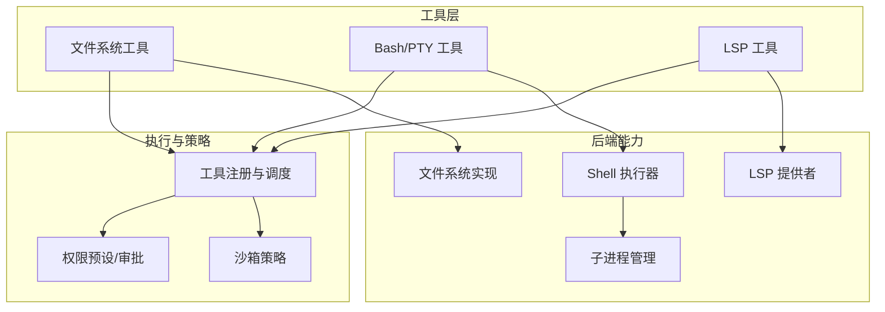
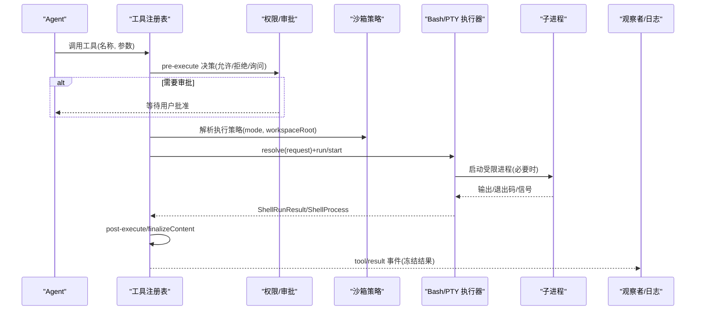
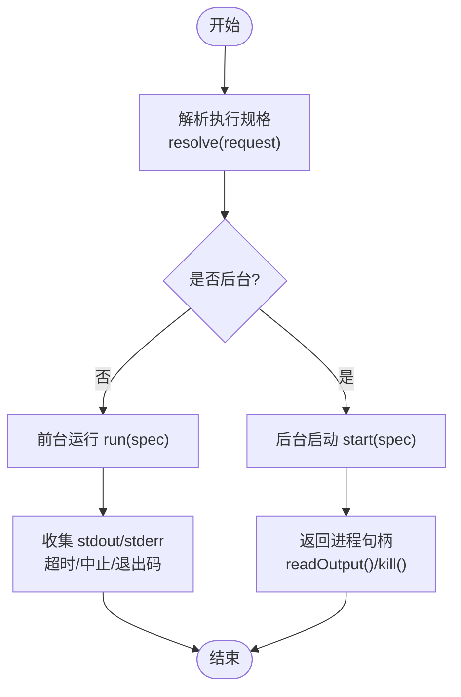
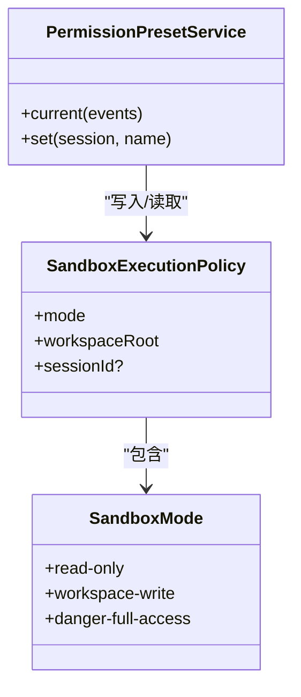
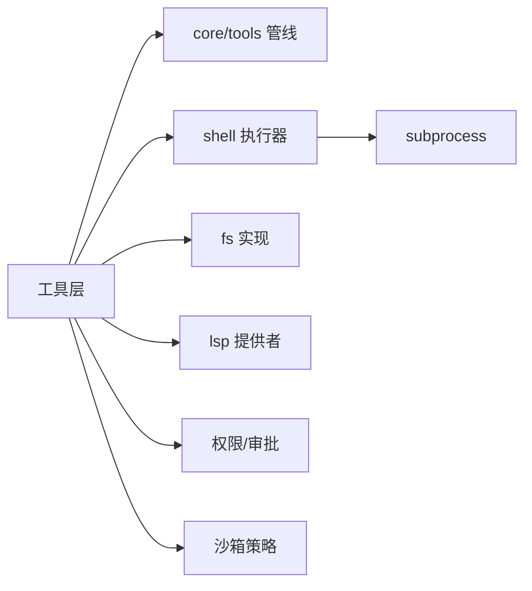

# 工具集成

<cite>
**本文引用的文件**
- [docs/subsystems/tools.md](file://docs/subsystems/tools.md)
- [docs/tool-catalog.md](file://docs/tool-catalog.md)
- [docs/subsystems/shell.md](file://docs/subsystems/shell.md)
- [docs/subsystems/lsp.md](file://docs/subsystems/lsp.md)
- [docs/subsystems/sandbox.md](file://docs/subsystems/sandbox.md)
- [docs/subsystems/permission-presets.md](file://docs/subsystems/permission-presets.md)
- [examples/headless-agent/cordis.yml](file://examples/headless-agent/cordis.yml)
- [examples/headless-agent/e2b.cordis.yml](file://examples/headless-agent/e2b.cordis.yml)
</cite>

## 目录
1. [简介](#简介)
2. [项目结构](#项目结构)
3. [核心组件](#核心组件)
4. [架构总览](#架构总览)
5. [详细组件分析](#详细组件分析)
6. [依赖关系分析](#依赖关系分析)
7. [性能与优化](#性能与优化)
8. [故障排查指南](#故障排查指南)
9. [结论](#结论)
10. [附录：E2B 沙箱配置示例](#附录e2b-沙箱配置示例)

## 简介
本文件面向“无头 Agent”场景，系统性说明如何启用和配置内置工具（文件系统、Bash、PTY、LSP 等），并覆盖权限控制、安全沙箱、执行环境隔离、自定义工具集成、工具链组合、调用优化、调试与监控、错误处理，以及 E2B 沙箱环境的工具配置示例。文档基于仓库中的子系统文档与示例配置进行提炼，确保与实际实现一致。

## 项目结构
- 工具注册与执行管线定义在 core/tools 子系统，提供 ToolDefinition、ToolExecution、工具水线（pre-execute / execute / post-execute / result）与 UI 呈现契约。
- Bash/PTY 通过 shell 子系统暴露统一执行接口，支持前台/后台进程、输出截断与转储、超时与中止信号。
- LSP 作为可选能力，提供语义导航（跳转定义/引用/实现、悬停）的标准化查询。
- 沙箱子系统提供进程级文件访问策略（只读、工作区写入、危险全开放），并与 Shell/FS 工具联动。
- 权限预设将“沙箱模式 + 审批策略”打包为可切换的安全等级。
- 示例 headless-agent 展示了最小可用的工具装配；e2b.cordis.yml 展示了将 FS/子进程迁移到 E2B 短生命周期沙箱的叠加方式。

图表来源
- [docs/subsystems/tools.md:10-152](file://docs/subsystems/tools.md#L10-L152)
- [docs/subsystems/shell.md:9-104](file://docs/subsystems/shell.md#L9-L104)
- [docs/subsystems/lsp.md:9-163](file://docs/subsystems/lsp.md#L9-L163)
- [docs/subsystems/sandbox.md:9-94](file://docs/subsystems/sandbox.md#L9-L94)

章节来源
- [docs/subsystems/tools.md:10-152](file://docs/subsystems/tools.md#L10-L152)
- [docs/tool-catalog.md:16-41](file://docs/tool-catalog.md#L16-L41)

## 核心组件
- 工具注册与执行管线
  - 每个工具以 ToolDefinition 注册，包含模型可见的 schema、输出契约、execute 函数、可选 finalizeContent/presentCall/presentResult、timeoutMs、并发安全标记等。
  - 执行管线顺序：tools/pre-execute → 守卫 → tools/execute（可替换 signal）→ tools/post-execute → finalizeContent → tools/result。
  - 结果分为成功/失败，携带 content/value/meta/additionalContexts 等；最终结果被冻结并持久化。
- Bash/PTY 执行
  - 统一抽象 ShellExecutor：resolve(request) → run/start；支持超时、stdoutMaxBytes、stdin、env、dshEnv、sandboxPolicy。
  - 前台返回 ShellRunResult（exitCode/signal/timedOut/aborted/timeoutMs/stdout/stderr/sandbox）。
  - 后台返回 ShellProcess（status/exitCode/signal/done/readOutput/kill），readOutput 增量读取并报告溢出与转储路径。
- LSP 导航
  - 四元操作：goToDefinition/findReferences/goToImplementation/hover；坐标采用零基 UTF-16。
  - 请求需 workspaceRoot、filePath、position；结果统一为 locations 或 hover。
  - 通过 ctx.lsp 注册 provider（如 stdio 语言服务器），按扩展名选择 provider 执行查询。
- 沙箱与权限
  - 沙箱模式：read-only | workspace-write | danger-full-access；仅前两者可下发给 provider。
  - 每调用解析 SandboxExecutionPolicy（mode/workspaceRoot/sessionId），由 ctx.sandboxPolicy.resolve() 决定。
  - 权限预设将 sandbox/mode 与 approval/policy 打包为可切换项，默认包含 workspace-write+ask 与 danger-full-access+never。

章节来源
- [docs/subsystems/tools.md:10-152](file://docs/subsystems/tools.md#L10-L152)
- [docs/subsystems/tools.md:170-405](file://docs/subsystems/tools.md#L170-L405)
- [docs/subsystems/shell.md:9-104](file://docs/subsystems/shell.md#L9-L104)
- [docs/subsystems/shell.md:105-221](file://docs/subsystems/shell.md#L105-L221)
- [docs/subsystems/lsp.md:9-163](file://docs/subsystems/lsp.md#L9-L163)
- [docs/subsystems/sandbox.md:9-94](file://docs/subsystems/sandbox.md#L9-L94)
- [docs/subsystems/permission-presets.md:9-68](file://docs/subsystems/permission-presets.md#L9-L68)

## 架构总览
下图展示一次工具调用的端到端流程，涵盖权限、沙箱、执行与结果回传。

图表来源
- [docs/subsystems/tools.md:170-405](file://docs/subsystems/tools.md#L170-L405)
- [docs/subsystems/shell.md:105-221](file://docs/subsystems/shell.md#L105-L221)
- [docs/subsystems/sandbox.md:41-94](file://docs/subsystems/sandbox.md#L41-L94)

## 详细组件分析

### 文件系统工具（read/write/edit/read_image/glob/grep）
- 能力与约束
  - read/write/edit 通过文件系统后端读写文本；read_image 仅在模型支持图像输入时可用。
  - glob/grep 使用子进程调用 ripgrep，不经过 shell，避免宿主 rg 依赖。
  - 写/编辑前会触发“先读后写”观察策略，便于审计与提示。
- 安全与沙箱
  - 写操作受沙箱策略限制；workspace-write 允许在工作区根下写入；read-only 禁止写入。
  - 若被拒绝，工具结果会包含沙箱拒绝信息，不应重试绕过。
- 典型用法
  - 读取大文件时使用 offset/limit；编辑时使用精确 old_string/new_string；搜索使用 glob/grep 限定范围。

章节来源
- [docs/tool-catalog.md:599-774](file://docs/tool-catalog.md#L599-L774)
- [docs/subsystems/sandbox.md:41-94](file://docs/subsystems/sandbox.md#L41-L94)

### Bash/PTY 工具（bash/pwsh/terminal）
- 能力与行为
  - bash/pwsh 每次调用在新进程中执行，不保留状态；支持 workdir、timeoutMs、run_in_background。
  - terminal_* 提供持久终端会话的生命周期管理（open/close/send/read/signal/list）。
  - 长输出会被截断并保存至转储文件，结果中给出路径以便后续读取。
- 执行与环境
  - 通过 ctx.shell.resolve(request) 生成 ShellExecSpec，合并 env、dshEnv、sandboxPolicy。
  - 前台运行返回 ShellRunResult；后台运行返回 ShellProcess，支持 kill 与增量读取。
- 沙箱与权限
  - 可通过沙箱策略限制文件访问；被拒绝时会返回明确的拒绝标记。
  - 背景任务通过通用 jobs 运行时管理，支持 job_list/job_output/job_kill。

图表来源
- [docs/subsystems/shell.md:13-104](file://docs/subsystems/shell.md#L13-L104)
- [docs/subsystems/shell.md:105-221](file://docs/subsystems/shell.md#L105-L221)

章节来源
- [docs/tool-catalog.md:176-263](file://docs/tool-catalog.md#L176-L263)
- [docs/subsystems/shell.md:13-104](file://docs/subsystems/shell.md#L13-L104)
- [docs/subsystems/shell.md:105-221](file://docs/subsystems/shell.md#L105-L221)

### LSP 工具（lsp）
- 能力与操作
  - 提供 goToDefinition/findReferences/goToImplementation/hover 四类语义查询。
  - 坐标为零基 UTF-16；结果统一为 locations 或 hover。
- 提供者与选择
  - 通过 ctx.lsp.registerProvider 注册 provider（如 stdio 语言服务器），按扩展名选择。
  - 未找到匹配 provider 时返回 LSP_UNAVAILABLE。
- 使用建议
  - 始终传入 workspaceRoot；对大型代码库建议限制结果数量与超时。

章节来源
- [docs/tool-catalog.md:31-31](file://docs/tool-catalog.md#L31-L31)
- [docs/subsystems/lsp.md:9-163](file://docs/subsystems/lsp.md#L9-L163)

### 权限控制与安全沙箱
- 沙箱模式
  - read-only：仅允许必要写入（如 /dev/null）；workspace-write：允许工作区根及后端临时目录；danger-full-access：解除限制。
  - 仅前两种模式可下发给 provider；danger-full-access 直接跳过 ctx.sandbox。
- 策略解析
  - 每次调用通过 ctx.sandboxPolicy.resolve(session?, mode?) 解析出 SandboxExecutionPolicy（mode/workspaceRoot/sessionId）。
  - 工具层（bash/fs）消费该策略，决定是否限制文件访问。
- 权限预设
  - 将 sandbox/mode 与 approval/policy 打包为预设，支持一键切换；默认包含 workspace-write+ask 与 danger-full-access+never。
  - 切换会记录 permission/preset 事件，并写入对应 knob。

图表来源
- [docs/subsystems/sandbox.md:9-94](file://docs/subsystems/sandbox.md#L9-L94)
- [docs/subsystems/permission-presets.md:9-68](file://docs/subsystems/permission-presets.md#L9-L68)

章节来源
- [docs/subsystems/sandbox.md:9-94](file://docs/subsystems/sandbox.md#L9-L94)
- [docs/subsystems/permission-presets.md:9-68](file://docs/subsystems/permission-presets.md#L9-L68)

### 自定义工具集成与工具链组合
- 注册与执行
  - 通过 ctx.tools.register(definition) 注册工具；可在 scope 内覆盖全局工具。
  - 使用 defineTool 声明参数 schema、output schema、execute、可选 finalizeContent/presentCall/presentResult、timeoutMs、isConcurrencySafe。
- 工具链组合
  - 利用 tools/pre-execute 做准入/审计；tools/execute 包装超时/重试/指标；tools/post-execute 替换内容/值或阻断；tools/result 观测最终结果。
  - 结合 jobs 运行时将长时间运行的 bash/PTY/子代理转为后台任务，并通过 job_* 工具统一管理。
- 并发与并行
  - isConcurrencySafe 为 true 的工具可与兄弟调用并行；否则串行执行形成屏障。

章节来源
- [docs/subsystems/tools.md:10-152](file://docs/subsystems/tools.md#L10-L152)
- [docs/subsystems/tools.md:170-405](file://docs/subsystems/tools.md#L170-L405)
- [docs/tool-catalog.md:16-41](file://docs/tool-catalog.md#L16-L41)

### 工具调用优化
- 超时与中止
  - 为工具设置 timeoutMs；在 execute 中正确响应 exec.signal，确保可取消。
- 输出与内存
  - Bash/PTY 长输出自动截断并落盘；合理设置 stdoutMaxBytes 避免过大内存占用。
- 并行与批处理
  - 对幂等且无共享状态的调用开启 isConcurrencySafe；批量文件操作尽量合并以减少进程创建开销。
- 缓存与索引
  - LSP 查询前可先 glob 缩小范围；对重复查询考虑本地缓存结果。

[本节为通用指导，无需特定文件来源]

## 依赖关系分析
- 工具层依赖 core/tools 提供的注册与执行管线。
- Bash/PTY 依赖 shell 子系统与 subprocess 管理；FS 工具依赖文件系统实现与观察策略。
- LSP 工具依赖 ctx.lsp 与具体 provider（如 stdio 语言服务器）。
- 所有可能产生副作用的工具均受沙箱策略与权限预设约束。

图表来源
- [docs/subsystems/tools.md:10-152](file://docs/subsystems/tools.md#L10-L152)
- [docs/subsystems/shell.md:9-104](file://docs/subsystems/shell.md#L9-L104)
- [docs/subsystems/lsp.md:9-163](file://docs/subsystems/lsp.md#L9-L163)
- [docs/subsystems/sandbox.md:9-94](file://docs/subsystems/sandbox.md#L9-L94)

章节来源
- [docs/subsystems/tools.md:10-152](file://docs/subsystems/tools.md#L10-L152)
- [docs/subsystems/shell.md:9-104](file://docs/subsystems/shell.md#L9-L104)
- [docs/subsystems/lsp.md:9-163](file://docs/subsystems/lsp.md#L9-L163)
- [docs/subsystems/sandbox.md:9-94](file://docs/subsystems/sandbox.md#L9-L94)

## 性能与优化
- 减少不必要的进程创建：优先使用批量 API 或缓存结果。
- 合理设置超时与输出上限：避免阻塞与内存膨胀。
- 利用后台任务：对耗时操作使用 run_in_background 或 terminal_send(run_in_background)。
- 限制 LSP 查询范围：通过 workspaceRoot 与文件过滤减少索引扫描。
- 沙箱模式权衡：开发阶段可使用 workspace-write，生产严格使用 read-only 或最小权限。

[本节为通用指导，无需特定文件来源]

## 故障排查指南
- 常见错误与定位
  - 未知工具/不可用能力：检查工具是否已注册、provider 是否加载（如 LSP_UNAVAILABLE）。
  - 沙箱拒绝：查看结果中的沙箱拒绝标记与模式；必要时申请更宽权限并重试。
  - 超时/中止：确认 timeoutMs 与 exec.signal 的处理逻辑；检查后台任务是否被意外终止。
- 调试与观测
  - 订阅 tools/result 获取最终冻结结果；使用 tools/post-execute 替换内容用于审计。
  - Bash/PTY 输出截断时根据 spill 路径读取完整输出。
- 权限与审批
  - 使用权限预设快速切换安全等级；审批流程缺失时将 ask 降级为拒绝。

章节来源
- [docs/subsystems/tools.md:170-405](file://docs/subsystems/tools.md#L170-L405)
- [docs/subsystems/shell.md:105-221](file://docs/subsystems/shell.md#L105-L221)
- [docs/subsystems/lsp.md:114-163](file://docs/subsystems/lsp.md#L114-L163)
- [docs/subsystems/sandbox.md:152-157](file://docs/subsystems/sandbox.md#L152-L157)

## 结论
无头 Agent 的工具体系以 core/tools 为核心，围绕 Bash/PTY、文件系统、LSP 等能力，配合沙箱与权限预设，提供安全、可控、可扩展的执行环境。通过工具链组合与调用优化，可以在保证安全的前提下提升效率；借助完善的观测与错误处理机制，便于调试与运维。E2B 沙箱提供了将 FS/子进程迁移到短生命周期远程环境的方案，适合隔离执行与资源受限场景。

[本节为总结性内容，无需特定文件来源]

## 附录：E2B 沙箱配置示例
- 目标：将文件系统与子进程能力迁移到 E2B 短生命周期沙箱，同时保留 Bash/PTY/LSP 等上层工具。
- 关键要点
  - 禁用本地 fs-local 与 subprocess-local，注入 e2b、subprocess-e2b、fs-e2b。
  - 配置 sandbox-policy 的 mode 与 workspaceRoot，确保与 e2b.cwd 指向同一远程目录。
  - 挂载 PTY 与 LSP 提供者（如 typescript-language-server）。
- 参考配置位置
  - 基础 headless 配置：examples/headless-agent/cordis.yml
  - E2B 叠加配置：examples/headless-agent/e2b.cordis.yml

章节来源
- [examples/headless-agent/cordis.yml:34-166](file://examples/headless-agent/cordis.yml#L34-L166)
- [examples/headless-agent/e2b.cordis.yml:1-58](file://examples/headless-agent/e2b.cordis.yml#L1-L58)