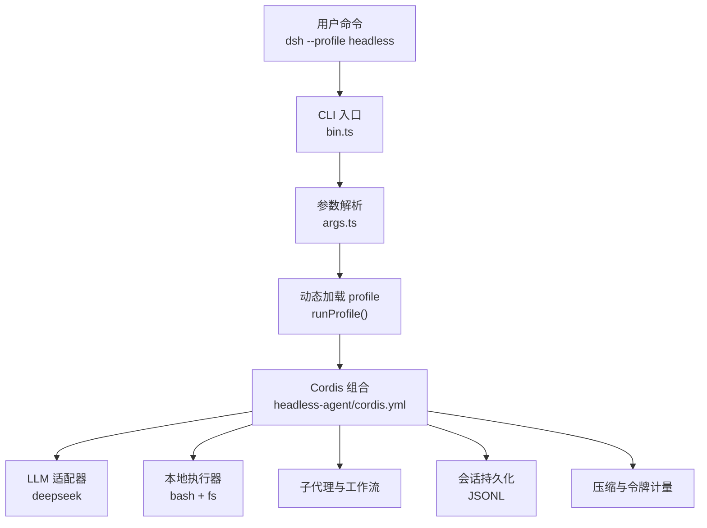
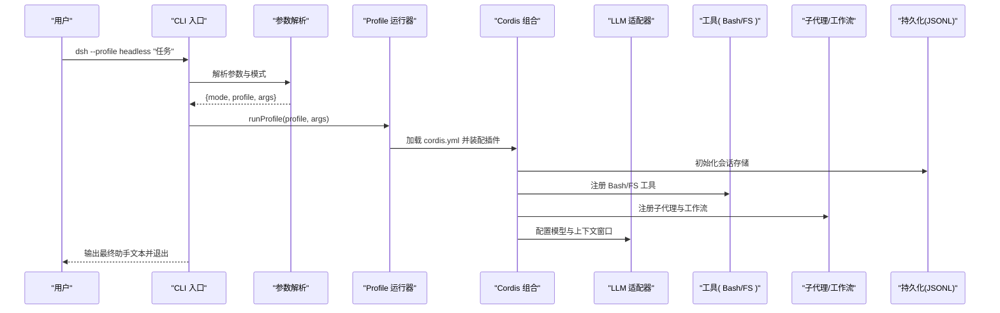
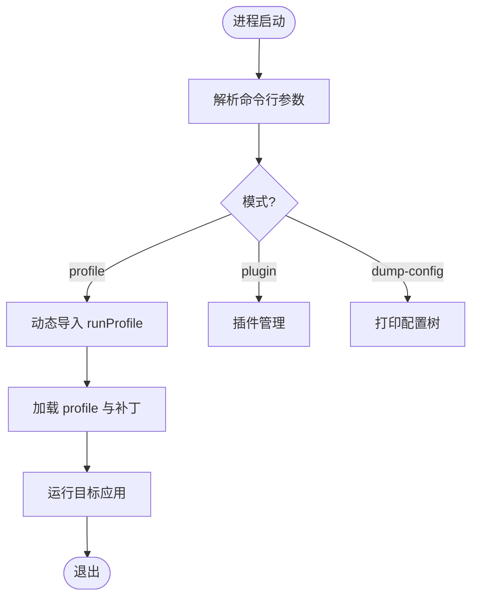
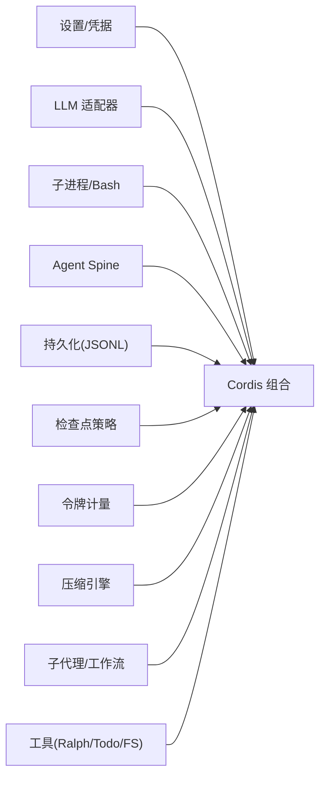
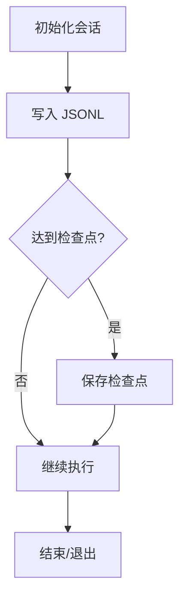
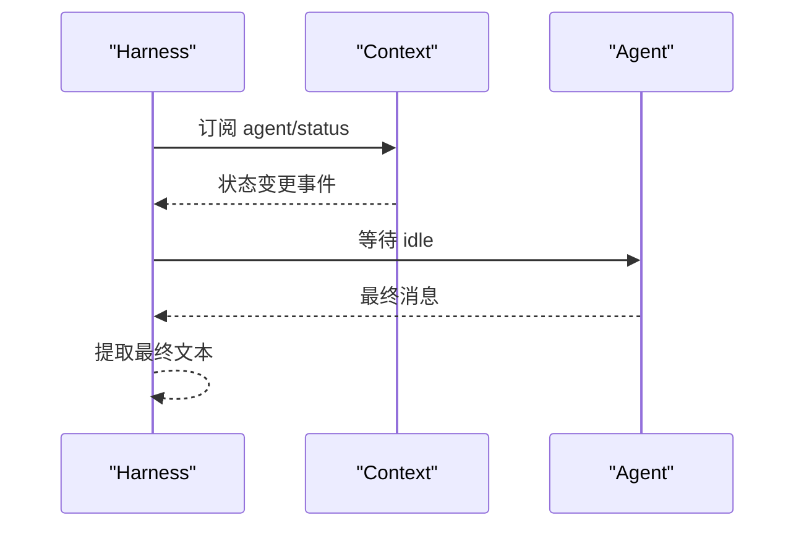
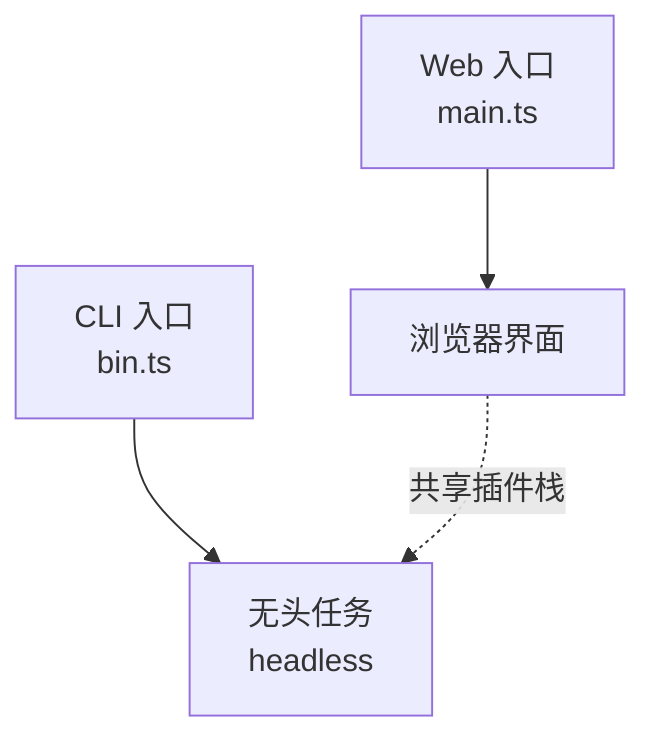
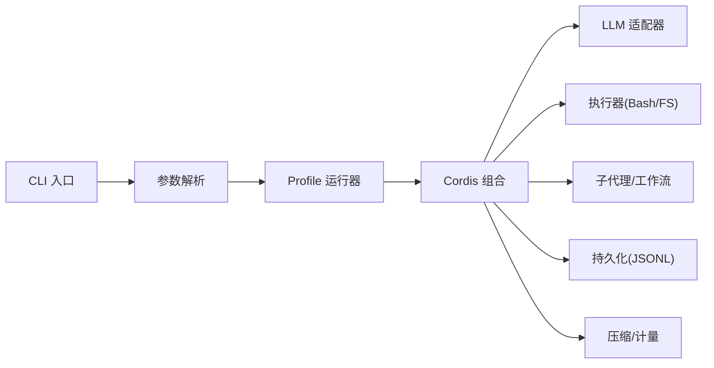

# 无头 Agent 示例

<cite>
**本文引用的文件**
- [examples/headless-agent/README.md](file://examples/headless-agent/README.md)
- [examples/headless-agent/cordis.yml](file://examples/headless-agent/cordis.yml)
- [apps/cli/src/bin.ts](file://apps/cli/src/bin.ts)
- [apps/cli/src/args.ts](file://apps/cli/src/args.ts)
- [examples/headless-agent/tests/harness.ts](file://examples/headless-agent/tests/harness.ts)
- [apps/web/src/main.ts](file://apps/web/src/main.ts)
</cite>

## 目录
1. [简介](#简介)
2. [项目结构](#项目结构)
3. [核心组件](#核心组件)
4. [架构总览](#架构总览)
5. [详细组件分析](#详细组件分析)
6. [依赖关系分析](#依赖关系分析)
7. [性能与资源管理](#性能与资源管理)
8. [故障恢复与可观测性](#故障恢复与可观测性)
9. [部署指南与运维建议](#部署指南与运维建议)
10. [结论](#结论)

## 简介
本文件面向在服务器环境中以“无头模式”运行智能体的完整方案，围绕启动流程、配置管理、会话持久化、监控日志等关键特性展开，并结合 Web 模式与 CLI 模式的对比，给出在不同部署环境下的最佳实践。内容基于仓库中的 headless-agent 示例、CLI 入口、Web 入口以及测试 harness 的源码与配置进行梳理，确保读者能够在生产环境中可靠地部署和运维无头 Agent。

## 项目结构
- 无头 Agent 示例位于 examples/headless-agent，提供一份最小但完整的 Cordis 组合配置，包含 LLM 适配器、本地 Bash/文件系统工具、子代理、工作流、持久化、压缩策略等。
- CLI 入口 apps/cli 负责解析命令行参数并动态加载不同模式（profile、plugin、dump-config），将参数透传给被启动的应用。
- Web 入口 apps/web 仅做最薄引导，实际装配由客户端库完成。
- 测试 harness 展示了如何在代码中组装与无头示例一致的插件栈，便于验证与回归。

图表来源
- [apps/cli/src/bin.ts:1-54](file://apps/cli/src/bin.ts#L1-L54)
- [apps/cli/src/args.ts:1-192](file://apps/cli/src/args.ts#L1-L192)
- [examples/headless-agent/cordis.yml:1-166](file://examples/headless-agent/cordis.yml#L1-L166)

章节来源
- [examples/headless-agent/README.md:1-33](file://examples/headless-agent/README.md#L1-L33)
- [apps/cli/src/bin.ts:1-54](file://apps/cli/src/bin.ts#L1-L54)
- [apps/cli/src/args.ts:1-192](file://apps/cli/src/args.ts#L1-L192)
- [examples/headless-agent/cordis.yml:1-166](file://examples/headless-agent/cordis.yml#L1-L166)

## 核心组件
- 启动与参数：CLI 通过动态导入按模式加载逻辑，避免无关模块进入调用路径；支持 --profile、--patch、--dump-config 等选项，并将剩余参数透传给被启动应用。
- 配置组合：headless-agent 使用 Cordis 配置文件声明式组合各插件，包括设置、凭据、LLM、子进程、Bash、Agent Spine、持久化、检查点策略、令牌计量、压缩、子代理、工作流、Ralph、Todo、FS 工具等。
- 会话持久化：默认 JSONL 持久化到 .sessions，支持压缩策略选择；配合检查点策略实现断点续跑与恢复。
- 监控与可观测性：测试 harness 暴露事件流与最终文本提取能力，便于集成日志与遥测。

章节来源
- [apps/cli/src/bin.ts:1-54](file://apps/cli/src/bin.ts#L1-L54)
- [apps/cli/src/args.ts:1-192](file://apps/cli/src/args.ts#L1-L192)
- [examples/headless-agent/cordis.yml:1-166](file://examples/headless-agent/cordis.yml#L1-L166)
- [examples/headless-agent/tests/harness.ts:1-105](file://examples/headless-agent/tests/harness.ts#L1-L105)

## 架构总览
无头 Agent 的运行时由 CLI 驱动，动态加载指定 profile，随后由 Cordis 组合出完整的插件栈。LLM 请求经适配器发出，工具调用通过本地 Bash/FS 或沙箱执行，子代理与工作流用于任务分解与编排，会话状态通过 JSONL 持久化并可压缩，检查点策略保障中断恢复。

图表来源
- [apps/cli/src/bin.ts:1-54](file://apps/cli/src/bin.ts#L1-L54)
- [apps/cli/src/args.ts:1-192](file://apps/cli/src/args.ts#L1-L192)
- [examples/headless-agent/cordis.yml:1-166](file://examples/headless-agent/cordis.yml#L1-L166)

## 详细组件分析

### 启动流程（CLI 到 Profile）
- CLI 入口根据命令行模式动态导入对应运行器，避免无关依赖污染。
- 参数解析器负责识别 launcher 自身标志，并将剩余参数原样传递给被启动应用。
- 对于 headless 场景，使用 --profile headless 启动一次性任务，创建并持久化会话，打印最终结果后退出。

图表来源
- [apps/cli/src/bin.ts:1-54](file://apps/cli/src/bin.ts#L1-L54)
- [apps/cli/src/args.ts:1-192](file://apps/cli/src/args.ts#L1-L192)

章节来源
- [apps/cli/src/bin.ts:1-54](file://apps/cli/src/bin.ts#L1-L54)
- [apps/cli/src/args.ts:1-192](file://apps/cli/src/args.ts#L1-L192)

### 配置管理（Cordis 组合）
- 设置与凭据：从用户设置文档与本地凭据文件中热重载，避免硬编码密钥。
- LLM：DeepSeek 适配器，支持 thinking 与 reasoningEffort，模型列表含上下文窗口配置。
- 执行环境：本地子进程与 Bash 执行器，带超时控制。
- Agent Spine：预创建主 Agent，注入系统提示与工作区上下文限制。
- 持久化与检查点：JSONL 会话存储，可选压缩；检查点策略用于恢复。
- 令牌计量与压缩：接近上下文窗口时触发摘要压缩，降低开销。
- 子代理与工作流：spawn/fork 两种后端，支持后台可继续任务与一次性分支。
- 工具链：Ralph、Todo、FS 工具，FS 观察策略保证写入需受控。

图表来源
- [examples/headless-agent/cordis.yml:1-166](file://examples/headless-agent/cordis.yml#L1-L166)

章节来源
- [examples/headless-agent/cordis.yml:1-166](file://examples/headless-agent/cordis.yml#L1-L166)

### 会话持久化与恢复
- 默认根目录为 .sessions，压缩策略可通过环境变量切换。
- 检查点策略与持久化结合，支持中断后恢复。
- 测试 harness 演示了如何按需挂载持久化与检查点，并在需要时启用压缩。

图表来源
- [examples/headless-agent/cordis.yml:63-82](file://examples/headless-agent/cordis.yml#L63-L82)
- [examples/headless-agent/tests/harness.ts:76-82](file://examples/headless-agent/tests/harness.ts#L76-L82)

章节来源
- [examples/headless-agent/cordis.yml:63-82](file://examples/headless-agent/cordis.yml#L63-L82)
- [examples/headless-agent/tests/harness.ts:76-82](file://examples/headless-agent/tests/harness.ts#L76-L82)

### 监控与日志
- 测试 harness 提供事件流与最终文本提取能力，可用于集成日志与遥测。
- 通过监听 agent/status 等事件，可在无头模式下实现进度与状态上报。

图表来源
- [examples/headless-agent/tests/harness.ts:86-105](file://examples/headless-agent/tests/harness.ts#L86-L105)

章节来源
- [examples/headless-agent/tests/harness.ts:86-105](file://examples/headless-agent/tests/harness.ts#L86-L105)

### 与 Web 模式和 CLI 模式的对比
- Web 模式：入口极薄，主要职责是找到挂载点并运行前端应用；适合交互式调试与可视化操作。
- CLI 模式：无头模式适合服务器端自动化任务，一次性执行、输出结果并退出；易于集成到流水线与调度系统。
- 配置与能力：两者共享底层插件与组合机制，差异主要体现在入口与交互方式。

图表来源
- [apps/web/src/main.ts:1-11](file://apps/web/src/main.ts#L1-L11)
- [apps/cli/src/bin.ts:1-54](file://apps/cli/src/bin.ts#L1-L54)

章节来源
- [apps/web/src/main.ts:1-11](file://apps/web/src/main.ts#L1-L11)
- [apps/cli/src/bin.ts:1-54](file://apps/cli/src/bin.ts#L1-L54)

## 依赖关系分析
- CLI 层依赖参数解析与动态导入，避免无关模块进入调用路径。
- Cordis 组合层依赖多个插件：设置、凭据、LLM、子进程、Bash、Agent Spine、持久化、检查点、令牌计量、压缩、子代理、工作流、工具。
- 测试 harness 复用相同插件栈，确保行为一致性与可回归性。

图表来源
- [apps/cli/src/bin.ts:1-54](file://apps/cli/src/bin.ts#L1-L54)
- [apps/cli/src/args.ts:1-192](file://apps/cli/src/args.ts#L1-L192)
- [examples/headless-agent/cordis.yml:1-166](file://examples/headless-agent/cordis.yml#L1-L166)

章节来源
- [apps/cli/src/bin.ts:1-54](file://apps/cli/src/bin.ts#L1-L54)
- [apps/cli/src/args.ts:1-192](file://apps/cli/src/args.ts#L1-L192)
- [examples/headless-agent/cordis.yml:1-166](file://examples/headless-agent/cordis.yml#L1-L166)

## 性能与资源管理
- 上下文窗口与压缩：通过令牌计量与压缩引擎，在历史接近上下文窗口时触发摘要，减少后续请求成本。
- 子进程与 Bash 超时：为 Bash 执行器设置超时，防止长时间阻塞。
- 工作区上下文限制：限制工作区上下文大小，避免过大输入影响性能。
- 子代理深度与后台模式：合理设置最大深度与后台模式，平衡并发与资源占用。

章节来源
- [examples/headless-agent/cordis.yml:55-82](file://examples/headless-agent/cordis.yml#L55-L82)
- [examples/headless-agent/cordis.yml:113-139](file://examples/headless-agent/cordis.yml#L113-L139)

## 故障恢复与可观测性
- 持久化与检查点：JSONL 持久化与检查点策略支持中断恢复，确保任务可续跑。
- 事件与日志：通过 harness 的事件订阅与最终文本提取，可实现进度上报与结果采集。
- 错误处理：CLI 参数解析对非法输入进行校验并快速失败，避免无效启动。

章节来源
- [examples/headless-agent/cordis.yml:63-82](file://examples/headless-agent/cordis.yml#L63-L82)
- [examples/headless-agent/tests/harness.ts:86-105](file://examples/headless-agent/tests/harness.ts#L86-L105)
- [apps/cli/src/args.ts:112-192](file://apps/cli/src/args.ts#L112-L192)

## 部署指南与运维建议
- 环境变量与凭据：
  - 在仓库根目录的 .env 中设置 DEEPSEEK_API_KEY（可选 DEEPSEEK_BASE_URL）。
  - 凭据通过本地凭据文件热重载，无需重启服务。
- 启动命令：
  - 使用 dsh --profile headless 并传入一个非空任务，创建并持久化会话，输出最终助手文本后退出。
- 沙箱覆盖（可选）：
  - 使用 e2b.cordis.yml 将本地 FS 与子进程替换为共享沙箱，适用于隔离执行与最终清理。
- 高级配置：
  - advanced.cordis.yml 可添加 Code Mode 与 Cordis 工具，增强能力。
- 运维建议：
  - 监控会话目录 .sessions 的大小与压缩策略，定期归档。
  - 设置合理的 Bash 超时与子代理深度，避免资源耗尽。
  - 结合事件与日志系统进行告警与审计。

章节来源
- [examples/headless-agent/README.md:7-33](file://examples/headless-agent/README.md#L7-L33)
- [examples/headless-agent/cordis.yml:1-166](file://examples/headless-agent/cordis.yml#L1-L166)

## 结论
无头 Agent 示例提供了在服务器环境中运行智能体的完整方案：通过 CLI 动态加载 profile，使用 Cordis 组合插件栈，实现 LLM 调用、工具执行、子代理与工作流、会话持久化与压缩、检查点恢复等关键能力。相比 Web 模式，无头模式更适合自动化与批处理；相比纯 CLI 脚本，它具备更强的可配置性与可扩展性。在生产环境中，建议结合环境变量与凭据管理、设置合理的超时与资源限制、启用持久化与检查点，并集成监控与日志系统，以实现稳定可靠的部署与运维。