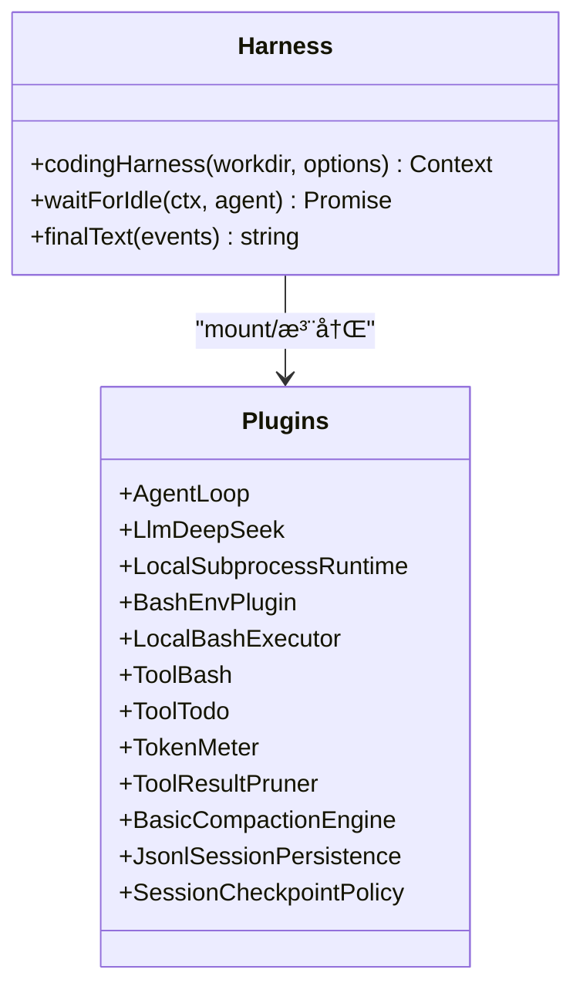

# 测试�快照

<cite>
**本文引用的文件**
- [vitest.config.ts](file://vitest.config.ts)
- [vitest.e2e.config.ts](file://vitest.e2e.config.ts)
- [vitest.shared.ts](file://vitest.shared.ts)
- [headless-driver.ts](file://examples/headless-agent/tests/fixtures/headless-driver.ts)
- [harness.ts](file://examples/headless-agent/tests/harness.ts)
- [headless.snapshot.ts](file://examples/headless-agent/tests/headless.snapshot.ts)
</cite>

## 目录
1. [简介](#简介)
2. [项目结�](#项目结�)
3. [核心组件](#核心组件)
4. [��总览](#��总览)
5. [详细组件分�](#详细组件分�)
6. [�赖关系分�](#�赖关系分�)
7. [性能考虑](#性能考虑)
8. [故障�查指�](#故障�查指�)
9. [结论](#结论)
10. [附录](#附录)

## 简介
本文件��无头 Agent 的端到端测试�快照验�，系统性说�：
- 测试框��置�执行（Vitest�E2E 并行�覆盖�门�）
- 快照测试的�置�刷新策略（JSONL 会�日志��� JSONL 输出）
- headless-driver.ts 的工作���事件���
- 端到端测试编写方法（模拟 LLM��久化会���放/覆盖）
- 测试�境�建�并行执行�结�分���归�践
- 覆盖�统计�性能基准��归测试最佳�践

## 项目结�
仓库采用多包工作区组织，测试相关的关键�置如下：
- 根级 Vitest �置：�元测试�覆盖�门�
- E2E 专用�置：真�模�调用�超时��试�并行度�制
- 共享工具：装饰器转译�进程�数隔离
- 无头驱动�快照：示例工程下的 headless 测试套件�快照断言

```mermaid
graph TB
A["根级 Vitest �置<br/>vitest.config.ts"] --> B["共享�件��数<br/>vitest.shared.ts"]
C["E2E �置<br/>vitest.e2e.config.ts"] --> B
D["无头驱动<br/>headless-driver.ts"] --> E["快照断言<br/>headless.snapshot.ts"]
F["测试装� harness<br/>harness.ts"] --> E
E --> G["快照数�<br/>examples/headless-agent/tests/snapshots/*"]
```

**图表��**
- [vitest.config.ts:117-159](file://vitest.config.ts#L117-L159)
- [vitest.e2e.config.ts:31-57](file://vitest.e2e.config.ts#L31-L57)
- [vitest.shared.ts:1-43](file://vitest.shared.ts#L1-L43)
- [headless-driver.ts:1-34](file://examples/headless-agent/tests/fixtures/headless-driver.ts#L1-L34)
- [headless.snapshot.ts:221-800](file://examples/headless-agent/tests/headless.snapshot.ts#L221-L800)

**章节��**
- [vitest.config.ts:117-159](file://vitest.config.ts#L117-L159)
- [vitest.e2e.config.ts:31-57](file://vitest.e2e.config.ts#L31-L57)
- [vitest.shared.ts:1-43](file://vitest.shared.ts#L1-L43)

## 核心组件
- Vitest �测�覆盖�
  - å�Œé¡¹ç›®æ¨¡å¼�：线程安全用例池 vs 进程绑定用例æ±
  - v8 覆盖�：严格�文件 100% 阈值，�除类�/客户端 UI 等暂�覆盖路径
  - Windows 平�差异化�除� pwsh �用性检测
- E2E �行器
  - 独立�置文件，加载 .env，设置较长超时��试
  - 通过�境���制并�度，��共享 API ��争用
- 共享工具
  - 标准装饰器预转��件
  - �用 webstorage 以�� jsdom � Node 存储冲�
- 无头驱动
  - �动 Cordis 上下文，�行�次 fixture 任务
  - 将 session_event 以 JSONL 行写入 stdout，最终写入 result 记录
- 测试装� harness
  - 挂载 AgentLoop�LLM�Bash�Tool��久化��缩等�件
  - �供等待空闲���最终消�等辅助能力
- 快照断言
  - 使用 runLoaderSmoke 驱动产� CLI 或库入�
  - 标准化并清洗请求头�时间戳�cwd 等�稳定字段
  - 支��放（replay）�覆盖（override）��会�文件集�
  - 对比�久化会� JSONL ��� JSONL 期望文件

**章节��**
- [vitest.config.ts:117-283](file://vitest.config.ts#L117-L283)
- [vitest.e2e.config.ts:1-59](file://vitest.e2e.config.ts#L1-L59)
- [vitest.shared.ts:1-43](file://vitest.shared.ts#L1-L43)
- [headless-driver.ts:1-34](file://examples/headless-agent/tests/fixtures/headless-driver.ts#L1-L34)
- [harness.ts:1-105](file://examples/headless-agent/tests/harness.ts#L1-L105)
- [headless.snapshot.ts:221-800](file://examples/headless-agent/tests/headless.snapshot.ts#L221-L800)

## ��总览
下图展示一次“无头快照测试�的端到端�程：测试驱动通过 runLoaderSmoke 拉起 CLI 或库入�，加载�置��件，执行任务；期间产生的 SessionEvent 被标准化��期望快照比对。

```mermaid
sequenceDiagram
participant T as "测试用例"
participant R as "runLoaderSmoke"
participant H as "headless-driver.ts"
participant C as "Cordis 上下文"
participant S as "会��久化(JSONL)"
participant N as "标准化/清洗"
participant X as "期望快照"
T->>R : 传入 binScript/configPath/任务��境
R->>H : �动并注入�境��
H->>C : boot + loadEnv + resolveConfigPath
H->>C : runFixtureTurn(任务, onEvent)
C-->>H : �调 sessionId + event
H-->>T : stdout �行 JSONL(session_event/result)
T->>N : normalizeSessionLog/scrubRequestHeaders/stabilize...
N-->>T : 稳定化的事件�列
T->>X : � stream-json.expected.jsonl / session.expected.jsonl 比较
```

**图表��**
- [headless.snapshot.ts:221-800](file://examples/headless-agent/tests/headless.snapshot.ts#L221-L800)
- [headless-driver.ts:1-34](file://examples/headless-agent/tests/fixtures/headless-driver.ts#L1-L34)

## 详细组件分�

### headless-driver.ts：无头驱动�事件�
- �责
  - 解�命令行�数（�置路径�任务）
  - 安装失败�崩溃钩�，加载�境��，�动 Cordis 上下文
  - �行�次 fixture 任务，并通过�调将�个 session_event 以 JSONL 形�输出
  - 最�输出 result 记录，确��被上层测试消费
- 错误处�
  - ��异常并写入 stderr，设置退出�为 1
  - finally 中释放 fiber 资�，�载钩�
- 事件�规范
  - �行一个 JSON 对象，包� type=“session_event� � event 字段
  - 最�一行为 result 记录，表示任务结�

```mermaid
flowchart TD
Start(["进程�动"]) --> Parse["解��数<br/>configPath + task"]
Parse --> Boot["loadEnv + boot + resolveConfigPath"]
Boot --> Run["runFixtureTurn(ctx, {task, onEvent})"]
Run --> Emit{"onEvent �调?"}
Emit --> |是| WriteStdout["process.stdout.write(JSONL)"]
WriteStdout --> Run
Emit --> |�| Result["输出 result 记录"]
Result --> End(["退出"])
Run --> |异常| Err["stderr 输出错误信�并 exitCode=1"]
Err --> End
```

**图表��**
- [headless-driver.ts:1-34](file://examples/headless-agent/tests/fixtures/headless-driver.ts#L1-L34)

**章节��**
- [headless-driver.ts:1-34](file://examples/headless-agent/tests/fixtures/headless-driver.ts#L1-L34)

### 测试装� harness：�件栈�辅助函数
- �件栈
  - AgentLoop�LLM（DeepSeek）�本地�进程�行时�Bash �境�执行器
  - Tool（bash�todo_write），�选 TokenMeter/ToolResultPruner/BasicCompactionEngine
  - �选 JsonlSessionPersistence � SessionCheckpointPolicy
- 辅助能力
  - waitForIdle：监� agent/status 事件直到 idle
  - finalText：�事件中��最�一� assistant/message 的文本内容

**图表��**
- [harness.ts:1-105](file://examples/headless-agent/tests/harness.ts#L1-L105)

**章节��**
- [harness.ts:1-105](file://examples/headless-agent/tests/harness.ts#L1-L105)

### 快照断言：JSONL 规范化�比对
- 关键�程
  - 通过 runLoaderSmoke �动 CLI 或库入�，收集 stdout ��久化会�
  - 解� JSONL，校验首�为 header�末�为 result，中间全为 session_event
  - 使用 normalizeSessionLog/scrubRequestHeaders/stabilizeRefreshLog/tokenizeSessionFixtureCwd 等工具消除ä¸�稳定因ç´
  - 支� DSH_SNAPSHOT=replay � DSH_SNAPSHOT_FILE/OVERRIDE/CHILD_FILES 进行�放�覆盖
  - 将标准化�的�� JSONL �期望文件比对；必�时在刷新模�下�写期望文件
- 典�场景
  - 产� headless profile 命令�模�失败��动激活错误
  - �供者�试�上下文溢出���凭�缺失/无效�示
  - 高级工具链�目标工具�Ralph 循���继续�代�结算

```mermaid
sequenceDiagram
participant U as "测试用例"
participant L as "runLoaderSmoke"
participant D as "headless-driver.ts"
participant P as "�久化(JSONL)"
participant N as "标准化/清洗"
participant V as "期望快照"
U->>L : 传入 binScript/configPath/任务/env
L->>D : �动驱动并执行任务
D-->>U : stdout JSONL(session_event/result)
L->>P : 读� .sessions/*.jsonl(.zstd)
U->>N : 标准化事件��久化日志
N-->>U : 稳定化�的内容
U->>V : � expected.jsonl 比对
alt 刷新模�
U->>V : �写期望文件
end
```

**图表��**
- [headless.snapshot.ts:221-800](file://examples/headless-agent/tests/headless.snapshot.ts#L221-L800)

**章节��**
- [headless.snapshot.ts:221-800](file://examples/headless-agent/tests/headless.snapshot.ts#L221-L800)

### JSONL 格�规范（基���）
- ��输出（stdout）
  - �行一个 JSON 对象
  - �若干行：type="session_event"，包� sessionId � event
  - 最�一行：type="result"，表示任务完�
- �久化会�（.sessions）
  - 文件扩展��为 .jsonl 或 .jsonl.zstd（�缩）
  - 首行 header 包� id�createdAt�cwd�parentSession 等元信�
  - å��续行为事件记录，按时间顺åº�追åŠ
- 标准化�点
  - �除请求头中的�感字段
  - 统一 cwd�时间戳�会� ID 等�稳定值
  - 支��放时注入 override ��会�文件集�

**章节��**
- [headless-driver.ts:1-34](file://examples/headless-agent/tests/fixtures/headless-driver.ts#L1-L34)
- [headless.snapshot.ts:115-209](file://examples/headless-agent/tests/headless.snapshot.ts#L115-L209)

## �赖关系分�
- Vitest �置层
  - �项目划分：thread-safe � process-bound，分别�制 include/exclude
  - 覆盖�门�：v8 �供者，�文件 100% 阈值，大��除项用�客户端 UI �平�差异
  - Windows � pwsh �用性检测影��除列表
- E2E �置层
  - 独立 include 模�，仅包� e2e 文件
  - 超时��试��稳定性；maxWorkers/fileParallelism �制并�
- 共享�件
  - 装饰器预转�，��测试��兼容
  - �用 webstorage �� jsdom 污染
- 无头驱动�快照
  - �赖 dsh-loader-smoke�dsh-session-persistence-jsonl�dsh-acp-snapshot 等内部包
  - 通过�境��切� replay/refresh 模��覆盖文件

```mermaid
graph LR
VC["vitest.config.ts"] --> VS["vitest.shared.ts"]
EC["vitest.e2e.config.ts"] --> VS
HS["headless.snapshot.ts"] --> HD["headless-driver.ts"]
HS --> HP["harness.ts"]
VC --> COV["覆盖�门�"]
EC --> PAR["并行�超时"]
```

**图表��**
- [vitest.config.ts:117-283](file://vitest.config.ts#L117-L283)
- [vitest.e2e.config.ts:31-57](file://vitest.e2e.config.ts#L31-L57)
- [vitest.shared.ts:1-43](file://vitest.shared.ts#L1-L43)
- [headless.snapshot.ts:221-800](file://examples/headless-agent/tests/headless.snapshot.ts#L221-L800)
- [headless-driver.ts:1-34](file://examples/headless-agent/tests/fixtures/headless-driver.ts#L1-L34)
- [harness.ts:1-105](file://examples/headless-agent/tests/harness.ts#L1-L105)

**章节��**
- [vitest.config.ts:117-283](file://vitest.config.ts#L117-L283)
- [vitest.e2e.config.ts:31-57](file://vitest.e2e.config.ts#L31-L57)
- [vitest.shared.ts:1-43](file://vitest.shared.ts#L1-L43)

## 性能考虑
- 并行执行
  - �测：fork 池隔离进程全局状�，���争
  - E2E：通过 DSH_E2E_MAX_WORKERS �制最大并�，默认 4，��至 1 串行
- 超时��试
  - E2E 测试超时 120s，hook 超时 30s，自动�试 2 次，缓解�时波动
- 覆盖�开销
  - 覆盖�仅在�测通�开�；E2E �采集覆盖�，�少�外开销
- I/O ��久化
  - 会�日志�能�缩（zstd），读�时需解�帧；快照刷新时批�写入期望文件

[本节为通用指导，无需特定文件引用]

## 故障�查指�
- 常�错误定�
  - �动失败：检查 headless-driver 的 stderr 输出�退出�
  - 凭�问题：缺失或�法密钥会在�中给出�确指引，注��包��感字符
  - �放失败：确认 DSH_SNAPSHOT � DSH_SNAPSHOT_FILE/OVERRIDE/CHILD_FILES 设置正确
- 调试技巧
  - 使用刷新模�（DSH_SNAPSHOT=refresh）生�新的期望快照
  - 查看�久化会�（.sessions）确认事件顺���缩完整性
  - ��并�（DSH_E2E_MAX_WORKERS=1）����问题
- 覆盖�门�失败
  - 根�报告定�未覆盖分支，补充用例或��调整�除项

**章节��**
- [headless.snapshot.ts:255-475](file://examples/headless-agent/tests/headless.snapshot.ts#L255-L475)
- [vitest.config.ts:160-283](file://vitest.config.ts#L160-L283)
- [vitest.e2e.config.ts:46-57](file://vitest.e2e.config.ts#L46-L57)

## 结论
该仓库�供了完善的无头 Agent 测试�快照体系：
- 通过 Vitest �项目�严格覆盖��障代�质�
- 通过 E2E �置����的并行�稳定性
- 借助 headless-driver �标准化�程，确�事件���久化会�的���性
- 快照断言支��放�覆盖�刷新，便��归�演进

[本节为总结，无需特定文件引用]

## 附录

### 端到端测试编写清�
- 选择入�：CLI 或库入�（binScript/libBinScript）
- 准备�置：cordis.yml � overlay（如 headless profile）
- 准备输入：input.json 中的 prompt steps
- 设置�境��：DSH_SNAPSHOT�DSH_SNAPSHOT_FILE/OVERRIDE/CHILD_FILES�DSH_TELEMETRY_DISABLED 等
- 断言�点：
  - �� JSONL：标准化�� stream-json.expected.jsonl 比对
  - �久化会�：session.expected.jsonl � .sessions/*.jsonl(.zstd) 一致性
  - 业务语义：工具调用顺��目标创建/�更��会�层级等

**章节��**
- [headless.snapshot.ts:221-800](file://examples/headless-agent/tests/headless.snapshot.ts#L221-L800)

### 模拟 LLM 调用�测试数�管�
- 使用内置 mock 或本地 HTTP �务器返�确定性�应
- 通过 DSH_SNAPSHOT_BASE_URL 指�自定义�务端，验�默认�数�适�器行为
- 利用 replay.override.json 对事件进行细粒度覆盖，�造边界场景

**章节��**
- [headless.snapshot.ts:518-568](file://examples/headless-agent/tests/headless.snapshot.ts#L518-L568)

### 覆盖�统计��归测试最佳�践
- 覆盖�
  - �测通��用 v8 覆盖�，严格�文件 100%
  - ���除客户端 UI�类�文件�平�专�代�
- �归测试
  - 优先使用�放模��定��行为
  - 新�场景先写期望快照，��步完善��
  - 定期刷新并审查差异，��漂移累积

**章节��**
- [vitest.config.ts:160-283](file://vitest.config.ts#L160-L283)