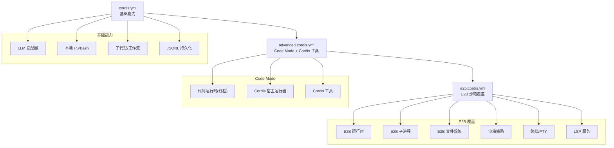
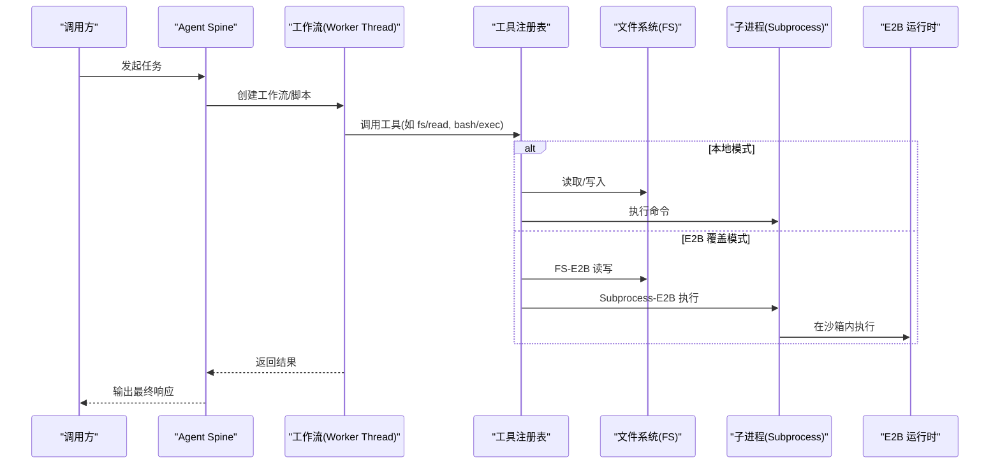
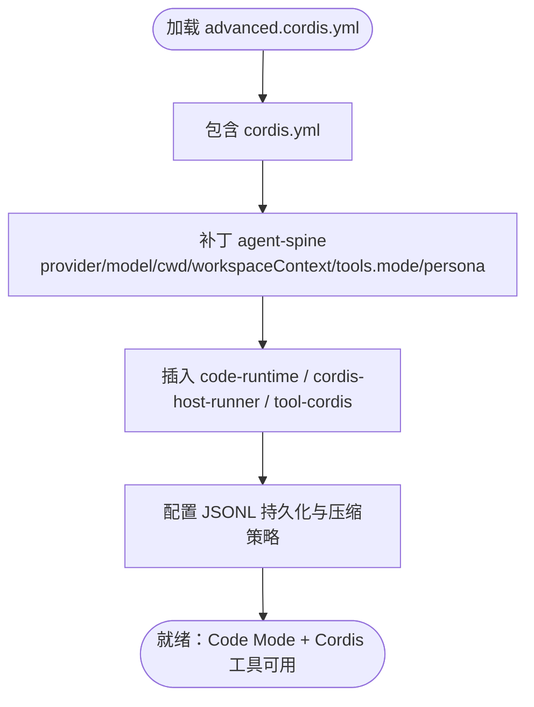
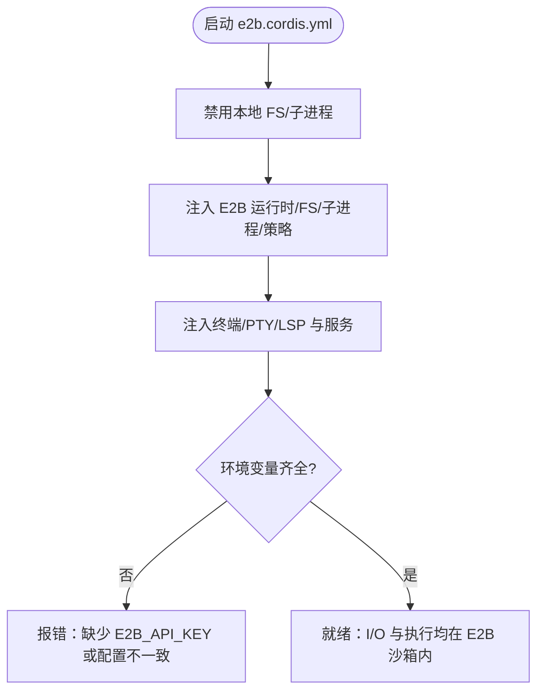
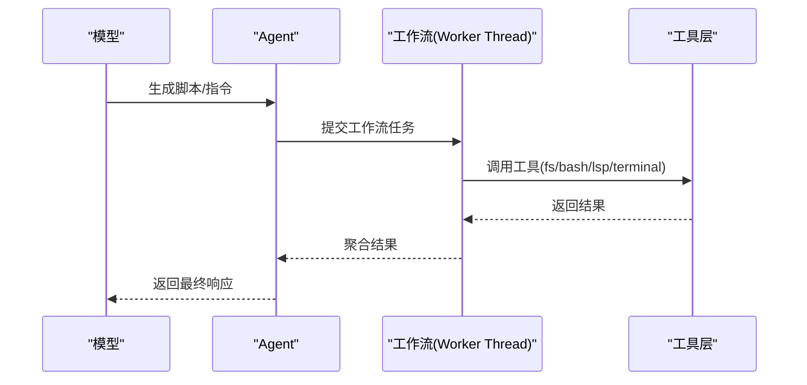
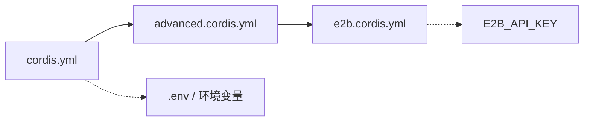

# 高级配置

<cite>
**本文引用的文件**
- [examples/headless-agent/advanced.cordis.yml](file://examples/headless-agent/advanced.cordis.yml)
- [examples/headless-agent/e2b.cordis.yml](file://examples/headless-agent/e2b.cordis.yml)
- [examples/headless-agent/cordis.yml](file://examples/headless-agent/cordis.yml)
- [examples/headless-agent/README.md](file://examples/headless-agent/README.md)
- [examples/headless-agent/advanced.cordis.snapshot.yml](file://examples/headless-agent/advanced.cordis.snapshot.yml)
- [docs/config-catalog.md](file://docs/config-catalog.md)
- [docs/subsystems/settings.md](file://docs/subsystems/settings.md)
</cite>

## 目录
1. [简介](#简介)
2. [项目结构](#项目结构)
3. [核心组件](#核心组件)
4. [架构总览](#架构总览)
5. [详细组件分析](#详细组件分析)
6. [依赖关系分析](#依赖关系分析)
7. [性能与并发调优](#性能与并发调优)
8. [故障排查指南](#故障排查指南)
9. [结论](#结论)
10. [附录：部署模板与最佳实践](#附录：部署模板与最佳实践)

## 简介
本文件面向无头 Agent 的高级配置，聚焦以下目标：
- 深入说明 advanced.cordis.yml 中的 Code Mode、Cordis 工具集成与工作流配置。
- 解释 e2b.cordis.yml 的 E2B 沙箱覆盖、环境变量管理、资源限制设置。
- 汇总性能调优参数、并发控制、超时配置、重试策略。
- 提供不同部署环境的配置模板与优化建议。
- 给出配置验证、热重载与配置管理的最佳实践。

## 项目结构
headless-agent 示例由三层配置组成：
- cordis.yml：基础能力（LLM、本地 Bash/FS、子代理、工作流、持久化、压缩等）。
- advanced.cordis.yml：在基础之上启用 Code Mode 与 Cordis 工具，并注入代码运行时与宿主运行器。
- e2b.cordis.yml：以覆盖方式将文件系统与进程迁移到 E2B 沙箱中，同时保留模型侧工具链。

图表来源
- [examples/headless-agent/cordis.yml:1-166](file://examples/headless-agent/cordis.yml#L1-L166)
- [examples/headless-agent/advanced.cordis.yml:1-35](file://examples/headless-agent/advanced.cordis.yml#L1-L35)
- [examples/headless-agent/e2b.cordis.yml:1-58](file://examples/headless-agent/e2b.cordis.yml#L1-L58)

章节来源
- [examples/headless-agent/README.md:1-33](file://examples/headless-agent/README.md#L1-L33)
- [examples/headless-agent/cordis.yml:1-166](file://examples/headless-agent/cordis.yml#L1-L166)
- [examples/headless-agent/advanced.cordis.yml:1-35](file://examples/headless-agent/advanced.cordis.yml#L1-L35)
- [examples/headless-agent/e2b.cordis.yml:1-58](file://examples/headless-agent/e2b.cordis.yml#L1-L58)

## 核心组件
- Code Mode 与 Cordis 工具集成
  - 通过 advanced.cordis.yml 插入代码运行时、Cordis 宿主运行器与 Cordis 工具，使 Agent 可在会话内执行 JS 脚本并通过 Cordis 编排任务。
  - 工作流引擎通过 worker-thread 模式调度，结合 spawn 后端实现并发与隔离。
- E2B 沙箱覆盖
  - e2b.cordis.yml 禁用本地 FS/子进程，替换为 E2B 提供的 FS 与子进程；统一 cwd、工作区根与 Bash 默认目录，确保所有 I/O 发生在同一沙箱路径。
  - 沙箱策略设置为危险全开放模式，便于演示；生产应收紧权限。
- 环境变量与凭据
  - 应用入口会加载 .env 到进程环境；API Key 通过 dsh-credentials-local 在每次请求时解析，避免硬编码密钥。
  - E2B 需要 E2B_API_KEY；快照压缩行为受 DSH_SNAPSHOT 影响。

章节来源
- [examples/headless-agent/advanced.cordis.yml:1-35](file://examples/headless-agent/advanced.cordis.yml#L1-L35)
- [examples/headless-agent/e2b.cordis.yml:1-58](file://examples/headless-agent/e2b.cordis.yml#L1-L58)
- [examples/headless-agent/cordis.yml:1-166](file://examples/headless-agent/cordis.yml#L1-L166)
- [examples/headless-agent/README.md:1-33](file://examples/headless-agent/README.md#L1-L33)

## 架构总览
下图展示了从用户请求到工具执行、再到沙箱执行的完整调用链。

图表来源
- [examples/headless-agent/cordis.yml:133-142](file://examples/headless-agent/cordis.yml#L133-L142)
- [examples/headless-agent/advanced.cordis.yml:28-34](file://examples/headless-agent/advanced.cordis.yml#L28-L34)
- [examples/headless-agent/e2b.cordis.yml:21-41](file://examples/headless-agent/e2b.cordis.yml#L21-L41)

## 详细组件分析

### advanced.cordis.yml：Code Mode、Cordis 工具与工作流
- 作用
  - 引入基础 cordis.yml，并对 agent-spine 进行补丁：指定 provider/model、cwd、workspaceContext 字节上限、tools.mode=both、persona。
  - 注入代码运行时、Cordis 宿主运行器与 Cordis 工具，使 Agent 可在工作区内执行 JS 脚本并通过 Cordis 编排。
  - 持久化使用 JSONL，压缩策略根据环境变量切换。
- 关键点
  - tools.mode=both：同时暴露“仅工具”和“工作流”两种模式，便于灵活编排。
  - workspaceContext.maxBytes：限制上下文大小，避免超出模型窗口。
  - 压缩：当未设置 DSH_SNAPSHOT 时使用 zstd，否则关闭压缩，便于回放与调试。

图表来源
- [examples/headless-agent/advanced.cordis.yml:1-35](file://examples/headless-agent/advanced.cordis.yml#L1-L35)
- [examples/headless-agent/cordis.yml:133-142](file://examples/headless-agent/cordis.yml#L133-L142)

章节来源
- [examples/headless-agent/advanced.cordis.yml:1-35](file://examples/headless-agent/advanced.cordis.yml#L1-L35)
- [examples/headless-agent/cordis.yml:133-142](file://examples/headless-agent/cordis.yml#L133-L142)

### e2b.cordis.yml：E2B 沙箱覆盖与环境变量
- 作用
  - 禁用本地 FS 与本地子进程，替换为 E2B 提供的 FS 与子进程。
  - 注入 E2B 运行时、策略、终端/PTY、LSP 及对应工具。
  - 要求 e2b.cwd、sandbox-policy.workspaceRoot、bash-local 默认工作目录指向同一远程目录，否则工具调用会失败。
- 环境变量与资源
  - 需要 E2B_API_KEY 用于认证。
  - timeoutMs 控制沙箱生命周期；可通过策略与命令级超时配合控制任务时长。
  - 工作区根与 cwd 必须一致，保证所有 I/O 落在同一沙箱路径。

图表来源
- [examples/headless-agent/e2b.cordis.yml:1-58](file://examples/headless-agent/e2b.cordis.yml#L1-L58)
- [examples/headless-agent/README.md:20-29](file://examples/headless-agent/README.md#L20-L29)

章节来源
- [examples/headless-agent/e2b.cordis.yml:1-58](file://examples/headless-agent/e2b.cordis.yml#L1-L58)
- [examples/headless-agent/README.md:20-29](file://examples/headless-agent/README.md#L20-L29)

### 工作流与工具集成
- 工作流引擎
  - 通过 worker-thread 模式承载模型生成的 JS 脚本，使用 spawn 后端创建隔离执行环境。
  - 工具层暴露 workflow 工具，供 Agent 在会话内编排多步任务。
- Cordis 工具
  - 通过 tool-cordis 暴露 Cordis 能力，允许在 Agent 内部动态编排流程、调用其他工具或服务。

图表来源
- [examples/headless-agent/cordis.yml:133-142](file://examples/headless-agent/cordis.yml#L133-L142)
- [examples/headless-agent/advanced.cordis.yml:28-34](file://examples/headless-agent/advanced.cordis.yml#L28-L34)

章节来源
- [examples/headless-agent/cordis.yml:133-142](file://examples/headless-agent/cordis.yml#L133-L142)
- [examples/headless-agent/advanced.cordis.yml:28-34](file://examples/headless-agent/advanced.cordis.yml#L28-L34)

## 依赖关系分析
- 插件装配
  - cordis.yml 定义了 LLM、本地 FS/Bash、子代理、工作流、持久化、压缩、观察策略等。
  - advanced.cordis.yml 在此基础上插入代码运行时与 Cordis 工具。
  - e2b.cordis.yml 覆盖底层 I/O 与执行，将 FS/子进程迁移至 E2B。
- 关键耦合点
  - cwd 一致性：e2b.cwd、sandbox-policy.workspaceRoot、bash 默认工作目录需一致，否则工具调用失败。
  - 凭据与密钥：DEEPSEEK_API_KEY、E2B_API_KEY 需在进程环境中可用。
  - 压缩与回放：DSH_SNAPSHOT 决定 JSONL 压缩策略，回放场景通常关闭压缩。

图表来源
- [examples/headless-agent/cordis.yml:1-166](file://examples/headless-agent/cordis.yml#L1-L166)
- [examples/headless-agent/advanced.cordis.yml:1-35](file://examples/headless-agent/advanced.cordis.yml#L1-L35)
- [examples/headless-agent/e2b.cordis.yml:1-58](file://examples/headless-agent/e2b.cordis.yml#L1-L58)

章节来源
- [examples/headless-agent/cordis.yml:1-166](file://examples/headless-agent/cordis.yml#L1-L166)
- [examples/headless-agent/advanced.cordis.yml:1-35](file://examples/headless-agent/advanced.cordis.yml#L1-L35)
- [examples/headless-agent/e2b.cordis.yml:1-58](file://examples/headless-agent/e2b.cordis.yml#L1-L58)

## 性能与并发调优
- 上下文与压缩
  - workspaceContext.maxBytes：控制工作区上下文大小，避免超出模型窗口。
  - JSONL 压缩：默认 zstd，回放或调试时可关闭以提升可读性。
- 工作流与子代理
  - 工作流使用 worker-thread + spawn 后端，具备进程隔离与并发能力。
  - 子代理支持 spawn/fork 两种提供者，fork 为一次性模式，spawn 支持可恢复后台模式。
- 超时与重试
  - Bash 超时：bash-local 提供 timeoutMs，防止长任务阻塞。
  - E2B 超时：e2b.timeoutMs 控制沙箱生命周期。
  - 压缩重试：compactionRetries 控制压缩失败的重试次数。
- 并发控制
  - 工具并行：todo_write 等工具可开启 allowParallelInProgress 提升吞吐。
  - 最大并行工具调用：可通过 agent-loop 的 maxParallelToolCalls 限制每步并发度。

章节来源
- [examples/headless-agent/cordis.yml:34-83](file://examples/headless-agent/cordis.yml#L34-L83)
- [examples/headless-agent/cordis.yml:113-131](file://examples/headless-agent/cordis.yml#L113-L131)
- [examples/headless-agent/cordis.yml:133-142](file://examples/headless-agent/cordis.yml#L133-L142)
- [docs/config-catalog.md:135-165](file://docs/config-catalog.md#L135-L165)

## 故障排查指南
- 常见错误
  - 路径不一致：e2b.cwd、sandbox-policy.workspaceRoot、bash-local 默认工作目录不一致会导致远程 spawn 错误。
  - 缺少密钥：未设置 E2B_API_KEY 或 DEEPSEEK_API_KEY 导致认证失败。
  - 压缩导致回放不可读：回放场景需关闭压缩。
- 定位方法
  - 检查环境变量是否加载到进程环境。
  - 确认覆盖后的 FS/子进程均指向 E2B。
  - 查看 JSONL 日志与事件流，定位失败步骤。
- 回退策略
  - 临时禁用 E2B 覆盖，回到本地 FS/子进程验证问题范围。
  - 调整超时与重试参数，观察稳定性变化。

章节来源
- [examples/headless-agent/e2b.cordis.yml:1-10](file://examples/headless-agent/e2b.cordis.yml#L1-L10)
- [examples/headless-agent/README.md:20-29](file://examples/headless-agent/README.md#L20-L29)
- [examples/headless-agent/advanced.cordis.snapshot.yml:1-50](file://examples/headless-agent/advanced.cordis.snapshot.yml#L1-L50)

## 结论
- advanced.cordis.yml 提供了 Code Mode 与 Cordis 工具的标准化接入点，适合在现有 headless 基础上快速增强。
- e2b.cordis.yml 实现了 I/O 与执行的沙箱化，便于安全隔离与可回收资源管理。
- 通过合理的上下文限制、超时与重试、并发控制，可以在不同环境下获得稳定且高效的 Agent 体验。
- 配置的热重载与验证机制保证了运行时变更的安全性与可观测性。

## 附录：部署模板与最佳实践

### 配置模板
- 本地开发（无需 E2B）
  - 使用 cordis.yml 作为基础，按需启用工具与工作流。
  - 设置 workspaceContext.maxBytes 与 bash timeoutMs。
  - 如需回放，关闭 JSONL 压缩。
- 生产隔离（E2B）
  - 基于 e2b.cordis.yml 覆盖 FS/子进程，确保 cwd 与 workspaceRoot 一致。
  - 设置 E2B_API_KEY 与合适的 timeoutMs。
  - 将沙箱策略从 danger-full-access 调整为最小权限。
- 混合模式
  - 在 advanced.cordis.yml 中保持 Code Mode 与 Cordis 工具，按环境选择是否覆盖到 E2B。

### 环境变量管理
- 使用 .env 加载到进程环境，避免在配置文件中硬编码密钥。
- 通过 dsh-credentials-local 在每次请求时解析凭据，提高安全性。
- 使用 DSH_SNAPSHOT 控制 JSONL 压缩策略，便于回放与调试。

### 配置验证与热重载
- 用户设置文档支持热重载，变更后会触发 settings/updated 事件。
- 通过 schemastery 校验字段类型与约束，跨字段校验可在 validate 钩子中实现。
- 配置 UI 可使用 describe 获取描述信息，并以增量更新方式渲染表单。

章节来源
- [docs/subsystems/settings.md:1-311](file://docs/subsystems/settings.md#L1-L311)
- [examples/headless-agent/cordis.yml:6-16](file://examples/headless-agent/cordis.yml#L6-L16)
- [examples/headless-agent/advanced.cordis.yml:22-27](file://examples/headless-agent/advanced.cordis.yml#L22-L27)
- [examples/headless-agent/e2b.cordis.yml:24-35](file://examples/headless-agent/e2b.cordis.yml#L24-L35)