# 高级示例

<cite>
**本文引用的文件**
- [examples/README.md](file://examples/README.md)
- [examples/acp-agent/README.md](file://examples/acp-agent/README.md)
- [examples/headless-agent/README.md](file://examples/headless-agent/README.md)
- [examples/acp-agent/cordis.yml](file://examples/acp-agent/cordis.yml)
- [examples/headless-agent/cordis.yml](file://examples/headless-agent/cordis.yml)
- [examples/acp-agent/advanced.cordis.yml](file://examples/acp-agent/advanced.cordis.yml)
- [examples/headless-agent/advanced.cordis.yml](file://examples/headless-agent/advanced.cordis.yml)
- [examples/acp-agent/tests/acp.e2e.ts](file://examples/acp-agent/tests/acp.e2e.ts)
- [examples/headless-agent/tests/full-loop.e2e.ts](file://examples/headless-agent/tests/full-loop.e2e.ts)
- [examples/acp-agent/subagent-continuable-inheritance.cordis.yml](file://examples/acp-agent/subagent-continuable-inheritance.cordis.yml)
- [examples/acp-agent/product-subagent-codex.cordis.yml](file://examples/acp-agent/product-subagent-codex.cordis.yml)
</cite>

## 目录
1. [简介](#简介)
2. [项目结�](#项目结�)
3. [核心组件](#核心组件)
4. [��总览](#��总览)
5. [详细组件分�](#详细组件分�)
6. [�赖关系分�](#�赖关系分�)
7. [性能考�](#性能考�)
8. [故障�查指�](#故障�查指�)
9. [结论](#结论)
10. [附录](#附录)

## 简介
本高级示例文档��有�验的开�者，�焦 DeepSeek Harness 的高级能力���应用场景，围绕两类典�示例展开：
- ACP Agent：��自动化�程�化集�的 Agent Client Protocol（ACP）�务器，支�会�管�����制��代��工作��工具集�等。
- Headless Agent：无头编�代�，一次性任务驱动��久化��代�委派�工作�� Ralph 迭代�JSONL 输出等。

文档将系统�述设计�路���细节�技术�点，并给出端到端工作�程演示，覆盖�置管��错误处��性能优化等方�。

## 项目结�
示例�� examples 目录下，包�多个��行场景。其中 acp-agent � headless-agent 是本次�点：
- acp-agent：通过 JSON-RPC stdio 暴露 ACP �议，适�父代���代��供者�程�化客户端使用；默认组�包�沙箱�审批��代��工作��Hooks��缩�会�查询索引���调用�醒等。
- headless-agent：一次性任务驱动的无头编�代�，组�了模�适�器�本地 Bash/文件系统��代�委派�工作�� Ralph 迭代�todo_write�JSONL �久化�检查点策略；还�供 E2B 沙箱覆盖的 POC。

```mermaid
graph TB
subgraph "示例"
A["acp-agent"]
B["headless-agent"]
end
subgraph "公共能力"
C["会���久化"]
D["�代��工作�"]
E["工具�沙箱"]
F["���审批"]
end
A --> C
A --> D
A --> E
A --> F
B --> C
B --> D
B --> E
B --> F
```

章节��
- [examples/README.md:1-30](file://examples/README.md#L1-L30)
- [examples/acp-agent/README.md:1-25](file://examples/acp-agent/README.md#L1-L25)
- [examples/headless-agent/README.md:1-33](file://examples/headless-agent/README.md#L1-L33)

## 核心组件
- 模�适�层：DeepSeek 适�器，开��考模����努力，支�多模�路由�上下文窗��置。
- 会���久化：JSONL �久化��缩策略�检查点策略�会�投影注册表。
- �代��工作�：spawn/fork 两��代��端，�继续����代��一次性 fork；工作�引�通过 worker-thread 执行脚本中的 agent() 调用。
- 工具栈：Bash�文件系统（�观察策略）�Ralph�Todo�Cordis 工具��选 Code Mode。
- ���沙箱：按会� cwd 隔离的沙箱策略，workspace-write/danger-full-access 模�切�；审批策略在�险模�下�设为 never，�则 ask。
- 钩��扩展：Claude/Codex Hooks 桥�，按需加载；Code Mode � Cordis 工具�通过覆盖�加�用。

章节��
- [examples/acp-agent/cordis.yml:7-193](file://examples/acp-agent/cordis.yml#L7-L193)
- [examples/headless-agent/cordis.yml:6-166](file://examples/headless-agent/cordis.yml#L6-L166)

## ��总览
下图展示了 ACP Agent � Headless Agent 的核心交互路径：外部客户端或 CLI 驱动会�创建��示，Agent Spine �调模��工具��代��工作�，并通过�久化���策略�障安全��观测性。

```mermaid
sequenceDiagram
participant Client as "客户端/CLI"
participant ACP as "ACP �务器"
participant Spine as "Agent Spine"
participant LLM as "模�适�器"
participant Tools as "工具(文件系统/Bash/Ralph/Todo)"
participant Sub as "�代�/工作�"
participant Store as "�久化(JSONL)"
Client->>ACP : initialize / newSession
ACP->>Spine : 创建会�(�带cwd/元数�)
Spine->>Store : �始化�久化/检查点
Client->>ACP : prompt(文本/工具/�任务)
Spine->>LLM : 生��应(�工具调用)
Spine->>Tools : 执行工具(�沙箱/��约�)
Spine->>Sub : 必�时委派�代�/工作�
Tools-->>Spine : 结�/副作用
Sub-->>Spine : 报告/完�
Spine->>Store : 写入事件/快照
Spine-->>Client : 返�最终文本/��更新
```

图表��
- [examples/acp-agent/cordis.yml:47-159](file://examples/acp-agent/cordis.yml#L47-L159)
- [examples/headless-agent/cordis.yml:43-152](file://examples/headless-agent/cordis.yml#L43-L152)

章节��
- [examples/acp-agent/cordis.yml:47-159](file://examples/acp-agent/cordis.yml#L47-L159)
- [examples/headless-agent/cordis.yml:43-152](file://examples/headless-agent/cordis.yml#L43-L152)

## 详细组件分�

### ACP Agent 示例
- 目标�边界：以 JSON-RPC stdio �供 ACP �议通�，stdout 仅承载�议帧；stderr 用�诊断。�个 session/new �供独立�对 cwd，沙箱�文件系统写�作基�该 cwd 进行��判定。
- 会����：通过 DSH_PERMISSION_MODE 选择 workspace-write 或 danger-full-access；在 workspace-write 下，若模��试请求更宽沙箱访问，会触� session/request_permission，由客户端决定 allow_once/reject_once，且仅对当��试生效。
- �代��工作�：�时暴露 spawn � fork 两��代�工具，分别对应“�继续����和“一次性 fork�；工作�引�通过 worker-thread 将脚本中的 agent() 调用分�到 spawn �端。
- 工具�钩�：文件系统走 dsh-fs-sandbox，�� fs-observation-policy；Hooks 支� Claude/Codex 两��议，进程级读�一次，缺失�无�作。
- 高级模�：通过 advanced.cordis.yml �加 Code Mode � Cordis 工具，统一在一个 ACP 快照中验�所有边界。

```mermaid
flowchart TD
Start(["session/new"]) --> CWD["设置会��对 cwd"]
CWD --> Policy{"��模�?"}
Policy --> |workspace-write| Sandbox["应用沙箱�制<br/>读写� cwd 约�"]
Policy --> |danger-full-access| Full["放宽访问<br/>审批策略=never"]
Sandbox --> Tools["工具执行(文件系统/Bash)"]
Full --> Tools
Tools --> Result{"是�需��代�/工作�?"}
Result --> |是| Sub["spawn/fork �代�<br/>或 workflow 引�"]
Result --> |�| Persist["写入�久化/检查点"]
Sub --> Persist
Persist --> End(["返�最终文本/��更新"])
```

图表��
- [examples/acp-agent/cordis.yml:18-63](file://examples/acp-agent/cordis.yml#L18-L63)
- [examples/acp-agent/cordis.yml:81-159](file://examples/acp-agent/cordis.yml#L81-L159)
- [examples/acp-agent/advanced.cordis.yml:1-30](file://examples/acp-agent/advanced.cordis.yml#L1-L30)

章节��
- [examples/acp-agent/README.md:1-25](file://examples/acp-agent/README.md#L1-L25)
- [examples/acp-agent/cordis.yml:18-63](file://examples/acp-agent/cordis.yml#L18-L63)
- [examples/acp-agent/cordis.yml:81-159](file://examples/acp-agent/cordis.yml#L81-L159)
- [examples/acp-agent/advanced.cordis.yml:1-30](file://examples/acp-agent/advanced.cordis.yml#L1-L30)

### Headless Agent 示例
- 目标�边界：一次性任务驱动，���空任务�创建并�久化新会�，打�最终助手文本并退出；测试驱动通过 harness 注入固定 main 代�。
- 模��工具：DeepSeek 适�器，本地 Bash �文件系统；支��代�委派�工作��Ralph 迭代� todo_write；JSONL �久化�检查点策略。
- 高级模�：通过 advanced.cordis.yml �加 Code Mode � Cordis 工具，���基础组�一致的��。
- E2B 覆盖：用 e2b.cordis.yml 替�本地文件系统��进程�供者为共享 E2B 沙箱，��最终删除；主机侧�留 Cordis�模�调用�会�状�等。

```mermaid
sequenceDiagram
participant CLI as "dsh --profile headless"
participant Harness as "测试/驱动 harness"
participant Spine as "Agent Spine(main)"
participant LLM as "模�适�器"
participant Tools as "工具(Bash/FS/Ralph/Todo)"
participant Store as "JSONL �久化"
CLI->>Harness : �动并传入任务
Harness->>Spine : 创建会�(预置 main 代�)
Spine->>Store : �始化�久化/检查点
Spine->>LLM : 生��应(�能包�工具调用)
Spine->>Tools : 执行工具(本地或 E2B 覆盖)
Tools-->>Spine : 结�/副作用
Spine->>Store : 写入事件/快照
Spine-->>CLI : 输出最终文本并退出
```

图表��
- [examples/headless-agent/cordis.yml:6-67](file://examples/headless-agent/cordis.yml#L6-L67)
- [examples/headless-agent/cordis.yml:84-152](file://examples/headless-agent/cordis.yml#L84-L152)
- [examples/headless-agent/advanced.cordis.yml:1-35](file://examples/headless-agent/advanced.cordis.yml#L1-L35)

章节��
- [examples/headless-agent/README.md:1-33](file://examples/headless-agent/README.md#L1-L33)
- [examples/headless-agent/cordis.yml:6-67](file://examples/headless-agent/cordis.yml#L6-L67)
- [examples/headless-agent/cordis.yml:84-152](file://examples/headless-agent/cordis.yml#L84-L152)
- [examples/headless-agent/advanced.cordis.yml:1-35](file://examples/headless-agent/advanced.cordis.yml#L1-L35)

### �代��继承特性
- �继续��代�继承：通过 overlay 将父会�切�到�读模�，确��继续����代�继承该覆盖而�部署默认值。
- 产��代�（Codex）：�加�生 Codex 产��供者�其��工具，场景固定组装�的请求模�而��际�动 Codex。

```mermaid
classDiagram
class ParentSession {
+cwd
+sandboxPolicy
}
class ChildSession {
+inheritPolicy()
+report()
}
ParentSession <|-- ChildSession : "继承��/上下文"
```

图表��
- [examples/acp-agent/subagent-continuable-inheritance.cordis.yml:1-12](file://examples/acp-agent/subagent-continuable-inheritance.cordis.yml#L1-L12)
- [examples/acp-agent/product-subagent-codex.cordis.yml:1-19](file://examples/acp-agent/product-subagent-codex.cordis.yml#L1-L19)

章节��
- [examples/acp-agent/subagent-continuable-inheritance.cordis.yml:1-12](file://examples/acp-agent/subagent-continuable-inheritance.cordis.yml#L1-L12)
- [examples/acp-agent/product-subagent-codex.cordis.yml:1-19](file://examples/acp-agent/product-subagent-codex.cordis.yml#L1-L19)

### 端到端�程演示

#### ACP 端到端（真� stdio）
- �动 ACP �务器，initialize �创建 session/new，�� prompt 驱动模��工具，最终验�世界效�（如写入文件），并断言 stdout 仅包� JSON-RPC 帧。

```mermaid
sequenceDiagram
participant Test as "E2E 测试"
participant Server as "ACP �务器"
participant Bridge as "�议桥"
participant Agent as "AgentLoop"
participant FS as "文件系统"
Test->>Server : initialize
Test->>Server : newSession({cwd})
Test->>Server : prompt(文本)
Server->>Bridge : 解�/路由
Bridge->>Agent : 创建会�/执行循�
Agent->>FS : 写入 proof.txt
FS-->>Agent : �功
Agent-->>Server : 最终文本/å�œæ­¢å�Ÿå›
Server-->>Test : ��更新/结�
```

图表��
- [examples/acp-agent/tests/acp.e2e.ts:42-97](file://examples/acp-agent/tests/acp.e2e.ts#L42-L97)
- [examples/acp-agent/tests/acp.e2e.ts:100-127](file://examples/acp-agent/tests/acp.e2e.ts#L100-L127)

章节��
- [examples/acp-agent/tests/acp.e2e.ts:42-97](file://examples/acp-agent/tests/acp.e2e.ts#L42-L97)
- [examples/acp-agent/tests/acp.e2e.ts:100-127](file://examples/acp-agent/tests/acp.e2e.ts#L100-L127)

#### Headless 全链路（真�模�+Bash）
- 通过 harness 创建会�� main 代�，��用户消�驱动 bash 工具执行命令，断言工具调用�结�中包�预期输出。

```mermaid
sequenceDiagram
participant Harness as "Harness"
participant Agent as "main 代�"
participant LLM as "模�"
participant Bash as "Bash 工具"
Harness->>Agent : followup(用户消�)
Agent->>LLM : 生��应(� bash 调用)
Agent->>Bash : 执行 echo e2e-ok
Bash-->>Agent : 输出 e2e-ok
Agent-->>Harness : 最终文本包� e2e-ok
```

图表��
- [examples/headless-agent/tests/full-loop.e2e.ts:28-49](file://examples/headless-agent/tests/full-loop.e2e.ts#L28-L49)

章节��
- [examples/headless-agent/tests/full-loop.e2e.ts:28-49](file://examples/headless-agent/tests/full-loop.e2e.ts#L28-L49)

## �赖关系分�
- �置��件：两个示例�通过 cordis.yml 声��组��件；advanced.cordis.yml 作为覆盖层�入 Code Mode � Cordis 工具。
- �行时�赖：�代��工具通过 Cordis 注册表挂载；工作�引�� spawn �端�作；文件系统� Bash �沙箱策略约�。
- 外部�赖：DeepSeek 适�器需� API Key；E2B 覆盖需� E2B_API_KEY；��模�通过�境��切�。

```mermaid
graph LR
Base["cordis.yml"] --> Overlay["advanced.cordis.yml"]
Overlay --> Plugins["�件集�(模�/工具/�代�/工作�)"]
Plugins --> Runtime["�行时(会�/�久化/��)"]
Runtime --> External["外部�务(API/E2B)"]
```

图表��
- [examples/acp-agent/cordis.yml:7-193](file://examples/acp-agent/cordis.yml#L7-L193)
- [examples/headless-agent/cordis.yml:6-166](file://examples/headless-agent/cordis.yml#L6-L166)
- [examples/acp-agent/advanced.cordis.yml:1-30](file://examples/acp-agent/advanced.cordis.yml#L1-L30)
- [examples/headless-agent/advanced.cordis.yml:1-35](file://examples/headless-agent/advanced.cordis.yml#L1-L35)

章节��
- [examples/acp-agent/cordis.yml:7-193](file://examples/acp-agent/cordis.yml#L7-L193)
- [examples/headless-agent/cordis.yml:6-166](file://examples/headless-agent/cordis.yml#L6-L166)
- [examples/acp-agent/advanced.cordis.yml:1-30](file://examples/acp-agent/advanced.cordis.yml#L1-L30)
- [examples/headless-agent/advanced.cordis.yml:1-35](file://examples/headless-agent/advanced.cordis.yml#L1-L35)

## 性能考�
- 令牌计���缩：token-meter � compaction-basic 在�近上下文窗�时自动摘�旧范围，��延迟��本。
- 工作线程�并�：workflow-worker-thread 通过 worker-thread 并行执行脚本中的 agent() 调用；todo 工具�许进行中任务并行。
- 沙箱� I/O：文件系统� Bash �沙箱策略�制，���必�的跨会�干扰；E2B 覆盖集中 I/O ��一沙箱，便�资��收。
- 快照��久化：JSONL �久化支��缩（zstd）�快照模�（关闭�缩）以平衡存储��放速度。

章节��
- [examples/acp-agent/cordis.yml:67-80](file://examples/acp-agent/cordis.yml#L67-L80)
- [examples/headless-agent/cordis.yml:72-82](file://examples/headless-agent/cordis.yml#L72-L82)
- [examples/acp-agent/cordis.yml:137-153](file://examples/acp-agent/cordis.yml#L137-L153)
- [examples/headless-agent/cordis.yml:133-152](file://examples/headless-agent/cordis.yml#L133-L152)

## 故障�查指�
- �议通�污染：ACP 示例�求 stdout 仅承载 JSON-RPC 帧；任何日志泄�都会导致解�失败。测试通过断言�行�为有效 JSON ��护。
- 注入�懒加载：session/new 路径需确��务在 JSON-RPC 读�循�中�用；测试覆盖了�桥�到 AgentLoop �到注册表/�久化的完整路径。
- ���沙箱：workspace-write 模�下若模��试请求更宽访问，需通过 session/request_permission �确 allow_once/reject_once；未决或��用时应失败关闭。
- 清��资�释放：Headless 测试在 afterEach 中确� fiber �临时目录被正确释放，防止残留进程或文件。

章节��
- [examples/acp-agent/tests/acp.e2e.ts:42-97](file://examples/acp-agent/tests/acp.e2e.ts#L42-L97)
- [examples/acp-agent/tests/acp.e2e.ts:100-127](file://examples/acp-agent/tests/acp.e2e.ts#L100-L127)
- [examples/headless-agent/tests/full-loop.e2e.ts:18-26](file://examples/headless-agent/tests/full-loop.e2e.ts#L18-L26)

## 结论
ACP Agent � Headless Agent 示例展示了 DeepSeek Harness 在自动化�无头场景下的强大能力：通过声���置组�模��工具��代��工作�，结�严格的���沙箱策略，��安全��观测�高性能的 AI 代�系统。高级模��加进一步验�了边界�兼容性，为生产级集��供了���考。

## 附录
- 快速�行
  - ACP：pnpm run demo:acp 或 demo:code-mode（需 DEEPSEEK_API_KEY）。
  - Headless：pnpm dsh --profile headless "任务�述"（需 DEEPSEEK_API_KEY，�选 BASE_URL）。
- 关键�境��
  - DSH_PERMISSION_MODE：workspace-write 或 danger-full-access。
  - DSH_SNAPSHOT：影��久化�缩�行为。
  - E2B_API_KEY：�用 E2B 覆盖时使用。

章节��
- [examples/acp-agent/README.md:7-12](file://examples/acp-agent/README.md#L7-L12)
- [examples/headless-agent/README.md:7-16](file://examples/headless-agent/README.md#L7-L16)
- [examples/headless-agent/README.md:20-28](file://examples/headless-agent/README.md#L20-L28)