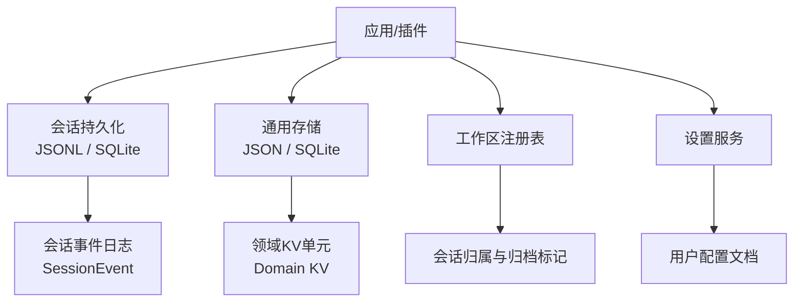
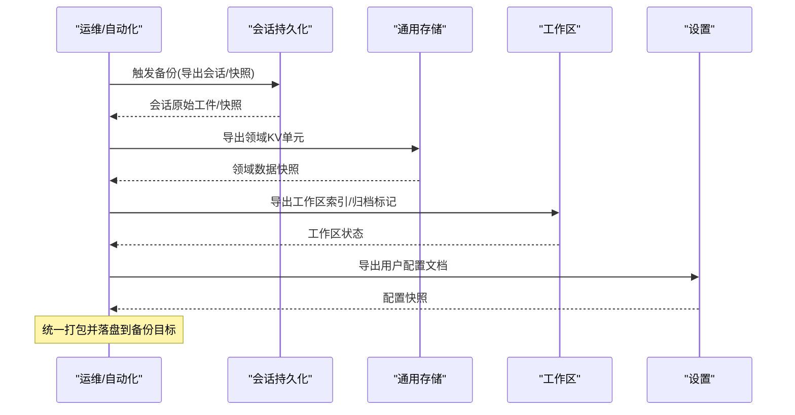
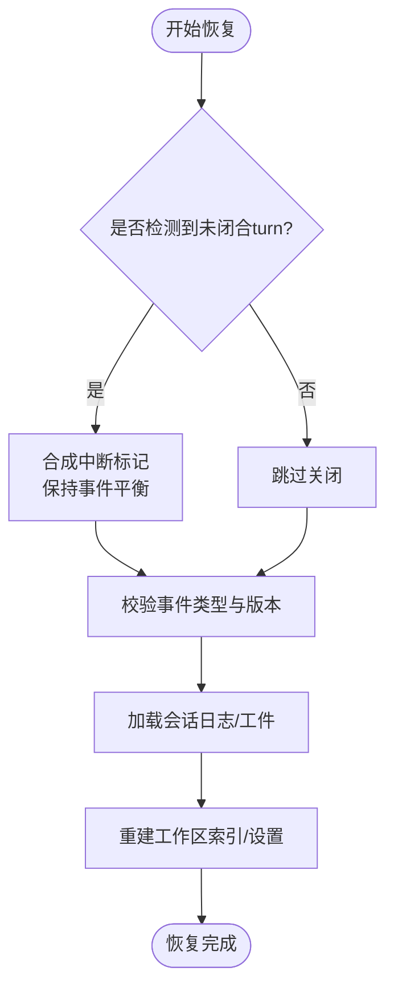
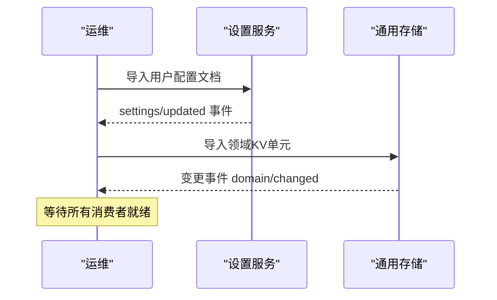
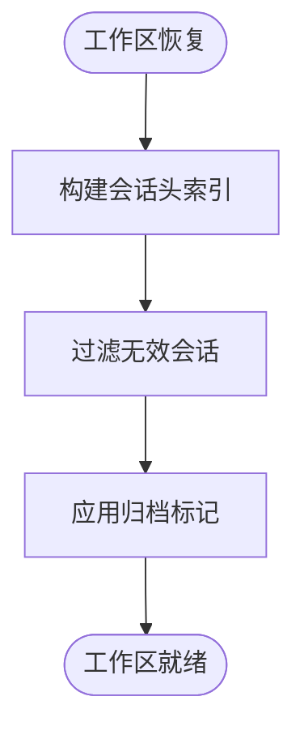
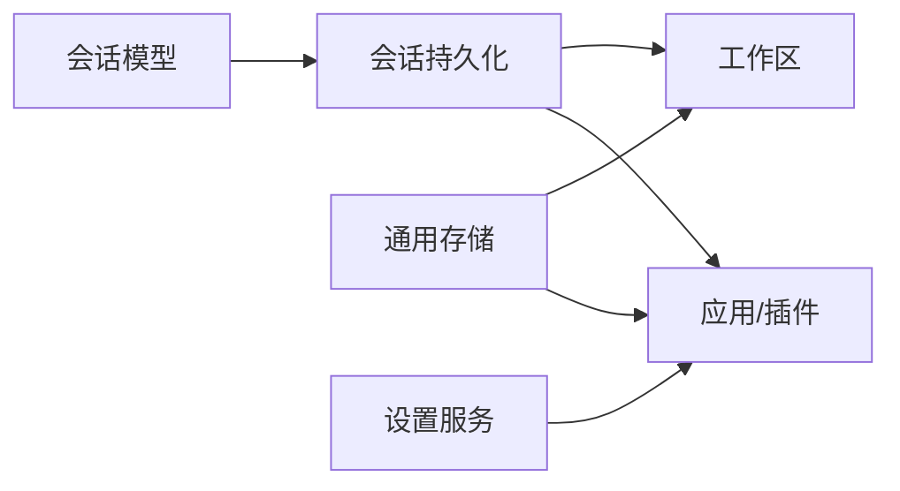

# 备份恢复

<cite>
**本文引用的文件**
- [persistence.md](file://docs/subsystems/persistence.md)
- [storage.md](file://docs/subsystems/storage.md)
- [session.md](file://docs/subsystems/session.md)
- [settings.md](file://docs/subsystems/settings.md)
- [workspace.md](file://docs/subsystems/workspace.md)
- [persistence-catalog.md](file://docs/persistence-catalog.md)
</cite>

## 目录
1. [简介](#简介)
2. [项目结构](#项目结构)
3. [核心组件](#核心组件)
4. [架构总览](#架构总览)
5. [详细组件分析](#详细组件分析)
6. [依赖关系分析](#依赖关系分析)
7. [性能与容量规划](#性能与容量规划)
8. [故障排查指南](#故障排查指南)
9. [结论](#结论)
10. [附录：策略清单与流程](#附录策略清单与流程)

## 简介
本文件面向生产环境的“数据备份与恢复”策略，覆盖会话数据、用户配置与系统状态的定期备份、灾难恢复、一致性校验与回滚机制，以及存储优化（归档、清理、空间管理）和高可用配置（主从复制、负载均衡、故障转移）。文档基于仓库中的持久化、存储、工作区与设置子系统的设计与能力进行系统化整理，确保在真实部署中可落地执行。

## 项目结构
本项目的数据持久化与备份恢复相关能力主要分布在以下子系统：
- 会话持久化：以事件日志为核心，提供 JSONL 与 SQLite 两种后端，支持崩溃恢复、原始工件读取、轻量快照与列表能力。
- 通用存储：键值域模型与后端抽象，支持 JSON 文件与 SQLite 后端，具备原子写入、版本检查与变更事件。
- 工作区：对会话归属的元数据索引与归档标记，辅助会话分组与归档。
- 设置：用户配置的分层解析与持久化，支持外部编辑推送与变更事件。
- 会话模型：事件类型、表面投影、请求头/上下文等，为导出与校验提供稳定语义。

图表来源
- [persistence.md:231-237](file://docs/subsystems/persistence.md#L231-L237)
- [storage.md:9-48](file://docs/subsystems/storage.md#L9-L48)
- [workspace.md:118-123](file://docs/subsystems/workspace.md#L118-L123)
- [settings.md:155-163](file://docs/subsystems/settings.md#L155-L163)

章节来源
- [persistence.md:1-120](file://docs/subsystems/persistence.md#L1-L120)
- [storage.md:1-48](file://docs/subsystems/storage.md#L1-L48)
- [workspace.md:1-123](file://docs/subsystems/workspace.md#L1-L123)
- [settings.md:1-163](file://docs/subsystems/settings.md#L1-L163)

## 核心组件
- 会话持久化（SessionPersistence）
  - 职责：定位、创建、追加、准备、加载、检查、后缀读取、列出与快照观察；保证追加顺序与连续性，崩溃恢复时补全中断的 turn。
  - 关键能力：原始工件读取（readRaw）、轻量快照（listSnapshots）、按序列后缀读取（readFrom）、冷启动修复。
- 通用存储（Storage + Domain）
  - 职责：提供键值域模型与后端抽象，支持 JSON 与 SQLite 后端；每个写操作在介质上原子且持久化后发出变更事件。
- 工作区（Workspace）
  - 职责：维护目录级会话索引、会话归档标记、启动时历史引导与一致性过滤。
- 设置（Settings）
  - 职责：用户配置分层解析、持久化、外部编辑推送、变更事件；支持路径级编辑与冲突检测。
- 会话模型（Session）
  - 职责：事件源模型、表面投影、请求头/上下文折叠；为导出、校验与重放提供稳定语义。

章节来源
- [persistence.md:231-380](file://docs/subsystems/persistence.md#L231-L380)
- [storage.md:9-126](file://docs/subsystems/storage.md#L9-L126)
- [workspace.md:118-223](file://docs/subsystems/workspace.md#L118-L223)
- [settings.md:155-311](file://docs/subsystems/settings.md#L155-L311)
- [session.md:1-125](file://docs/subsystems/session.md#L1-L125)

## 架构总览
下图展示了备份恢复涉及的核心数据面与控制面：会话事件日志是“唯一事实源”，通用存储承载非会话类数据，工作区负责会话归属与归档标记，设置承载用户配置。备份应覆盖这些组件的数据与元数据，恢复需遵循一致的顺序与一致性校验。

图表来源
- [persistence.md:231-380](file://docs/subsystems/persistence.md#L231-L380)
- [storage.md:9-126](file://docs/subsystems/storage.md#L9-L126)
- [workspace.md:118-223](file://docs/subsystems/workspace.md#L118-L223)
- [settings.md:155-311](file://docs/subsystems/settings.md#L155-L311)

## 详细组件分析

### 会话数据备份与恢复
- 备份要点
  - 使用会话持久化的“原始工件读取”能力获取字节级一致内容，避免通过事件重建引入偏差。
  - 使用“轻量快照/列表”能力快速枚举会话元数据，便于增量与差异备份。
  - 对于 JSONL 后端，建议直接备份每会话独立工件；对于 SQLite 后端，建议采用数据库级快照或一致性导出。
- 恢复要点
  - 冷启动恢复：若发现未闭合的 turn，系统会合成中断标记以保持平衡，无需截断已提交事件。
  - 恢复顺序：先恢复会话事件日志，再恢复工作区索引与设置，最后启动服务。
  - 一致性校验：利用“格式拒绝”机制与事件类型白名单，拒绝未知或不兼容的事件类型，防止静默降级。

图表来源
- [persistence.md:13-20](file://docs/subsystems/persistence.md#L13-L20)
- [persistence.md:92-95](file://docs/subsystems/persistence.md#L92-L95)
- [persistence.md:231-380](file://docs/subsystems/persistence.md#L231-L380)

章节来源
- [persistence.md:13-20](file://docs/subsystems/persistence.md#L13-L20)
- [persistence.md:92-95](file://docs/subsystems/persistence.md#L92-L95)
- [persistence.md:231-380](file://docs/subsystems/persistence.md#L231-L380)
- [session.md:601-606](file://docs/subsystems/session.md#L601-L606)

### 用户配置与系统状态备份与恢复
- 备份要点
  - 设置服务支持外部编辑推送与变更事件，备份时应捕获完整用户文档与当前解析后的值。
  - 通用存储的领域 KV 单元提供原子写入与版本检查，适合备份配置、路由、权限等系统状态。
- 恢复要点
  - 恢复设置文档后，监听变更事件以驱动消费者重新加载配置。
  - 恢复领域 KV 后，验证记录是否符合领域 schema，不匹配则拒绝并告警。

图表来源
- [settings.md:155-311](file://docs/subsystems/settings.md#L155-L311)
- [storage.md:104-126](file://docs/subsystems/storage.md#L104-L126)

章节来源
- [settings.md:155-311](file://docs/subsystems/settings.md#L155-L311)
- [storage.md:104-126](file://docs/subsystems/storage.md#L104-L126)

### 工作区与归档
- 备份要点
  - 工作区维护会话归属与归档标记，备份时需包含工作区索引与归档状态。
  - 启动时会基于会话头信息构建历史索引，确保会话与目录的一致性。
- 恢复要点
  - 恢复工作区索引后，系统会过滤无效会话（如 cwd 不匹配），保证一致性。
  - 归档标记用于将会话移出活跃视图，不影响其事件日志完整性。

图表来源
- [workspace.md:118-123](file://docs/subsystems/workspace.md#L118-L123)
- [workspace.md:207-213](file://docs/subsystems/workspace.md#L207-L213)

章节来源
- [workspace.md:118-123](file://docs/subsystems/workspace.md#L118-L123)
- [workspace.md:207-213](file://docs/subsystems/workspace.md#L207-L213)

### 高可用配置（主从复制、负载均衡、故障转移）
- 主从复制
  - 会话持久化：JSONL 后端建议配合文件系统级复制（如 LVM snapshot、对象存储同步）；SQLite 后端建议使用数据库级复制（如 WAL 模式+物理复制）。
  - 通用存储：JSON 后端建议对象存储多副本；SQLite 后端使用数据库复制。
  - 设置服务：用户配置文档建议多副本存储（对象存储/分布式文件系统）。
- 负载均衡
  - 无状态服务层前加负载均衡器，将读写请求分发至多个实例；读多写少场景可启用只读副本。
- 故障转移
  - 健康检查与自动切换：当主节点不可用时，切换到只读副本或备用节点。
  - 数据一致性：切换前确保复制延迟在阈值内，必要时暂停写入直至一致。

本节为概念性说明，不直接映射具体代码文件。

### 备份验证与测试流程
- 验证步骤
  - 完整性校验：对备份工件计算哈希并与预期对比；对 SQLite 数据库运行一致性检查。
  - 可恢复性演练：在隔离环境执行恢复流程，验证会话可重放、工作区索引正确、设置生效。
  - 一致性校验：利用会话持久化的“格式拒绝”与事件类型白名单，确保恢复后的日志可被当前版本正确解读。
- 测试用例
  - 正常恢复：从最近一次全量备份恢复，验证会话与配置一致。
  - 增量恢复：从最近一次增量备份恢复，验证增量合并正确。
  - 失败恢复：模拟损坏的工件，验证系统拒绝并给出升级方向或错误提示。

本节为概念性说明，不直接映射具体代码文件。

## 依赖关系分析
- 会话持久化依赖会话模型与事件类型目录，确保事件可解释性与兼容性。
- 通用存储依赖领域 schema 与后端实现，确保数据一致性与变更通知。
- 工作区依赖会话持久化与工作区注册表，确保会话归属与归档一致性。
- 设置服务依赖提供者实现，确保配置持久化与外部编辑推送。

图表来源
- [persistence.md:231-380](file://docs/subsystems/persistence.md#L231-L380)
- [storage.md:9-126](file://docs/subsystems/storage.md#L9-L126)
- [workspace.md:118-223](file://docs/subsystems/workspace.md#L118-L223)
- [settings.md:155-311](file://docs/subsystems/settings.md#L155-L311)

章节来源
- [persistence.md:231-380](file://docs/subsystems/persistence.md#L231-L380)
- [storage.md:9-126](file://docs/subsystems/storage.md#L9-L126)
- [workspace.md:118-223](file://docs/subsystems/workspace.md#L118-L223)
- [settings.md:155-311](file://docs/subsystems/settings.md#L155-L311)

## 性能与容量规划
- 备份频率
  - 会话事件日志：高频增量（如每小时）+ 每日全量；JSONL 可直接增量，SQLite 建议定时快照。
  - 用户配置：变更即备份或每分钟增量。
  - 工作区索引：随会话变更增量备份。
- 存储优化
  - 归档：将长时间未活跃的会话归档至冷存储，保留元数据以便检索。
  - 清理：定期清理过期备份工件，保留策略基于 RPO/RTO 目标。
  - 压缩：对 JSONL 工件使用压缩格式（如 Zstandard）以减少空间占用。
- 容量监控
  - 监控备份大小增长趋势，设置阈值告警。
  - 对 SQLite 数据库监控文件大小与 WAL 增长。

本节为概念性说明，不直接映射具体代码文件。

## 故障排查指南
- 常见问题
  - 恢复后会话无法重放：检查事件类型是否在白名单内，版本是否兼容。
  - 工作区索引不一致：检查会话头 cwd 是否与目录一致，过滤无效会话。
  - 设置未生效：检查设置文档是否完整，监听变更事件是否正确处理。
- 诊断工具
  - 使用会话持久化的“检查”能力获取不可变逻辑视图，验证事件连续性。
  - 使用通用存储的变更事件定位写入顺序与冲突。
  - 使用工作区的状态查询确认会话归属与归档标记。

章节来源
- [persistence.md:13-20](file://docs/subsystems/persistence.md#L13-L20)
- [persistence.md:92-95](file://docs/subsystems/persistence.md#L92-L95)
- [storage.md:104-126](file://docs/subsystems/storage.md#L104-L126)
- [workspace.md:118-123](file://docs/subsystems/workspace.md#L118-L123)

## 结论
本策略基于仓库中的持久化、存储、工作区与设置子系统能力，提供了完整的备份与恢复方案。通过会话事件日志的原始工件读取、通用存储的领域 KV 单元、工作区的归档标记与设置的变更事件，可实现高可靠的数据保护与快速恢复。结合主从复制、负载均衡与故障转移，可进一步提升系统可用性。建议在生产环境中定期演练恢复流程，确保备份数据的完整性与可恢复性。

## 附录：策略清单与流程
- 备份清单
  - 会话事件日志（JSONL/SQLite）
  - 用户配置文档（设置服务）
  - 工作区索引与归档标记
  - 通用存储领域 KV 单元
- 恢复流程
  - 停止写入或切换到只读模式
  - 恢复会话事件日志
  - 恢复工作区索引与归档标记
  - 恢复用户配置与系统状态
  - 启动服务并验证一致性
- 验证步骤
  - 完整性校验（哈希/数据库检查）
  - 可恢复性演练（隔离环境恢复）
  - 一致性校验（事件类型与版本）

本节为概念性说明，不直接映射具体代码文件。