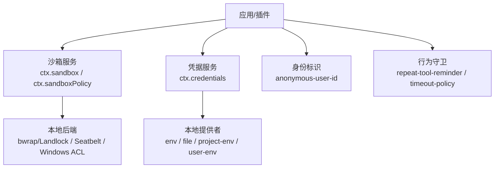
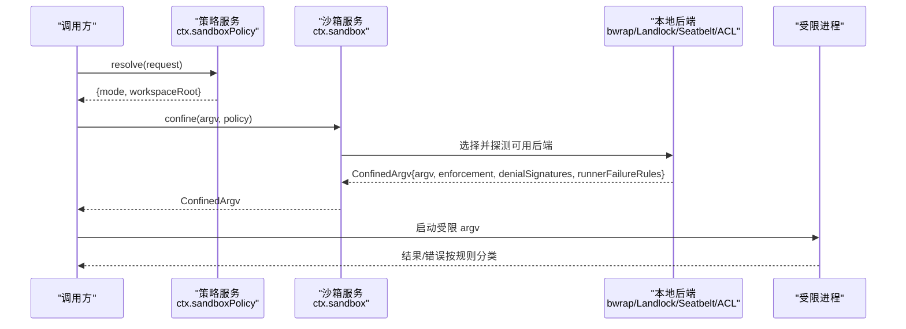
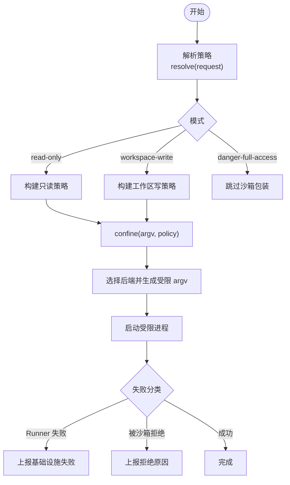
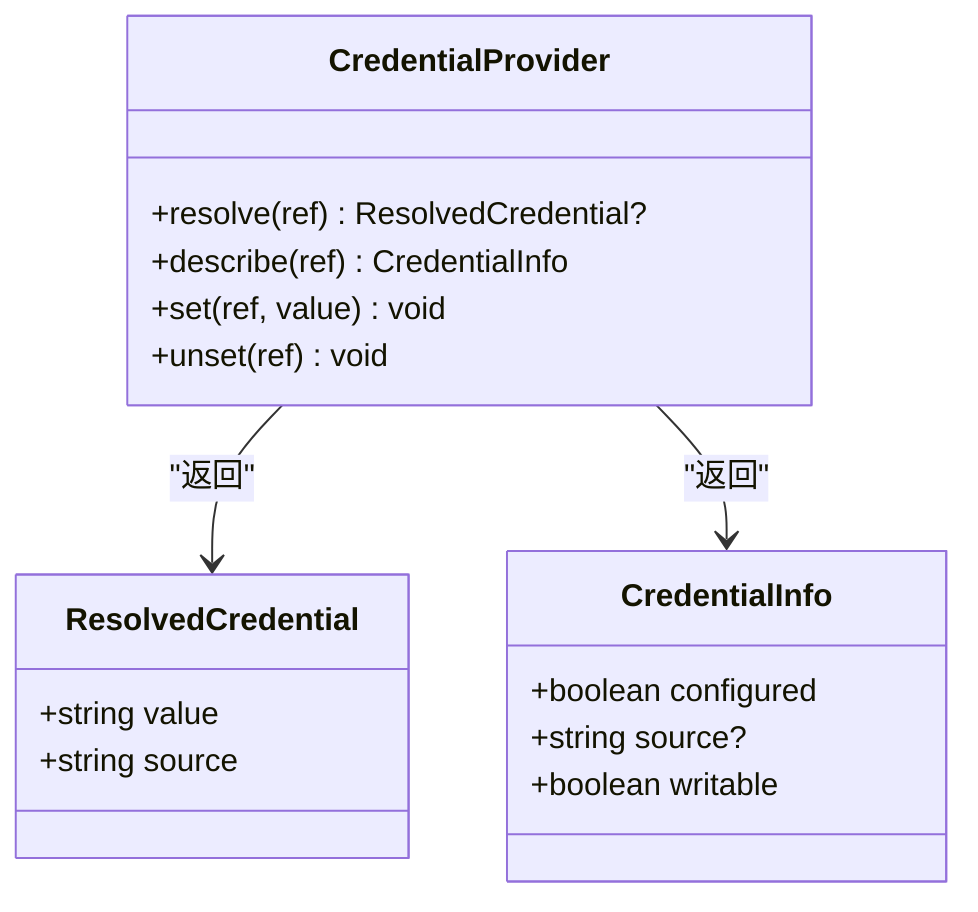
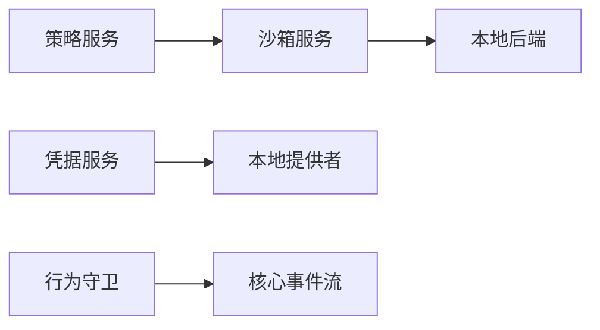

# 安全加固

<cite>
**本文引用的文件**
- [packages/sandbox/README.md](file://packages/sandbox/README.md)
- [docs/subsystems/sandbox.md](file://docs/subsystems/sandbox.md)
- [packages/sandbox/sandbox/src/index.ts](file://packages/sandbox/sandbox/src/index.ts)
- [packages/sandbox/sandbox-policy/src/index.ts](file://packages/sandbox/sandbox-policy/src/index.ts)
- [packages/credentials/README.md](file://packages/credentials/README.md)
- [docs/subsystems/credentials.md](file://docs/subsystems/credentials.md)
- [packages/credentials/credentials/src/index.ts](file://packages/credentials/credentials/src/index.ts)
- [packages/identity/README.md](file://packages/identity/README.md)
- [packages/guard/README.md](file://packages/guard/README.md)
</cite>

## 目录
1. [简介](#简介)
2. [项目结构](#项目结构)
3. [核心组件](#核心组件)
4. [架构总览](#架构总览)
5. [详细组件分析](#详细组件分析)
6. [依赖关系分析](#依赖关系分析)
7. [性能与安全权衡](#性能与安全权衡)
8. [故障排查指南](#故障排查指南)
9. [结论](#结论)
10. [附录](#附录)

## 简介
本指南面向部署与运维人员，聚焦 deepseek-harness 的安全加固实践。内容覆盖：
- 沙箱隔离机制与 Landlock 集成、权限控制策略
- 网络安全配置（防火墙、SSL/TLS、API 访问控制）
- 身份认证与授权（JWT、OAuth2、细粒度权限）
- 数据安全（敏感数据加密、日志脱敏、访问审计）
- 自动化安全扫描与漏洞检测
- 安全事件响应与修复策略

说明：本项目在进程级隔离、凭据管理、行为守卫等方面提供了可落地的能力；网络与认证部分以通用最佳实践补充，便于结合现有网关与服务进行加固。

## 项目结构
与“安全”直接相关的子系统集中在以下位置：
- 进程沙箱：packages/sandbox（抽象服务）、packages/sandbox/sandbox-local（本地后端，含 Linux bwrap/Landlock、macOS Seatbelt、Windows ACL）
- 凭据管理：packages/credentials（引用与提供者分离），credentials-local（环境变量与本地文件提供）
- 身份标识：packages/identity（匿名用户 ID，用于遥测与反馈关联）
- 行为守卫：packages/guard（重复工具调用提醒、超时策略等）

图示来源
- [docs/subsystems/sandbox.md:1-219](file://docs/subsystems/sandbox.md#L1-L219)
- [docs/subsystems/credentials.md:1-134](file://docs/subsystems/credentials.md#L1-L134)

章节来源
- [packages/sandbox/README.md:1-16](file://packages/sandbox/README.md#L1-L16)
- [docs/subsystems/sandbox.md:1-219](file://docs/subsystems/sandbox.md#L1-L219)
- [docs/subsystems/credentials.md:1-134](file://docs/subsystems/credentials.md#L1-L134)

## 核心组件
- 进程沙箱（Sandbox）
  - 抽象服务：ctx.sandbox.confine(argv, policy) 返回受约束的 argv 及执行完整性报告
  - 策略服务：ctx.sandboxPolicy.resolve() 解析每次调用的模式与工作区根
  - 模式：read-only、workspace-write、danger-full-access（仅前两种可下发到后端）
  - 执行完整性：full/partial（旧内核或平台差异可能导致部分生效）
- 凭据（Credentials）
  - 引用与值分离：配置中只保存引用（如环境变量名），运行时由提供者解析
  - 操作：resolve/describe/set/unset；变更事件 credentials/updated
- 身份（Identity）
  - 匿名用户 ID：持久化一次 Harness-home 相关 ID，用于遥测与反馈
- 守卫（Guard）
  - 重复工具调用提醒、超时策略等，作为对 agent 循环的行为护栏

章节来源
- [docs/subsystems/sandbox.md:9-156](file://docs/subsystems/sandbox.md#L9-L156)
- [docs/subsystems/credentials.md:9-134](file://docs/subsystems/credentials.md#L9-L134)
- [packages/identity/README.md:1-10](file://packages/identity/README.md#L1-L10)
- [packages/guard/README.md:1-13](file://packages/guard/README.md#L1-L13)

## 架构总览
下图展示典型调用链：上层能力（工具/子代理/Shell）通过策略服务确定执行模式，再经沙箱服务包装为受限 argv，最终由本地后端落地为具体隔离技术（Landlock/bwrap/Seatbelt/ACL）。凭据服务在每次操作边界解析密钥，避免将敏感值写入配置。

图示来源
- [docs/subsystems/sandbox.md:41-156](file://docs/subsystems/sandbox.md#L41-L156)
- [packages/sandbox/sandbox/src/index.ts:158-187](file://packages/sandbox/sandbox/src/index.ts#L158-L187)
- [packages/sandbox/sandbox-policy/src/index.ts:91-213](file://packages/sandbox/sandbox-policy/src/index.ts#L91-L213)

## 详细组件分析

### 进程沙箱与 Landlock 集成
- 模式与边界
  - read-only：仅允许必要写目标（如 /dev/null），禁止其他写
  - workspace-write：允许在工作区根与后端提供的临时区域写
  - danger-full-access：不经过沙箱包装（不应对外暴露）
- 执行完整性
  - full：后端能完全实现承诺的文件效果
  - partial：由于内核 ABI 或平台限制，仅部分生效；需要绝对边界的场景应拒绝或提示
- 失败分类
  - denialSignatures：被沙箱正确拦截时的诊断特征
  - runnerFailureRules：沙箱运行器自身失败的特征（退出码、stderr 行匹配）
- 策略解析
  - 优先顺序：显式批准的模式 > 会话最近记录的模式 > 部署默认
  - 工作区根：来自会话不可变 cwd 规范化后的路径，或部署配置的后备

图示来源
- [docs/subsystems/sandbox.md:9-156](file://docs/subsystems/sandbox.md#L9-L156)
- [docs/subsystems/sandbox.md:152-156](file://docs/subsystems/sandbox.md#L152-L156)

章节来源
- [docs/subsystems/sandbox.md:9-156](file://docs/subsystems/sandbox.md#L9-L156)
- [docs/subsystems/sandbox.md:152-156](file://docs/subsystems/sandbox.md#L152-L156)

### 凭据管理与敏感数据保护
- 引用与值分离：配置中仅保存引用（如环境变量名），避免硬编码密钥
- 每操作解析：每次操作重新 resolve，支持热更新与轮换
- 描述与可写性：describe 返回是否已配置、来源层、是否可写，不暴露值
- 变更事件：credentials/updated 通知持久化源变更，UI 可刷新状态

图示来源
- [docs/subsystems/credentials.md:9-134](file://docs/subsystems/credentials.md#L9-L134)
- [packages/credentials/credentials/src/index.ts:60-104](file://packages/credentials/credentials/src/index.ts#L60-L104)

章节来源
- [docs/subsystems/credentials.md:9-134](file://docs/subsystems/credentials.md#L9-L134)
- [packages/credentials/README.md:1-15](file://packages/credentials/README.md#L1-L15)

### 身份与匿名标识
- 匿名用户 ID：用于遥测、反馈与请求关联，不代表已认证账户
- 使用建议：仅在必要时启用，最小化采集范围

章节来源
- [packages/identity/README.md:1-10](file://packages/identity/README.md#L1-L10)

### 行为守卫与资源控制
- 重复工具调用提醒：降低无效循环风险
- 超时策略：为工具调用设置截止时间，防止长时间占用资源

章节来源
- [packages/guard/README.md:1-13](file://packages/guard/README.md#L1-L13)

## 依赖关系分析
- 沙箱服务依赖策略服务决定执行模式与工作区根
- 沙箱服务依赖本地后端实现具体隔离（Linux 推荐启用 Landlock 以获得更细粒度的系统调用限制）
- 凭据服务独立于配置层，通过提供者实现多来源解析
- 守卫模块监听核心事件，对异常行为进行干预

图示来源
- [docs/subsystems/sandbox.md:1-219](file://docs/subsystems/sandbox.md#L1-L219)
- [docs/subsystems/credentials.md:1-134](file://docs/subsystems/credentials.md#L1-L134)

章节来源
- [docs/subsystems/sandbox.md:1-219](file://docs/subsystems/sandbox.md#L1-L219)
- [docs/subsystems/credentials.md:1-134](file://docs/subsystems/credentials.md#L1-L134)

## 性能与安全权衡
- 沙箱开销
  - 进程包装与策略评估带来少量额外延迟；建议在高频路径复用策略缓存（由策略服务负责）
  - partial 模式下需考虑降级策略（如拒绝关键写操作）
- 凭据解析
  - 每操作解析可能引入 I/O；可通过合理设计减少热点路径上的频繁解析
- 守卫策略
  - 超时与提醒会增加事件处理开销，但有助于整体稳定性

[本节为通用指导，无需特定文件来源]

## 故障排查指南
- 沙箱不可用
  - 现象：confine 抛出不可用错误
  - 排查：检查后端可用性、内核 ABI、平台支持；确认未误用 danger-full-access
- 部分执行（partial）
  - 现象：后端报告 partial
  - 排查：升级内核或切换后端；对必须完整边界的场景拒绝执行
- 凭据未配置
  - 现象：resolve 返回 undefined
  - 排查：检查引用是否正确、提供者是否就绪；使用 describe 查看来源与可写性
- 凭据未生效
  - 现象：变更后未读取到新值
  - 排查：确保每次操作都重新 resolve；确认未跨操作缓存
- 守卫触发
  - 现象：工具重复调用提醒或超时
  - 排查：优化调用逻辑；调整超时阈值

章节来源
- [docs/subsystems/sandbox.md:152-156](file://docs/subsystems/sandbox.md#L152-L156)
- [docs/subsystems/credentials.md:9-134](file://docs/subsystems/credentials.md#L9-L134)

## 结论
- 进程级隔离是本项目安全基座：通过策略服务与本地后端（推荐启用 Landlock）实现最小权限执行
- 凭据管理采用引用与值分离，支持热更新与审计友好
- 行为守卫为系统稳定性提供兜底保障
- 结合网络与认证的最佳实践，可形成端到端的安全闭环

[本节为总结性内容，无需特定文件来源]

## 附录

### 沙箱隔离机制的配置与使用（实操要点）
- 部署默认模式：建议默认 workspace-write，严格限制危险模式
- 会话级覆盖：通过会话事件记录模式，确保可追溯
- 工作区根：确保 cwd 规范化后与预期一致，避免符号链接绕过
- 后端选择：Linux 优先启用 Landlock；macOS 使用 Seatbelt；Windows 使用 ACL 受限令牌
- 失败分类：区分“运行器失败”和“被沙箱拒绝”，分别上报与处置

章节来源
- [docs/subsystems/sandbox.md:9-156](file://docs/subsystems/sandbox.md#L9-L156)
- [docs/subsystems/sandbox.md:152-156](file://docs/subsystems/sandbox.md#L152-L156)

### 网络安全配置（通用最佳实践）
- 防火墙规则
  - 仅开放必要端口；限制来源 IP；出站连接白名单
- SSL/TLS 证书管理
  - 使用受信任 CA 签发的证书；定期轮换；禁用弱密码套件
- API 访问控制
  - 强制 HTTPS；最小权限原则；速率限制与配额；输入校验与输出编码

[本节为通用指导，无需特定文件来源]

### 身份认证与授权（通用最佳实践）
- JWT 令牌
  - 短生命周期；签名校验；防重放；服务端存储最小化
- OAuth2 流程
  - 使用 PKCE；最小 scope；回调域名白名单；状态参数校验
- 细粒度权限
  - 基于资源的授权（RBAC/ABAC）；动态策略；审计日志

[本节为通用指导，无需特定文件来源]

### 数据安全（加密、脱敏、审计）
- 敏感数据加密
  - 传输层 TLS；静态数据加密（磁盘/备份）；密钥轮换
- 日志脱敏
  - 屏蔽令牌、密码、个人身份信息；统一脱敏中间件
- 数据访问审计
  - 记录谁在何时访问了什么；不可篡改存储；告警与巡检

[本节为通用指导，无需特定文件来源]

### 安全扫描与漏洞检测（自动化流程）
- 代码扫描：依赖漏洞扫描、静态分析、模板注入检测
- 容器镜像扫描：基础镜像与依赖库漏洞
- 运行时防护：沙箱、WAF、RASP
- 流水线集成：PR 门禁、阻断高危问题、自动修复建议

[本节为通用指导，无需特定文件来源]

### 安全事件响应与修复策略
- 分级响应：P0-P3 定义响应时限与升级路径
- 快速止血：回滚、限流、熔断、隔离
- 根因分析与复盘：时间线、影响面、改进项
- 持续加固：补丁管理、基线核查、演练

[本节为通用指导，无需特定文件来源]