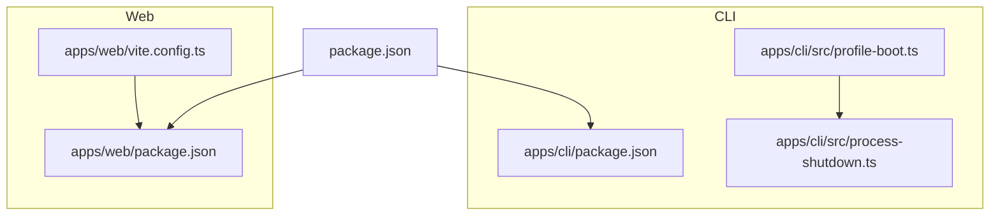
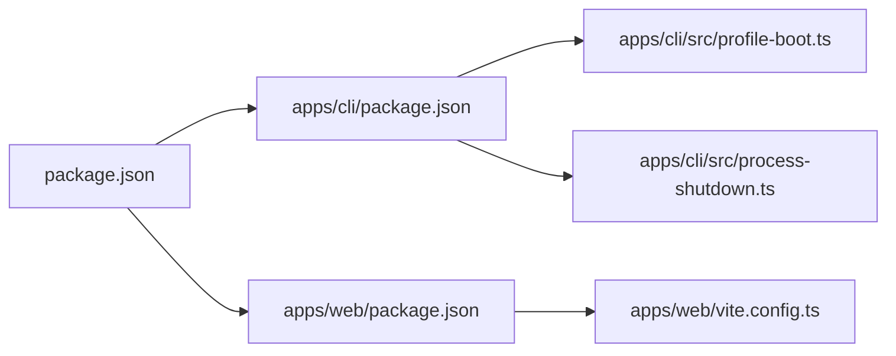

# 性能优化

<cite>
**本文引用的文件**
- [package.json](file://package.json)
- [apps/cli/package.json](file://apps/cli/package.json)
- [apps/web/package.json](file://apps/web/package.json)
- [apps/web/vite.config.ts](file://apps/web/vite.config.ts)
- [apps/cli/src/profile-boot.ts](file://apps/cli/src/profile-boot.ts)
- [apps/cli/src/process-shutdown.ts](file://apps/cli/src/process-shutdown.ts)
</cite>

## 目录
1. [简介](#简介)
2. [项目结�](#项目结�)
3. [核心组件](#核心组件)
4. [��总览](#��总览)
5. [详细组件分�](#详细组件分�)
6. [�赖关系分�](#�赖关系分�)
7. [性能注�事项](#性能注�事项)
8. [故障�查指�](#故障�查指�)
9. [结论](#结论)
10. [附录](#附录)

## 简介
本指��� DeepSeek Harness 项目的生产�开��境，�焦以下目标：
- Node.js 进程内存管��调优（进程�数��圾�收策略�内存泄�检测）
- 并��制�置（Worker 线程池���池�资��制）
- 数�库性能优化（查询优化�索引策略�缓存�置）
- �端性能优化（代�分割�资��缩��览器缓存）
- 性能监��分�（APM 集��指标采集�瓶颈识别）

本仓库在�端�建�CLI �动�程�进程退出等方��供了��地的优化点；数�库� APM 相关内容以通用�践为主，结�仓库�有能力给出建议。

## 项目结�
仓库采用多包 monorepo 结�，关键�性能相关的入���置如下：
- CLI 应用：apps/cli，负责�动�组��件�热�载�进程生命周期管�
- Web �端：apps/web，基� Vite �建，包�精细的代�分割���资�组织
- 根工程脚本：package.json �供�建�测试�文档等统一命令

图表��
- [apps/cli/src/profile-boot.ts:1-301](file://apps/cli/src/profile-boot.ts#L1-L301)
- [apps/cli/src/process-shutdown.ts:1-78](file://apps/cli/src/process-shutdown.ts#L1-L78)
- [apps/web/vite.config.ts:1-161](file://apps/web/vite.config.ts#L1-L161)
- [apps/cli/package.json:1-102](file://apps/cli/package.json#L1-L102)
- [apps/web/package.json:1-52](file://apps/web/package.json#L1-L52)

章节��
- [package.json:1-183](file://package.json#L1-L183)
- [apps/cli/package.json:1-102](file://apps/cli/package.json#L1-L102)
- [apps/web/package.json:1-52](file://apps/web/package.json#L1-L52)

## 核心组件
- CLI �动�组�：profile-boot 负责加载 profile��加补�层�注入�境���命令行�数�安装失败�����关闭
- 进程退出�制器：process-shutdown �供优雅退出�超时强制退出�信�处��并
- Web �建：vite.config.ts 定义 vendor chunk�语法高亮语言包分包�字体���资�路径���映射�别�解�

章节��
- [apps/cli/src/profile-boot.ts:1-301](file://apps/cli/src/profile-boot.ts#L1-L301)
- [apps/cli/src/process-shutdown.ts:1-78](file://apps/cli/src/process-shutdown.ts#L1-L78)
- [apps/web/vite.config.ts:1-161](file://apps/web/vite.config.ts#L1-L161)

## ��总览
下图展示 CLI �动到 Web �建的关键链路，以�性能相关�置点：

```mermaid
sequenceDiagram
participant User as "用户/CI"
participant CLI as "dsh CLI(profile-boot)"
participant Boot as "Cordis Loader/Boot"
participant App as "应用�件/�务"
participant Shutdown as "进程退出�制器"
participant Web as "Vite �建(vite.config.ts)"
User->>CLI : 执行 dsh 命令
CLI->>Boot : 加载 profile��加补�层
Boot-->>App : 挂载�务��件
CLI->>Shutdown : 注册信��优雅退出
Note over CLI,Shutdown : 超时�强制退出，���死
User->>Web : �建�端产物
Web-->>User : 输出 index/vendor/langs/fonts 分片
```

图表��
- [apps/cli/src/profile-boot.ts:142-259](file://apps/cli/src/profile-boot.ts#L142-L259)
- [apps/cli/src/process-shutdown.ts:22-76](file://apps/cli/src/process-shutdown.ts#L22-L76)
- [apps/web/vite.config.ts:92-128](file://apps/web/vite.config.ts#L92-L128)

## 详细组件分�

### Node.js 进程�数�内存管�
- �行时版本约�：根 package.json 指定 Node 引�范围，确�使用较新的 V8 特性以�得更好的 GC �性能
- 进程�动入�：通过根脚本中的 dsh 命令调用 CLI 二进制，便�在部署时统一传入 Node �数（如 --max-old-space-size�--max-semi-space-size�--gc-interval 等）
- 优雅退出�超时：process-shutdown �供统一的 shutdown/interrupt ��，并内置超时强制退出，��长时间 GC 或资�释放导致进程挂起
- 建议的调优�点
  - 根�工作负载设置堆上��新生代大�，�少频� GC
  - 在高��场景适当调整 GC 触�频�，平衡延迟���
  - �� heapdump � Chrome DevTools 进行堆快照对比，定��长对象

章节��
- [package.json:8-10](file://package.json#L8-L10)
- [package.json:136-142](file://package.json#L136-L142)
- [apps/cli/src/process-shutdown.ts:1-78](file://apps/cli/src/process-shutdown.ts#L1-L78)

### �圾�收策略�内存泄�检测
- 策略选择：优先使用默认��/并行 GC；对�延迟场景��试更激进的 GC 间隔
- 检测手段
  - 定期生�堆快照，比较差异定��续�长的对象
  - 使用事件循�� I/O 热点分�，�除长任务阻�导致的“伪内存泄��
  - 在 CLI 中利用 process-shutdown 的超时机制，确�异常情况下�会长期�用资�
- 最佳�践
  - ��全局大对象常驻；�时释放��定时器�监�器
  - 对长会�数�采用分页��缩存储，��内存峰值

[本节为通用指导，�直�分�具体文件]

### 并��制�置（Worker 线程池���池�资��制）
- Worker 线程æ±
  - 代��行�工具执行通常通过�进程或 Worker 线程隔离，需按 CPU 核数� I/O 类�设定��池大�
  - ��过度并行导致上下文切��内存�力上�
- è¿�æ�¥æ±
  - 对外部�务（LLM�文件系统�终端）的��应�用并�制最大��数，防止雪崩
- 资��制
  - 结�进程级�制（ulimit�cgroups）�进程内�制（队列长度�超时），形����护
  - 使用 process-shutdown 的超时退出，��资�释放��

[本节为通用指导，�直�分�具体文件]

### 数�库性能优化（查询�索引�缓存）
- 查询优化
  - 仅选择必�字段，�� SELECT *；��使用 JOIN ��查询
  - 将高频读路径下沉至缓存层，�少数�库�力
- 索引策略
  - 针对高频过滤����关�列建立�适索引；��过多写放大
  - 定期分�慢查询日志，�续优化索引
- 缓存�置
  - 使用本地内存缓存�分布�缓存分层；注�缓存一致性�过期策略�穿�防护
  - 对热点键�����级，��缓存击穿

[本节为通用指导，�直�分�具体文件]

### �端性能优化（代�分割�资��缩��览器缓存）
- 代�分割
  - 将��渲染�赖（数学公��语法高亮�Markdown 解�）抽离为 vendor chunk，�少主包体积
  - 将语言包按需懒加载，首��加载必�语法，���始加载速度
- 资�组织��缩
  - 字体���资�按目录分组输出，便� CDN 缓存�版本化
  - 开���映射以便线上问题定�
- �览器缓存策略
  - 使用带哈希的文件���强缓存；vendor � index 分离，更新�赖时仅�哈希 vendor
- �建�置�点
  - 通过 manualChunks 精确�制分包边界
  - 通过 assetFileNames � chunkFileNames 规范输出布局

章节��
- [apps/web/vite.config.ts:21-74](file://apps/web/vite.config.ts#L21-L74)
- [apps/web/vite.config.ts:92-128](file://apps/web/vite.config.ts#L92-L128)
- [apps/web/vite.config.ts:118-125](file://apps/web/vite.config.ts#L118-L125)
- [apps/web/vite.config.ts:113-117](file://apps/web/vite.config.ts#L113-L117)
- [apps/web/vite.config.ts:94-96](file://apps/web/vite.config.ts#L94-L96)

### CLI �动�热�载的性能影�
- Profile 组��补�层
  - �动时按顺��加 bundle�profile�home � overlay 补�，����计算�状�污染
  - �次�新组�都克隆补�对象，��共享引用导致的热�载副作用
- 热�载� HMR
  - 当未�供 HMR �务时自动挂载轻� HMR，仅监��置文件�更，最�化��开销
- �境���命令行�数
  - �动�注入���的�境快照�命令行�数，���续修改引��一致

章节��
- [apps/cli/src/profile-boot.ts:105-171](file://apps/cli/src/profile-boot.ts#L105-L171)
- [apps/cli/src/profile-boot.ts:227-259](file://apps/cli/src/profile-boot.ts#L227-L259)
- [apps/cli/src/profile-boot.ts:268-299](file://apps/cli/src/profile-boot.ts#L268-L299)

### 进程退出�资�清�
- 优雅退出
  - �供 shutdown � interrupt 两�模�，支��并多次退出请求
  - 内置超时强制退出，��资�释放阻�导致进程无法结�
- 信�处�
  - SIGTERM/SIGINT 统一转为中断�程，确�所有�件有�释放资�

章节��
- [apps/cli/src/process-shutdown.ts:1-78](file://apps/cli/src/process-shutdown.ts#L1-L78)

## �赖关系分�
- CLI �赖 Cordis 生��多个内部�件，通过 profile �补�层动�组�
- Web �建�赖 Vite � React �件，并通过手动分包策略将��库拆分到 vendor
- 根工程脚本统一管��建�测试��布�程

图表��
- [package.json:19-47](file://package.json#L19-L47)
- [apps/cli/package.json:22-84](file://apps/cli/package.json#L22-L84)
- [apps/web/package.json:22-50](file://apps/web/package.json#L22-L50)
- [apps/cli/src/profile-boot.ts:14-39](file://apps/cli/src/profile-boot.ts#L14-L39)
- [apps/cli/src/process-shutdown.ts:1-12](file://apps/cli/src/process-shutdown.ts#L1-L12)
- [apps/web/vite.config.ts:1-5](file://apps/web/vite.config.ts#L1-L5)

章节��
- [package.json:19-47](file://package.json#L19-L47)
- [apps/cli/package.json:22-84](file://apps/cli/package.json#L22-L84)
- [apps/web/package.json:22-50](file://apps/web/package.json#L22-L50)

## 性能注�事项
- Node.js 进程
  - 根�机器内存�工作负载设置堆大�� GC �数
  - 使用堆快照��焰图定�热点�泄�
- 并��资�
  - ��设置 Worker 池���池上�，��资�争用
  - 引入超时�熔断，防止级�失败
- �端�建
  - �� vendor 稳定，�少�必��打包
  - 懒加载��模�，首��加载必需部分
- 数�库
  - 关注慢查询�索引命中�，定期优化
  - 使用缓存�轻数�库�力，注�一致性�失效策略
- 监��分�
  - �入 APM 收集关键指标（TTFT����错误��GC 时间）
  - 建立告警阈值�看�，�续跟踪性能趋势

[本节为通用指导，�直�分�具体文件]

## 故障�查指�
- 进程无法退出或退出缓慢
  - 检查 process-shutdown 的超时是�生效，确认是�有未释放的资�或阻�的异步�作
  - 查看�件 dispose 逻辑是�正确
- �端�建体积过大或首�过慢
  - 检查 vendor 分包是���，确认��库是�被正确拆分
  - 验�语言包是�按需懒加载，��全部打入主包
- �动阶段性能抖动
  - 观察 profile 组��补�层数�，�少�必�的 patch ��件
  - 确认 HMR 仅在需�时�用，���外开销

章节��
- [apps/cli/src/process-shutdown.ts:22-76](file://apps/cli/src/process-shutdown.ts#L22-L76)
- [apps/web/vite.config.ts:92-128](file://apps/web/vite.config.ts#L92-L128)
- [apps/cli/src/profile-boot.ts:268-299](file://apps/cli/src/profile-boot.ts#L268-L299)

## 结论
- 通过��的 Node.js 进程�数� GC 策略，结�堆快照��焰图，�有效�制内存�延迟
- 并��制需围绕 Worker 池���池�资��制进行系统化设计，��过载
- 数�库优化应�查询�索引�缓存三维度入手，�续跟踪慢查询�命中�
- �端�建已具备精细的分包�资�组织，进一步优化懒加载�缓存策略�显著��首�体验
- 建议在生产�境�入 APM，建立指标�告警，�续���解决瓶颈

[本节为总结性内容，�直�分�具体文件]

## 附录
- 常用 Node �数�考（示例）
  - --max-old-space-size：设置�年代堆上�
  - --max-semi-space-size：设置新生代堆大�
  - --gc-interval：调整 GC 触�频�
- �端�建关键�置�置
  - apps/web/vite.config.ts：manualChunks�assetFileNames�chunkFileNames�sourcemap
- CLI �动关键�程�置
  - apps/cli/src/profile-boot.ts：profile 组��补�层�HMR��境��注入
  - apps/cli/src/process-shutdown.ts：优雅退出�超时强制退出�信�处�

章节��
- [apps/web/vite.config.ts:92-128](file://apps/web/vite.config.ts#L92-L128)
- [apps/cli/src/profile-boot.ts:142-259](file://apps/cli/src/profile-boot.ts#L142-L259)
- [apps/cli/src/process-shutdown.ts:22-76](file://apps/cli/src/process-shutdown.ts#L22-L76)