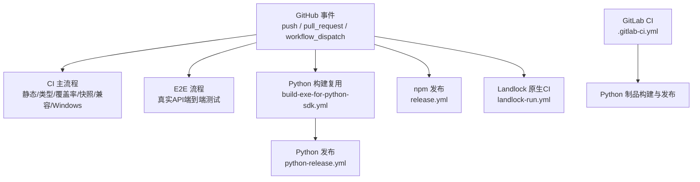
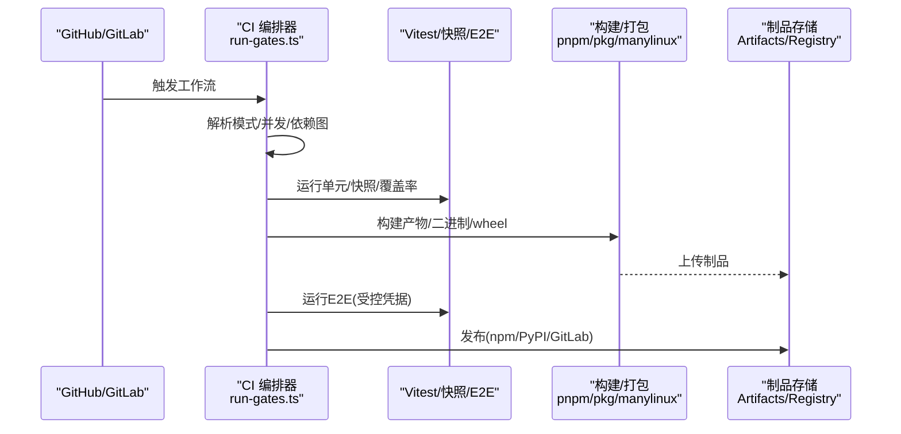
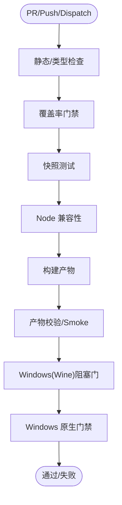
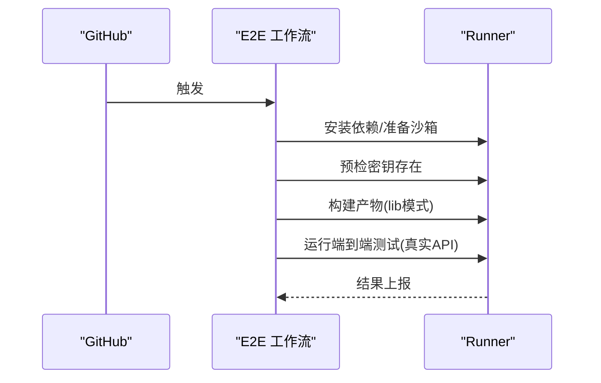
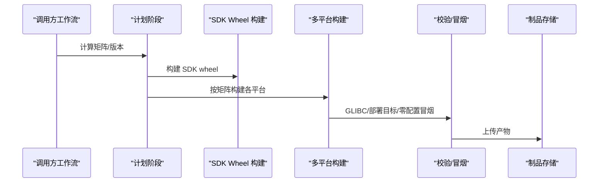
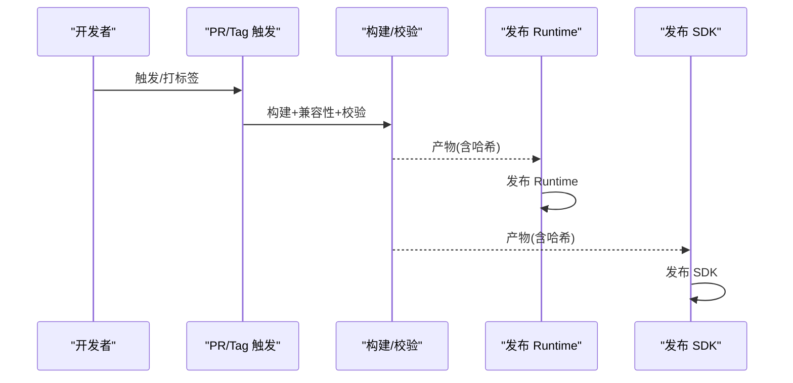
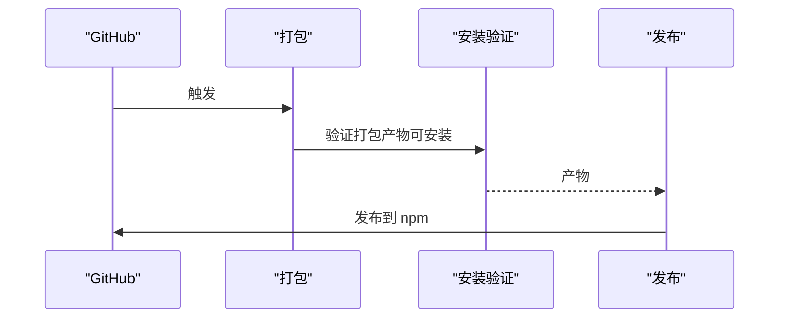
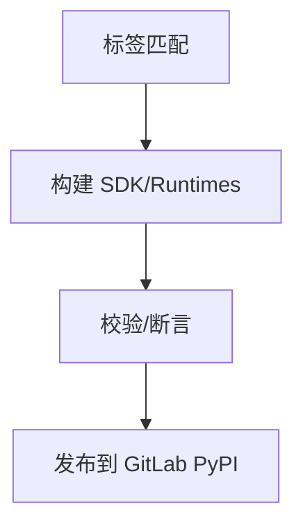
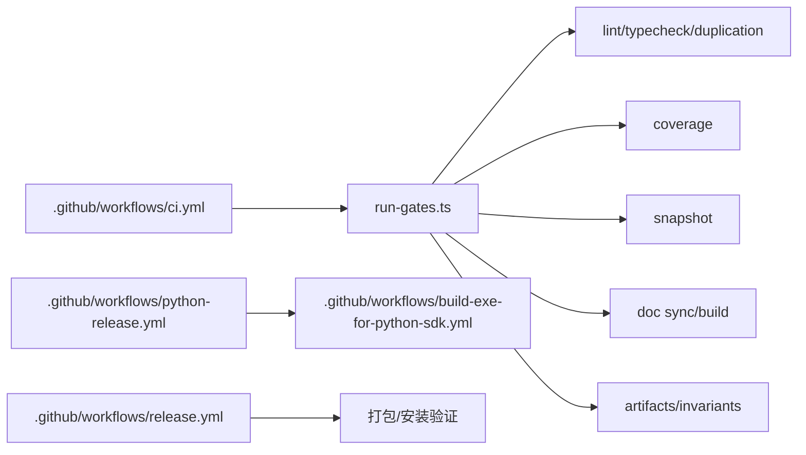

# 持续集成

<cite>
**本文引用的文件**
- [.github/workflows/ci.yml](file://.github/workflows/ci.yml)
- [.github/workflows/release.yml](file://.github/workflows/release.yml)
- [.github/workflows/python-release.yml](file://.github/workflows/python-release.yml)
- [.github/workflows/build-exe-for-python-sdk.yml](file://.github/workflows/build-exe-for-python-sdk.yml)
- [.github/workflows/e2e.yml](file://.github/workflows/e2e.yml)
- [.github/workflows/landlock-run.yml](file://.github/workflows/landlock-run.yml)
- [.gitlab-ci.yml](file://.gitlab-ci.yml)
- [package.json](file://package.json)
- [vitest.config.ts](file://vitest.config.ts)
- [scripts/run-gates.ts](file://scripts/run-gates.ts)
</cite>

## 目录
1. [简介](#简介)
2. [项目结构](#项目结构)
3. [核心组件](#核心组件)
4. [架构总览](#架构总览)
5. [详细组件分析](#详细组件分析)
6. [依赖关系分析](#依赖关系分析)
7. [性能与可维护性](#性能与可维护性)
8. [故障排查指南](#故障排查指南)
9. [结论](#结论)
10. [附录](#附录)

## 简介
本文件面向该仓库的持续集成流水线，系统性说明代码质量门禁、自动化测试、构建与发布流程。内容覆盖：
- GitHub Actions 工作流定义与任务编排
- GitLab CI 配置（Python 制品发布）
- 环境变量与凭据管理策略
- 单元测试、快照测试、端到端测试执行策略
- 静态检查、覆盖率门禁、兼容性校验
- Python SDK/运行时多平台制品构建与发布
- npm 包打包与发布流程

## 项目结构
仓库采用 monorepo 组织，CI 通过多个 GitHub Actions 工作流协同完成不同职责：
- 主 CI：静态检查、类型检查、覆盖率、快照、兼容性、Windows 验证等
- E2E：调用真实 API 的端到端测试
- 构建复用：Python 单文件可执行构建与多平台轮子生成
- 发布：npm 包打包与发布；Python 制品构建、校验与 PyPI 发布
- 原生模块：Landlock 相关包的独立 CI 矩阵

图表来源
- [.github/workflows/ci.yml:1-120](file://.github/workflows/ci.yml#L1-L120)
- [.github/workflows/e2e.yml:1-60](file://.github/workflows/e2e.yml#L1-L60)
- [.github/workflows/build-exe-for-python-sdk.yml:1-60](file://.github/workflows/build-exe-for-python-sdk.yml#L1-L60)
- [.github/workflows/python-release.yml:1-40](file://.github/workflows/python-release.yml#L1-L40)
- [.github/workflows/release.yml:1-40](file://.github/workflows/release.yml#L1-L40)
- [.github/workflows/landlock-run.yml:1-40](file://.github/workflows/landlock-run.yml#L1-L40)
- [.gitlab-ci.yml:1-30](file://.gitlab-ci.yml#L1-L30)

章节来源
- [.github/workflows/ci.yml:1-120](file://.github/workflows/ci.yml#L1-L120)
- [.github/workflows/e2e.yml:1-60](file://.github/workflows/e2e.yml#L1-L60)
- [.github/workflows/build-exe-for-python-sdk.yml:1-60](file://.github/workflows/build-exe-for-python-sdk.yml#L1-L60)
- [.github/workflows/python-release.yml:1-40](file://.github/workflows/python-release.yml#L1-L40)
- [.github/workflows/release.yml:1-40](file://.github/workflows/release.yml#L1-L40)
- [.github/workflows/landlock-run.yml:1-40](file://.github/workflows/landlock-run.yml#L1-L40)
- [.gitlab-ci.yml:1-30](file://.gitlab-ci.yml#L1-L30)

## 核心组件
- 统一门禁编排器：通过脚本集中定义并调度各类质量门禁（静态检查、类型检查、覆盖率、快照、文档同步、产物校验等），支持并发控制与依赖图校验。
- 测试框架与覆盖率：Vitest 驱动单元/快照/浏览器快照测试，v8 覆盖率强制 100% 每文件阈值，按进程边界拆分以保证稳定性。
- 多平台构建：Node.js 与 Python 混合栈，使用 pnpm、manylinux 容器、pkg 工具链产出跨平台二进制与 wheel。
- 发布管线：npm 包打包与发布；Python SDK/运行时轮子构建、校验与 PyPI 发布；GitLab 私有源发布。
- 安全与合规：最小权限、密钥隔离、分支/标签触发限制、环境级保护。

章节来源
- [scripts/run-gates.ts:14-30](file://scripts/run-gates.ts#L14-L30)
- [scripts/run-gates.ts:192-284](file://scripts/run-gates.ts#L192-L284)
- [vitest.config.ts:117-159](file://vitest.config.ts#L117-L159)
- [vitest.config.ts:160-283](file://vitest.config.ts#L160-L283)
- [.github/workflows/build-exe-for-python-sdk.yml:145-319](file://.github/workflows/build-exe-for-python-sdk.yml#L145-L319)
- [.github/workflows/python-release.yml:76-180](file://.github/workflows/python-release.yml#L76-L180)
- [.github/workflows/release.yml:36-150](file://.github/workflows/release.yml#L36-L150)

## 架构总览
下图展示从事件到门禁、构建、测试、发布的整体数据与控制流。

图表来源
- [.github/workflows/ci.yml:63-258](file://.github/workflows/ci.yml#L63-L258)
- [.github/workflows/e2e.yml:54-124](file://.github/workflows/e2e.yml#L54-L124)
- [.github/workflows/build-exe-for-python-sdk.yml:145-319](file://.github/workflows/build-exe-for-python-sdk.yml#L145-L319)
- [.github/workflows/python-release.yml:76-245](file://.github/workflows/python-release.yml#L76-L245)
- [.github/workflows/release.yml:36-150](file://.github/workflows/release.yml#L36-L150)
- [.gitlab-ci.yml:23-130](file://.gitlab-ci.yml#L23-L130)

## 详细组件分析

### 主 CI 流水线（GitHub Actions）
- 触发条件：push/PR/手动触发；并发控制避免重复干扰；失败快速策略按需关闭。
- 关键门禁：
  - 静态检查与类型检查：通过统一编排器执行，确保契约就绪后再进行后续步骤。
  - 覆盖率门禁：v8 覆盖率，100% 每文件阈值，重型用例隔离执行。
  - 快照测试：示例与 Web 快照回放，保证 UI/行为稳定。
  - 兼容性：多 Node 版本冒烟测试。
  - Windows 验证：Wine 阻塞路径 + 原生 Windows 完整门禁。
  - 构建产物校验：publint、node-next types、内置二进制冒烟。
- 缓存策略：pnpm store、Playwright 浏览器缓存、Wine apt 缓存，显著缩短冷启动时间。
- 回退机制：Linux/Windows 自托管池切换变量，保障关键通道可用性。

图表来源
- [.github/workflows/ci.yml:63-258](file://.github/workflows/ci.yml#L63-L258)
- [.github/workflows/ci.yml:260-490](file://.github/workflows/ci.yml#L260-L490)
- [scripts/run-gates.ts:192-284](file://scripts/run-gates.ts#L192-L284)
- [scripts/run-gates.ts:354-456](file://scripts/run-gates.ts#L354-L456)

章节来源
- [.github/workflows/ci.yml:63-258](file://.github/workflows/ci.yml#L63-L258)
- [.github/workflows/ci.yml:260-490](file://.github/workflows/ci.yml#L260-L490)
- [scripts/run-gates.ts:192-284](file://scripts/run-gates.ts#L192-L284)
- [scripts/run-gates.ts:354-456](file://scripts/run-gates.ts#L354-L456)

### 端到端测试（真实 API）
- 触发：PR/推送/定时；对 fork/Dependabot PR 自动跳过以避免密钥泄露风险。
- 安全：仅在工作流内注入密钥，严格限定作用域；显式设置外部 API 地址，防止被 .env 劫持。
- 执行：先构建 lib 模式产物，再运行端到端套件；支持并行度与重试上限控制。

图表来源
- [.github/workflows/e2e.yml:1-124](file://.github/workflows/e2e.yml#L1-L124)

章节来源
- [.github/workflows/e2e.yml:1-124](file://.github/workflows/e2e.yml#L1-L124)

### Python 单文件可执行构建（复用工作流）
- 目标：为 Python SDK 构建单文件可执行及多平台 wheel（Linux x64/arm64、macOS arm64）。
- 关键点：
  - manylinux 2.28 约束：在对应容器中重建 node-pty 以符合 GLIBC 要求。
  - 产物校验：GLIBC 版本检查、macOS 部署目标检查、clean venv 中零配置冒烟。
  - 工件上传：SDK wheel 与各平台 runtime wheel。
- 复用方式：被 Python 发布工作流与 CI 中的 Python 运行时检查调用。

图表来源
- [.github/workflows/build-exe-for-python-sdk.yml:59-144](file://.github/workflows/build-exe-for-python-sdk.yml#L59-L144)
- [.github/workflows/build-exe-for-python-sdk.yml:145-319](file://.github/workflows/build-exe-for-python-sdk.yml#L145-L319)

章节来源
- [.github/workflows/build-exe-for-python-sdk.yml:59-144](file://.github/workflows/build-exe-for-python-sdk.yml#L59-L144)
- [.github/workflows/build-exe-for-python-sdk.yml:145-319](file://.github/workflows/build-exe-for-python-sdk.yml#L145-L319)

### Python 发布流水线（GitHub Actions）
- 触发：手动触发或带标签的 PR；发布需满足严格的标签与环境校验。
- 流程：
  - 构建四份 wheel（SDK + 三平台 Runtime）。
  - 兼容性验证：在不同 Python 版本下安装并冒烟。
  - 校验：文件清单、大小限制、twine 元数据检查、SHA256 记录。
  - 发布：分步发布 Runtime 与 SDK，分别受环境保护与 OIDC 认证。
- 安全：公开 PyPI 开关、发布者仓库白名单、标签匹配校验。

图表来源
- [.github/workflows/python-release.yml:28-180](file://.github/workflows/python-release.yml#L28-L180)
- [.github/workflows/python-release.yml:181-245](file://.github/workflows/python-release.yml#L181-L245)

章节来源
- [.github/workflows/python-release.yml:28-180](file://.github/workflows/python-release.yml#L28-L180)
- [.github/workflows/python-release.yml:181-245](file://.github/workflows/python-release.yml#L181-L245)

### npm 发布流水线（GitHub Actions）
- 触发：PR/Master 构建；发布需手动触发且来自 dsh-v* 标签。
- 流程：
  - 验证版本、构建、打包所有 packages/apps 产物。
  - 同时打包 vendor 与 Landlock entry 用于安装验证。
  - 验证打包后可安装；上传 npm tarballs。
  - 发布：下载上一步产物，使用 NPM_TOKEN 发布。
- 安全：环境级保护、最小权限、仅发布 job 具备写权限。

图表来源
- [.github/workflows/release.yml:36-150](file://.github/workflows/release.yml#L36-L150)

章节来源
- [.github/workflows/release.yml:36-150](file://.github/workflows/release.yml#L36-L150)

### GitLab CI（Python 制品发布）
- 触发：仅当提交标签匹配 python-vX.Y.Z(-...) 时运行。
- 流程：
  - 构建 SDK wheel。
  - 构建多平台 Runtime wheel（含 manylinux 校验、macOS 部署目标检查）。
  - 发布至 GitLab 私有 PyPI 源。
- 注意：与 GitHub 的公共 PyPI 发布互补，适合内部分发。

图表来源
- [.gitlab-ci.yml:1-130](file://.gitlab-ci.yml#L1-L130)

章节来源
- [.gitlab-ci.yml:1-130](file://.gitlab-ci.yml#L1-L130)

### 原生模块 CI（Landlock Run）
- 触发：针对 native/landlock-run 变更。
- 矩阵：多平台构建与测试，包含 keyless 入口测试与需要内核限制的 launcher 测试。
- 打包演练：在当前平台执行 pack → install → confine 全流程。

章节来源
- [.github/workflows/landlock-run.yml:1-145](file://.github/workflows/landlock-run.yml#L1-L145)

### 测试与覆盖率策略
- 单元测试：Vitest 多线程/分叉隔离，进程绑定测试单独分组，避免共享状态污染。
- 快照测试：示例与 Web 快照回放，确保 UI/交互一致性。
- 覆盖率：v8 提供者，100% 每文件阈值；重型用例隔离执行，兼顾速度与准确性。
- 端到端：真实 API 场景，受控凭据与超时/重试策略。

章节来源
- [vitest.config.ts:117-159](file://vitest.config.ts#L117-L159)
- [vitest.config.ts:160-283](file://vitest.config.ts#L160-L283)
- [.github/workflows/e2e.yml:54-124](file://.github/workflows/e2e.yml#L54-L124)

### 代码质量门禁
- 静态检查与类型检查：通过编排器统一执行，契约就绪后继续。
- 重复检测：jscpd 扫描。
- 文档与契约：文档站点构建、链接/引用/图表校验、导出 JSDoc 校验。
- 包健康：publint、knip、node-next types、包不变量校验。
- 许可证与约束：DSH 包许可证校验、工作区约束检查。

章节来源
- [scripts/run-gates.ts:192-284](file://scripts/run-gates.ts#L192-L284)
- [scripts/run-gates.ts:554-616](file://scripts/run-gates.ts#L554-L616)
- [package.json:19-142](file://package.json#L19-L142)

## 依赖关系分析
- 编排器依赖：run-gates.ts 聚合多种 pnpm 脚本与自定义校验，形成有向无环图，支持并发与失败短路。
- 工作流耦合：
  - CI 主流程依赖 run-gates 提供的 gate 集合。
  - Python 发布依赖 build-exe-for-python-sdk 产出的 wheel。
  - npm 发布依赖打包产物与安装验证。
- 外部依赖：
  - manylinux 容器用于 Linux 二进制与 addon 构建。
  - pkg 工具链用于单文件可执行。
  - PyPI/NPM/GitLab 注册表用于发布。

图表来源
- [scripts/run-gates.ts:192-284](file://scripts/run-gates.ts#L192-L284)
- [.github/workflows/python-release.yml:28-180](file://.github/workflows/python-release.yml#L28-L180)
- [.github/workflows/build-exe-for-python-sdk.yml:59-144](file://.github/workflows/build-exe-for-python-sdk.yml#L59-L144)
- [.github/workflows/release.yml:36-150](file://.github/workflows/release.yml#L36-L150)

章节来源
- [scripts/run-gates.ts:192-284](file://scripts/run-gates.ts#L192-L284)
- [.github/workflows/python-release.yml:28-180](file://.github/workflows/python-release.yml#L28-L180)
- [.github/workflows/build-exe-for-python-sdk.yml:59-144](file://.github/workflows/build-exe-for-python-sdk.yml#L59-L144)
- [.github/workflows/release.yml:36-150](file://.github/workflows/release.yml#L36-L150)

## 性能与可维护性
- 并发控制：通过 DSH_GATE_CONCURRENCY、DSH_COVERAGE_MAX_WORKERS、DSH_SNAPSHOT_MAX_CONCURRENCY 等环境变量精细调节。
- 缓存优化：pnpm store、Playwright 浏览器缓存、Wine apt 缓存、pkg 目标缓存，减少冷启动与网络开销。
- 资源隔离：进程/线程隔离测试，避免共享状态导致的偶发失败。
- 可观测性：每个 gate 输出结构化结果与耗时，便于定位瓶颈。
- 可维护性：gate 列表集中管理，新增门禁只需扩展编排器；工作流解耦清晰，职责单一。

[本节提供通用指导，不直接分析具体文件]

## 故障排查指南
- 覆盖率不达标：查看未覆盖位置报告，确认重型用例是否被豁免；必要时补充测试或调整豁免范围。
- 快照不一致：使用记录模式更新快照，确认是否为预期变更；回放模式用于回归验证。
- Python 构建失败：检查 manylinux 容器与 GLIBC 版本；确认 node-pty 重建成功；核对 macOS 部署目标。
- 发布失败：确认标签格式与环境变量；检查 twine 校验与文件大小限制；核对发布环境权限。
- Windows 门禁失败：确认 Wine 依赖缓存；检查 symlink/Developer Mode；逐步缩小问题范围。

章节来源
- [vitest.config.ts:160-283](file://vitest.config.ts#L160-L283)
- [.github/workflows/build-exe-for-python-sdk.yml:185-319](file://.github/workflows/build-exe-for-python-sdk.yml#L185-L319)
- [.github/workflows/python-release.yml:76-180](file://.github/workflows/python-release.yml#L76-L180)
- [.github/workflows/ci.yml:338-490](file://.github/workflows/ci.yml#L338-L490)

## 结论
该仓库的 CI/CD 体系以“编排器 + 多工作流”为核心，将静态检查、测试、构建、发布解耦为可组合的流水线。通过严格的覆盖率门禁、多平台构建与发布、以及安全可控的凭据管理，保障了代码质量与交付效率。建议持续优化：
- 进一步细化并发参数与缓存命中率监控
- 扩大端到端测试覆盖面与稳定性
- 完善安全扫描与依赖漏洞检测（可在现有 gate 中扩展）

[本节总结性内容，不直接分析具体文件]

## 附录
- 主要命令参考（位于 package.json scripts）：
  - 类型检查、构建、测试、覆盖率、快照、文档站点构建、发布等
- 环境变量要点：
  - DSH_TELEMETRY_DISABLED：禁用遥测
  - DSH_GATE_CONCURRENCY：门禁并发
  - DSH_COVERAGE_MAX_WORKERS：覆盖率并发
  - DSN_SNAPSHOT_MAX_CONCURRENCY：快照并发
  - DEEPSEEK_API_KEY_EXTERNAL：端到端测试密钥（GitHub Secrets）
  - TWINE_*：GitLab PyPI 发布凭据（GitLab CI）

章节来源
- [package.json:19-142](file://package.json#L19-L142)
- [.github/workflows/ci.yml:37-42](file://.github/workflows/ci.yml#L37-L42)
- [.github/workflows/e2e.yml:49-124](file://.github/workflows/e2e.yml#L49-L124)
- [.gitlab-ci.yml:112-130](file://.gitlab-ci.yml#L112-L130)