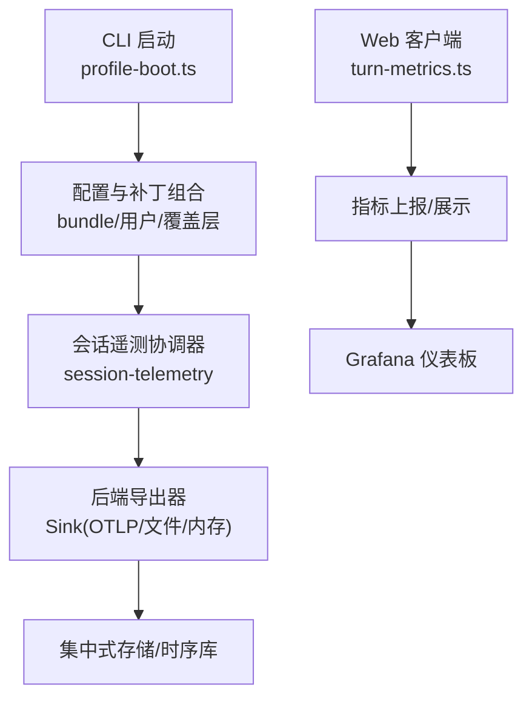
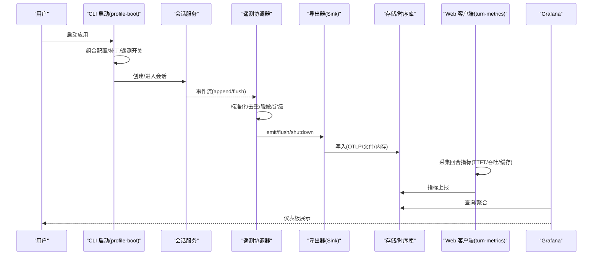
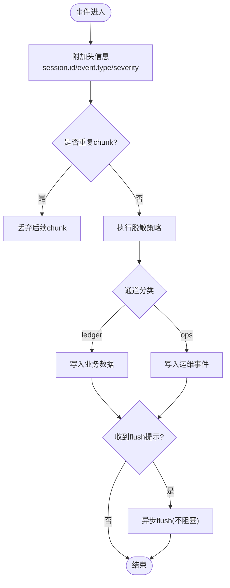
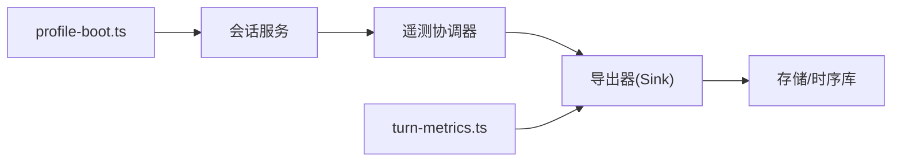

# 监控日志

<cite>
**本文引用的文件**
- [profile-boot.ts](file://apps/cli/src/profile-boot.ts)
- [telemetry.spec.ts](file://packages/session/session-telemetry/tests/telemetry.spec.ts)
- [turn-metrics.ts](file://packages/client/ui-conversation/src/client/chat/turn-metrics.ts)
</cite>

## 目录
1. [简介](#简介)
2. [项目结构](#项目结构)
3. [核心组件](#核心组件)
4. [架构总览](#架构总览)
5. [详细组件分析](#详细组件分析)
6. [依赖关系分析](#依赖关系分析)
7. [性能考量](#性能考量)
8. [故障诊断指南](#故障诊断指南)
9. [结论](#结论)
10. [附录](#附录)

## 简介
本方案围绕应用监控与日志收集，覆盖健康检查、性能指标采集、告警规则、结构化日志、日志轮转与集中存储、分布式追踪（请求链路与服务间调用）、Grafana 仪表板搭建以及故障诊断方法。结合仓库中会话遥测协调器、CLI 启动配置与前端交互指标等实现，提供可落地的端到端实践。

## 项目结构
- CLI 启动层负责解析并组合配置文件、补丁层与运行时开关，包括遥测模块的启用/禁用策略。
- 会话遥测协调器将会话事件标准化为遥测记录，支持实时捕获与按需回放，具备错误隔离与幂等重放能力。
- 前端对话界面在消息回合中采集关键性能指标（如首字延迟、吞吐、缓存命中率），便于可视化与告警。

**图表来源**
- [profile-boot.ts:142-170](file://apps/cli/src/profile-boot.ts#L142-L170)
- [telemetry.spec.ts:90-179](file://packages/session/session-telemetry/tests/telemetry.spec.ts#L90-L179)
- [turn-metrics.ts](file://packages/client/ui-conversation/src/client/chat/turn-metrics.ts)

**章节来源**
- [profile-boot.ts:142-170](file://apps/cli/src/profile-boot.ts#L142-L170)
- [telemetry.spec.ts:90-179](file://packages/session/session-telemetry/tests/telemetry.spec.ts#L90-L179)

## 核心组件
- 遥测开关与启动装配：通过环境变量控制遥测行是否启用，并在启动时注入补丁层，确保最小化侵入与可插拔。
- 会话遥测协调器：对会话事件进行标准化、去重、脱敏、严重级别映射，并以“通道”区分业务数据与运维操作事件；支持按会话边界回放与失败隔离。
- 前端性能指标：在对话回合中采集 TTFT、吞吐、缓存命中、输入输出 token 数等指标，用于可视化与告警。

**章节来源**
- [profile-boot.ts:56-83](file://apps/cli/src/profile-boot.ts#L56-L83)
- [telemetry.spec.ts:90-179](file://packages/session/session-telemetry/tests/telemetry.spec.ts#L90-L179)
- [turn-metrics.ts](file://packages/client/ui-conversation/src/client/chat/turn-metrics.ts)

## 架构总览
下图展示了从 CLI 启动到遥测数据汇聚与可视化的整体流程，包含遥测开关、会话事件采集、标准化与导出、以及前端指标接入。

**图表来源**
- [profile-boot.ts:142-170](file://apps/cli/src/profile-boot.ts#L142-L170)
- [telemetry.spec.ts:434-517](file://packages/session/session-telemetry/tests/telemetry.spec.ts#L434-L517)
- [turn-metrics.ts](file://packages/client/ui-conversation/src/client/chat/turn-metrics.ts)

## 详细组件分析

### 遥测开关与启动装配
- 行为要点
  - 通过环境变量硬关闭遥测行，任何非空值均视为禁用，避免误开启。
  - 若组合中不存在遥测行，则不生成补丁，保持无感兼容。
  - 启动时按顺序叠加 bundle 层、用户层、家目录层、覆盖层与遥测开关层，保证优先级与可观测性。
- 建议
  - 在生产环境默认启用遥测，并通过安全策略限制敏感字段外泄。
  - 使用覆盖层动态调整采样率或目标后端。

**章节来源**
- [profile-boot.ts:56-83](file://apps/cli/src/profile-boot.ts#L56-L83)
- [profile-boot.ts:142-170](file://apps/cli/src/profile-boot.ts#L142-L170)

### 会话遥测协调器
- 功能特性
  - 事件标准化：为每条记录附加会话 ID、事件类型、序列号、严重级别等属性。
  - 去重与投影：每个 (turn, step) 仅发送首个 chunk，降低带宽与存储压力。
  - 错误隔离：emit/flush/shutdown 失败不影响主流程，且支持重试与跳过单条失败。
  - 按需回放：支持捕获会话前缀，便于调试与取证。
  - 通道分离：业务数据走 ledger，运维事件走 ops（如 shutdown、agent-error）。
- 适用场景
  - 会话级全量审计、问题回溯、跨进程/重启后的状态恢复。
  - 与 OTLP/文件/内存后端对接，灵活选择存储与传输方式。

**图表来源**
- [telemetry.spec.ts:90-179](file://packages/session/session-telemetry/tests/telemetry.spec.ts#L90-L179)
- [telemetry.spec.ts:434-517](file://packages/session/session-telemetry/tests/telemetry.spec.ts#L434-L517)

**章节来源**
- [telemetry.spec.ts:90-179](file://packages/session/session-telemetry/tests/telemetry.spec.ts#L90-L179)
- [telemetry.spec.ts:434-517](file://packages/session/session-telemetry/tests/telemetry.spec.ts#L434-L517)

### 前端性能指标采集
- 采集内容
  - 首字延迟（TTFT）、吞吐（tok/s）、缓存命中率、输入/输出 token 数、回合耗时等。
- 用途
  - 构建实时监控面板，设置阈值告警（如 TTFT 过高、吞吐骤降、缓存命中率异常）。
  - 辅助定位模型侧瓶颈与工具调用开销。

**章节来源**
- [turn-metrics.ts](file://packages/client/ui-conversation/src/client/chat/turn-metrics.ts)

## 依赖关系分析
- CLI 启动层依赖配置加载与补丁组合机制，决定遥测模块是否参与运行期。
- 会话遥测协调器依赖会话事件总线，向外部 Sink 输出标准化记录。
- 前端指标与后端存储通过统一接口对接，便于集中分析与可视化。

**图表来源**
- [profile-boot.ts:142-170](file://apps/cli/src/profile-boot.ts#L142-L170)
- [telemetry.spec.ts:90-179](file://packages/session/session-telemetry/tests/telemetry.spec.ts#L90-L179)
- [turn-metrics.ts](file://packages/client/ui-conversation/src/client/chat/turn-metrics.ts)

**章节来源**
- [profile-boot.ts:142-170](file://apps/cli/src/profile-boot.ts#L142-L170)
- [telemetry.spec.ts:90-179](file://packages/session/session-telemetry/tests/telemetry.spec.ts#L90-L179)

## 性能考量
- 采样与去重：对高频 chunk 仅保留首个，减少网络与存储压力。
- 异步 flush：flush 提示不阻塞主流程，避免影响用户体验。
- 错误隔离：后端失败仅记录告警，不影响会话正常推进。
- 指标粒度：前端指标以回合为单位聚合，兼顾精度与开销。

[本节为通用指导，无需具体文件引用]

## 故障诊断指南
- 错误堆栈分析
  - 利用 ops 通道中的 agent-error 记录，获取错误名称、消息、所在 turn/step，快速定位问题上下文。
- 性能瓶颈定位
  - 通过 TTFT、吞吐、缓存命中率等指标识别模型响应慢、工具调用耗时或缓存失效等问题。
- 根因分析技术
  - 使用按需回放捕获会话前缀，结合脱敏策略与通道分类，还原完整事件链。
  - 借助 flush 与 shutdown 标记，判断会话生命周期与健康状态。

**章节来源**
- [telemetry.spec.ts:531-551](file://packages/session/session-telemetry/tests/telemetry.spec.ts#L531-L551)
- [telemetry.spec.ts:434-517](file://packages/session/session-telemetry/tests/telemetry.spec.ts#L434-L517)

## 结论
本方案基于仓库内 CLI 启动装配与会话遥测协调器，构建了可扩展、低侵入的监控与日志体系。通过标准化事件、错误隔离、按需回放与前端指标采集，可实现健康检查、性能监控、告警与可视化闭环。建议在生产环境中结合 OTLP/文件/内存后端与 Grafana，形成统一的观测平台。

[本节为总结性内容，无需具体文件引用]

## 附录

### 健康检查端点与告警规则（建议）
- 健康检查
  - 暴露 /health 与 /ready 端点，返回进程存活、依赖可用性与资源水位。
- 告警规则
  - TTFT > 阈值持续 N 分钟触发高优告警。
  - 吞吐 < 阈值且缓存命中率 < 阈值同时出现时触发中优告警。
  - agent-error 频率突增触发中优告警。

[本节为通用建议，无需具体文件引用]

### 日志格式与轮转（建议）
- 结构化日志
  - 字段包含时间戳、会话 ID、事件类型、严重级别、trace/span 标识、业务键等。
- 轮转策略
  - 按大小与时间双维度轮转，保留最近 N 天，压缩归档。
- 集中存储
  - 推荐 OTLP 上报至时序库/日志系统，支持检索与关联分析。

[本节为通用建议，无需具体文件引用]

### 分布式追踪（建议）
- 请求链路追踪
  - 为每次请求生成 traceId，贯穿 CLI、会话、工具调用与外部服务。
- 服务间调用监控
  - 在跨进程/远程调用处注入 span，记录入出参摘要与耗时。
- 性能分析
  - 结合火焰图与热点统计，定位 CPU/IO 瓶颈。

[本节为通用建议，无需具体文件引用]

### Grafana 仪表板（建议）
- 自定义指标可视化
  - 展示 TTFT、吞吐、缓存命中率、错误率、会话时长分布等。
- 实时监控面板
  - 多租户/多会话视图，支持下钻到具体会话与事件链。

[本节为通用建议，无需具体文件引用]