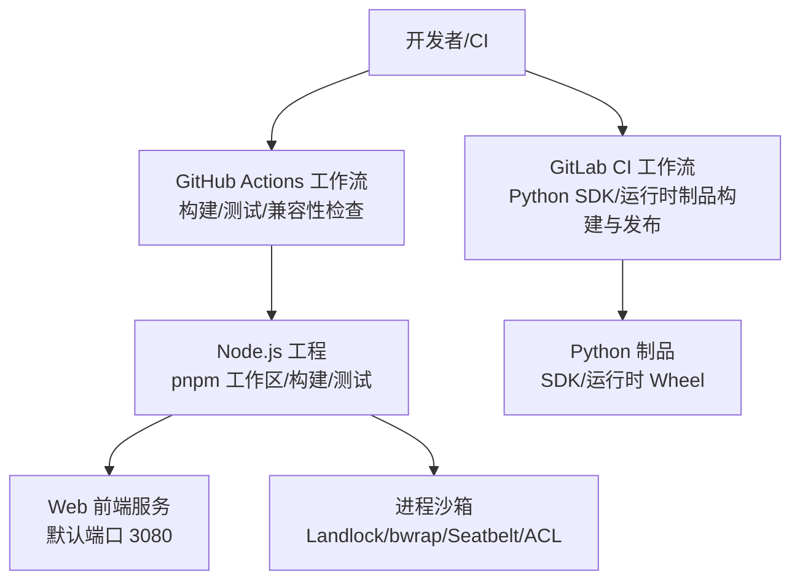
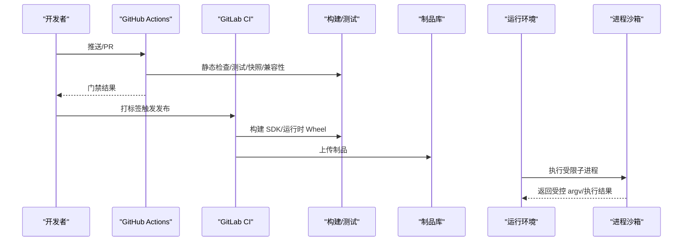
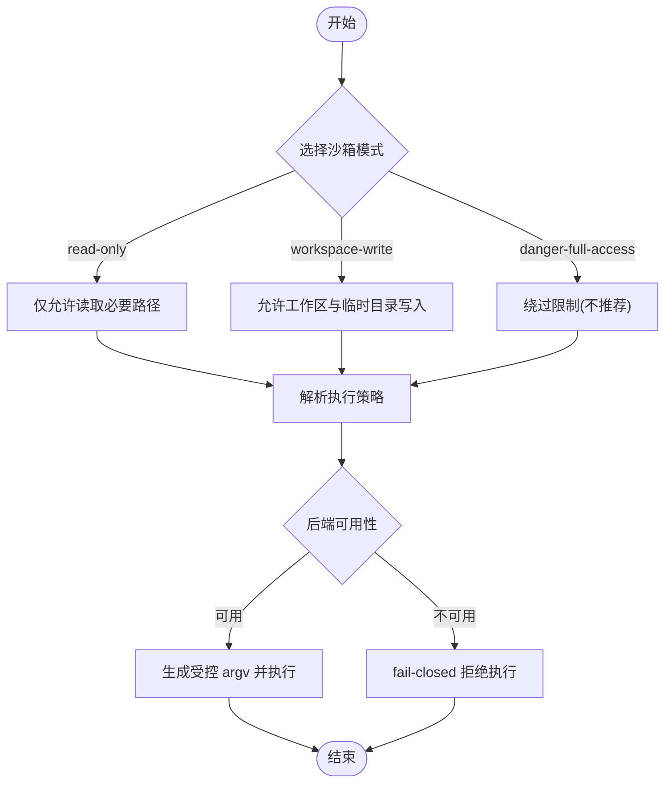
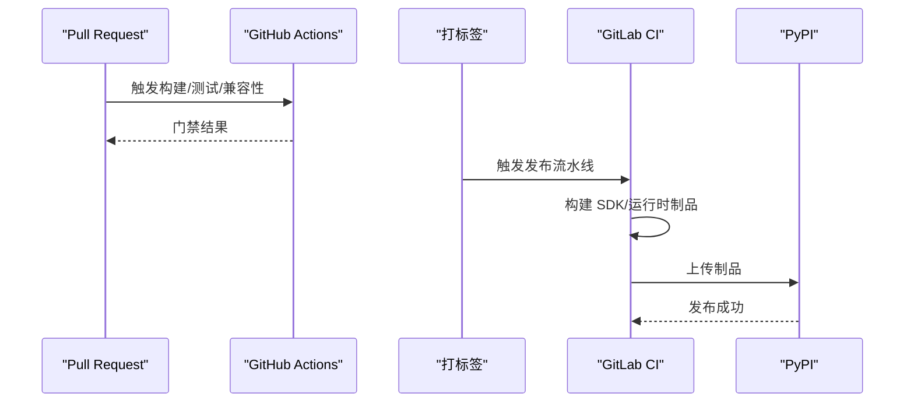
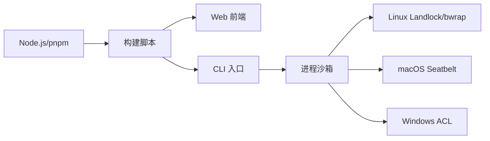

# 部署运维

<cite>
**本文引用的文件**
- [README.md](file://README.md)
- [package.json](file://package.json)
- [.github/workflows/ci.yml](file://.github/workflows/ci.yml)
- [.gitlab-ci.yml](file://.gitlab-ci.yml)
- [docs/subsystems/sandbox.md](file://docs/subsystems/sandbox.md)
- [native/landlock-run/README.md](file://native/landlock-run/README.md)
</cite>

## 目录
1. [简介](#简介)
2. [项目结构](#项目结构)
3. [核心组件](#核心组件)
4. [架构总览](#架构总览)
5. [详细组件分析](#详细组件分析)
6. [依赖分析](#依赖分析)
7. [性能考虑](#性能考虑)
8. [故障排查指南](#故障排查指南)
9. [结论](#结论)
10. [附录](#附录)

## 简介
本指南面向生产环境，提供 DeepSeek Harness（dsh）的部署与运维方案，覆盖本地、容器化与云平台的部署方式；安全配置（沙箱隔离、权限控制、网络安全）；性能调优（内存管理、并发控制、资源限制）；监控与日志收集；备份恢复与灾难恢复；以及自动化部署流水线与持续集成设置。文档基于仓库内现有脚本、工作流与安全子系统说明进行编排，确保可落地且可追溯。

## 项目结构
- 应用入口与运行方式：通过 npm/pnpm 提供的脚本构建并启动 Web UI，默认监听本地端口提供服务。
- 多平台 CI/CD：GitHub Actions 负责主流程质量门禁与跨平台验证；GitLab CI 负责 Python SDK 与运行时制品的构建与发布。
- 安全子系统：进程沙箱抽象与 Linux Landlock 自限制执行器，用于在不可信命令执行时提供最小权限的文件系统访问控制。

**图表来源**
- [.github/workflows/ci.yml:1-120](file://.github/workflows/ci.yml#L1-L120)
- [.gitlab-ci.yml:1-130](file://.gitlab-ci.yml#L1-L130)
- [package.json:19-142](file://package.json#L19-L142)
- [docs/subsystems/sandbox.md:1-40](file://docs/subsystems/sandbox.md#L1-L40)

**章节来源**
- [README.md:15-35](file://README.md#L15-L35)
- [package.json:19-142](file://package.json#L19-L142)
- [.github/workflows/ci.yml:1-120](file://.github/workflows/ci.yml#L1-L120)
- [.gitlab-ci.yml:1-130](file://.gitlab-ci.yml#L1-L130)

## 核心组件
- 构建与运行脚本：根 package.json 定义了构建、测试、文档站点构建等脚本，统一入口便于自动化。
- 持续集成：
  - GitHub Actions：静态检查、覆盖率、快照、兼容性与 Windows Wine 校验、原生 Windows 完整门禁、序列化合约回归。
  - GitLab CI：Python SDK 与运行时 wheel 构建、manylinux 校验、macOS 部署目标检查与 PyPI 发布。
- 进程沙箱：以“能力即插件”的方式封装不同后端（Linux bwrap/Landlock、macOS Seatbelt、Windows ACL），对外暴露统一的 confine API 与策略解析。

**章节来源**
- [package.json:19-142](file://package.json#L19-L142)
- [.github/workflows/ci.yml:1-120](file://.github/workflows/ci.yml#L1-L120)
- [.gitlab-ci.yml:23-130](file://.gitlab-ci.yml#L23-L130)
- [docs/subsystems/sandbox.md:1-40](file://docs/subsystems/sandbox.md#L1-L40)

## 架构总览
下图展示从代码提交到制品发布的端到端流水线，以及运行时关键的安全边界。

**图表来源**
- [.github/workflows/ci.yml:1-120](file://.github/workflows/ci.yml#L1-L120)
- [.gitlab-ci.yml:23-130](file://.gitlab-ci.yml#L23-L130)
- [docs/subsystems/sandbox.md:150-187](file://docs/subsystems/sandbox.md#L150-L187)

## 详细组件分析

### 本地部署（Node.js 直接运行）
- 前置条件：安装 Node.js（满足版本要求）与 pnpm。
- 步骤要点：
  - 克隆仓库并安装依赖。
  - 构建产物。
  - 使用 CLI 启动 Web UI（默认监听本地端口）。
- 注意事项：
  - 若需在生产中暴露网络，请通过反向代理或容器网络进行端口映射与访问控制。
  - 建议结合操作系统防火墙与只读文件系统策略，限制不必要的写入路径。

**章节来源**
- [README.md:15-35](file://README.md#L15-L35)
- [package.json:19-47](file://package.json#L19-L47)

### Docker 容器化部署
- 镜像选择：基于官方 Node.js 镜像，安装 pnpm 并复制源码，执行构建与启动命令。
- 环境变量：
  - 关闭遥测上报（CI 中已启用该开关，生产建议保持关闭）。
  - 如需调整并发与缓存，可通过环境变量注入给构建与测试阶段。
- 网络与存储：
  - 将 Web 服务端口映射至宿主机，并通过反向代理（如 Nginx/Traefik）提供 HTTPS 与鉴权。
  - 持久化会话与工件目录，避免容器重建导致数据丢失。
- 安全加固：
  - 以非 root 用户运行容器。
  - 限制容器 CPU/内存与 PID 数量。
  - 仅挂载必要卷，遵循最小权限原则。

[本节为通用容器化实践指导，不直接引用具体文件]

### 云平台部署（Kubernetes 示例）
- Deployment：定义副本数、资源请求/限制、健康检查探针。
- Service/Ingress：对外暴露 HTTP 服务，配置 TLS 终止与访问白名单。
- ConfigMap/Secret：集中管理配置与敏感信息（如模型密钥、代理地址）。
- Pod 安全：
  - 使用 PodSecurityPolicy/PSA 限制特权操作。
  - 结合网络策略（NetworkPolicy）限制出站访问。
- 观测性：
  - 采集标准输出日志到集中式日志系统。
  - 导出指标（CPU/内存/Pod 状态）到监控系统。

[本节为通用 K8s 实践指导，不直接引用具体文件]

### 安全配置（沙箱隔离、权限控制、网络安全）
- 进程沙箱模式：
  - read-only：仅允许读取必要路径，拒绝写操作。
  - workspace-write：允许在工作区根与后端临时目录写入。
  - danger-full-access：绕过限制（不建议在生产使用）。
- 执行策略解析：
  - 每次调用根据会话上下文与部署默认值解析最终策略。
  - 支持显式覆盖模式，但需经审批流程。
- 后端实现：
  - Linux：bwrap/Landlock，内核 ABI 决定完全或部分强制。
  - macOS：Seatbelt。
  - Windows：ACL 受限令牌。
- 失败处理：
  - 当无可用后端或内核不支持时，采用 fail-closed 策略，拒绝执行。
- 网络安全：
  - 仅开放必要端口，使用反向代理与 WAF。
  - 对上游 LLM 提供商与工具调用进行域名白名单与超时控制。

**图表来源**
- [docs/subsystems/sandbox.md:9-40](file://docs/subsystems/sandbox.md#L9-L40)
- [docs/subsystems/sandbox.md:150-187](file://docs/subsystems/sandbox.md#L150-L187)

**章节来源**
- [docs/subsystems/sandbox.md:9-40](file://docs/subsystems/sandbox.md#L9-L40)
- [docs/subsystems/sandbox.md:150-187](file://docs/subsystems/sandbox.md#L150-L187)

### 性能调优（内存管理、并发控制、资源限制）
- 构建与测试并发：
  - 通过环境变量控制覆盖率、快照、Lint 等任务的并发度，避免资源争用。
  - 在 CI 中针对共享 VM 场景降低并发，保证稳定性。
- 运行时资源限制：
  - 容器/K8s 层设置 CPU/内存请求与上限，防止单实例占用过多资源。
  - 限制最大进程数与打开文件句柄数，避免资源耗尽。
- 缓存与依赖：
  - 复用 pnpm store 与浏览器二进制缓存，缩短冷启动时间。
  - 合理设置 CDN 与静态资源缓存策略。
- 网络与 I/O：
  - 对上游 LLM 调用设置超时与重试退避。
  - 对磁盘 I/O 进行限流与异步化，减少阻塞。

**章节来源**
- [.github/workflows/ci.yml:115-177](file://.github/workflows/ci.yml#L115-L177)
- [.github/workflows/ci.yml:178-257](file://.github/workflows/ci.yml#L178-L257)
- [.github/workflows/ci.yml:260-327](file://.github/workflows/ci.yml#L260-L327)

### 监控与日志收集
- 日志：
  - 应用标准输出/错误输出，由容器运行时或日志采集器统一收集。
  - 结构化日志字段包含会话 ID、任务 ID、耗时与错误码，便于检索。
- 指标：
  - 暴露基础指标（CPU、内存、请求延迟、错误率）。
  - 与 Prometheus/Grafana 集成，建立告警规则。
- 追踪：
  - 对关键链路（LLM 调用、工具执行、沙箱执行）添加分布式追踪。
- 遥测：
  - 生产环境建议关闭遥测上报，避免外部依赖影响稳定性。

[本节为通用观测性实践指导，不直接引用具体文件]

### 备份与恢复、灾难恢复
- 数据范围：
  - 会话数据、工作区文件、配置与凭证。
- 备份策略：
  - 定期增量备份 + 全量备份，保留多版本。
  - 异地容灾存储，加密传输与静态加密。
- 恢复演练：
  - 制定 RTO/RPO 目标，定期进行恢复演练。
  - 自动化恢复脚本与回滚流程。
- 高可用：
  - 多副本部署，自动故障转移。
  - 数据库/对象存储具备多可用区冗余。

[本节为通用灾备实践指导，不直接引用具体文件]

### 自动化部署流水线与持续集成
- GitHub Actions：
  - 静态检查、覆盖率、快照、兼容性矩阵（Node 版本）、Windows Wine 与原生 Windows 门禁。
  - 序列化合约回归与自托管备用池切换。
- GitLab CI：
  - Python SDK 与运行时 wheel 构建，manylinux 校验，macOS 部署目标检查。
  - 制品打包与 PyPI 发布。
- 发布流程：
  - 通过标签触发发布，校验版本号一致性。
  - 制品签名与完整性校验。

**图表来源**
- [.github/workflows/ci.yml:1-120](file://.github/workflows/ci.yml#L1-L120)
- [.gitlab-ci.yml:23-130](file://.gitlab-ci.yml#L23-L130)

**章节来源**
- [.github/workflows/ci.yml:1-120](file://.github/workflows/ci.yml#L1-L120)
- [.gitlab-ci.yml:23-130](file://.gitlab-ci.yml#L23-L130)

## 依赖分析
- 构建与运行依赖：
  - Node.js 版本约束与 pnpm 工作区管理。
  - 前端构建与测试依赖（Playwright 等）。
- CI 依赖：
  - GitHub Actions 节点与缓存策略。
  - GitLab CI 的 Python 环境与 manylinux 镜像。
- 安全依赖：
  - 进程沙箱后端（Landlock/bwrap/Seatbelt/ACL）。
  - 可选的容器化工具链（bubblewrap 等）。

**图表来源**
- [package.json:19-142](file://package.json#L19-L142)
- [docs/subsystems/sandbox.md:1-40](file://docs/subsystems/sandbox.md#L1-L40)
- [native/landlock-run/README.md:1-61](file://native/landlock-run/README.md#L1-L61)

**章节来源**
- [package.json:19-142](file://package.json#L19-L142)
- [docs/subsystems/sandbox.md:1-40](file://docs/subsystems/sandbox.md#L1-L40)
- [native/landlock-run/README.md:1-61](file://native/landlock-run/README.md#L1-L61)

## 性能考虑
- 并发控制：
  - 在 CI 中通过环境变量调节覆盖率、快照、Lint 等任务的并发度，平衡速度与稳定性。
  - 生产环境按负载水平调整副本数与资源限制。
- 内存管理：
  - 设置合理的堆大小与 GC 参数，避免频繁 Full GC。
  - 监控内存泄漏与峰值，优化长会话与大数据处理。
- I/O 与网络：
  - 使用连接池与缓存，减少重复计算与网络开销。
  - 对慢依赖进行熔断与降级。

[本节为通用性能优化指导，不直接引用具体文件]

## 故障排查指南
- 常见问题定位：
  - 沙箱不可用：检查内核版本与模块加载情况，确认后端是否可用。
  - 权限不足：核对工作区与临时目录权限，确保最小授权。
  - 网络问题：检查代理与域名白名单，确认超时与重试策略。
- 日志与指标：
  - 收集应用日志、系统日志与容器日志。
  - 查看指标异常（CPU/内存/错误率）与告警事件。
- 回滚与恢复：
  - 快速回滚到上一稳定版本。
  - 使用备份数据进行恢复演练。

**章节来源**
- [docs/subsystems/sandbox.md:150-187](file://docs/subsystems/sandbox.md#L150-L187)

## 结论
本指南基于仓库内的构建脚本、CI 工作流与安全子系统说明，提供了从本地到容器化与云平台的部署路径，明确了安全、性能、观测性与灾备的关键实践。建议在上线前完成沙箱策略评估、资源限额设定、监控告警接入与灾备演练，确保生产环境的稳定性与安全性。

## 附录
- 快速参考：
  - 本地启动：参考 README 中的运行说明。
  - 构建与测试：使用根 package.json 提供的脚本。
  - 发布制品：通过 GitLab CI 的标签触发流程。

**章节来源**
- [README.md:15-35](file://README.md#L15-L35)
- [package.json:19-142](file://package.json#L19-L142)
- [.gitlab-ci.yml:23-130](file://.gitlab-ci.yml#L23-L130)