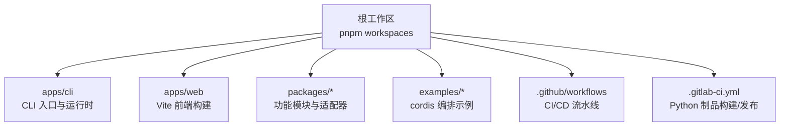
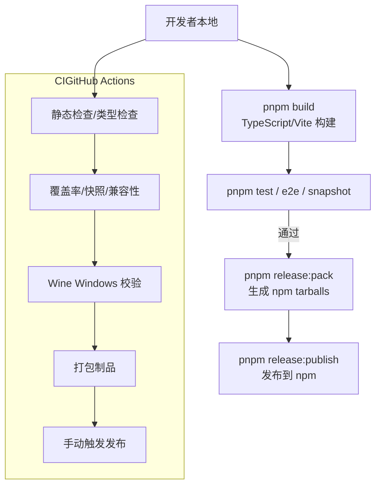
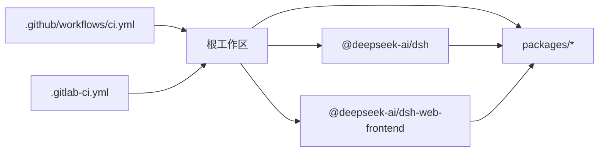
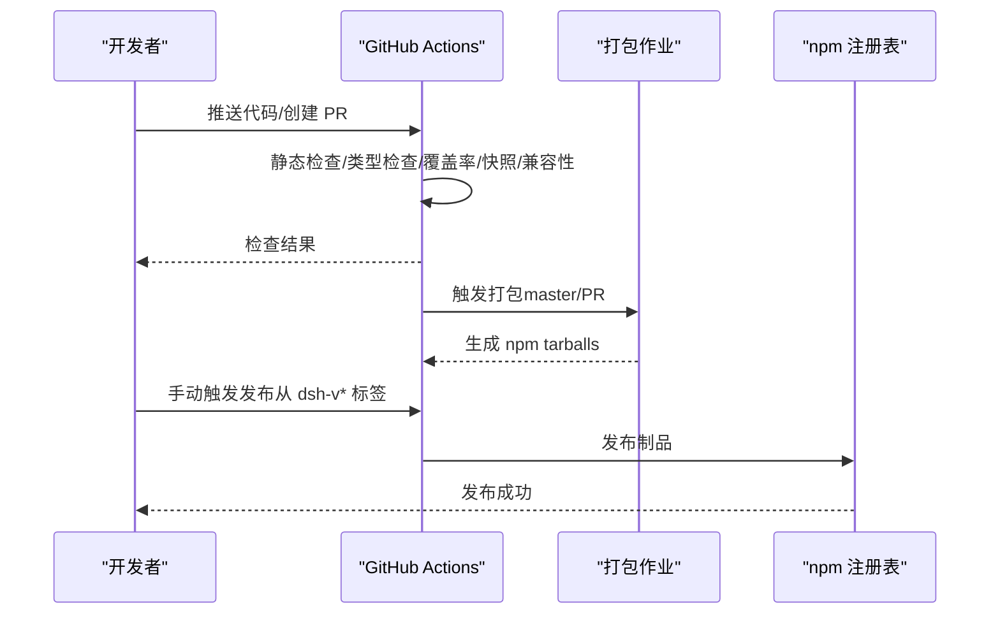
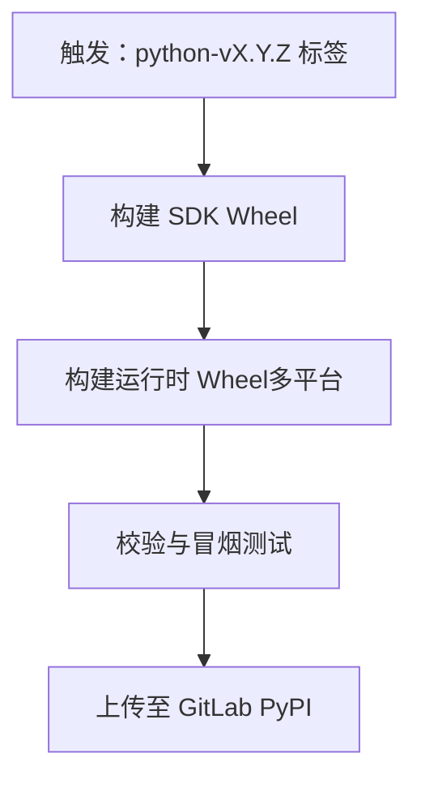

# 部署配置

<cite>
**本文引用的文件**
- [package.json](file://package.json)
- [.github/workflows/ci.yml](file://.github/workflows/ci.yml)
- [.github/workflows/release.yml](file://.github/workflows/release.yml)
- [.gitlab-ci.yml](file://.gitlab-ci.yml)
- [apps/cli/package.json](file://apps/cli/package.json)
- [apps/web/package.json](file://apps/web/package.json)
- [examples/acp-agent/cordis.yml](file://examples/acp-agent/cordis.yml)
- [examples/headless-agent/cordis.yml](file://examples/headless-agent/cordis.yml)
</cite>

## 目录
1. [简介](#简介)
2. [项目结构](#项目结构)
3. [核心组件](#核心组件)
4. [架构总览](#架构总览)
5. [详细组件分析](#详细组件分析)
6. [依赖关系分析](#依赖关系分析)
7. [性能与容量规划](#性能与容量规划)
8. [故障排查指南](#故障排查指南)
9. [结论](#结论)
10. [附录](#附录)

## 简介
本部署配置文档面向开发、测试与生产环境，说明如何在不同环境中完成 deepseek-harness 的构建、打包与发布；提供容器化与编排建议（基于仓库现有脚本与工件），并给出在主流云平台（AWS、Azure、GCP）上的部署思路。同时覆盖本地部署步骤、环境变量与配置文件管理、多环境最佳实践与敏感信息管理策略。

## 项目结构
仓库采用 monorepo 组织：
- apps/cli：命令行入口与运行时装配，负责加载插件、启动 Web UI 等
- apps/web：前端应用，使用 Vite 构建静态资源，由 CLI 服务
- packages/*：可复用的功能包（LLM 适配、会话、工具、沙箱、设置等）
- examples/*：示例编排（cordis.yml），演示不同运行模式
- .github/workflows：GitHub Actions CI/CD（构建、验证、发布）
- .gitlab-ci.yml：GitLab CI 用于 Python SDK 与运行时制品构建与发布

**章节来源**
- [package.json:1-18](file://package.json#L1-L18)
- [apps/cli/package.json:1-20](file://apps/cli/package.json#L1-L20)
- [apps/web/package.json:1-25](file://apps/web/package.json#L1-L25)

## 核心组件
- CLI 应用（@deepseek-ai/dsh）：定义二进制入口、依赖与发布范围，负责加载 cordis 编排、启动 Web 服务与工具链
- Web 前端（@deepseek-ai/dsh-web-frontend）：Vite 构建产物由 CLI 提供静态服务
- Cordis 编排（examples/*.yml）：声明式组合 LLM 适配器、沙箱、权限、持久化、工具等能力
- CI/CD：
  - GitHub Actions：类型检查、覆盖率、快照、兼容性、Windows Wine 校验、制品打包与 npm 发布
  - GitLab CI：Python SDK 与运行时 wheel 构建、平台校验与 PyPI 发布

**章节来源**
- [apps/cli/package.json:1-102](file://apps/cli/package.json#L1-L102)
- [apps/web/package.json:1-52](file://apps/web/package.json#L1-L52)
- [examples/acp-agent/cordis.yml:1-193](file://examples/acp-agent/cordis.yml#L1-L193)
- [examples/headless-agent/cordis.yml:1-166](file://examples/headless-agent/cordis.yml#L1-L166)
- [.github/workflows/ci.yml:1-120](file://.github/workflows/ci.yml#L1-L120)
- [.github/workflows/release.yml:1-150](file://.github/workflows/release.yml#L1-L150)
- [.gitlab-ci.yml:1-130](file://.gitlab-ci.yml#L1-L130)

## 架构总览
下图展示从源码到制品的关键路径与环境差异点（构建、测试、发布）。

**图表来源**
- [.github/workflows/ci.yml:63-113](file://.github/workflows/ci.yml#L63-L113)
- [.github/workflows/ci.yml:115-177](file://.github/workflows/ci.yml#L115-L177)
- [.github/workflows/ci.yml:178-258](file://.github/workflows/ci.yml#L178-L258)
- [.github/workflows/ci.yml:338-402](file://.github/workflows/ci.yml#L338-L402)
- [.github/workflows/release.yml:36-108](file://.github/workflows/release.yml#L36-L108)
- [.github/workflows/release.yml:109-150](file://.github/workflows/release.yml#L109-L150)

## 详细组件分析

### 环境与构建差异（开发/测试/生产）
- 开发环境
  - 使用 pnpm workspace 安装依赖，启用 HMR 与开发脚本
  - 可通过示例编排快速启动（如 headless 或 acp 示例）
  - 关键环境变量：DSH_TELEMETRY_DISABLED=1（CI 中强制关闭遥测）
- 测试环境
  - 执行完整测试套件：单元测试、端到端、快照、兼容性矩阵（Node 版本）、Windows Wine 校验
  - 覆盖率与并发控制通过环境变量调节
- 生产环境
  - 仅保留构建产物与最小依赖
  - 通过 CLI 提供的 web 命令托管前端静态资源
  - 通过 cordis.yml 注入运行时策略（沙箱、权限、持久化、模型等）

**章节来源**
- [package.json:19-142](file://package.json#L19-L142)
- [.github/workflows/ci.yml:37-42](file://.github/workflows/ci.yml#L37-L42)
- [examples/headless-agent/cordis.yml:1-166](file://examples/headless-agent/cordis.yml#L1-L166)
- [examples/acp-agent/cordis.yml:1-193](file://examples/acp-agent/cordis.yml#L1-L193)

### Docker 容器化部署（镜像构建与编排建议）
仓库未包含 Dockerfile 与 docker-compose，但提供了稳定的构建与发布流程，可按如下方式容器化：
- 基础镜像选择
  - Node.js 22/24 LTS（与 engines.engines 要求一致）
  - 如需运行 Playwright/浏览器相关测试，准备系统依赖
- 构建阶段
  - 安装 pnpm 并缓存 store
  - 执行 pnpm install --frozen-lockfile
  - 执行 pnpm run build（含 host/client 与 web 前端）
- 运行阶段
  - 以非 root 用户运行
  - 暴露端口（若使用内置 web 服务）
  - 通过环境变量注入配置（见“本地部署与环境变量”）
- 编排建议
  - 使用 Compose 或 Kubernetes 管理进程生命周期
  - 将 cordis.yml 作为只读卷挂载，便于按环境切换
  - 将凭据与密钥通过 Secret/环境变量注入，避免写入镜像

[本节为通用指导，不直接引用具体代码文件]

### 云平台部署指南（AWS/Azure/GCP）
- AWS
  - ECS/Fargate：将构建产物放入容器镜像，通过任务定义注入环境变量与配置卷
  - EKS：使用 Helm 管理 Deployment/Service/ConfigMap/Secret
  - CodePipeline：复用仓库中的 CI 产出，实现持续交付
- Azure
  - Container Apps：无服务器容器托管，支持按请求扩缩容
  - AKS：Kubernetes 集群部署，结合 Key Vault 管理密钥
  - Pipelines：复用 GitHub Actions 产物进行发布
- GCP
  - Cloud Run：无服务器容器，适合事件驱动与 HTTP 服务
  - GKE：标准 Kubernetes 部署，配合 Secret Manager
  - Cloud Build：集成仓库 CI 产物，自动化发布

[本节为通用指导，不直接引用具体代码文件]

### 本地部署步骤（环境变量、配置文件与依赖）
- 前置条件
  - Node.js 版本满足 engines 要求
  - pnpm 已安装
- 安装与构建
  - pnpm install --frozen-lockfile
  - pnpm run build
- 运行示例
  - 使用 headless 或 acp 示例的 cordis.yml 启动
  - 通过 CLI 命令加载编排并启动服务
- 环境变量与配置
  - 使用 .env 或进程环境注入密钥（如 API Key）
  - 通过 cordis.yml 的 config 字段调整行为（如沙箱模式、持久化路径）
  - 注意：遥测在 CI 中强制关闭，本地可按需开启或关闭

**章节来源**
- [package.json:8-10](file://package.json#L8-L10)
- [package.json:19-142](file://package.json#L19-L142)
- [examples/acp-agent/cordis.yml:1-193](file://examples/acp-agent/cordis.yml#L1-L193)
- [examples/headless-agent/cordis.yml:1-166](file://examples/headless-agent/cordis.yml#L1-L166)

### 多环境配置管理最佳实践
- 配置分离
  - 将环境差异放入环境变量或外部配置源（如 ConfigMap/Secret）
  - 使用 cordis.yml 描述能力装配，避免硬编码
- 敏感信息保护
  - 不在仓库中提交密钥；通过 CI/CD 注入或运行时读取
  - 对凭据文件设置严格权限（owner-only）
- 版本控制策略
  - 锁定依赖版本（pnpm lockfile）
  - 使用语义化版本与标签（release 流程）
  - 变更通过 PR 审查，CI 门禁保障质量

**章节来源**
- [examples/acp-agent/cordis.yml:1-193](file://examples/acp-agent/cordis.yml#L1-L193)
- [examples/headless-agent/cordis.yml:1-166](file://examples/headless-agent/cordis.yml#L1-L166)
- [.github/workflows/release.yml:1-150](file://.github/workflows/release.yml#L1-L150)

## 依赖关系分析
- 工作区与包依赖
  - 根 package.json 定义 workspaces，聚合 apps、packages、native 等子项目
  - CLI 依赖大量内部包（llm、session、tools、sandbox 等）
  - Web 前端依赖 React、Vite 及内部 client 包
- CI 依赖
  - GitHub Actions：Node 24、pnpm、Playwright、Wine（Windows 兼容）
  - GitLab CI：Python 工具链、uv、twine、manylinux 镜像

**图表来源**
- [package.json:11-18](file://package.json#L11-L18)
- [apps/cli/package.json:22-84](file://apps/cli/package.json#L22-L84)
- [apps/web/package.json:28-49](file://apps/web/package.json#L28-L49)
- [.github/workflows/ci.yml:63-113](file://.github/workflows/ci.yml#L63-L113)
- [.gitlab-ci.yml:14-67](file://.gitlab-ci.yml#L14-L67)

**章节来源**
- [package.json:11-18](file://package.json#L11-L18)
- [apps/cli/package.json:22-84](file://apps/cli/package.json#L22-L84)
- [apps/web/package.json:28-49](file://apps/web/package.json#L28-L49)
- [.github/workflows/ci.yml:63-113](file://.github/workflows/ci.yml#L63-L113)
- [.gitlab-ci.yml:14-67](file://.gitlab-ci.yml#L14-L67)

## 性能与容量规划
- 构建与测试并行度
  - 通过环境变量控制并发（如 DSH_GATE_CONCURRENCY、DSH_COVERAGE_MAX_WORKERS、DSH_SNAPSHOT_MAX_CONCURRENCY）
  - 在自托管 VM 上降低并发以避免资源争用
- 缓存策略
  - pnpm store 缓存、Playwright 浏览器缓存、Wine apt 缓存
  - 分支/PR 恢复缓存，减少重复下载
- 资源隔离
  - 使用沙箱与权限策略限制文件系统与进程访问
  - 在容器中限制 CPU/内存配额

**章节来源**
- [.github/workflows/ci.yml:115-177](file://.github/workflows/ci.yml#L115-L177)
- [.github/workflows/ci.yml:178-258](file://.github/workflows/ci.yml#L178-L258)
- [.github/workflows/ci.yml:338-402](file://.github/workflows/ci.yml#L338-L402)
- [examples/acp-agent/cordis.yml:18-31](file://examples/acp-agent/cordis.yml#L18-L31)

## 故障排查指南
- 常见问题定位
  - 构建失败：检查 Node 版本与 pnpm 锁文件一致性
  - 测试失败：确认 Playwright/Wine 依赖是否就绪
  - 发布失败：核对版本号与标签匹配，检查 npm token 权限
- 日志与诊断
  - 使用示例编排中的持久化路径查看会话日志
  - 通过 cordis.yml 的 config 调整日志级别与输出
- 回滚与恢复
  - 使用制品库中的历史版本进行回滚
  - 通过环境变量与配置卷快速切换至已知稳定配置

**章节来源**
- [.github/workflows/release.yml:72-108](file://.github/workflows/release.yml#L72-L108)
- [.github/workflows/release.yml:109-150](file://.github/workflows/release.yml#L109-L150)
- [examples/acp-agent/cordis.yml:47-57](file://examples/acp-agent/cordis.yml#L47-L57)
- [examples/headless-agent/cordis.yml:63-67](file://examples/headless-agent/cordis.yml#L63-L67)

## 结论
本项目通过 monorepo 与完善的 CI/CD 实现了跨平台构建、测试与发布。部署时可基于 CLI 与 cordis 编排灵活组合能力，并通过环境变量与外部配置实现多环境差异化。建议在容器化与云平台上遵循“配置外置、密钥安全、制品可追溯”的原则，确保稳定与可维护性。

## 附录

### 构建与发布流程（序列图）

**图表来源**
- [.github/workflows/ci.yml:63-113](file://.github/workflows/ci.yml#L63-L113)
- [.github/workflows/ci.yml:115-177](file://.github/workflows/ci.yml#L115-L177)
- [.github/workflows/ci.yml:178-258](file://.github/workflows/ci.yml#L178-L258)
- [.github/workflows/release.yml:36-108](file://.github/workflows/release.yml#L36-L108)
- [.github/workflows/release.yml:109-150](file://.github/workflows/release.yml#L109-L150)

### Python 制品构建与发布（GitLab CI）

**图表来源**
- [.gitlab-ci.yml:1-130](file://.gitlab-ci.yml#L1-L130)