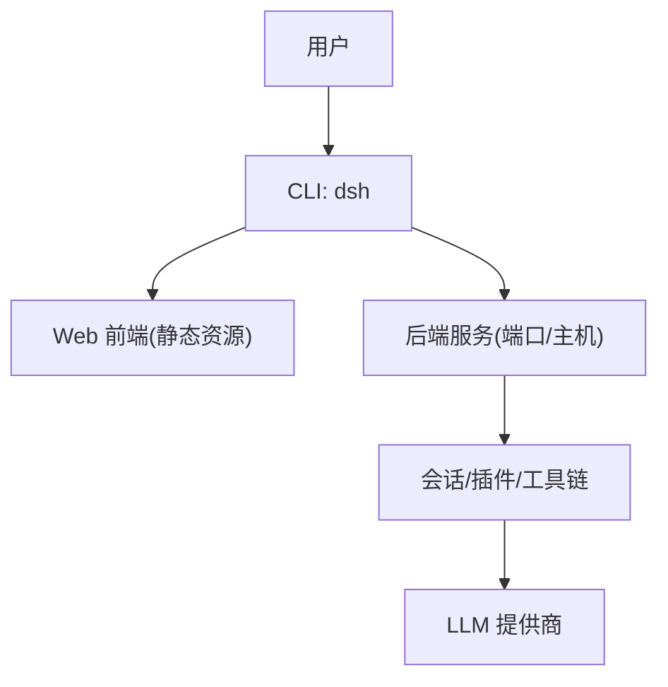
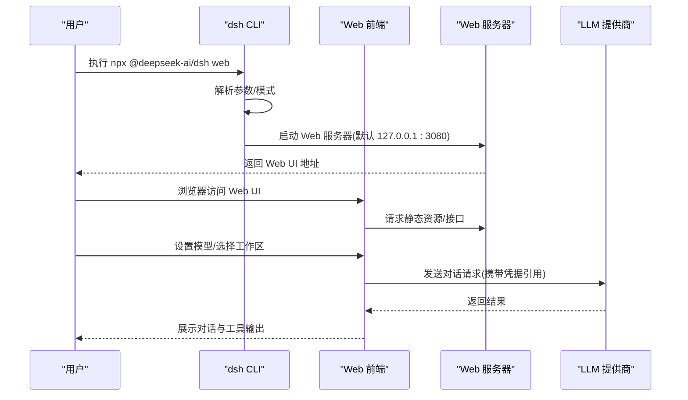
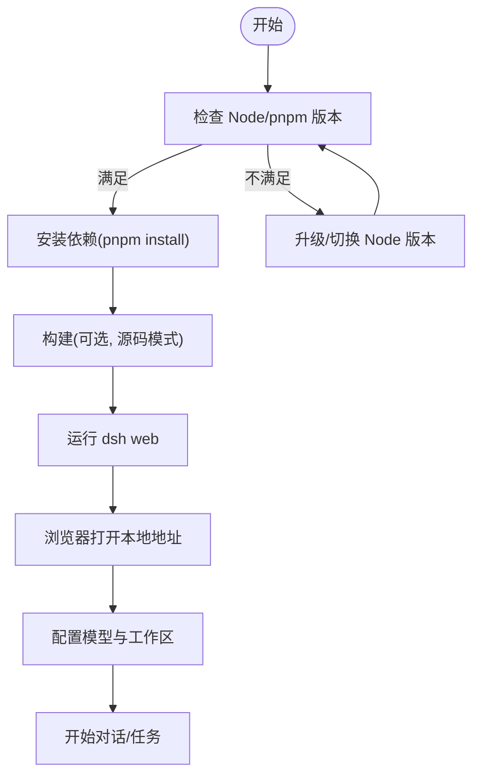
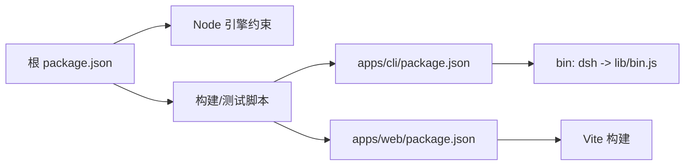

# 快速开始

<cite>
**本文引用的文件**
- [README.md](file://README.md)
- [package.json](file://package.json)
- [apps/cli/README.md](file://apps/cli/README.md)
- [apps/cli/package.json](file://apps/cli/package.json)
- [apps/web/package.json](file://apps/web/package.json)
- [apps/cli/src/bin.ts](file://apps/cli/src/bin.ts)
- [docs/user/guide/index.md](file://docs/user/guide/index.md)
- [docs/user/guide/providers.md](file://docs/user/guide/providers.md)
- [examples/web-cordis/cordis.yml](file://examples/web-cordis/cordis.yml)
</cite>

## 目录
1. [简介](#简介)
2. [项目结构](#项目结构)
3. [核心组件](#核心组件)
4. [架构总览](#架构总览)
5. [详细组件分析](#详细组件分析)
6. [依赖分析](#依赖分析)
7. [性能注意事项](#性能注意事项)
8. [故障排除指南](#故障排除指南)
9. [结论](#结论)
10. [附录](#附录)

## 简介
本指南帮助你在最短时间内安装并运行 DeepSeek Harness（dsh），体验 Web UI 的核心能力。你将学会：
- 通过 npm 直接运行
- 从源码克隆、构建与启动
- 配置模型与选择工作区
- 常见初始配置选项与排错要点

## 项目结构
仓库采用 monorepo 组织，关键入口如下：
- CLI 命令行工具：apps/cli（提供 dsh 命令与 web/headless/profile 等模式）
- Web 前端应用：apps/web（Vite 构建产物由 dsh web 服务）
- 根脚本与包管理：package.json（定义 Node 版本要求、pnpm workspace、构建与运行脚本）

图表来源
- [apps/cli/package.json:14-16](file://apps/cli/package.json#L14-L16)
- [apps/web/package.json:1-5](file://apps/web/package.json#L1-L5)
- [package.json:19-24](file://package.json#L19-L24)

章节来源
- [README.md:13-35](file://README.md#L13-L35)
- [package.json:7-10](file://package.json#L7-L10)
- [apps/cli/README.md:7-16](file://apps/cli/README.md#L7-L16)

## 核心组件
- CLI 入口与分发：apps/cli/src/bin.ts 解析参数并按模式动态加载 runner（profile/plugin/dump-config）。
- Web 前端：apps/web 使用 Vite 构建，产物由 dsh web 提供静态服务。
- 根脚本：package.json 暴露 build、dev:web、dsh 等脚本，统一工程化流程。

章节来源
- [apps/cli/src/bin.ts:1-54](file://apps/cli/src/bin.ts#L1-L54)
- [apps/web/package.json:22-26](file://apps/web/package.json#L22-L26)
- [package.json:19-24](file://package.json#L19-L24)

## 架构总览
下图展示了“从命令行到 Web UI”的调用链路，以及首次启动时的关键步骤。

图表来源
- [README.md:15-23](file://README.md#L15-L23)
- [apps/cli/README.md:18-28](file://apps/cli/README.md#L18-L28)
- [docs/user/guide/index.md:5-23](file://docs/user/guide/index.md#L5-L23)
- [docs/user/guide/providers.md:7-27](file://docs/user/guide/providers.md#L7-L27)

## 详细组件分析

### 安装与环境要求
- 环境要求
  - Node.js：^22.19.0 或 >=24.0.0
  - 包管理器：pnpm（monorepo 构建与开发）
- 从 npm 运行（推荐新手）
  - 安装 Node.js 后，在任意目录执行：npx @deepseek-ai/dsh web
  - 成功后会在本地启动 Web UI，默认监听 http://127.0.0.1:3080
- 从源码构建与运行
  - git clone 仓库并进入目录
  - pnpm install
  - pnpm run build
  - pnpm dsh web

章节来源
- [package.json:7-10](file://package.json#L7-L10)
- [README.md:15-35](file://README.md#L15-L35)

### 第一个 Web UI 示例
- 启动后，打开浏览器访问提示的本地地址（默认 127.0.0.1:3080）
- 在 Settings → Models 中配置模型（例如输入 DeepSeek API Key 并保存）
- 点击 Choose workspace 选择当前工作区目录
- 在聊天框输入任务，例如：“总结本仓库并识别主要包”，观察 Agent 的文件读取、命令执行与计划能力

章节来源
- [docs/user/guide/index.md:5-23](file://docs/user/guide/index.md#L5-L23)
- [docs/user/guide/providers.md:7-27](file://docs/user/guide/providers.md#L7-L27)

### 常用初始配置选项
- 修改 Web 服务端口与主机
  - 通过补丁覆盖 webserver 配置，可固定 host 与 port（示例见 examples/web-cordis/cordis.yml）
- 凭证与模型
  - 模型密钥保存在 $DSH_HOME/.credentials.yaml；settings.yaml 仅保存凭据引用
  - 支持添加目录中的 Provider 或自定义 Provider（含 OpenAI 兼容端点）
- 工作区与权限
  - 未选择工作区时，会话编辑器不可用；选择后可让 Agent 读写文件、执行命令
- 调试与导出
  - 使用 --dump-default-config / --dump-config 查看组合后的配置树（不启动服务）

章节来源
- [examples/web-cordis/cordis.yml:9-19](file://examples/web-cordis/cordis.yml#L9-L19)
- [docs/user/guide/providers.md:7-27](file://docs/user/guide/providers.md#L7-L27)
- [apps/cli/README.md:30-43](file://apps/cli/README.md#L30-L43)

### 启动流程图（从零到可用）

图表来源
- [package.json:7-10](file://package.json#L7-L10)
- [README.md:15-35](file://README.md#L15-L35)
- [docs/user/guide/index.md:5-23](file://docs/user/guide/index.md#L5-L23)

## 依赖分析
- 运行时依赖
  - Node.js 版本约束由根 package.json 的 engines 字段限定
  - CLI 通过 apps/cli/package.json 的 bin 映射到 lib/bin.js
- 构建与开发
  - 根 scripts 定义了 build、dev:web、test 等统一入口
  - Web 前端基于 Vite，构建产物由 dsh web 提供静态服务

图表来源
- [package.json:7-10](file://package.json#L7-L10)
- [package.json:19-24](file://package.json#L19-L24)
- [apps/cli/package.json:14-16](file://apps/cli/package.json#L14-L16)
- [apps/web/package.json:22-26](file://apps/web/package.json#L22-L26)

章节来源
- [package.json:7-10](file://package.json#L7-L10)
- [apps/cli/package.json:14-16](file://apps/cli/package.json#L14-L16)
- [apps/web/package.json:1-5](file://apps/web/package.json#L1-L5)

## 性能注意事项
- 并发与压缩
  - 可通过相关插件配置调整并行工具调用上限与日志/导出压缩级别
- 内存与超时
  - 代码执行沙箱具备计算时间与堆大小限制，避免长时间占用
- 上下文压缩
  - 可按策略对长对话进行摘要压缩，减少上下文压力

[本节为通用指导，不直接分析具体文件]

## 故障排除指南
- 无法启动或端口冲突
  - 确认已安装符合要求的 Node.js 版本
  - 若端口被占用，可通过补丁覆盖 webserver 的 host/port
- 模型不可用或鉴权失败
  - 在 Settings → Models 中保存凭据，确保 $DSH_HOME/.credentials.yaml 存在且有效
  - 自定义 Provider 需正确填写 base URL、协议与模型列表
- 图像输入被拒绝
  - 自定义 Provider 的模型需在 settings.yaml 中声明 input 包含 image
- 工作区未选择导致功能受限
  - 在界面中选择工作区后再尝试发起任务

章节来源
- [examples/web-cordis/cordis.yml:9-19](file://examples/web-cordis/cordis.yml#L9-L19)
- [docs/user/guide/providers.md:7-27](file://docs/user/guide/providers.md#L7-L27)
- [docs/user/guide/providers.md:88-94](file://docs/user/guide/providers.md#L88-L94)
- [docs/user/guide/index.md:13-23](file://docs/user/guide/index.md#L13-L23)

## 结论
通过以上步骤，你可以在几分钟内完成安装、配置并体验 DeepSeek Harness 的 Web UI。建议先使用 npm 方式快速上手，再根据需要切换到源码模式进行二次开发与扩展。

## 附录
- 更多用法
  - 使用 headless 模式执行一次性任务
  - 使用 profile 机制组合插件与补丁层
  - 使用 --dump-config 诊断配置合并结果

章节来源
- [apps/cli/README.md:7-16](file://apps/cli/README.md#L7-L16)
- [apps/cli/README.md:18-28](file://apps/cli/README.md#L18-L28)
- [apps/cli/README.md:30-43](file://apps/cli/README.md#L30-L43)