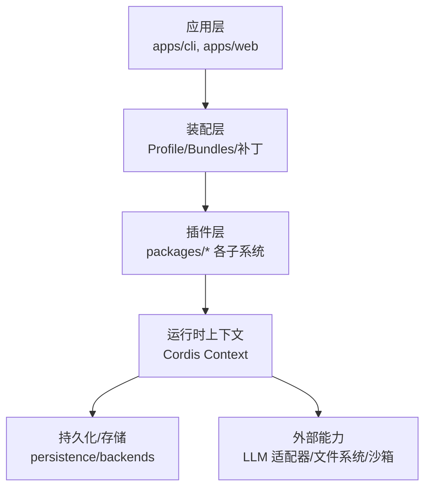
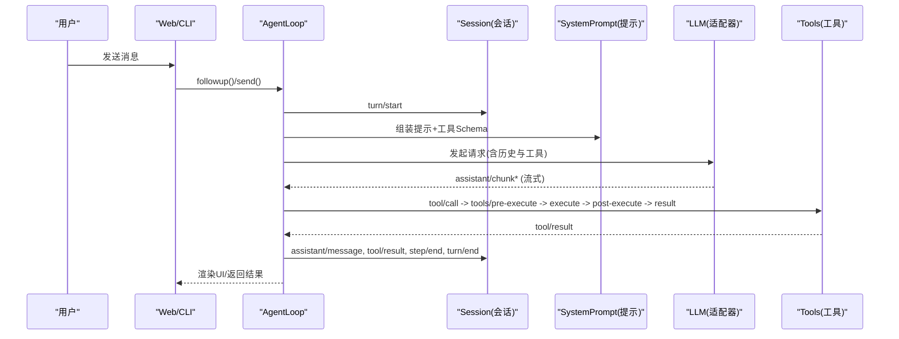
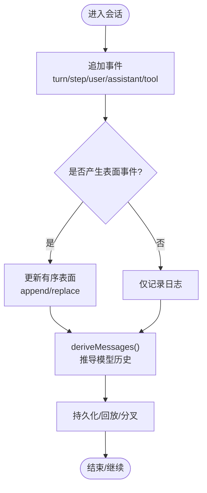
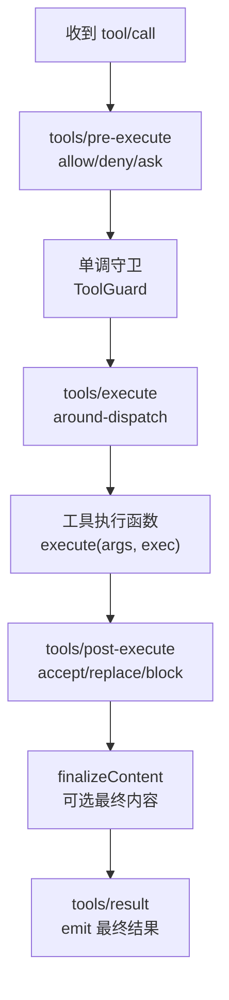
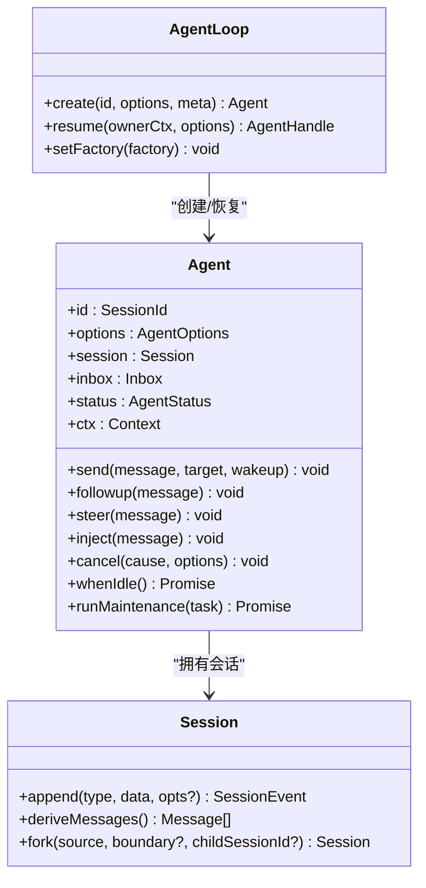
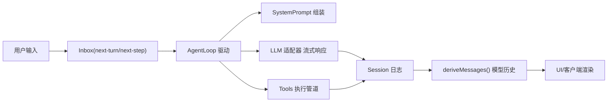
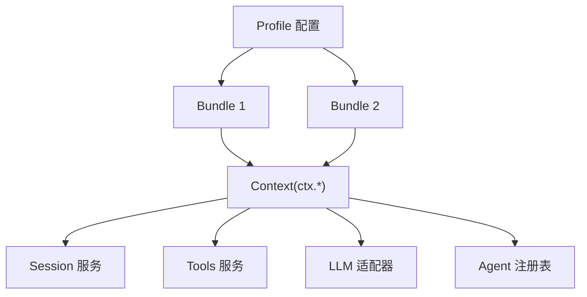

# 架构概览

<cite>
**本文引用的文件**
- [README.md](file://README.md)
- [architecture.md](file://docs/architecture.md)
- [cordis-primer.md](file://docs/cordis-primer.md)
- [core.md](file://docs/subsystems/core.md)
- [session.md](file://docs/subsystems/session.md)
- [tools.md](file://docs/subsystems/tools.md)
- [index.md](file://docs/cordis-tutorial/index.md)
</cite>

## 目录
1. [简介](#简介)
2. [项目结构](#项目结构)
3. [核心组件](#核心组件)
4. [架构总览](#架构总览)
5. [详细组件分析](#详细组件分析)
6. [依赖关系分析](#依赖关系分析)
7. [性能考量](#性能考量)
8. [故障排查指南](#故障排查指南)
9. [结论](#结论)
10. [附录](#附录)

## 简介
DeepSeek Harness（简称 dsh）是一个以“一切皆插件”为核心理念的开源智能体运行框架，基于 Cordis 插件架构构建。系统通过可插拔的服务、事件与副作用机制，将模型适配器、工具注册表、会话日志、Agent 循环等全部能力以插件形式挂载到共享上下文中，从而支持按配置组合、热重载与运行时替换。该设计使产品具备高度的可扩展性与可维护性：新增或替换能力只需在配置层叠加新的插件行，无需修改核心代码。

**章节来源**
- [README.md:5-13](file://README.md#L5-L13)

## 项目结构
仓库采用多包（packages/）与多应用（apps/）组织方式：
- packages/：实现各子系统与能力（如 session、tools、agent、llm、preset、web 等），每个包通常对应一个插件或服务定义。
- apps/：提供 CLI 与 Web 入口，负责装配 Profile/Bundles 并启动运行时。
- docs/：包含架构说明、Cordis 教程、子系统文档与扩展指南。
- examples/：示例 Agent 与组合配置，演示如何拼装能力。
- scripts/：构建、验证与生成脚本。
- vendor/：内嵌的 Cordis 框架源码与加载器。

**图表来源**
- [architecture.md:15-37](file://docs/architecture.md#L15-L37)

**章节来源**
- [architecture.md:15-37](file://docs/architecture.md#L15-L37)

## 核心组件
- 会话系统（Session）：以追加式事件日志作为唯一事实源，所有模型可见的历史均由日志推导；支持分叉、恢复、压缩与持久化。
- 工具生态（Tools）：统一的工具注册表与执行管道，提供参数校验、策略拦截、并行/独占调度、结果呈现与审计。
- Agent 管理（Agent + AgentLoop）：暴露 Agent 接口与生命周期，默认驱动实现 turn/step 循环，协调会话、提示组装与 LLM 流式调用。
- 系统与提示（SystemPrompt）：组装系统提示与工具 Schema，决定模型每次请求的上下文。
- 能力接缝（Seams）：服务定义、提供者与消费者三件套，允许对 LLM、FS、Shell、Subagent 等能力进行替换。
- 事件总线（Events）：typed events 用于跨模块通信，支持 emit/waterfall/parallel/serial 多种分发模式。

**章节来源**
- [core.md:9-19](file://docs/subsystems/core.md#L9-L19)
- [session.md:1-12](file://docs/subsystems/session.md#L1-L12)
- [tools.md:9-12](file://docs/subsystems/tools.md#L9-L12)
- [architecture.md:53-61](file://docs/architecture.md#L53-L61)

## 架构总览
下图展示了从用户输入到模型输出与工具调用的端到端流程，以及关键插件与事件的作用点。

**图表来源**
- [architecture.md:63-89](file://docs/architecture.md#L63-L89)
- [core.md:9-19](file://docs/subsystems/core.md#L9-L19)
- [tools.md:170-173](file://docs/subsystems/tools.md#L170-L173)

## 详细组件分析

### 会话系统（Session）
- 追加式事件日志：turn/start、step/start、user/message、assistant/chunk、assistant/message、tool/call、tool/result 等事件构成完整交互历史。
- 派生历史：deriveMessages() 从有序表面（surface）推导模型可见的消息序列，保证可重放与 UI 一致性。
- 分叉与恢复：支持从稳定边界创建子会话，或从持久化恢复；首条“活写”位置由 session/end-seed 标记。
- 持久化契约：所有 event.data 必须可 JSON 序列化；后端可自定义编码但需还原原始事件。

**图表来源**
- [session.md:22-125](file://docs/subsystems/session.md#L22-L125)
- [session.md:493-531](file://docs/subsystems/session.md#L493-L531)
- [session.md:532-589](file://docs/subsystems/session.md#L532-L589)

**章节来源**
- [session.md:1-12](file://docs/subsystems/session.md#L1-L12)
- [session.md:22-125](file://docs/subsystems/session.md#L22-L125)
- [session.md:493-531](file://docs/subsystems/session.md#L493-L531)
- [session.md:532-589](file://docs/subsystems/session.md#L532-L589)

### 工具生态（Tools）
- 工具定义：ToolDefinition 包含模型可见的 ToolSchema、execute 执行函数、输出规范、可选 finalizeContent 与 UI 呈现。
- 执行管道：tools/pre-execute（允许/拒绝/询问）→ 单调守卫 → tools/execute（环绕包装）→ tools/post-execute（接受/替换/阻断）→ 最终结果。
- 调度模式：根据 isConcurrencySafe 分类为 parallel 或 exclusive，形成并发池与排他屏障。
- 呈现协议：presentCall/presentResult 提供与宿主无关的卡片视图（终端、diff、搜索、读取、网页等）。

**图表来源**
- [tools.md:9-94](file://docs/subsystems/tools.md#L9-L94)
- [tools.md:170-173](file://docs/subsystems/tools.md#L170-L173)
- [tools.md:243-253](file://docs/subsystems/tools.md#L243-L253)
- [tools.md:459-468](file://docs/subsystems/tools.md#L459-L468)

**章节来源**
- [tools.md:9-94](file://docs/subsystems/tools.md#L9-L94)
- [tools.md:170-173](file://docs/subsystems/tools.md#L170-L173)
- [tools.md:243-253](file://docs/subsystems/tools.md#L243-L253)
- [tools.md:459-468](file://docs/subsystems/tools.md#L459-L468)

### Agent 管理与循环（Agent + AgentLoop）
- Agent 接口：统一 send/followup/steer/inject、取消、空闲等待、维护任务等能力；状态机 idle/running。
- 循环驱动：默认实现位于 agent-loop，负责 claim 输入、打开 turn、组装提示、流式请求、工具调用、写入日志。
- 事件拦截：agent/pre-step、agent/request、agent/turn-stopping 等事件用于重写输入、注入上下文、终止轮次。
- 作用域：scope 提供 per-agent 的注册与作用域隔离，确保能力可按 Agent 实例定制。

**图表来源**
- [core.md:22-51](file://docs/subsystems/core.md#L22-L51)
- [core.md:53-155](file://docs/subsystems/core.md#L53-L155)
- [core.md:343-380](file://docs/subsystems/core.md#L343-L380)

**章节来源**
- [core.md:22-51](file://docs/subsystems/core.md#L22-L51)
- [core.md:53-155](file://docs/subsystems/core.md#L53-L155)
- [core.md:343-380](file://docs/subsystems/core.md#L343-L380)

### 数据流向与控制流程
- 控制流：用户输入经 Agent.send/followup 进入 inbox，AgentLoop 在 pre-step 阶段决定进入步骤，随后发起 LLM 请求，处理工具调用，最终关闭 step/turn。
- 数据流：所有模型可见的事实均写入 Session 日志；assistant/chunk 保留流式保真度；deriveMessages() 生成模型历史；工具结果以 tool/result 记录。
- 扩展点：通过 ctx.tools、ctx.llm、ctx.sessions、ctx.systemPrompt 等键访问服务；使用事件进行拦截与策略注入。

**图表来源**
- [architecture.md:63-89](file://docs/architecture.md#L63-L89)
- [session.md:493-531](file://docs/subsystems/session.md#L493-L531)

**章节来源**
- [architecture.md:63-89](file://docs/architecture.md#L63-L89)
- [session.md:493-531](file://docs/subsystems/session.md#L493-L531)

## 依赖关系分析
- 分层装配：Profile 列出 Bundles，按序叠加；每个 Bundle 声明其 patch 文件，最终合并 home 级与命令行覆盖。
- 服务键：各子系统通过 ctx.* 键暴露服务（如 ctx.sessions、ctx.tools、ctx.llm、ctx.agents），插件通过 inject 声明依赖，避免硬耦合。
- 事件解耦：跨模块通信通过 typed events，支持不同分发模式，降低直接调用带来的耦合。
- 能力接缝：服务定义、提供者、消费者三要素分离，便于替换（如 LLM 适配器、FS、Shell、Subagent）。

**图表来源**
- [architecture.md:15-37](file://docs/architecture.md#L15-L37)
- [cordis-primer.md:7-14](file://docs/cordis-primer.md#L7-L14)

**章节来源**
- [architecture.md:15-37](file://docs/architecture.md#L15-L37)
- [cordis-primer.md:7-14](file://docs/cordis-primer.md#L7-L14)

## 性能考量
- 流式响应：assistant/chunk 保持 token 级保真度，减少 UI 阻塞与提升感知延迟。
- 缓存与投影：deriveMessages() 对表面节点进行一次性投影并缓存，重写时重建，避免重复计算。
- 并发与排他：工具执行根据 isConcurrencySafe 选择并行或独占，合理提升吞吐同时保证一致性。
- 持久化缓冲：Session.append 不阻塞 I/O，持久化插件异步缓冲并在 flush 时落盘，降低热路径开销。

[本节为通用性能指导，不直接分析具体文件]

## 故障排查指南
- 事件顺序与完整性：检查 session/event 是否连续、是否违反 turn/step 嵌套约束；确认 surfaceOp 与 sourceEventSeqs 正确。
- 工具失败定位：查看 tools/pre-execute 是否拒绝/询问未授权；tools/execute 是否超时或抛出异常；tools/post-execute 是否阻断结果。
- Agent 状态：关注 agent/status 转换，确认 running/idle 是否符合预期；必要时使用 whenIdle() 等待收敛。
- 提示与工具 Schema：确认 system-prompt 与工具 schema 已正确组装，避免模型无法识别工具或缺少必要字段。

**章节来源**
- [session.md:577-605](file://docs/subsystems/session.md#L577-L605)
- [tools.md:376-404](file://docs/subsystems/tools.md#L376-L404)
- [core.md:146-155](file://docs/subsystems/core.md#L146-L155)

## 结论
DeepSeek Harness 通过 Cordis 插件架构实现了“一切皆插件”的设计目标：以服务键、类型化事件与可逆副作用为核心，将 Agent、会话、工具、LLM 适配器等能力模块化与可替换化。通过 Profile/Bundles 的组合机制，可在配置层灵活拼装能力；通过事件与接缝，可在不侵入核心的前提下扩展行为。该设计既保证了系统的稳定性与可维护性，也为后续深入学习与实践提供了清晰的扩展点与集成路径。

[本节为总结性内容，不直接分析具体文件]

## 附录
- 快速上手：参考 Cordis 教程逐步实践插件开发与服务装配。
- 扩展指南：阅读添加工具、LLM 适配器、会话节点等 cookbook，了解最佳实践。
- 配置与调试：使用 dsh --dump-config 查看实际装配树，结合事件与日志定位问题。

**章节来源**
- [index.md:1-11](file://docs/cordis-tutorial/index.md#L1-L11)
- [architecture.md:104-129](file://docs/architecture.md#L104-L129)