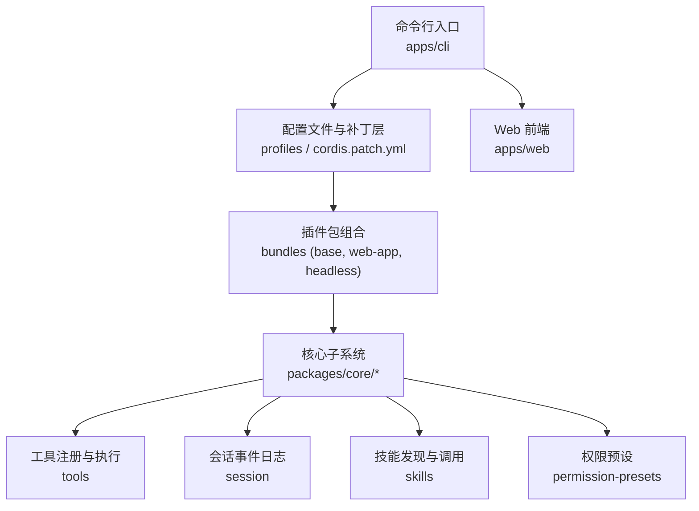
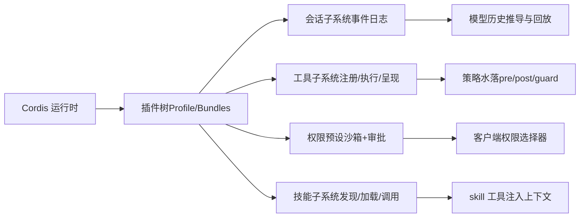
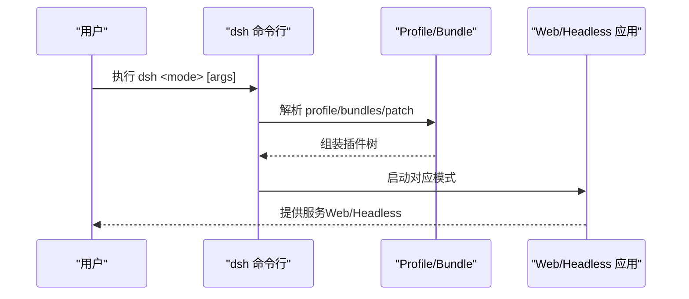
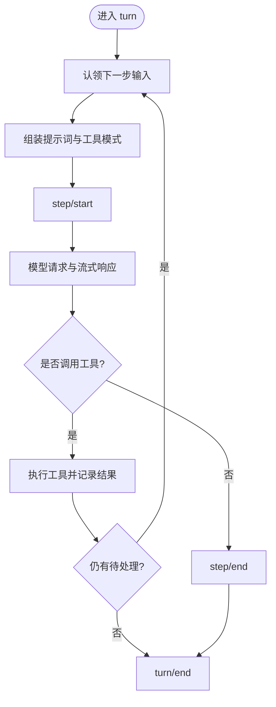
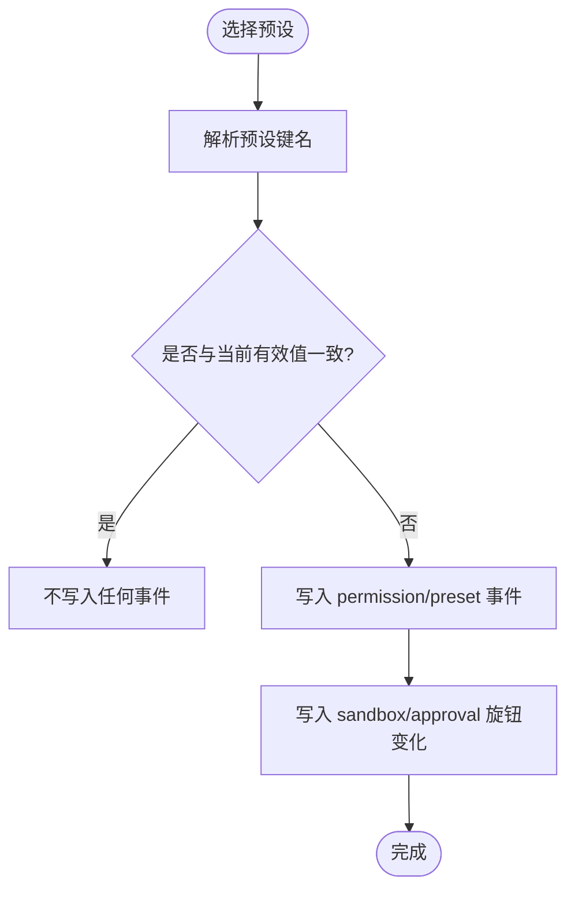
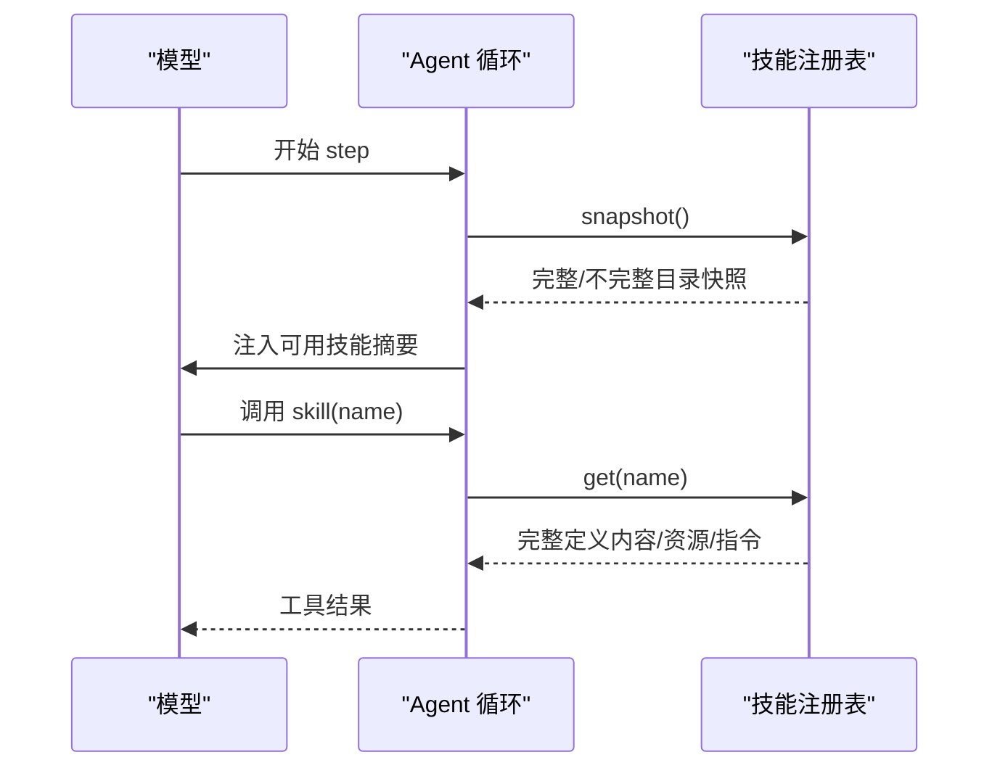
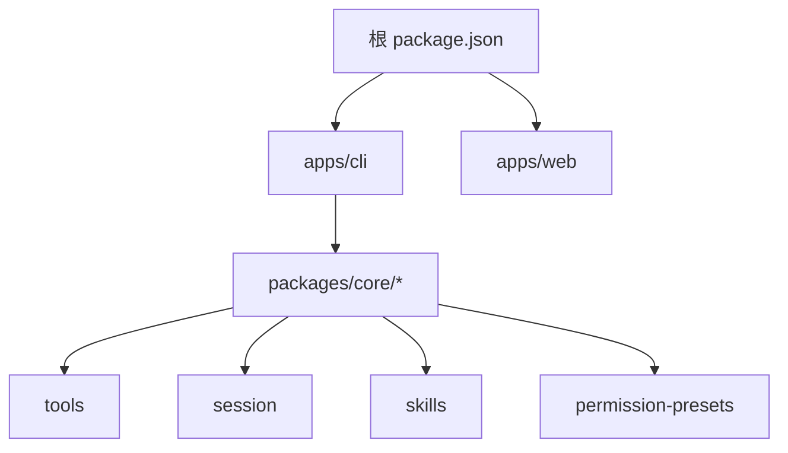

# 核心特性

<cite>
**本文引用的文件**
- [README.md](file://README.md)
- [apps/cli/README.md](file://apps/cli/README.md)
- [apps/web/package.json](file://apps/web/package.json)
- [package.json](file://package.json)
- [docs/architecture.md](file://docs/architecture.md)
- [docs/subsystems/session.md](file://docs/subsystems/session.md)
- [docs/subsystems/tools.md](file://docs/subsystems/tools.md)
- [docs/subsystems/permission-presets.md](file://docs/subsystems/permission-presets.md)
- [docs/subsystems/skills.md](file://docs/subsystems/skills.md)
</cite>

## 目录
1. [简介](#简介)
2. [项目结构](#项目结构)
3. [核心组件](#核心组件)
4. [架构总览](#架构总览)
5. [详细组件分析](#详细组件分析)
6. [依赖关系分析](#依赖关系分析)
7. [性能考量](#性能考量)
8. [故障排查指南](#故障排查指南)
9. [结论](#结论)
10. [附录](#附录)

## 简介
DeepSeek Harness（dsh）是一个以“一切皆插件”为核心理念的智能体编排框架，基于 Cordis 运行时构建。它提供 Web UI、CLI 和无头模式三种运行方式，支持跨平台部署；通过插件化与能力接缝（seam）实现高度可扩展性，覆盖会话管理、工具生态、权限控制、技能系统、持久化与可观测性等企业级能力。

## 项目结构
仓库采用多包工作区组织：
- apps/cli：命令行入口与配置解析，负责启动 web/headless/profiles 等模式
- apps/web：Web 前端应用（Vite + React），由 CLI 的 dsh web 命令提供服务
- packages/*：按子系统划分的插件与核心能力（会话、工具、权限、技能、LLM 适配等）
- docs：架构、子系统与用户文档
- examples：示例智能体与工作流
- native：原生安全沙箱相关二进制与打包脚本



图表来源
- [apps/cli/README.md:1-48](file://apps/cli/README.md#L1-L48)
- [docs/architecture.md:15-37](file://docs/architecture.md#L15-L37)
- [apps/web/package.json:1-52](file://apps/web/package.json#L1-L52)

章节来源
- [README.md:1-58](file://README.md#L1-L58)
- [apps/cli/README.md:1-48](file://apps/cli/README.md#L1-L48)
- [apps/web/package.json:1-52](file://apps/web/package.json#L1-L52)
- [package.json:1-183](file://package.json#L1-L183)
- [docs/architecture.md:1-130](file://docs/architecture.md#L1-L130)

## 核心组件
- 会话（Session）：以追加式事件日志作为唯一事实源，所有模型可见输入与输出均可从日志推导与回放
- 工具（Tools）：统一注册表与执行管线，支持预执行策略、守卫、后处理、UI 呈现与并发调度
- 权限预设（Permission Presets）：将沙箱模式与审批策略打包为可选集，供客户端一键切换
- 技能（Skills）：分层发现与加载的技能目录，结合 skill 工具注入到模型上下文
- 架构与组合：基于 Cordis 的插件树、Profile/Bundles 组合与能力接缝，使任意能力可替换

章节来源
- [docs/subsystems/session.md:1-800](file://docs/subsystems/session.md#L1-L800)
- [docs/subsystems/tools.md:1-721](file://docs/subsystems/tools.md#L1-L721)
- [docs/subsystems/permission-presets.md:1-132](file://docs/subsystems/permission-presets.md#L1-L132)
- [docs/subsystems/skills.md:1-332](file://docs/subsystems/skills.md#L1-L332)
- [docs/architecture.md:39-129](file://docs/architecture.md#L39-L129)

## 架构总览
- 一切皆插件：模型适配器、工具注册表、会话日志、Agent 循环均为插件，可通过配置替换
- Profile 与 Bundle：运行时的插件树由有序层叠加组成，支持用户补丁与覆盖
- 能力接缝：服务定义、提供者、消费者三要素解耦，便于替换文件系统、子进程、子智能体等
- 事件驱动：会话事件、Agent 事件、能力事件构成扩展点，贯穿生命周期



图表来源
- [docs/architecture.md:9-37](file://docs/architecture.md#L9-L37)
- [docs/architecture.md:98-129](file://docs/architecture.md#L98-L129)

## 详细组件分析

### 智能体编排与多模式运行（Web UI、CLI、无头）
- CLI 入口：解析命令与参数，加载所选 runner；web 与 headless 为首发模板
- 模式说明：
  - Web UI：默认监听本地端口，提供对话界面与轨迹查看
  - Headless：一次性运行任务，打印最终答案并退出
  - Profile：用户自定义插件栈与补丁层，支持复用与分发
- 跨平台：Node.js 工程，配合原生沙箱与脚本支持多平台部署



图表来源
- [apps/cli/README.md:1-48](file://apps/cli/README.md#L1-L48)
- [package.json:19-142](file://package.json#L19-L142)

章节来源
- [apps/cli/README.md:1-48](file://apps/cli/README.md#L1-L48)
- [package.json:19-142](file://package.json#L19-L142)
- [apps/web/package.json:1-52](file://apps/web/package.json#L1-L52)

### 会话管理（事件溯源、派生历史、分叉与恢复）
- 追加式事件日志：turn/step/user/assistant/tool 等事件构成完整交互历史
- 派生历史：从日志推导模型可见消息，保证可回放与一致性
- 分叉与恢复：基于稳定边界创建子会话，支持 resume/fork/replay
- 持久化契约：后端需无损持久化全部事件，包括 chunk，seq 连续



图表来源
- [docs/architecture.md:63-90](file://docs/architecture.md#L63-L90)
- [docs/subsystems/session.md:1-800](file://docs/subsystems/session.md#L1-L800)

章节来源
- [docs/subsystems/session.md:1-800](file://docs/subsystems/session.md#L1-L800)
- [docs/architecture.md:63-90](file://docs/architecture.md#L63-L90)

### 工具生态系统（注册、执行、呈现与策略）
- 工具定义：包含 schema、execute、输出渲染、超时、并发安全标记、UI 呈现
- 执行管线：pre-execute → guards → execute → post-execute → finalizeContent → result
- 策略与权限：允许/拒绝/询问（ask）与单调守卫，确保不可逆的拒绝决策
- UI 呈现：统一的 card 视图（终端、diff、搜索、读取、网页等）

```mermaid
sequenceDiagram
participant Loop as "Agent 循环"
participant Reg as "工具注册表"
participant Pre as "pre-execute"
participant Guard as "守卫"
participant Body as "工具实现"
participant Post as "post-execute"
Loop->>Reg : execute(execInput)
Reg->>Pre : 策略水落(allow/deny/ask)
Pre-->>Reg : 决策
Reg->>Guard : 单调守卫检查
Guard-->>Reg : 允许或拒绝
Reg->>Body : 执行工具
Body-->>Reg : 结构化结果
Reg->>Post : 后处理(接受/替换/阻断)
Post-->>Loop : 最终结果
```

图表来源
- [docs/subsystems/tools.md:170-404](file://docs/subsystems/tools.md#L170-L404)
- [docs/subsystems/tools.md:478-570](file://docs/subsystems/tools.md#L478-L570)

章节来源
- [docs/subsystems/tools.md:1-721](file://docs/subsystems/tools.md#L1-L721)

### 权限控制（沙箱与审批的策略预设）
- 预设表：将 sandbox/mode 与 approval/policy 打包为命名预设（如 workspace-write、danger-full-access）
- 当前预设推导：基于会话事件折叠有效值，优先保留用户选择，否则匹配声明顺序
- 切换行为：写入 log-only 事件，仅更新变化的旋钮，避免冗余



图表来源
- [docs/subsystems/permission-presets.md:46-68](file://docs/subsystems/permission-presets.md#L46-L68)
- [docs/subsystems/permission-presets.md:80-126](file://docs/subsystems/permission-presets.md#L80-L126)

章节来源
- [docs/subsystems/permission-presets.md:1-132](file://docs/subsystems/permission-presets.md#L1-L132)

### 技能系统（发现、加载与注入）
- 分层注册：host 与 per-scope 两层合并，最近层优先
- 本地发现：扫描项目与用户目录，支持变更监听与缓存
- 模型注入：在 agent/pre-step 注入可用技能摘要，后续步骤按需刷新
- 工具调用：skill 工具校验名称与策略，返回内容、资源与指令



图表来源
- [docs/subsystems/skills.md:9-18](file://docs/subsystems/skills.md#L9-L18)
- [docs/subsystems/skills.md:229-236](file://docs/subsystems/skills.md#L229-L236)
- [docs/subsystems/skills.md:245-305](file://docs/subsystems/skills.md#L245-L305)

章节来源
- [docs/subsystems/skills.md:1-332](file://docs/subsystems/skills.md#L1-L332)

### 插件化架构带来的灵活性与可扩展性
- 能力接缝：服务定义/提供者/消费者分离，便于替换文件系统、子进程、子智能体等
- 组合机制：Profile/Bundles 有序叠加，用户补丁与 --patch 覆盖
- 扩展点：新增模型、工具、命令、后台任务、文件系统访问、UI 节点等均有明确接入点

章节来源
- [docs/architecture.md:9-37](file://docs/architecture.md#L9-L37)
- [docs/architecture.md:98-129](file://docs/architecture.md#L98-L129)

## 依赖关系分析
- 顶层脚本与命令：根 package.json 提供构建、测试、发布与 dsh 入口
- CLI 与 Web：CLI 负责启动与参数转发，Web 为独立前端产物
- 子系统耦合：会话、工具、权限、技能均通过 Cordis 上下文与事件解耦



图表来源
- [package.json:19-142](file://package.json#L19-L142)
- [apps/cli/README.md:1-48](file://apps/cli/README.md#L1-L48)
- [apps/web/package.json:1-52](file://apps/web/package.json#L1-L52)

章节来源
- [package.json:1-183](file://package.json#L1-L183)
- [apps/cli/README.md:1-48](file://apps/cli/README.md#L1-L48)
- [apps/web/package.json:1-52](file://apps/web/package.json#L1-L52)

## 性能考量
- 会话推导缓存：deriveMessages 对每个表面节点仅投影一次，重写时重建，降低重复计算
- 工具并发：isConcurrencySafe 标记允许并行分组，提升吞吐
- 事件持久化：后端需无损持久化全部事件，保持 seq 连续，避免丢失导致回放不一致
- 技能目录缓存：本地提供者维护有限缓存，减少频繁 IO

[本节为通用指导，无需特定文件引用]

## 故障排查指南
- 会话回放失败：检查事件数据是否 JSON 可序列化、seq 是否连续、surfaceOp 是否合法
- 工具执行被拒绝：确认 pre-execute 策略与守卫未返回拒绝原因；必要时启用 ask 流程
- 权限切换无效：检查当前预设是否与有效值一致；确认 shell 具备沙箱能力且 approval 服务可用
- 技能未生效：确认技能名称符合 kebab-case、策略允许模型调用；检查目录与变更监听是否正常

章节来源
- [docs/subsystems/session.md:601-605](file://docs/subsystems/session.md#L601-L605)
- [docs/subsystems/tools.md:376-404](file://docs/subsystems/tools.md#L376-L404)
- [docs/subsystems/permission-presets.md:44-68](file://docs/subsystems/permission-presets.md#L44-L68)
- [docs/subsystems/skills.md:83-86](file://docs/subsystems/skills.md#L83-L86)

## 结论
DeepSeek Harness 以插件化与能力接缝为核心，提供强大的智能体编排能力与多模式运行支持。其会话事件溯源、工具生态、权限预设与技能系统共同构成了企业级智能体平台的坚实基础。相比其他框架，dsh 强调“一切可替换、一切可组合”，并通过严格的类型与持久化契约保障可靠性与可观测性。

[本节为总结性内容，无需特定文件引用]

## 附录
- 快速上手
  - Web UI：使用 dsh web 启动浏览器界面
  - Headless：使用 dsh --profile headless "任务" 执行一次性任务
  - 自定义 Profile：通过 dsh plugin 管理插件与补丁层
- 参考路径
  - 架构文档：docs/architecture.md
  - 子系统文档：docs/subsystems/*.md
  - CLI 参考：apps/cli/README.md

[本节为补充信息，无需特定文件引用]