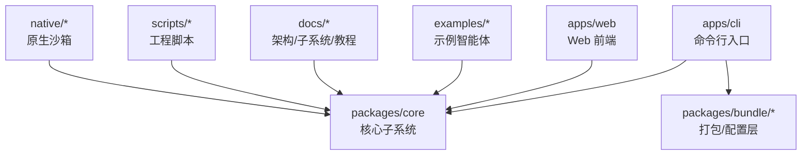
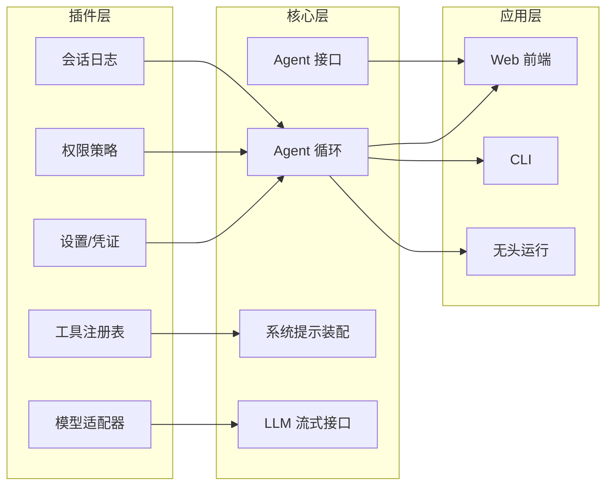
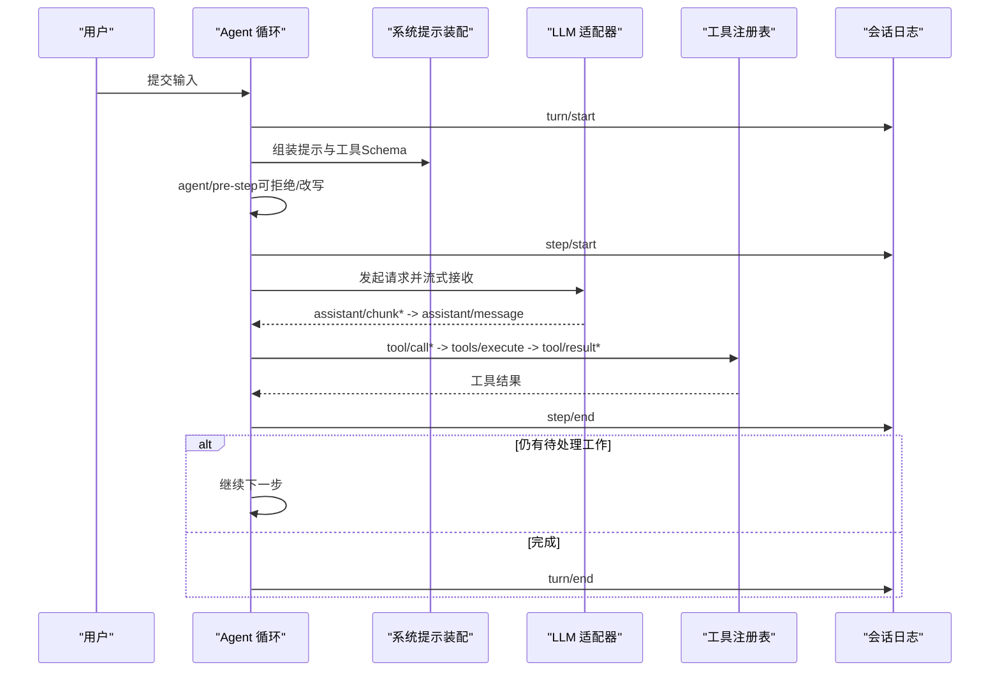
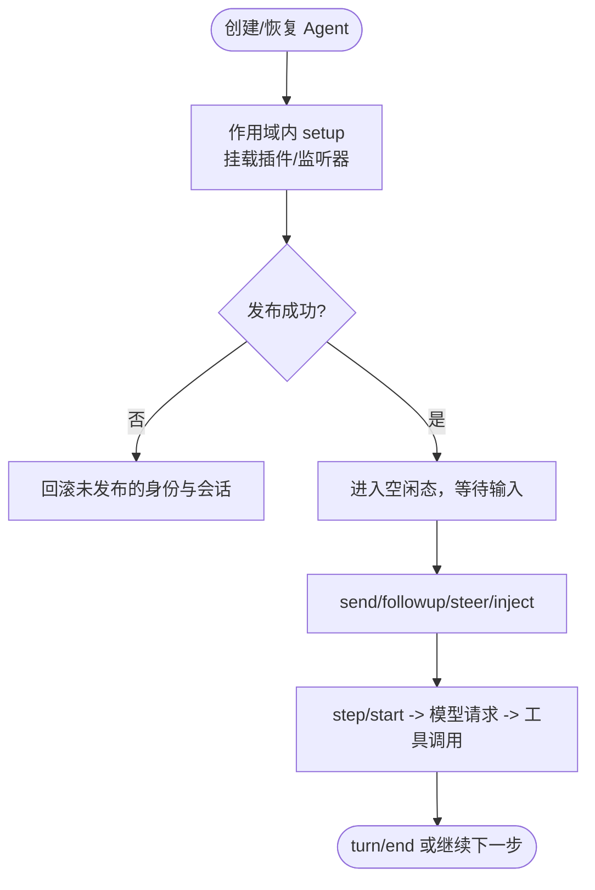
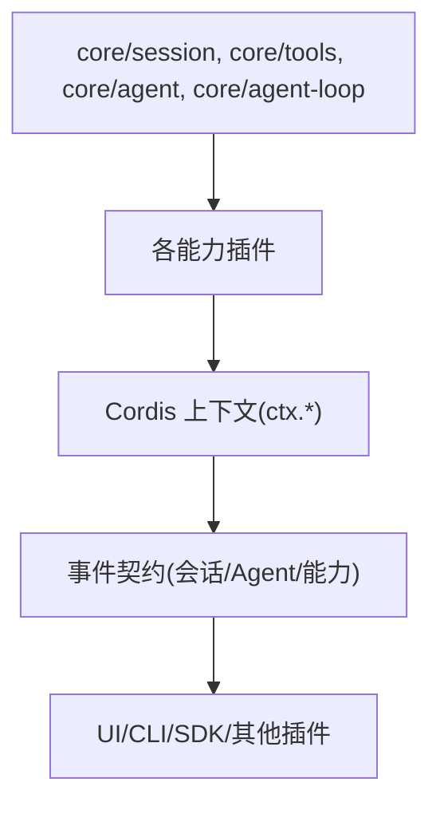

# 项目介绍

<cite>
**本文引用的文件**
- [README.md](file://README.md)
- [package.json](file://package.json)
- [LICENSE](file://LICENSE)
- [docs/architecture.md](file://docs/architecture.md)
- [docs/cordis-primer.md](file://docs/cordis-primer.md)
- [docs/subsystems/core.md](file://docs/subsystems/core.md)
- [docs/user/guide/index.md](file://docs/user/guide/index.md)
</cite>

## 目录
1. [简介](#简介)
2. [项目结构](#项目结构)
3. [核心组件](#核心组件)
4. [架构总览](#架构总览)
5. [详细组件分析](#详细组件分析)
6. [依赖关系分析](#依赖关系分析)
7. [性能与可扩展性](#性能与可扩展性)
8. [故障排查指南](#故障排查指南)
9. [结论](#结论)
10. [附录](#附录)

## 简介
DeepSeek Harness（简称 dsh）是由 DeepSeek AI 开源的智能体框架，采用“一切皆插件”的设计哲学，基于 Cordis 插件架构构建。它提供可组合、可替换的模型适配、工具注册、会话日志、权限策略、持久化等能力，并通过 Web UI、CLI、无头运行模式等多种形态交付。当前为开发者预览版，迭代速度快，存在破坏性变更的可能。

核心价值主张：
- 一切皆插件：所有功能以插件形式贡献到共享上下文，任何部分均可通过配置替换或扩展。
- 基于 Cordis 的可组合性：服务、事件、可逆效果构成统一扩展点，支持热重载与卸载回滚。
- 面向智能体的运行时：围绕 Agent 生命周期、会话日志、工具执行流水线、流式 LLM 交互形成完整闭环。
- 多形态交付：Web 界面、命令行、无头模式、Python SDK，覆盖开发、调试、集成与生产场景。

适用场景与目标用户：
- 需要快速搭建可插拔智能体平台的团队与个人开发者。
- 希望将模型、工具、权限、存储等能力解耦并灵活编排的工程团队。
- 需要在浏览器、CLI、服务端或 Python 环境中运行智能体的应用开发者。

版本状态与社区：
- 版本：0.1.0-rc.5（根 package.json）。
- 许可证：MIT。
- 社区渠道：GitHub Discussions、Discord、插件主题标签 #dsh-plugin。

章节来源
- [README.md:1-58](file://README.md#L1-L58)
- [package.json:1-10](file://package.json#L1-L10)

## 项目结构
仓库采用 monorepo 组织，包含应用、包、文档、示例、脚本与原生组件等：
- apps：Web 前端与 CLI 入口。
- packages：按子系统拆分的插件与核心能力（如 session、tools、llm、agent-loop、scope 等）。
- docs：架构、子系统、教程、用户指南、配置目录等。
- examples：多种智能体示例（ACP、headless、JSON-RPC、MCP 内存等）。
- scripts：构建、验证、发布、测试等工程脚本。
- native：原生安全沙箱相关组件。

图表来源
- [docs/architecture.md:15-37](file://docs/architecture.md#L15-L37)
- [docs/subsystems/core.md:7-20](file://docs/subsystems/core.md#L7-L20)

章节来源
- [docs/architecture.md:15-37](file://docs/architecture.md#L15-L37)

## 核心组件
- 会话日志（Session Log）：追加型事件日志，作为模型可见上下文的唯一事实源，支持派生消息、回放、持久化。
- 系统提示与工具模式（System Prompt & Tools）：组装提示片段与工具 Schema，驱动模型请求。
- 智能体接口与循环（Agent & Agent Loop）：定义 Agent 生命周期、发送/取消/注入、步骤与回合边界；默认驱动实现位于 agent-loop。
- LLM 流式接口（LLM Streaming）：消息与流词汇抽象，提供适配器接缝，便于接入不同模型提供方。
- 作用域与注册（Scope & Registry）：按 Agent 作用域管理注册项，支持隔离与继承。

这些组件共同构成“会话—提示—工具—模型—日志”的闭环，确保每一步模型可见输入都可从日志重建。

章节来源
- [docs/subsystems/core.md:7-20](file://docs/subsystems/core.md#L7-L20)
- [docs/subsystems/core.md:244-248](file://docs/subsystems/core.md#L244-L248)

## 架构总览
DeepSeek Harness 以 Cordis 为底层插件框架，所有产品特性均为插件：模型适配器、工具注册表、会话日志、Agent 循环本身都可由配置替换。启动时按有序层级组合 Profile 与 Bundle，形成插件树；每个 Bundle 声明自身在 package.json 的 dsh 字段中，通过 patch 机制叠加覆盖。

关键概念：
- Profile：命名化的组合模板，列出要堆叠的 Bundle，保存用户自定义 patch。
- Bundle：Cordis 配置行与其挂载代码的分发格式，保证上层仍可覆盖。
- 能力接缝（Capability Seams）：服务定义、提供者、消费者三角色分离，便于替换实现而不影响调用方。
- 事件体系：会话事件（持久）、Agent 事件（实时）、能力事件（策略/适配），构成扩展点。

图表来源
- [docs/architecture.md:9-27](file://docs/architecture.md#L9-L27)
- [docs/architecture.md:98-127](file://docs/architecture.md#L98-L127)

章节来源
- [docs/architecture.md:9-27](file://docs/architecture.md#L9-L27)
- [docs/architecture.md:98-127](file://docs/architecture.md#L98-L127)

## 详细组件分析

### 回合与步骤流程（Turn/Step Flow）
一个 step 是一次模型请求及其调用的工具；一个 turn 是零或多个 step，直到没有待处理工作才关闭。该流程通过会话事件记录，确保可回放与一致性。

图表来源
- [docs/architecture.md:63-90](file://docs/architecture.md#L63-L90)

章节来源
- [docs/architecture.md:63-90](file://docs/architecture.md#L63-L90)

### Agent 生命周期与作用域
- Agent 创建与拥有：通过 ctx.agents.create/resume 创建或恢复会话与 Agent，返回拥有者句柄用于生命周期管理。
- 作用域注册：每个 Agent 拥有独立 ctx，注册项随 Agent 销毁而撤销，避免全局污染。
- 拦截与决策：agent/pre-step 决定进入/拒绝下一步；agent/request-error 可在失败后修复或重试。

图表来源
- [docs/subsystems/core.md:22-51](file://docs/subsystems/core.md#L22-L51)
- [docs/subsystems/core.md:211-235](file://docs/subsystems/core.md#L211-L235)

章节来源
- [docs/subsystems/core.md:22-51](file://docs/subsystems/core.md#L22-L51)
- [docs/subsystems/core.md:211-235](file://docs/subsystems/core.md#L211-L235)

### 会话日志与模型可见性
- 追加型日志：所有模型可见的事实都写入 SessionEvent 日志，作为唯一事实源。
- 派生消息：模型历史由日志推导，而非单独存储，确保回放与 UI 保真。
- 新能力扩展：新增模型可见输入需新增会话事件类型，并在日志基础上渲染。

章节来源
- [docs/subsystems/core.md:244-248](file://docs/subsystems/core.md#L244-L248)
- [docs/architecture.md:92-97](file://docs/architecture.md#L92-L97)

### 能力接缝与替换策略
- 服务定义/提供者/消费者三角色分离，便于替换实现。
- 文件系统与子进程共享执行世界，指向远程沙箱即可整体迁移 Bash、PTY、LSP。
- 子代理提供者可在同一接口下变化，从全新子代理到委托回合。

章节来源
- [docs/architecture.md:98-103](file://docs/architecture.md#L98-L103)

## 依赖关系分析
- 插件与核心：所有能力以插件形式挂载到共享上下文，核心暴露稳定键（如 ctx.sessions、ctx.tools、ctx.llm、ctx.agents）。
- 组合顺序：Profile 与 Bundle 按序叠加，patch 可替换任意行；可通过 dump-config 查看实际启动树。
- 事件契约：事件类型通过 TypeScript 声明合并扩展，分发模式（emit/waterfall/parallel/serial）构成公共契约。

图表来源
- [docs/cordis-primer.md:7-14](file://docs/cordis-primer.md#L7-L14)
- [docs/architecture.md:53-61](file://docs/architecture.md#L53-L61)

章节来源
- [docs/cordis-primer.md:7-14](file://docs/cordis-primer.md#L7-L14)
- [docs/architecture.md:53-61](file://docs/architecture.md#L53-L61)

## 性能与可扩展性
- 流式响应：LLM 流式接口减少首字延迟，提升交互体验。
- 工具并行：工具调用支持并行执行，缩短多步任务耗时。
- 可插拔后端：文件系统、子进程、沙箱、持久化等均可替换，便于在不同环境优化性能。
- 作用域隔离：按 Agent 作用域管理资源，避免全局竞争与泄漏。

[本节为通用指导，不直接分析具体文件]

## 故障排查指南
- 会话回放与诊断：利用会话日志进行回放与问题定位，确保模型可见输入均可从日志重建。
- 错误事件：agent/error 捕获步骤或回合错误，即使无明确位置也会上报。
- 请求错误恢复：agent/request-error 允许在失败后修复状态或重试。
- 配置与组合：使用 dump-config 检查实际启动树，确认 patch 是否生效。

章节来源
- [docs/subsystems/core.md:775-797](file://docs/subsystems/core.md#L775-L797)
- [docs/architecture.md:92-97](file://docs/architecture.md#L92-L97)

## 结论
DeepSeek Harness 以“一切皆插件”和 Cordis 的可组合性为核心，提供了完整的智能体运行时：会话日志、工具执行、模型流式交互、权限与持久化等能力均通过插件与事件机制解耦。其优势在于：
- 高度可替换：模型、工具、存储、沙箱等均可按需替换。
- 强一致性与可回放：会话日志作为唯一事实源，保障可观测与可恢复。
- 多形态交付：Web、CLI、无头模式与 Python SDK 覆盖广泛场景。
- 活跃社区与开放许可：MIT 许可，社区讨论与 Discord 支持完善。

对于初学者，建议从 Web UI 开始，配置模型与工作区，逐步探索插件开发与能力接缝；对于工程团队，可利用 Profile/Bundles 与补丁机制编排定制化智能体平台。

[本节为总结性内容，不直接分析具体文件]

## 附录
- 快速上手：通过 npm 命令启动 Web UI，或在源码仓库安装依赖后构建并运行。
- 用户指南：配置模型、选择工作区、运行任务、继续学习路径。
- 许可证与第三方通知：MIT 许可，第三方依赖与许可证见仓库说明。

章节来源
- [README.md:13-35](file://README.md#L13-L35)
- [docs/user/guide/index.md:1-31](file://docs/user/guide/index.md#L1-L31)
- [LICENSE:1-22](file://LICENSE#L1-L22)
- [package.json:1-10](file://package.json#L1-L10)