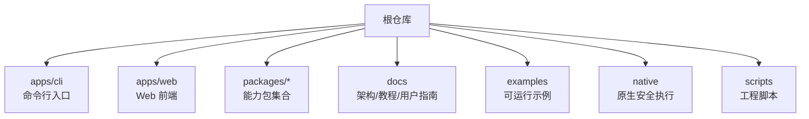
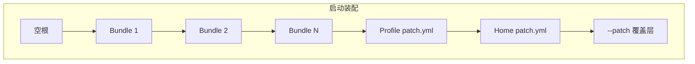
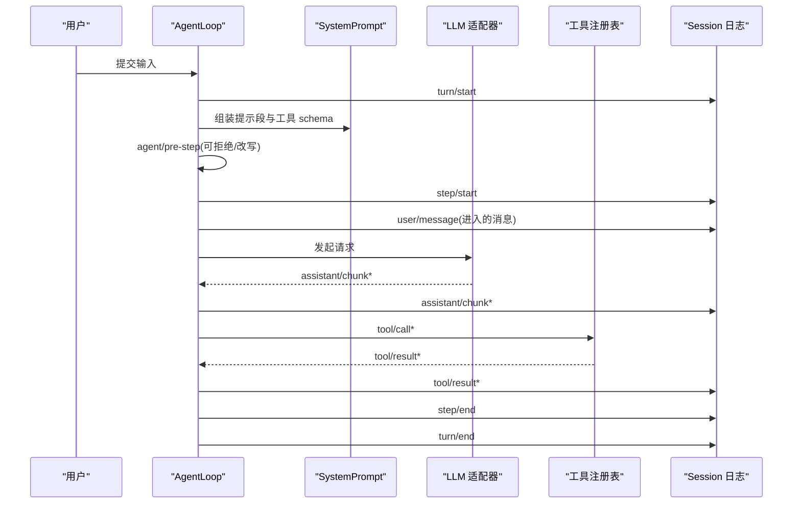
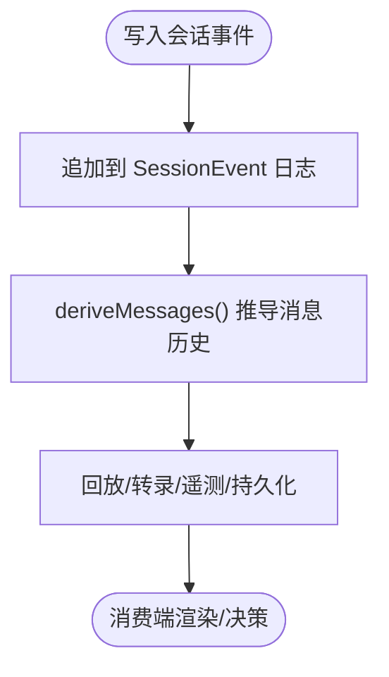
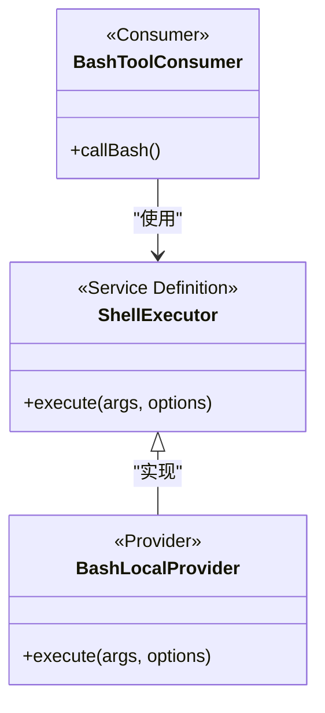
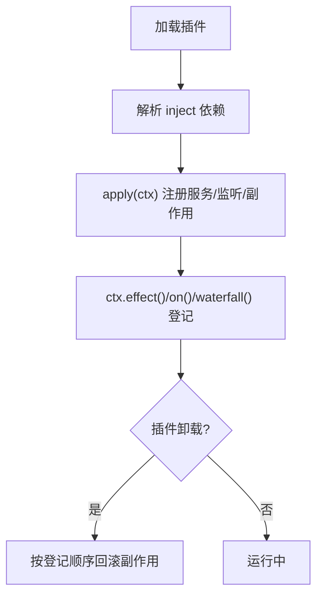
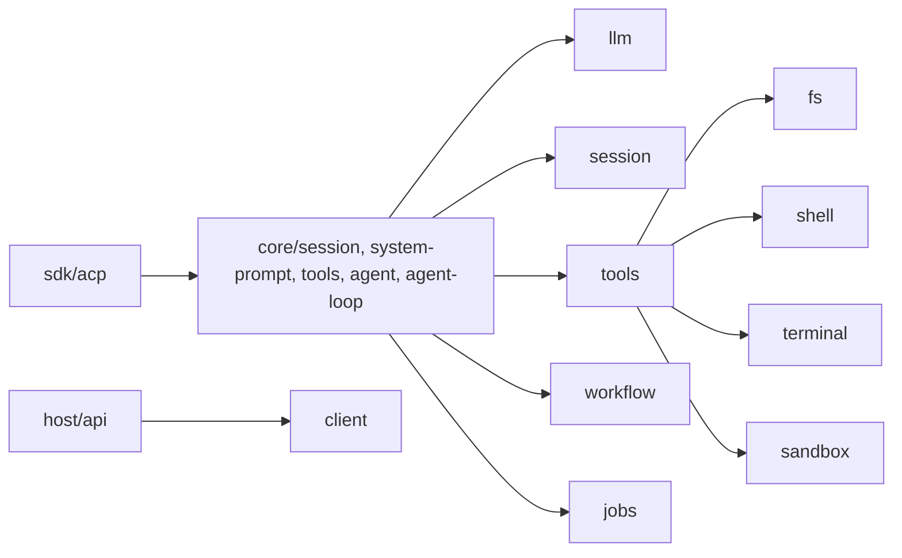

# 项目概览

<cite>
**本文引用的文件**
- [README.md](file://README.md)
- [apps/cli/README.md](file://apps/cli/README.md)
- [docs/architecture.md](file://docs/architecture.md)
- [docs/cordis-primer.md](file://docs/cordis-primer.md)
- [docs/glossary.md](file://docs/glossary.md)
- [docs/user/guide/index.md](file://docs/user/guide/index.md)
- [examples/README.md](file://examples/README.md)
- [examples/headless-agent/README.md](file://examples/headless-agent/README.md)
- [packages/README.md](file://packages/README.md)
- [docs/subsystems/core.md](file://docs/subsystems/core.md)
</cite>

## 目录
1. [简介](#简介)
2. [项目结构](#项目结构)
3. [核心组件](#核心组件)
4. [架构总览](#架构总览)
5. [详细组件分析](#详细组件分析)
6. [依赖关系分析](#依赖关系分析)
7. [性能考量](#性能考量)
8. [故障排查指南](#故障排查指南)
9. [结论](#结论)
10. [附录：快速开始与使用示例](#附录快速开始与使用示例)

## 简介
DeepSeek Harness（简称 dsh）是一个开源智能体框架，采用“一切皆插件”的设计哲学，基于 Cordis 插件架构构建。它通过可组合的插件树、类型化的事件流、可替换的能力接缝（seams）和会话日志驱动的智能体循环，提供从 Web UI、命令行到无头自动化等多种运行形态。其目标是让模型适配器、工具注册表、会话持久化、权限策略等全部以插件形式参与装配，从而在配置层面即可替换或扩展产品行为。

- 核心价值
  - 可插拔：所有能力以插件形式贡献服务、事件与副作用，卸载时自动回滚。
  - 可组合：通过 profile 与 bundle 分层叠加，形成最终运行时的插件树。
  - 可扩展：围绕 session、agent、tools、llm 等能力接缝进行扩展，无需修改核心。
  - 可观测：会话日志为唯一事实源，支持回放、遥测、标题生成、转储等。
  - 多形态：Web UI、CLI、Headless、ACP、JSON-RPC 等入口统一由同一内核驱动。

- “一切皆插件”的哲学
  - 没有不可变的核心；每个功能都是插件，通过 ctx.<key> 暴露稳定键名。
  - 注册即副作用，卸载即回滚；加载顺序由依赖声明决定而非手工编排。
  - 事件是扩展点，按 emit/waterfall/parallel/serial 模式组织通信契约。

**章节来源**
- [README.md:5-11](file://README.md#L5-L11)
- [docs/architecture.md:9-14](file://docs/architecture.md#L9-L14)
- [docs/cordis-primer.md:7-14](file://docs/cordis-primer.md#L7-L14)

## 项目结构
仓库采用 monorepo 组织，核心代码位于 packages，应用入口位于 apps，示例位于 examples，文档位于 docs，原生二进制与脚本分别位于 native 与 scripts。

- 顶层关键目录
  - apps/cli：dsh 命令入口，负责 profile 选择与参数转发
  - apps/web：Web 前端与 E2E 测试
  - packages/*：按能力分组的功能包（core、llm、session、tools、fs、shell、terminal、subprocess、sandbox、workflow、jobs、web、settings、credentials、storage、workspace、sdk、acp、host、client、boot、bundle、extensions、hooks、interaction、preset、guard、compaction、context、subagent、skill、attachment、spill、todo、plan、identity、feedback、schedule、typert、api、e2b、test-support、util、examples）
  - docs：架构、子系统、Cordis 教程、用户指南、术语表等
  - examples：可运行的示例（headless-agent、jsonrpc-agent、web-cordis、web-schedule、mcp-memory、acp-agent）
  - native：Landlock 等原生安全执行环境相关
  - scripts：构建、验证、发布、文档生成等工程脚本

**图表来源**
- [apps/cli/README.md:1-15](file://apps/cli/README.md#L1-L15)
- [packages/README.md:7-59](file://packages/README.md#L7-L59)

**章节来源**
- [apps/cli/README.md:1-15](file://apps/cli/README.md#L1-L15)
- [packages/README.md:7-59](file://packages/README.md#L7-L59)

## 核心组件
- 会话与日志（session）
  - 追加式 SessionEvent 日志，作为模型可见输入的唯一事实源；消息历史由日志推导。
- 系统提示与工具模式（system-prompt + tools）
  - 组装提示段与工具 schema，注册工具并守卫执行管线。
- 智能体与循环（agent + agent-loop）
  - Agent 接口与默认驱动实现；turn/step 生命周期、取消、注入、工作项队列。
- LLM 适配（llm）
  - 消息与流词汇、适配器接缝；可替换不同模型提供方。
- 能力接缝（capability seams）
  - 文件系统、子进程、沙箱、Shell、终端、Web、技能、工作流、作业、计划、设置、凭据、存储、工作区等均以 Service Definition + Provider + Consumer 角色解耦。

这些组件共同构成 dsh 的产品骨架，并通过 Cordis 的服务注册与事件机制组合成可运行的智能体。

**章节来源**
- [docs/architecture.md:39-52](file://docs/architecture.md#L39-L52)
- [docs/subsystems/core.md:7-19](file://docs/subsystems/core.md#L7-L19)
- [packages/README.md:11-59](file://packages/README.md#L11-L59)

## 架构总览
dsh 的运行由“profile + bundle”的分层组合驱动。启动时，按顺序将多个 bundle 的补丁层叠加到空根上，再应用 profile 与 home 层的 cordis.patch.yml，最后应用 --patch 覆盖层。每一层都可替换或插入新的行（row），从而实现能力的动态装配。

- 关键概念
  - Profile：命名组合，列出 bundles、安装出树插件、持有用户 patch。
  - Bundle：分发格式，包含 Cordis 配置行与挂载的代码，保持上层可替换。
  - 能力接缝：Service Definition / Provider / Consumer 三角色，一处替换影响全局。
  - 事件：session/event、agent/*、capabilities/* 三类扩展点。

**图表来源**
- [docs/architecture.md:15-38](file://docs/architecture.md#L15-L38)
- [docs/architecture.md:98-127](file://docs/architecture.md#L98-L127)

**章节来源**
- [docs/architecture.md:15-38](file://docs/architecture.md#L15-L38)
- [docs/architecture.md:98-127](file://docs/architecture.md#L98-L127)

## 详细组件分析

### 智能体循环与事件流（Agent Loop & Events）
- Turn/Step 流程
  - turn/start → claim 输入 → 组装提示与工具 schema → agent/pre-step → step/start → 调用模型 → tool/call* → step/end → 下一轮或关闭 turn → turn/end
- 事件分类
  - 会话事件：turn/*、step/*、user/message、assistant/*、tool/* 等，持久化到日志
  - 智能体事件：agent/*，携带 Agent 实例，用于观察或拦截进行中工作
  - 能力事件：fs/*、tools/*、telemetry/* 等，附加策略与适配器

**图表来源**
- [docs/architecture.md:63-90](file://docs/architecture.md#L63-L90)
- [docs/subsystems/core.md:244-249](file://docs/subsystems/core.md#L244-L249)

**章节来源**
- [docs/architecture.md:63-90](file://docs/architecture.md#L63-L90)
- [docs/subsystems/core.md:244-249](file://docs/subsystems/core.md#L244-L249)

### 会话日志与消息推导（Session Log）
- 会话日志是追加式、带单调序列号的 typed event 流，作为模型可见输入的权威来源。
- deriveMessages() 从日志推导模型历史；assistant/chunk 保留回放与 UI 保真。
- 任何到达模型请求的内容必须可从日志重建，这是运行时不变量。

**图表来源**
- [docs/architecture.md:92-97](file://docs/architecture.md#L92-L97)
- [docs/subsystems/core.md:244-249](file://docs/subsystems/core.md#L244-L249)

**章节来源**
- [docs/architecture.md:92-97](file://docs/architecture.md#L92-L97)
- [docs/subsystems/core.md:244-249](file://docs/subsystems/core.md#L244-L249)

### 能力接缝（Capability Seams）
- 一个 seam = Service Definition + Provider(s) + Consumer(s)。
- 常见接缝：fs、subprocess、shell、terminal、sandbox、web、skill、workflow、jobs、plan、settings、credentials、storage、workspace、subagent、llm 等。
- 通过 provider 替换即可改变整条能力链（例如将本地 FS/Subprocess 指向远程沙箱）。

**图表来源**
- [docs/glossary.md:7-19](file://docs/glossary.md#L7-L19)
- [packages/README.md:22-35](file://packages/README.md#L22-L35)

**章节来源**
- [docs/glossary.md:7-19](file://docs/glossary.md#L7-L19)
- [packages/README.md:22-35](file://packages/README.md#L22-L35)

### Cordis 插件体系（Plugin Framework）
- 插件即实现 Service 的对象，可通过 inject 声明依赖，apply(ctx) 注册服务。
- 上下文（Context）是服务仓库，通过稳定键（ctx.tools、ctx.llm、ctx.sessions 等）访问。
- 事件分四种模式：emit（广播）、waterfall（中间件式串联）、parallel（并行）、serial（有序串联）。
- 注册即副作用，卸载即回滚；推荐用 effect/on/waterfall 管理生命周期。

**图表来源**
- [docs/cordis-primer.md:7-14](file://docs/cordis-primer.md#L7-L14)
- [docs/cordis-primer.md:15-34](file://docs/cordis-primer.md#L15-L34)
- [docs/cordis-primer.md:36-44](file://docs/cordis-primer.md#L36-L44)

**章节来源**
- [docs/cordis-primer.md:7-14](file://docs/cordis-primer.md#L7-L14)
- [docs/cordis-primer.md:15-34](file://docs/cordis-primer.md#L15-L34)
- [docs/cordis-primer.md:36-44](file://docs/cordis-primer.md#L36-L44)

## 依赖关系分析
- 包分组与职责
  - core：会话、提示、工具、Agent 接口与默认循环
  - llm：消息/流词汇与适配器接缝
  - session：持久化与投影
  - tools：工具注册与执行管线
  - fs/shell/terminal/sandbox：系统与执行环境能力
  - workflow/jobs/schedule：任务与工作流编排
  - web/host/client：Web 前后端与网关
  - sdk/acp/jsonrpc：外部集成与自动化协议
- 依赖原则
  - 扩展插件依赖 Service Definition，不直接依赖具体 Provider
  - 包间通过 ctx 键与事件解耦，避免强耦合

**图表来源**
- [packages/README.md:11-59](file://packages/README.md#L11-L59)
- [docs/architecture.md:39-52](file://docs/architecture.md#L39-L52)

**章节来源**
- [packages/README.md:11-59](file://packages/README.md#L11-L59)
- [docs/architecture.md:39-52](file://docs/architecture.md#L39-L52)

## 性能考量
- 会话日志为单一事实源，建议最小化冗余写入，合理批处理 chunk 与结果。
- 工具执行应遵循守卫与超时策略，避免阻塞主循环。
- 使用 schedule/jobs/workflow 将耗时任务异步化，减少交互延迟。
- 对大模型流式响应，优先使用 streaming 以降低首字延迟。
- 合理使用缓存与压缩（如 compaction）控制上下文大小。

[本节为通用指导，不直接分析具体文件]

## 故障排查指南
- 启动失败
  - 检查 dsh 命令与 profile 是否正确；查看 CLI 帮助与错误码。
  - 使用 --dump-config 或 --dump-default-config 检查最终组合树。
- 模型不可用
  - 确认已配置模型提供者与凭据；在 Web UI 设置中保存后即时生效。
- 工具未生效
  - 检查工具是否注册到 ctx.tools；确认权限策略与沙箱限制。
- 会话无法恢复
  - 检查持久化后端与 checkpoint；确保日志完整。
- 取消与中断
  - 使用 Agent.cancel 指定原因；关注 whenIdle 等待收敛。

**章节来源**
- [apps/cli/README.md:18-43](file://apps/cli/README.md#L18-L43)
- [docs/user/guide/index.md:7-23](file://docs/user/guide/index.md#L7-L23)
- [docs/subsystems/core.md:171-205](file://docs/subsystems/core.md#L171-L205)

## 结论
DeepSeek Harness 以“一切皆插件”为核心思想，借助 Cordis 的插件体系与能力接缝，提供了高度可组合、可替换、可观测的智能体运行平台。通过 profile/bundle 分层装配、事件驱动的扩展点、以及统一的会话日志，开发者可以在不改动核心的前提下，灵活定制模型、工具、执行环境与交互界面，满足从交互式 Web 到无头自动化等多场景需求。

[本节为总结性内容，不直接分析具体文件]

## 附录：快速开始与使用示例

### 快速开始
- 通过 npm 运行 Web UI
  - 安装 Node.js 后执行 npx @deepseek-ai/dsh web，默认在 http://127.0.0.1:3080 提供服务。
- 从源码运行
  - 克隆仓库，pnpm install，pnpm run build，然后 pnpm dsh web。
- 首次使用 Web UI
  - 在 Settings → Models 中配置模型与凭据；选择工作区后即可开始对话。

**章节来源**
- [README.md:13-35](file://README.md#L13-L35)
- [docs/user/guide/index.md:7-23](file://docs/user/guide/index.md#L7-L23)

### 常用运行形态
- Web 模式：交互式对话与可视化轨迹
- Headless 模式：一次性任务，输出结构化结果后退出
- JSON-RPC/ACP：程序化控制与自动化集成

**章节来源**
- [examples/README.md:7-29](file://examples/README.md#L7-L29)
- [examples/headless-agent/README.md:7-16](file://examples/headless-agent/README.md#L7-L16)

### 示例场景
- headless-agent：非交互式编码代理，接受单一任务，执行后输出结果
- jsonrpc-agent：通过 Python SDK 与 JSON-RPC 驱动无头编码代理
- web-cordis：自引用代理，可检查和修改内存中的 Cordis 插件树
- web-schedule：可选 Web 覆盖层，提供会话内定时提醒
- acp-agent：Agent Client Protocol 自动化服务器，支持会话、权限与取消

**章节来源**
- [examples/README.md:7-29](file://examples/README.md#L7-L29)
- [examples/headless-agent/README.md:7-16](file://examples/headless-agent/README.md#L7-L16)

### 与其他智能体框架的对比优势（基于仓库文档）
- 插件化与可组合性：所有能力以插件形式参与装配，卸载即回滚，便于热替换与隔离。
- 能力接缝：通过 Service Definition/Provider/Consumer 解耦，一处替换影响全局，降低耦合度。
- 会话日志驱动：以追加式日志为唯一事实源，天然支持回放、转录与一致性保障。
- 多形态统一内核：Web、CLI、Headless、ACP、JSON-RPC 共享同一驱动与事件模型。
- 丰富的生态包：涵盖 shell、terminal、sandbox、workflow、jobs、settings、credentials、storage、workspace 等能力。

[本节依据仓库文档归纳，不直接引用具体代码片段]